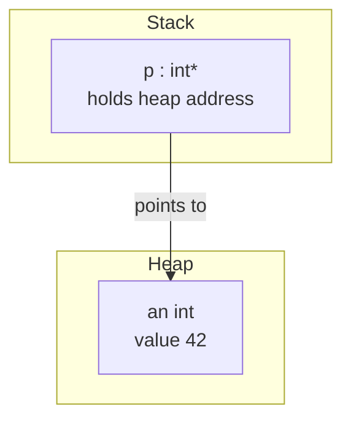
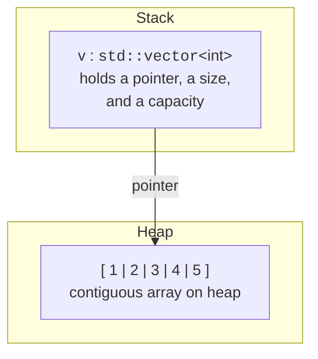

We've already met the **stack** in detail. Let's now zoom out and
look at *every* place your data can live, the lifetime rules for
each, and the trade-offs between them. By the end of this chapter
you should be able to look at any variable in C++ and answer three
questions:

1. **Where does it live?** (stack, heap, globals, code)
2. **When does it die?** (end of scope, manually with `delete`,
   end of program, never)
3. **Who is responsible for it?** (the compiler, you, or the OS)

| Region | What lives there | Lifetime / owner |
| --- | --- | --- |
| Text segment | compiled machine code | whole program, read-only |
| Data segment | globals, statics, string literals | whole program |
| Heap | whatever `new` allocates | until you free it — **you** manage it |
| Stack | function calls and locals | end of scope — auto-managed |

<svg
  viewBox="0 0 640 260"
  role="img"
  aria-label="A vertical address-space tower: faint code and blue data bands at the bottom, a green heap growing upward and a yellow stack growing downward into the translucent gap between them"
  style={{ display: "block", width: "100%", maxWidth: "640px", height: "auto", margin: "2.5rem auto" }}
>
  <g fill="currentColor" opacity="0.06">
    <rect x="232" y="20" width="176" height="234" rx="14" />
  </g>
  <g fill="currentColor" opacity="0.12">
    <rect x="240" y="212" width="160" height="34" rx="8" />
  </g>
  <g style={{ color: "var(--ds-blue-500)" }} fill="currentColor">
    <rect x="240" y="172" width="160" height="34" rx="8" fillOpacity="0.35" />
  </g>
  <g style={{ color: "var(--ds-green-500)" }} fill="currentColor">
    <rect x="240" y="132" width="160" height="34" rx="8" fillOpacity="0.85" />
    <polygon points="272,126 288,126 280,112" />
    <polygon points="352,126 368,126 360,112" />
  </g>
  <g style={{ color: "var(--ds-yellow-500)" }} fill="currentColor">
    <rect x="240" y="28" width="160" height="34" rx="8" />
    <polygon points="272,68 288,68 280,82" />
    <polygon points="352,68 368,68 360,82" />
  </g>
  <g fill="currentColor" opacity="0.25">
    <circle cx="320" cy="92" r="3" />
    <circle cx="320" cy="104" r="3" />
  </g>
</svg>

## The four regions, one by one

### 1. Text (code) segment

The compiled machine code of your program. Read-only — the OS marks
those pages so that trying to write to them crashes the program.
You don't directly interact with this region.

### 2. Data segment (globals and statics)

Variables declared outside any function, and variables declared
`static` inside a function, live here.

- They are **zero-initialized** by default (unlike locals!).
- Their lifetime is the entire program: they're alive *before*
  `main` runs and *after* it returns.
- They have a fixed address; pointers to them never dangle.

<CodeBlock
  adapter="cpp"
  files={[
    {
      filename: "main.cpp",
      starterCode: `#include <iostream>

int global_counter = 0; // data segment, alive for whole program

void called_many_times() {
  static int call_count = 0; // also data segment; survives between calls!
  ++call_count;
  ++global_counter;
  std::cout << "I have been called " << call_count
            << " times; global = " << global_counter << "\\n";
}

int main() {
  called_many_times();
  called_many_times();
  called_many_times();
  return 0;
}
`,
    },
  ]}
/>

Notice `call_count` keeps incrementing — it lives in the data
segment, not in the function's stack frame. A `static` local is a
hidden global with restricted visibility.

Use globals *sparingly*. They make code hard to test and reason
about because *any* function can change them. Prefer parameters and
returns.

### 3. Stack

Local variables and function parameters. Frames pushed on call,
popped on return. **Fast** to allocate (just bump a pointer),
**limited** in size, **automatic** in cleanup.

```cpp
void foo() {
    int x = 42;       // stack
    double pi = 3.14; // stack
    char buf[64];     // stack -- 64 bytes
}                      // x, pi, buf all gone here
```

### 4. Heap

The big, dynamic playground. Memory you ask for **at runtime** with
`new` (or in C, `malloc`). It stays alive until you release it with
`delete` (or `free`).

```cpp
int* p = new int(42);   // heap allocation, p points to it
// ... use *p ...
delete p;               // free it; forgetting is a memory leak
```

Compared to the stack:

| Aspect | Stack | Heap |
| --- | --- | --- |
| Allocation | bump a pointer (cycles) | system bookkeeping (~100 cycles) |
| Deallocation | frame pop (free) | another bookkeeping call |
| Size limit | small (a few MB) | huge (gigabytes) |
| Lifetime | tied to scope | you decide |
| Concurrency | per-thread | shared, needs care |
| Failure mode | overflow → crash | leak / corruption / use-after-free |

A common mental model: **stack is for things whose lifetime matches
a function call. Heap is for everything else.**

## A diagram of stack vs heap interaction

When you allocate on the heap, the *pointer* (typically 8 bytes on
64-bit systems) lives on the stack. The *object* lives on the heap.



When the function returns, the stack pointer `p` is destroyed. But
the heap object stays alive forever — unless something explicitly
calls `delete`. That's a **memory leak**. We'll spend a whole later
chapter on smart pointers that prevent this automatically.

## Lifetime in pictures

```mermaid
gantt
    title Lifetimes of variables in a program run
    dateFormat X
    axisFormat %s
    section Globals & statics
    global_counter      :a1, 0, 100
    section main locals
    x in main           :b1, 10, 90
    section Heap (via new)
    *(new int)          :c1, 20, 50
    section foo locals
    y in foo            :d1, 30, 50
    section bar locals
    z in bar            :e1, 60, 80
```



Globals span the whole program. Stack locals span only the function
call. Heap objects span between `new` and `delete` — which can be
anywhere.

## Storage duration vs scope

These two ideas often get mixed up:

- **Scope** = the region of source code where the *name* is visible.
- **Storage duration** = how long the *memory* is alive at runtime.

For a normal local variable they overlap perfectly. For a `static`
local, the scope is small (only inside the function) but the
storage duration is global. For a heap object, the storage duration
is "until you free it" — but if you lose the pointer to it before
freeing it, you've leaked it.

## Why C++ exposes all this

In Python or Java, you rarely think about where an object lives.
Garbage collection takes care of it. That convenience has a price:
unpredictable pauses, larger memory footprint, less predictable
performance.

C++ takes the opposite trade-off. The language gives you tools
(stack, heap, statics, smart pointers, RAII) and trusts you to
choose the right one. Once you understand the model, the choices
are usually obvious:

- **Tiny, scoped-to-this-function data?** Stack.
- **Data that survives across function calls but is bounded in
  count?** Globals (sparingly) or a class member.
- **Data whose size or count you don't know at compile time?** Heap
  (via `std::vector`, `std::string`, smart pointers).
- **Big, owned by exactly one place?** Heap, via `std::unique_ptr`.

We'll meet `std::unique_ptr` and friends in a couple chapters.

## What `std::vector` and `std::string` really do

`std::vector<int>` is the canonical "modern C++" container. Where
does its data live?



The *vector handle* lives on the stack — three small fields: a
pointer to the data, the current size, and the current capacity.
The actual elements live on the heap. When the vector goes out of
scope, its destructor automatically frees the heap data. **You
never call `delete` on a vector's contents.** That is RAII in
action.

<CodeBlock
  adapter="cpp"
  files={[
    {
      filename: "main.cpp",
      starterCode: `#include <iostream>
#include <vector>

int main() {
  std::vector<int> v;
  std::cout << "before: size=" << v.size() << " capacity=" << v.capacity()
            << "\\n";
  for (int i = 0; i < 10; ++i) {
    v.push_back(i);
    std::cout << "push " << i << " -> size=" << v.size()
              << " capacity=" << v.capacity() << "\\n";
  }
  return 0;
}
`,
    },
  ]}
/>

Watch the capacity grow in geometric jumps (typically doubling).
That's the vector reallocating a bigger heap block when it runs out
of room. The amortized cost of `push_back` is therefore constant.

## A worked memory diagram

Trace this program in your head before running it:

<CodeBlock
  adapter="cpp"
  files={[
    {
      filename: "main.cpp",
      starterCode: `#include <iostream>
#include <vector>

int globals_live_here = 1;

int main() {
  int on_the_stack = 2;
  std::vector<int> handle_on_stack;
  handle_on_stack.push_back(3); // the '3' lives on the heap
  handle_on_stack.push_back(4);

  int *heap_int = new int(5);

  std::cout << globals_live_here << " " << on_the_stack << " "
            << handle_on_stack[0] << " " << handle_on_stack[1] << " "
            << *heap_int << "\\n";

  delete heap_int; // free the raw heap allocation
  return 0;
} // handle_on_stack auto-frees its heap data
`,
    },
  ]}
/>

| Variable | Lives in | Frees how |
| --- | --- | --- |
| `globals_live_here` | data segment | end of program |
| `on_the_stack` | stack frame of `main` | when `main` returns |
| `handle_on_stack` | stack frame of `main` | destructor at end of scope |
| The `int`s inside the vector | **heap** | the vector's destructor |
| `heap_int` (the pointer) | stack frame of `main` | when `main` returns |
| `*heap_int` (the int) | **heap** | only when `delete heap_int;` runs |

The right column is what really matters. Stack things get freed for
free. Heap things need either *you* (raw `new`/`delete`) or a smart
container/pointer to do it for you.

## Test your understanding

<MultipleChoice
  markdown={`Where does a \`static\` local variable inside a function live?

- On the stack, in the function's frame.
  > Normal locals live there; \`static\` locals do not.
- On the heap, allocated by \`new\` each call.
  > They are allocated once for the whole program.
- [o] In the data segment, alongside globals — its memory survives between calls.
  > A \`static\` local is essentially a hidden global with restricted scope.
- In CPU registers.
  > Registers are too small and too temporary for this.`}
/>

<MultipleChoice
  markdown={`When a function with a \`std::vector<int>\` local variable returns, what happens to the vector's elements on the heap?

- They leak unless the user called \`delete\` first.
  > That would be true for a raw \`new int[]\`, not for a vector.
- The OS reclaims them at process exit.
  > That would happen eventually, but it would be a leak in the meantime.
- [o] The vector's destructor runs automatically when the local goes out of scope, and it frees the heap memory for you.
  > This is RAII: ownership is tied to a stack object.
- The compiler issues a warning.
  > No warning is needed because there is no leak.`}
/>

<MultipleChoice
  markdown={`Which of these allocations is cheapest *at runtime*?

*Hint: anything involving \`new\` or a heap buffer pays allocator bookkeeping; a plain local does not.*

- \`new std::vector<int>(1000)\`
  > That allocates the vector handle on the heap AND the 1000-int buffer on the heap.
- [o] \`int x = 0;\` inside a function.
  > A stack allocation is essentially "advance the stack pointer by 4 bytes," which the CPU can do in a single instruction.
- \`int* p = new int[1000];\`
  > Heap allocation requires bookkeeping in the allocator.
- A \`std::string\` of length 1000 declared as a local.
  > The string handle is on the stack, but the 1000 bytes are on the heap.`}
/>

<MultipleChoice
  markdown={`What is the difference between **scope** and **storage duration**?

- They are two names for the same thing.
  > They are related but distinct.
- Scope is runtime, storage duration is compile-time.
  > It is the other way around in spirit: scope is a compile-time concept (about names), storage duration is a runtime concept (about memory).
- [o] Scope is the region of source code where a name is visible; storage duration is how long the underlying memory lives at runtime.
  > A \`static\` local is the textbook example: small scope, but long storage duration.
- Storage duration only applies to heap allocations.
  > It applies to every variable, in every region.`}
/>

Next: pointers and references — the language tools that let you
*name* memory.
