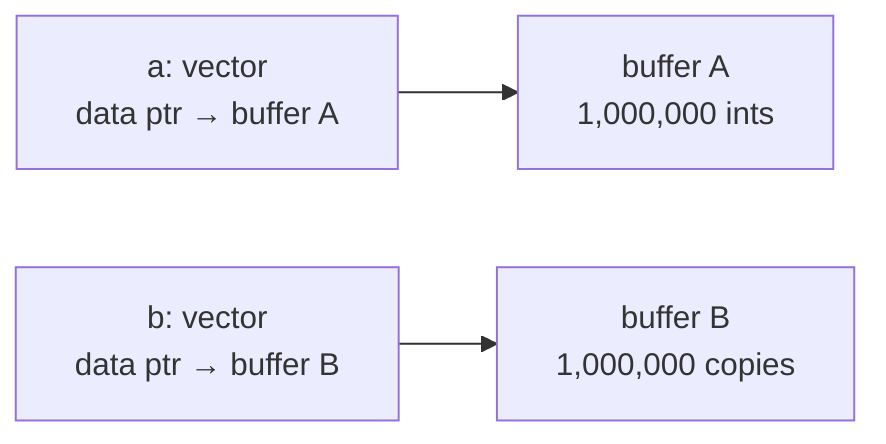
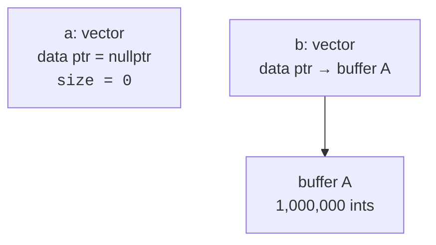

Copying a `std::vector<int>` with a million elements would mean
allocating a new million-element buffer and copying every byte.
Yet C++ programmers happily write functions that return such
vectors. Why is that fast?

<Figure
  slug="cpp-move-semantics-cutout"
  alt="Move semantics intuition, an isometric illustration"
/>

The answer is **move semantics**: the language can *transfer*
ownership of internal storage from one object to another without
copying the contents. This chapter is about the intuition, not the
full template machinery, that comes later if you go deep.

## Copy vs. move, in pictures

Suppose a `std::vector<int>` owns a heap buffer of 1,000,000 ints.

A **copy** allocates a new buffer and duplicates every element:



A **move** just steals the pointer:



The buffer is unchanged. `a` is left in a valid but empty state
(safe to destroy or reassign). `b` now owns the data. Total work:
copying a few pointers and integers. Done.

## `std::move` is not the operation, it's a *cast*

The name is a bit misleading. `std::move(x)` does **not** itself
move anything. It just tells the compiler "treat `x` as if it were
an rvalue (a temporary, eligible for moving from)."

The actual move happens when something *accepts* an rvalue, like a
move constructor or move assignment operator. Many standard library
types (vector, string, unique_ptr, ...) have move operations defined
that pillage the source's internals.

```cpp
std::vector<int> a = make_a_huge_vector();    // returns by value, typically moved
std::vector<int> b = std::move(a);            // a's buffer transferred to b
// a is now valid but unspecified; safe to assign to or destroy.
```

## Watch the moves happen

You don't have to take any of this on faith. The little `Tracer`
struct below announces every time it is constructed, copied, or
moved. Read the three `push_back` lines, predict the output, then
run it:

<CodeBlock
  adapter="cpp"
  files={[
    {
      filename: "main.cpp",
      initCode: `#include <iostream>
#include <utility>
#include <vector>

struct Tracer {
  Tracer() { std::cout << "construct\\n"; }
  Tracer(const Tracer &) { std::cout << "COPY\\n"; }
  Tracer(Tracer &&) noexcept { std::cout << "move\\n"; }
};`,
      starterCode: `int main() {
  std::vector<Tracer> v;
  v.reserve(3); // pre-allocate so reallocation doesn't add noise

  Tracer t;
  v.push_back(t);            // t is an lvalue: copied
  v.push_back(std::move(t)); // cast to rvalue: moved
  v.push_back(Tracer{});     // a temporary is already an rvalue: moved
  return 0;
}
`,
    },
  ]}
/>

The first `push_back` prints `COPY`, `t` has a name, you might
still use it, so the vector must duplicate it. The second prints
`move`, because `std::move(t)` granted permission to pillage. The
third constructs a nameless temporary and moves it in; no cast was
needed, because a temporary is *already* an rvalue. Try deleting the
`v.reserve(3)` line and watch extra moves appear as the vector
reallocates its buffer mid-growth.

`std::unique_ptr` cannot be copied (because then there would be two
owners). It *can* be moved, transferring ownership:

<CodeBlock
  adapter="cpp"
  files={[
    {
      filename: "main.cpp",
      starterCode: `#include <iostream>
#include <memory>
#include <utility>

struct Toy {
  int id;
  Toy(int i) : id(i) { std::cout << "Toy " << id << " born\\n"; }
  ~Toy() { std::cout << "Toy " << id << " gone\\n"; }
};

std::unique_ptr<Toy> create() {
  return std::make_unique<Toy>(7); // returns by value -> moved out
}

int main() {
  std::unique_ptr<Toy> a = create();
  std::cout << "a holds Toy " << a->id << "\\n";

  std::unique_ptr<Toy> b = std::move(a);
  std::cout << "after move, a is " << (a ? "non-null" : "null") << "\\n";
  std::cout << "b holds Toy " << b->id << "\\n";
  return 0;
}
`,
    },
  ]}
/>

After the move, `a` is null and `b` is the sole owner. Exactly what
we want.

## Return-by-value is now cheap

This is the practical takeaway every beginner needs:

> **Returning a large container by value is essentially free in
> modern C++.** Either the compiler elides the copy entirely
> (RVO/NRVO), or the move constructor transfers the buffer.

So write:

```cpp
std::vector<int> read_numbers();   // good, return by value
```

not:

```cpp
void read_numbers(std::vector<int>& out);   // unnecessary obfuscation
std::vector<int>* read_numbers();           // avoid raw owning pointers
```

The simpler signature is also the more efficient one.

## What about lvalues and rvalues?

Briefly, because the names matter:

- An **lvalue** is something that has a name and an address, a
  variable, a member access. You can take `&x`.
- An **rvalue** (more precisely, an *xvalue* or *prvalue*) is a
  temporary or an expression treated as one, a function result, a
  literal, the result of `std::move`.

Move operations are bound to rvalues, so casting an lvalue with
`std::move` lets you opt-in to moving. Use it when you genuinely
want to give up an object's contents, and *don't* use it on
return values that the compiler can already optimize, or on `const`
objects (it silently downgrades to a copy).

## The Rule of Five

When you write your own resource-owning class, the special member
functions you might want to define are:

1. Destructor
2. Copy constructor
3. Copy assignment
4. Move constructor
5. Move assignment

If you define one of these, you usually need to consider all five.
The good news: by composing your class out of types that already
manage their own resources (`std::vector`, `std::string`,
`std::unique_ptr`, ...) you almost never need to write any of them.
The compiler-generated defaults will do the right thing.

This is sometimes called the **Rule of Zero**, and is the modern
ideal: *let the standard library own the resources, and your class
needs no special members*.

## Test your understanding

<MultipleChoice
  markdown={`What does \`std::move(x)\` actually do?

- [o] It is a cast that lets \`x\` bind to an rvalue reference, enabling a move constructor or move assignment to transfer ownership from \`x\`.
  > The actual move happens in the operation that consumes the rvalue.
- It marks \`x\` as \`const\`.
  > Quite the opposite.
- It moves \`x\` immediately and zeros it out.
  > It does not move anything by itself.
- It deletes \`x\`.
  > It does not delete anything.`}
/>

<MultipleChoice
  markdown={`Why is returning a large \`std::vector\` by value cheap in modern C++?

- The standard library uses a global pool.
  > It does not.
- The compiler stores it in a register.
  > Vectors don't fit in registers.
- [o] The vector is either constructed directly into the caller's location (copy elision) or its internal pointer is moved instead of copying the elements.
  > Both are pointer-level operations.
- Because \`std::vector\` is small.
  > A vector's *handle* is small (a few pointers/sizes); the heap buffer it owns can be huge.`}
/>

Next: how to *think about* algorithms and data structures, what
they cost and when to reach for which.
