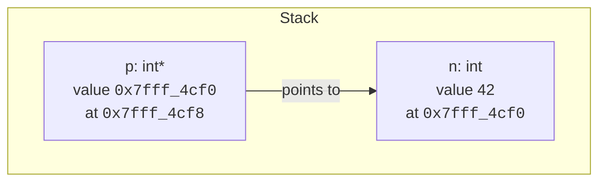
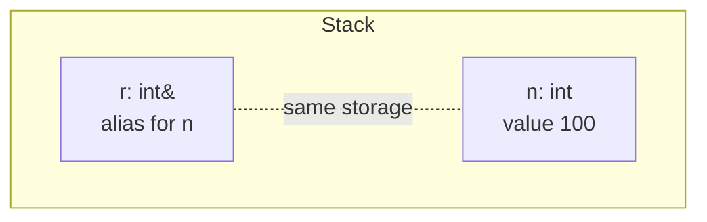
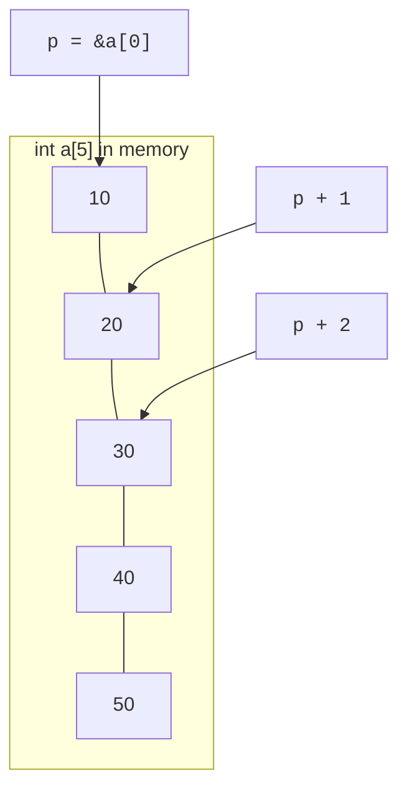
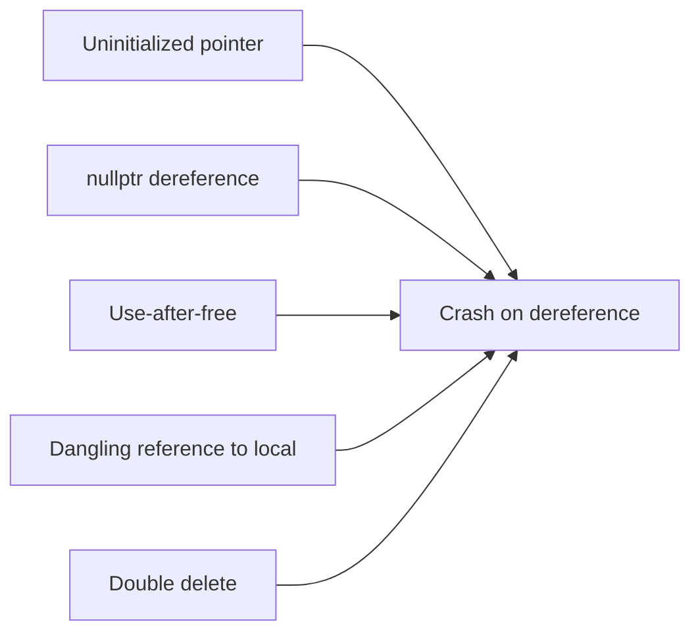

A **pointer** holds a memory address. A **reference** is an alias
for an existing variable. Both are how C++ lets one piece of code
*reach into* memory owned by another. They are the two tools you
will use most often once functions and objects start sharing data.

<Figure
  slug="cpp-pointers-and-references-cutout"
  alt="Pointers and references, an isometric illustration"
/>

Beginners often find pointers intimidating. Don't be. A pointer is
just a number, the address of a byte in memory, with a type
attached so the compiler knows how to interpret what's there.

## A pointer is an address with a type

```cpp
int  n = 42;
int* p = &n;     // p holds the address of n
```

After the second line, two variables exist:

- `n` is an `int` somewhere on the stack, storing 42.
- `p` is an `int*` (read: "pointer to int"), storing the *address* of
  `n`.



You read what a pointer points to with the **dereference** operator
`*`: `*p` means "the int at the address held by `p`."

<CodeBlock
  adapter="cpp"
  files={[
    {
      filename: "main.cpp",
      starterCode: `#include <iostream>

int main() {
  int n = 42;
  int *p = &n;

  std::cout << "n  = " << n << "\\n";
  std::cout << "*p = " << *p << "\\n"; // reads through the pointer
  *p = 100;                           // writes through the pointer
  std::cout << "n  = " << n << "  (after *p = 100)\\n";
  return 0;
}
`,
    },
  ]}
/>

Two operators do most of the pointer work:

- `&x`, take the address of `x`. Type: `T*` if `x` is `T`.
- `*p`, dereference `p` to read or write the pointed-to value.

## `nullptr`: the pointer that points to nothing

A pointer that holds the special value `nullptr` does not point at
any object. Dereferencing it is undefined behavior, usually a
crash. Initialize every pointer to *something* (often `nullptr`)
and check before dereferencing.

<CodeBlock
  adapter="cpp"
  files={[
    {
      filename: "main.cpp",
      starterCode: `#include <iostream>

void describe(int *p) {
  if (p == nullptr) {
    std::cout << "(no value)\\n";
  } else {
    std::cout << "value = " << *p << "\\n";
  }
}

int main() {
  int n = 7;
  describe(&n);
  describe(nullptr);
  return 0;
}
`,
    },
  ]}
/>

Older code uses `0` or `NULL` instead of `nullptr`. Always use
`nullptr` in modern C++: it has its own type and avoids ambiguities.

The null reference has a famous father, and he regrets it. Tony
Hoare introduced null into the ALGOL W language in 1965, and in a
2009 conference talk he called it his **"billion-dollar mistake"**:

> I couldn't resist the temptation to put in a null reference,
> simply because it was so easy to implement. This has led to
> innumerable errors, vulnerabilities, and system crashes, which
> have probably caused a billion dollars of pain and damage in the
> last forty years.

C++ inherits the mistake, every pointer type carries a "maybe
nothing" state whether you want it or not. The discipline that
keeps you safe is the same one Hoare wished he had enforced:
treat "can this be null?" as a question you answer *deliberately*
for every pointer, and prefer references (which cannot be null)
when absence is not a meaningful state.

## References: aliases, not pointers

A **reference** is a second name for an existing variable. Once
bound, it cannot be re-bound to anything else.

```cpp
int n = 42;
int& r = n;   // r is now another name for n
r = 100;      // modifies n
std::cout << n;  // prints 100
```



Key differences from pointers:

| Pointer | Reference |
| --- | --- |
| Can be `nullptr` | Must refer to a real object |
| Can be reassigned to point elsewhere | Bound once, for life |
| Has its own storage (the address) | Conceptually free; usually compiled as a hidden pointer |
| Syntax: `*p`, `p->m` | Syntax: just `r`, `r.m` |

You use references most often as **function parameters** (which we
covered in the functions chapter) and as **return types** when you
want the caller to be able to modify a member of an object.

<CodeBlock
  adapter="cpp"
  files={[
    {
      filename: "main.cpp",
      starterCode: `#include <iostream>

void increment(int &x) { // by reference: modifies caller's variable
  x += 1;
}

int main() {
  int n = 10;
  increment(n);
  increment(n);
  std::cout << "n = " << n << "\\n"; // 12
  return 0;
}
`,
    },
  ]}
/>

## When to use which

A rough but reliable rule:

- **By value** if the type is cheap to copy and you don't need to
  modify the caller.
- **Const reference** if the type is expensive to copy and you don't
  need to modify it.
- **Non-const reference** if you must modify the caller's object.
- **Pointer** if the parameter is *optional* (so it can be `nullptr`)
  or if you want to express "I might point at a different object
  later."
- **Smart pointer** (`std::unique_ptr`, `std::shared_ptr`) when you
  actually *own* a heap object. We'll cover these soon.

## Pointer arithmetic and arrays

Arrays in C++ live in *contiguous* memory. You can do arithmetic on
pointers to step through them.



<CodeBlock
  adapter="cpp"
  files={[
    {
      filename: "main.cpp",
      starterCode: `#include <iostream>

int main() {
  int a[5] = {10, 20, 30, 40, 50};
  int *p = a; // an array "decays" to a pointer to its first element

  std::cout << *p << "\\n";       // 10
  std::cout << *(p + 1) << "\\n"; // 20
  std::cout << p[2] << "\\n";     // 30, same as *(p + 2)
  std::cout << p[4] << "\\n";     // 50
  return 0;
}
`,
    },
  ]}
/>

Pointer arithmetic moves in *steps of the pointed-to type's size*:
`p + 1` advances by `sizeof(int)` bytes, not by 1 byte. This is
exactly what makes array indexing work.

In modern C++ we usually prefer `std::vector` over raw arrays, it
carries its own size, grows itself, and frees itself. Pointer
arithmetic is then internal to the implementation, not your daily
code.

## `->` is just `(*p).` shorthand

When `p` is a pointer to a struct or class, you access its members
with `->`:

```cpp
struct Point { int x; int y; };
Point pt{3, 4};
Point* p = &pt;
std::cout << (*p).x << "\\n";   // works but verbose
std::cout << p->x   << "\\n";   // same thing, idiomatic
```

## Const + pointers: the four shapes

Mixing `const` with pointers trips up everybody at first. Read
right-to-left:

```cpp
int* p;                  // pointer to int. Can change both.
const int* p;            // pointer to const int. Can't write *p; CAN reassign p.
int* const p;            // const pointer to int. Can write *p; CAN'T reassign p.
const int* const p;      // const pointer to const int. Can change nothing.
```

The compiler enforces this for you, which is why `const` everywhere
is so valuable: it documents intent *and* catches mistakes.

## Common pointer/reference bugs

Almost every C++ runtime crash is one of these:



| Bug | Cause | Fix |
| --- | --- | --- |
| **Null deref** | Reading `*p` when `p == nullptr` | Check before dereferencing. |
| **Dangling pointer** | The pointed-to object died but the pointer still points there | Don't return addresses of locals; reset pointers after `delete`. |
| **Use-after-free** | Dereferencing memory that has been `delete`d | Use smart pointers (later chapter). |
| **Double-free** | Calling `delete` twice on the same address | Use smart pointers; set raw pointers to `nullptr` after `delete`. |
| **Wild pointer** | Reading an uninitialized pointer | Initialize to `nullptr`. |

## A worked example: swap, two ways

We saw `swap_ints` by reference. Here it is again, both with
references and with pointers, so you can compare.

<CodeBlock
  adapter="cpp"
  files={[
    {
      filename: "main.cpp",
      starterCode: `#include <iostream>

void swap_ref(int &a, int &b) {
  int tmp = a;
  a = b;
  b = tmp;
}

void swap_ptr(int *a, int *b) {
  if (!a || !b)
    return; // pointer version must guard against null
  int tmp = *a;
  *a = *b;
  *b = tmp;
}

int main() {
  int x = 1, y = 2;
  swap_ref(x, y);
  std::cout << "after swap_ref: " << x << " " << y << "\\n";

  int p = 10, q = 20;
  swap_ptr(&p, &q);
  std::cout << "after swap_ptr: " << p << " " << q << "\\n";
  return 0;
}
`,
    },
  ]}
/>

The reference version is simpler at the call site (`swap_ref(x, y)`
versus `swap_ptr(&x, &y)`) and safer (it can't be null). Reach for
references unless you really need to express "this might be absent."

## Challenges

<ChallengeCard
  adapter="cpp"
  title="Add one through a pointer"
  instructions={`Implement \`void add_one(int* p)\`. If \`p\` is not null, increment the int it points to by 1. If \`p\` is null, do nothing. The provided \`main\` calls it on a real address and prints the resulting value; you should see exactly \`8\`.`}
  files={[
    {
      filename: "main.cpp",
      starterCode: `#include <iostream>

void add_one(int *p) {
  // your code here
}

int main() {
  int n = 7;
  add_one(&n);
  add_one(nullptr); // must not crash
  std::cout << n;
  return 0;
}
`,
      solutionCode: `#include <iostream>

void add_one(int *p) {
  if (p)
    *p += 1;
}

int main() {
  int n = 7;
  add_one(&n);
  add_one(nullptr);
  std::cout << n;
  return 0;
}
`,
    },
  ]}
  tests={[
    {
      id: "add",
      name: "Increments through pointer",
      description: "Exact stdout match",
      expect: { stdoutEquals: "8" },
    },
  ]}
/>

<ChallengeCard
  adapter="cpp"
  title="Sum a C-array with pointer arithmetic"
  instructions={`Implement \`int sum(const int* data, int n)\` that returns the sum of the first \`n\` ints starting at \`data\`. Use pointer arithmetic (or indexing, they're equivalent). \`main\` runs the function on \`{1, 2, 3, 4, 5}\` and should print \`15\`.`}
  files={[
    {
      filename: "main.cpp",
      starterCode: `#include <iostream>

int sum(const int *data, int n) {
  // your code here
  return 0;
}

int main() {
  int a[5] = {1, 2, 3, 4, 5};
  std::cout << sum(a, 5);
  return 0;
}
`,
      solutionCode: `#include <iostream>

int sum(const int *data, int n) {
  int total = 0;
  for (int i = 0; i < n; ++i)
    total += data[i];
  return total;
}

int main() {
  int a[5] = {1, 2, 3, 4, 5};
  std::cout << sum(a, 5);
  return 0;
}
`,
    },
  ]}
  tests={[
    {
      id: "sum",
      name: "Sum is 15",
      description: "Exact stdout match",
      expect: { stdoutEquals: "15" },
    },
  ]}
/>

## Test your understanding

<MultipleChoice
  markdown={`What is a pointer, in the simplest physical sense?

- A label for a function.
  > Functions have their own kind of pointer, but that's not the general meaning.
- A copy of an object stored elsewhere.
  > Pointers do not copy the pointee; they refer to it.
- [o] A variable whose value is the memory address of another object, paired with a type that describes what's at that address.
  > The type lets the compiler dereference and step through memory correctly.
- A type-erased reference to any value.
  > Pointers are *typed*; this is what \`void*\` would attempt to do.`}
/>

<MultipleChoice
  markdown={`Which of the following is **not** true of references?

- They must be initialized when declared.
  > True; you cannot create an uninitialized reference.
- [o] You can later make a reference refer to a different object by assigning to it.
  > References cannot be rebound; assigning to a reference modifies the *referent*.
- They cannot be null.
  > True; the language guarantees a reference refers to a real object.
- They are usually compiled to a hidden pointer.
  > True; the implementation is typically a pointer, even though the language model is an alias.`}
/>

<MultipleChoice
  markdown={`Why is dereferencing a \`nullptr\` undefined behavior?

- The C++ standard requires it to throw an exception.
  > The standard does not require an exception.
- The OS will always send SIGSEGV.
  > Most modern OSes do, but the standard does not require any particular signal.
- [o] Because \`nullptr\` does not point to any valid object, the language places no restrictions on what happens; the compiler is allowed to do anything.
  > Always check or guarantee non-null before dereferencing.
- It is well-defined; it always returns 0.
  > It does not; that is a common myth.`}
/>

<MultipleChoice
  markdown={`What does \`p->x\` mean, given a pointer \`p\` to a struct with member \`x\`?

- It is the same as \`p.x\`.
  > That syntax is for *objects*, not pointers.
- It allocates a new field \`x\` on \`p\`.
  > Members cannot be added at runtime in C++.
- [o] It is shorthand for \`(*p).x\`: dereference the pointer, then access member \`x\`.
  > The arrow is purely a convenience.
- It is undefined behavior.
  > Only if \`p\` is invalid; for a valid pointer the syntax is perfectly well-defined.`}
/>

Next: how to ask the operating system for memory you really need,
*dynamic memory* with `new`, `delete`, and the modern-C++ tools
that automate them.
