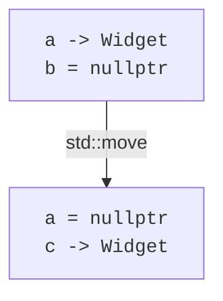
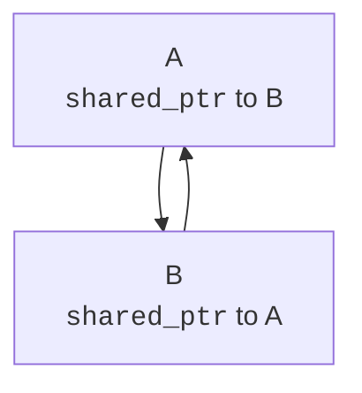
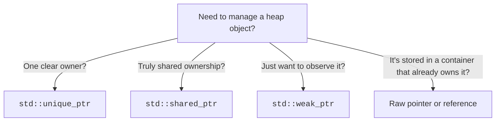

Raw `new`/`delete` are easy to get wrong. The standard library's
**smart pointers** are RAII wrappers that hold a heap pointer and
delete it automatically. Once you internalize them, you almost
never write `delete` again.

<Figure
  slug="cpp-smart-pointers-cutout"
  alt="Smart pointers, an isometric illustration"
/>

There are three to know:

- `std::unique_ptr<T>`, exclusive owner. Lightweight, free of
  overhead. Use this first; it covers most cases.
- `std::shared_ptr<T>`, shared owner. Multiple shared_ptrs can
  hold the same object; the last one to die deletes it.
- `std::weak_ptr<T>`, non-owning observer of a `shared_ptr`. Used
  to break cycles or watch an object without keeping it alive.

## `std::unique_ptr`: one owner, no overhead

<CodeBlock
  adapter="cpp"
  files={[
    {
      filename: "main.cpp",
      starterCode: `#include <iostream>
#include <memory>

class Widget {
public:
  Widget(int id) : id_(id) { std::cout << "Widget " << id_ << " born\\n"; }
  ~Widget() { std::cout << "Widget " << id_ << " gone\\n"; }
  void poke() const { std::cout << "Widget " << id_ << " poked\\n"; }

private:
  int id_;
};

int main() {
  std::unique_ptr<Widget> p = std::make_unique<Widget>(1);
  p->poke();
  // when p goes out of scope, the Widget is destroyed.
  return 0;
}
`,
    },
  ]}
/>

`std::make_unique<Widget>(1)` is preferred over `new Widget(1)` for
two reasons: it's exception-safe in surprising ways, and you never
have to write the type twice.

A `unique_ptr` cannot be copied, only **moved** (next chapter).
That single restriction enforces "exactly one owner" at compile
time:

```cpp
std::unique_ptr<Widget> a = std::make_unique<Widget>(1);
std::unique_ptr<Widget> b = a;              // ERROR: copying not allowed
std::unique_ptr<Widget> c = std::move(a);   // OK: ownership transferred
// a is now nullptr; c owns the widget
```



## `std::shared_ptr`: when ownership really is shared

`shared_ptr` keeps a small *reference count* alongside the object.
Each copy increments the count; each destruction decrements it.
When the count hits zero, the object is deleted.

<Figure
  slug="cpp-smart-pointers-std-unique-ptr-inline-cutout"
  alt="A crate with a single handle that only one pair of hands can hold at a time"
/>

<CodeBlock
  adapter="cpp"
  files={[
    {
      filename: "main.cpp",
      starterCode: `#include <iostream>
#include <memory>

class Note {
public:
  Note(const char *text) : text_(text) {
    std::cout << "Note '" << text_ << "' created\\n";
  }
  ~Note() { std::cout << "Note '" << text_ << "' destroyed\\n"; }
  void show() const { std::cout << text_ << "\\n"; }

private:
  const char *text_;
};

int main() {
  std::shared_ptr<Note> a = std::make_shared<Note>("hello");
  std::cout << "use_count = " << a.use_count() << "\\n";
  {
    std::shared_ptr<Note> b = a; // share ownership
    std::cout << "use_count = " << a.use_count() << "\\n";
    b->show();
  } // b goes out of scope; count drops back to 1
  std::cout << "use_count = " << a.use_count() << "\\n";
  return 0;
}
`,
    },
  ]}
/>

Use `shared_ptr` only when you truly need shared ownership, a node
in a graph that several roots can reach, a cached object accessed
from multiple subsystems. Defaulting to `shared_ptr` "just in case"
is a common over-correction; the reference count costs CPU and
clouds ownership.

## `std::weak_ptr`: observer that doesn't keep alive

A common shared-pointer trap: two objects each hold a `shared_ptr`
to the other. Neither's count ever hits zero, so neither is
destroyed, a **cycle leak**.



The fix is to make one of the directions a `weak_ptr`. A `weak_ptr`
does not increment the reference count; it lets you ask "is the
target still alive?" and, if so, briefly *lock* it into a
`shared_ptr` for safe use.

```cpp
std::shared_ptr<Node> parent = std::make_shared<Node>();
std::weak_ptr<Node>   peek   = parent;     // doesn't keep parent alive

if (auto p = peek.lock()) {
    p->doSomething();   // safe, we have a real shared_ptr now
} else {
    // the parent is gone
}
```

We won't go deeper here. The thing to take away is that smart
pointers express *ownership intent*: who keeps the object alive, who
merely watches it.

## Picking a smart pointer



A practical heuristic:

- **Use `std::unique_ptr` by default.**
- **Reach for `std::shared_ptr` only when ownership is genuinely
  shared.**
- **Use raw pointers/references for non-owning views, function
  parameters that just read the object.**

## Smart pointer ≠ everywhere

For things that already manage their own storage (`std::vector`,
`std::string`, `std::map`, ...), you do *not* need smart pointers.
A `std::vector<Widget>` already owns its Widgets. Wrapping vectors
in smart pointers is almost always wrong.

<Figure
  slug="cpp-smart-pointers-inline-cutout"
  alt="A crate carried by a handle that unclips itself, the crate dropping neatly into a return chute the moment the last hand lets go"
/>

Use smart pointers when you have a single *polymorphic* object whose
lifetime needs explicit management, e.g., `std::unique_ptr<Shape>`
in a heterogeneous container.

## Challenge

<ChallengeCard
  adapter="cpp"
  title="A unique owner"
  instructions={`Replace the raw \`new\`/\`delete\` in the provided \`main\` with \`std::make_unique\` and \`std::unique_ptr\`. The behaviour and output must be unchanged: prints \`Widget 1 created\`, then \`123\`, then \`Widget 1 destroyed\`, each on its own line.`}
  files={[
    {
      filename: "main.cpp",
      starterCode: `#include <iostream>
#include <memory>

class Widget {
public:
  Widget(int id) : id_(id) { std::cout << "Widget " << id_ << " created\\n"; }
  ~Widget() { std::cout << "Widget " << id_ << " destroyed\\n"; }
  int value() const { return 123; }

private:
  int id_;
};

int main() {
  Widget *w = new Widget(1);
  std::cout << w->value() << "\\n";
  delete w;
  return 0;
}
`,
      solutionCode: `#include <iostream>
#include <memory>

class Widget {
public:
  Widget(int id) : id_(id) { std::cout << "Widget " << id_ << " created\\n"; }
  ~Widget() { std::cout << "Widget " << id_ << " destroyed\\n"; }
  int value() const { return 123; }

private:
  int id_;
};

int main() {
  auto w = std::make_unique<Widget>(1);
  std::cout << w->value() << "\\n";
  return 0;
}
`,
    },
  ]}
  tests={[
    {
      id: "uptr",
      name: "Widget lifecycle",
      description: "Exact stdout match",
      expect: { stdoutEquals: "Widget 1 created\n123\nWidget 1 destroyed\n" },
    },
  ]}
/>

## Test your understanding

<MultipleChoice
  markdown={`Why is \`std::unique_ptr\` preferred over a raw \`new\`/\`delete\` pair?

- It is faster than a raw pointer.
  > Performance is essentially identical.
- [o] It applies RAII: the destructor runs on scope exit and reliably deletes the owned object, eliminating leaks, double-deletes, and use-after-free bugs on the *owner* side.
  > Ownership is tied to a scope, so cleanup happens automatically on every path.
- It is the only legal way to use the heap in modern C++.
  > Raw \`new\` is still legal; just usually unwise.
- It allows multiple owners.
  > That is what \`shared_ptr\` does.`}
/>

<MultipleChoice
  markdown={`When should you reach for \`std::shared_ptr\` instead of \`std::unique_ptr\`?

- For any object larger than 64 bytes.
  > Size is unrelated to ownership shape.
- [o] When the lifetime of the object is genuinely shared across multiple owners that may release it in any order, and \`unique_ptr\` cannot capture that.
  > The reference count keeps the object alive until the last owner is gone.
- For all polymorphic objects.
  > Polymorphism does not by itself require shared ownership.
- Whenever you allocate on the heap.
  > Default to \`unique_ptr\`; only upgrade when needed.`}
/>

Next: the *move* in `std::move(a)`, what it actually does, and why
it makes returning heavy objects from functions cheap.
