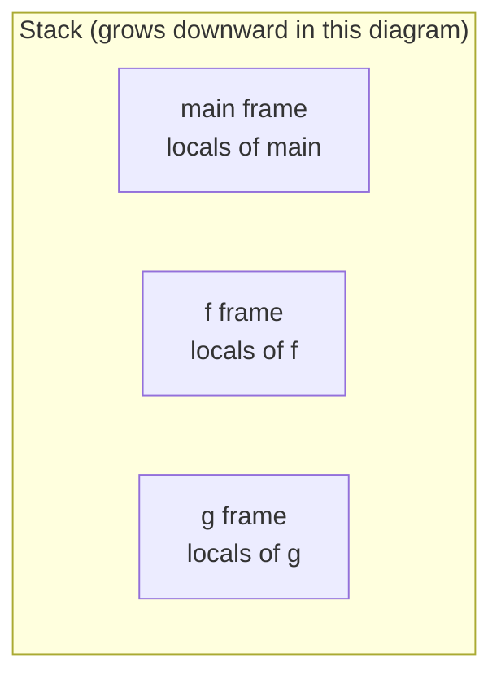
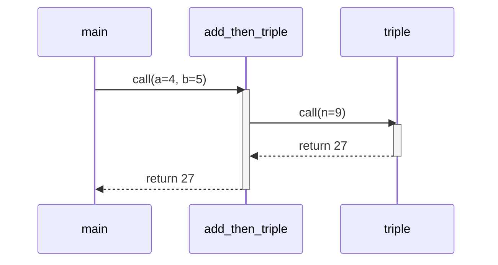

When one function calls another, *something* has to remember:

- Where to come back to after the call.
- The values of the caller's local variables.
- The values being passed as arguments.
- The space for the callee's locals.

<Figure
  slug="cpp-the-call-stack-cutout"
  alt="The call stack, an isometric illustration"
/>

That something is the **call stack**. Every running program has one,
and once you can picture it, almost every "how does this work?"
question in C++ has an obvious answer.

## A stack of frames

Each function call gets its own little block of memory called a
**stack frame**. The frame holds the function's parameters, local
variables, and bookkeeping (most importantly, the **return address**,
*where in the caller's code execution should resume when this
function returns*).

<Figure
  slug="cpp-the-call-stack-stack-frames-inline-cutout"
  alt="A column of trays growing upward as jobs start and coming apart from the top as they finish"
  caption="Each call gets its own frame, and the frame dies when the call returns."
/>



When `f` calls `g`, a new frame for `g` is **pushed** on top. When
`g` returns, its frame is **popped** off. The stack thus mirrors
the *call hierarchy* at any moment.

## A worked example

<CodeBlock
  adapter="cpp"
  files={[
    {
      filename: "main.cpp",
      starterCode: `#include <iostream>

int triple(int n) {
  int t = n * 3;
  return t;
}

int add_then_triple(int a, int b) {
  int sum = a + b;
  int out = triple(sum);
  return out;
}

int main() {
  int x = 4;
  int y = 5;
  int z = add_then_triple(x, y);
  std::cout << z << "\\n";
  return 0;
}
`,
    },
  ]}
/>

Let's trace what the stack looks like at each step.

**Just inside `main`, after `x = 4; y = 5;`:**

```text
[ main: x=4, y=5 ]   <- top of stack
```

**Right after the call to `add_then_triple(4, 5)`, before any of
its code runs:**

```text
[ add_then_triple: a=4, b=5, sum=?, out=? ]
[ main:            x=4, y=5,            z=? ]
```

**Inside `add_then_triple`, after `int sum = a + b;`:**

```text
[ add_then_triple: a=4, b=5, sum=9, out=? ]
[ main:            x=4, y=5,            z=? ]
```

**Right after calling `triple(9)`:**

```text
[ triple:          n=9, t=? ]
[ add_then_triple: a=4, b=5, sum=9, out=? ]
[ main:            x=4, y=5,            z=? ]
```

**Inside `triple`, after `int t = n * 3;`:**

```text
[ triple:          n=9, t=27 ]
[ add_then_triple: a=4, b=5, sum=9, out=? ]
[ main:            x=4, y=5,            z=? ]
```

**After `return t;`** (the `triple` frame is popped, the value `27`
is delivered to the caller):

```text
[ add_then_triple: a=4, b=5, sum=9, out=27 ]
[ main:            x=4, y=5,            z=? ]
```

**After `return out;`** (the `add_then_triple` frame is popped):

```text
[ main: x=4, y=5, z=27 ]
```

The program then prints `27` and returns from `main`. Every
function call is a *miniature lifecycle* on the stack.

## A diagram of the same thing



## Local variables die when their frame is popped

This is the single most important consequence of the stack model:
**when a function returns, all of its local variables are gone.**
Their memory is reused for the next function call.

```cpp
int* bad() {
    int x = 42;
    return &x;     // returning the address of a local variable
}                  // x dies here -- the pointer dangles.

int main() {
    int* p = bad();
    // *p reads memory that no longer "belongs" to anyone -- UB.
}
```

This is the bug we promised to revisit in the variables chapter.
The fix: don't return pointers to locals. Return by value, or
return something stored on the heap (via `new` or, better, via
`std::make_unique()`).

## Function arguments are local variables too

When you call a function, its parameters are *initialized* with
copies of the arguments (or set to alias them, in the reference
case). Inside the function, parameters behave just like locals.

```cpp
void increment(int x) {     // x is a local, initialized to a copy of the argument.
    x = x + 1;              // modifies the local copy
}                           // x dies; the caller's variable is unchanged.
```

That is why "pass by value doesn't modify the caller", the
parameter and the argument live in *different stack frames* and have
*different addresses*.

## Stack overflow

The stack is *finite*. On most desktop OSes it's about 1 MB to 8 MB.
If you call functions deep enough, typically through unbounded
recursion, the stack runs out of room, and the program crashes
with a **stack overflow**.

<Figure
  slug="cpp-the-call-stack-inline-cutout"
  alt="A vertical column of trays being added one on top of another as a figure climbs, and the same trays being taken off from the top as they climb back down"
  caption="Frames stack as calls begin and unwind as they return, in strict order."
/>

<CodeBlock
  adapter="cpp"
  files={[
    {
      filename: "main.cpp",
      starterCode: `#include <iostream>

// DON'T worry, this is intentional. It will likely crash or trip
// the sandbox's stack guard.
int blow(int n) {
  return blow(n + 1); // no base case!
}

int main() {
  // Uncomment to demonstrate -- you may see no output, or a crash.
  // std::cout << blow(0) << "\\n";
  std::cout << "(uncomment the line above to trigger a stack overflow)\\n";
  return 0;
}
`,
    },
  ]}
/>

The cure is always the same: give recursion a real base case, or
rewrite it as a loop.

This failure mode is so emblematic of programming that when Jeff
Atwood and Joel Spolsky launched their programmer Q&A site in 2008,
they let the community vote on a name, and *Stack Overflow* won.
The crash you just learned about is the namesake of the website
where a generation of programmers went to ask about it.

## A picture of the program's memory

We saw this in the "How Computers Run Programs" chapter. The stack
is one of several regions:

- **Text / code**, the compiled instructions.
- **Data**, globals, statics, string literals.
- **Heap**, grows upward as you `new` things.
- **Stack**, grows downward as you call functions.

The stack grows toward the heap; the heap grows toward the stack.
On 32-bit systems they could in principle meet. On modern 64-bit
systems the address space is so vast that it's not a concern in
practice.

## A small simulation

If you want to convince yourself the stack really exists, the
program below prints the address of each frame's local variable.
Notice that the addresses are *spaced apart by similar amounts* as
the call depth increases, that spacing is roughly the size of a
stack frame.

<CodeBlock
  adapter="cpp"
  files={[
    {
      filename: "main.cpp",
      starterCode: `#include <cstdint>
#include <iostream>

void show(const char *who, int depth) {
  int local;
  auto addr = reinterpret_cast<std::uintptr_t>(&local);
  std::cout << who << " depth=" << depth << "  &local=0x" << std::hex << addr
            << std::dec << "\\n";
}

void recurse(int depth) {
  show("recurse", depth);
  if (depth < 4) {
    recurse(depth + 1);
  }
}

int main() {
  show("main", 0);
  recurse(1);
  return 0;
}
`,
    },
  ]}
/>

The addresses get smaller as you go deeper (or larger, depending on
the platform), because each recursive call pushes a new frame onto
the stack.

## Why this matters

You will use this picture *constantly* when you reason about:

- **Pointers and references.** A reference to a local doesn't
  outlive the function.
- **Move semantics.** Moving a `std::vector` is fast because we move
  the *handle* on the stack, not the heap data.
- **RAII.** A local object's destructor runs when its frame is
  popped, that's how `std::unique_ptr` knows when to free memory.
- **Performance.** Stack allocation is essentially free; heap
  allocation costs a system call (eventually).
- **Crashes.** Most segfaults trace back to "you dereferenced a
  pointer to something that no longer exists."

The stack is the secret protagonist of every C++ program.

## Test your understanding

<MultipleChoice
  markdown={`What is a "stack frame"?

- [o] A region of memory allocated on entry to a function that holds its parameters, locals, and bookkeeping such as the return address.
  > Each function call creates a new frame; returning destroys it.
- The visible part of the call stack in your debugger UI.
  > That is one way to *view* a frame, but the frame itself is a memory concept.
- A backup copy of all global variables at the time of the call.
  > Globals are not copied when a function is called.
- A shared region of memory used by all currently-running threads.
  > Each thread has its own stack; frames are per-call, not shared.`}
/>

<MultipleChoice
  markdown={`Why is it unsafe to return a pointer (or reference) to a local variable?

- The OS encrypts stack memory after a function returns.
  > It does not.
- Local variables are read-only and cannot be addressed.
  > Local variables are perfectly addressable while they exist.
- [o] When the function returns, its frame is popped and the memory may be reused; the pointer then refers to something that no longer exists, which is undefined behavior.
  > Return by value, or return something heap-allocated.
- The compiler always changes the address at runtime.
  > Addresses are stable for the lifetime of the variable; the problem is the lifetime.`}
/>

<MultipleChoice
  markdown={`A program crashes with "stack overflow." What is the most likely cause?

- A use-after-free bug in heap-allocated memory.
  > That is a different kind of crash (often a segfault, not a stack overflow).
- The program tried to print too much to standard output.
  > Output is unrelated to the call stack.
- A loop that ran too many iterations.
  > A loop reuses the same stack space; it doesn't grow the stack.
- [o] Unbounded recursion (or a missing base case) caused the call stack to outgrow the OS-imposed size limit.
  > Either fix the base case, or convert the recursion to iteration.`}
/>

<MultipleChoice
  markdown={`Where do parameters of a function live?

- In the heap.
  > Only objects you explicitly \`new\` go on the heap.
- In a separate "parameter segment" of memory.
  > C++ does not have such a thing; parameters live in the callee's frame.
- [o] In the callee's stack frame, initialized from the caller's arguments at the moment of the call.
  > Parameters are just local variables that the language sets up for you on entry.
- In CPU registers exclusively.
  > Some may be in registers, but the conceptual model puts them in the new frame.`}
/>

Up next: zoom out from the stack to the *whole* memory model, what
the heap is, what global data looks like, and how programs juggle
all three.
