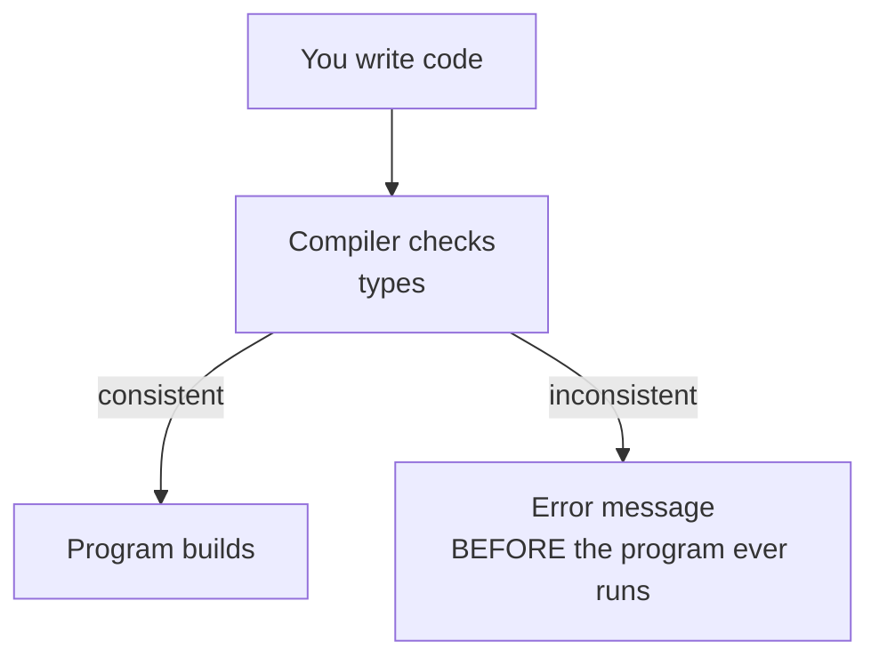

In the previous chapter we said every variable has a *type*, and a
type is a *promise about memory and operations*. Now let's zoom out
and look at the C++ type system as a whole. The goal is not to
memorize every category but to build a *map* of the territory so you
recognize where every type fits.

<Figure
  slug="cpp-types-and-values-cutout"
  alt="Types and values, an isometric illustration"
/>

## Why types?

A type system answers three questions:

1. **What can I store?** A `bool` can store `true` or `false`; a
   `std::string` can store any sequence of bytes.
2. **What can I do with it?** You can `<<` a `std::string` to
   `std::cout`; you cannot `<<` a raw `int[5]` array.
3. **What can be converted to what, and how dangerous is each
   conversion?**

A *static* type system answers all three at *compile time*. Bugs
caught by the compiler are bugs your users never see.



## A map of C++ types

C++ types break down into a small family of categories:

- **Fundamental**
  - Integral, `int`, `char`, `bool`, ...
  - Floating-point, `float`, `double`, `long double`
  - `void`, "no value"
  - `std::nullptr_t`, just for `nullptr`
- **Compound**
  - Pointer, `T*`
  - Reference, `T&`
  - Array, `T[n]`
  - Function, `int(int)`
  - Class / struct
  - Enumeration

Most of your day will be spent with `int`, `double`, `bool`,
`std::string`, `std::vector`, and your own classes, but it helps
to know the rest exists.

## Integral types in detail

C++ integers come in several widths and two **signedness** flavors:

| Type | Bits | Range (signed) | Range (unsigned) |
| --- | ---: | --- | --- |
| `char` / `signed char` / `unsigned char` | 8 | -128..127 | 0..255 |
| `short` | 16 | -32 768..32 767 | 0..65 535 |
| `int` | 32 (typical) | ±2.1B | 0..4.29B |
| `long` | 32 or 64 | varies | varies |
| `long long` | 64 | ±9.2 quintillion | 0..1.8E19 |
| `std::size_t` | 32 or 64 | n/a (unsigned) | size of any object |

`std::size_t` is the type returned by `sizeof` and used for sizes
and array indices. It is *unsigned*, which leads to a classic trap:

<CodeBlock
  adapter="cpp"
  files={[
    {
      filename: "main.cpp",
      starterCode: `#include <iostream>
#include <vector>

int main() {
  std::vector<int> v = {10, 20, 30};

  // Looks reasonable -- but watch out!
  for (int i = v.size() - 1; i >= 0; --i) {
    std::cout << v[i] << "\\n";
  }

  // The dangerous version:
  // for (std::size_t i = v.size() - 1; i >= 0; --i) {
  //     ...   // infinite loop! size_t is unsigned, so i >= 0 is always true,
  //           //   and i-- wraps from 0 to a huge positive number.
  // }
  return 0;
}
`,
    },
  ]}
/>

A good habit: use *signed* integer types for arithmetic and *only*
use `std::size_t` when you really need to interoperate with a size or
index from the standard library.

## Floating-point types and their surprises

The central surprise is that the gap between representable values grows
with their magnitude, so "precision" is not a fixed number of decimals:

<Chart slug="float-precision-gaps" />

`float` and `double` represent real numbers, but only approximately.
The hardware uses **IEEE-754** binary representation, which cannot
exactly store many "nice" decimal numbers.

<CodeBlock
  adapter="cpp"
  files={[
    {
      filename: "main.cpp",
      starterCode: `#include <iomanip>
#include <iostream>

int main() {
  double a = 0.1;
  double b = 0.2;
  double c = a + b;
  std::cout << std::setprecision(20);
  std::cout << "a + b = " << c << "\\n";
  std::cout << "compare to 0.3: " << (c == 0.3 ? "equal" : "NOT equal") << "\\n";
  return 0;
}
`,
    },
  ]}
/>

`0.1 + 0.2` is not exactly `0.3` in binary floating-point. Never
compare floats with `==`; compare with a tolerance:
`std::abs(a - b) < 1e-9`. Use `int` (or `long long`) for money,
counts, and anything that needs to be exact.

## Compound types preview

We will cover each of these properly in later chapters; for now you
just need to recognize their *shape*.

```cpp
int n;           // a value
int* p;          // a pointer to an int
int& r = n;      // a reference to an int
int a[5];        // an array of 5 ints
struct Point { int x; int y; };  // a struct (aggregate type)
enum class Color { Red, Green, Blue };  // a scoped enum
```

A **pointer** holds a memory address. A **reference** is an alias
for another name. An **array** is a fixed-size block of consecutive
values. A **struct** bundles several values into one. An **enum
class** is a small set of named constants with its own type.

## Type conversions

C++ has two big categories of conversions:

1. **Implicit (silent) conversions.** The compiler inserts them for
   you when there is a "standard" way to convert. Examples:
   `int -> double`, `int -> bool` (zero is false, nonzero is true).
2. **Explicit conversions.** You write them yourself. Modern C++
   prefers the named casts: `static_cast`, `const_cast`,
   `reinterpret_cast`, `dynamic_cast`.

<CodeBlock
  adapter="cpp"
  files={[
    {
      filename: "main.cpp",
      starterCode: `#include <iostream>

int main() {
  int n = 7;
  double d = n;                   // implicit int -> double
  int n2 = static_cast<int>(3.9); // explicit double -> int (truncates to 3)
  bool b = n;                     // 7 -> true
  int k = b;                      // true -> 1

  std::cout << d << " " << n2 << " " << b << " " << k << "\\n";
  return 0;
}
`,
    },
  ]}
/>

Use `static_cast` when you actually mean it. C-style casts
(`(int)3.9`) work but are easy to grep-miss and easy to *over*-do
(they will silently strip `const`, perform reinterpretation, or do
both).

If you ever doubt that a humble numeric conversion deserves respect,
consider the most expensive type error in history. On June 4, 1996,
the maiden flight of the European **Ariane 5** rocket veered off
course and self-destructed about 37 seconds after liftoff,
destroying the launcher and its four scientific satellites. The
inquiry board traced the failure to one line of guidance software,
reused from the older Ariane 4: a 64-bit floating-point value
representing the rocket's horizontal velocity was converted to a
16-bit signed integer. Ariane 5 flew a steeper trajectory than its
predecessor, the value no longer fit, the unguarded conversion
overflowed, and the guidance computer shut itself down mid-flight.
The conversion had been left unprotected because, on Ariane 4, the
value *provably* couldn't overflow. Types are promises about the
values that can appear, and the Ariane team learned that a promise
made for one rocket does not transfer to another.

## Truthiness

In conditions like `if (x)`, C++ treats any non-zero value as
"true" and zero as "false." This includes pointers (a null pointer
is false; any non-null pointer is true).

<CodeBlock
  adapter="cpp"
  files={[
    {
      filename: "main.cpp",
      starterCode: `#include <iostream>

void describe(int n) {
  if (n) {
    std::cout << n << " is nonzero (truthy)\\n";
  } else {
    std::cout << n << " is zero (falsy)\\n";
  }
}

int main() {
  describe(0);
  describe(1);
  describe(-1);
  return 0;
}
`,
    },
  ]}
/>

For clarity in real code, prefer explicit comparisons (`if (n != 0)`,
`if (p != nullptr)`).

## Named constants and `constexpr`

For values that are *truly* constant and known at compile time, use
`constexpr` rather than `const`. `constexpr` guarantees the value
is computed at compile time and can be used wherever a compile-time
constant is needed (e.g. as an array size).

<CodeBlock
  adapter="cpp"
  files={[
    {
      filename: "main.cpp",
      starterCode: `#include <iostream>

constexpr int kBoardSize = 8;

int main() {
  int board[kBoardSize][kBoardSize] = {};
  board[0][0] = 1;
  std::cout << "board is " << kBoardSize << "x" << kBoardSize << "\\n";
  std::cout << "corner = " << board[0][0] << "\\n";
  return 0;
}
`,
    },
  ]}
/>

Prefer `constexpr` over preprocessor `#define MAX 100` macros. The
constexpr version has a real type, respects scope, and the compiler
can reason about it.

## Enumerations: a small set of named values

When a variable should hold *one of* a small fixed set of options,
use an `enum class`:

<CodeBlock
  adapter="cpp"
  files={[
    {
      filename: "main.cpp",
      starterCode: `#include <iostream>

enum class TrafficLight { Red, Yellow, Green };

const char *describe(TrafficLight light) {
  switch (light) {
  case TrafficLight::Red:
    return "STOP";
  case TrafficLight::Yellow:
    return "SLOW";
  case TrafficLight::Green:
    return "GO";
  }
  return "?";
}

int main() {
  TrafficLight l = TrafficLight::Green;
  std::cout << describe(l) << "\\n";
  l = TrafficLight::Red;
  std::cout << describe(l) << "\\n";
  return 0;
}
`,
    },
  ]}
/>

Why not just use `int 0/1/2`? Because then nothing prevents you
from writing `l = 7;` or comparing two unrelated enums. With
`enum class`, the type system catches misuse for free.

## Type aliases

Long type names get repetitive. `using` declares a friendly alias:

```cpp
using StringMap = std::map<std::string, std::string>;

StringMap config;   // much shorter than spelling std::map<...> again
```

Aliases are just names, they don't create new types. But they make
code dramatically more readable.

## Reading C++ types right to left

When you see a complex type, read from the variable name outward.

```cpp
const int* p;     // p is a pointer to const int
int* const p;     // p is a const pointer to int
const int* const p;   // p is a const pointer to const int
```

The trick: the word `const` qualifies whatever is *to its left*
(or, if there is nothing to its left, whatever is to its right).
Practice this on small examples; the same pattern scales up.

## Challenge: choose the right type

<ChallengeCard
  adapter="cpp"
  title="Average of a vector"
  instructions={`Implement \`double average(const std::vector<int>& xs)\` that returns the mean of \`xs\`. Pay attention to the types: \`xs.size()\` is \`std::size_t\` and the sum is \`int\`, you'll need a cast or careful arithmetic to get the right \`double\` result. The fixed input prints exactly \`3\` on success.`}
  files={[
    {
      filename: "main.cpp",
      starterCode: `#include <iostream>
#include <vector>

double average(const std::vector<int> &xs) {
  // your code here
  return 0.0;
}

int main() {
  std::vector<int> v = {1, 2, 3, 4, 5};
  std::cout << average(v);
  return 0;
}
`,
      solutionCode: `#include <iostream>
#include <vector>

double average(const std::vector<int> &xs) {
  long long total = 0;
  for (int x : xs)
    total += x;
  return static_cast<double>(total) / xs.size();
}

int main() {
  std::vector<int> v = {1, 2, 3, 4, 5};
  std::cout << average(v);
  return 0;
}
`,
    },
  ]}
  tests={[
    {
      id: "avg",
      name: "average of 1..5 is 3",
      description: "Exact stdout match",
      expect: { stdoutEquals: "3" },
    },
  ]}
/>

## Test your understanding

<MultipleChoice
  markdown={`Why is it dangerous to compare \`double\` values with \`==\`?

- The CPU does not support double equality at all.
  > It does; the issue is that the values being compared may not be exactly equal due to rounding.
- [o] Floating-point arithmetic is approximate; many decimal values cannot be represented exactly in binary, so the comparison may fail even for inputs that look mathematically equal.
  > Use a tolerance (\`std::abs(a-b) < eps\`) for floating-point equality.
- It is dangerous only on 32-bit systems.
  > It is true everywhere; IEEE-754 behaves the same way on all platforms.
- The compiler always emits a warning, so the operation is forbidden.
  > It is not forbidden, but the result is often surprising.`}
/>

<MultipleChoice
  markdown={`What's the safer modern alternative to a C-style cast like \`(int)3.9\`?

- [o] A static_cast, e.g. \`static_cast<int>(3.9)\`.
  > \`static_cast\` is the right tool for ordinary numeric conversions.
- A dynamic_cast.
  > That is for safely casting between related class types at runtime.
- A reinterpret_cast.
  > That is for low-level pointer reinterpretation; using it for arithmetic is dangerous.
- A const_cast.
  > That is for removing \`const\`, not for type changes.`}
/>

<MultipleChoice
  markdown={`What is the main reason to prefer \`enum class Color { ... }\` over plain integers for representing a small fixed set of options?

- It is faster at runtime.
  > Both compile to the same code at runtime.
- It uses less memory.
  > The storage is typically the same.
- [o] It gives the values a distinct type, so the compiler can prevent misuse like mixing colors with unrelated integers.
  > \`enum class\` is a type-safety win.
- It is required by the C++ standard.
  > The language allows plain integers too; \`enum class\` is just better hygiene.`}
/>

<MultipleChoice
  markdown={`When should you reach for \`constexpr\` instead of \`const\`?

- Never; \`const\` is always better.
  > \`constexpr\` has a different purpose.
- Only inside template metaprogramming code.
  > \`constexpr\` is useful in everyday code too.
- Whenever you want a variable that might change later.
  > Both \`const\` and \`constexpr\` forbid changes after initialization.
- [o] When the value is genuinely known at compile time and you may need it in a context that requires a compile-time constant (array sizes, template arguments, etc.).
  > \`constexpr\` is a compile-time promise; \`const\` is only a runtime "do not modify" promise.`}
/>

Next: how to control the flow of a program, `if`, `while`, `for`,
`switch`, and how to think about them as *decisions* and *loops*.
