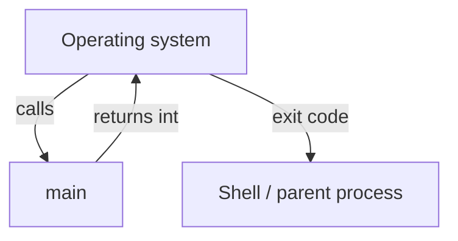
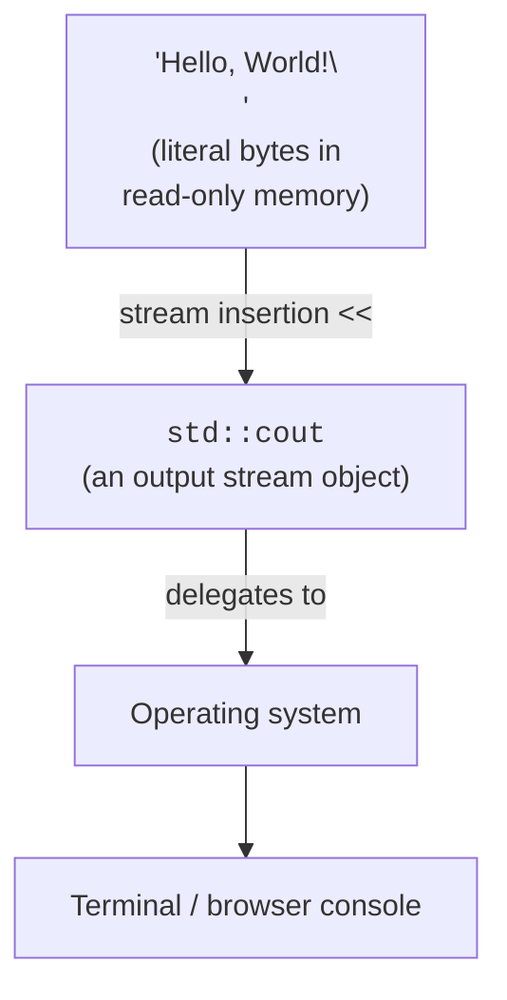

Now that you know the machine and the pipeline, let's slow down on a
program you have already seen and examine *every single piece*.
"Hello, World!" looks trivial, but the four-line version below uses
roughly a dozen distinct language features. Let's name them.

<Figure
  slug="cpp-your-first-program-cutout"
  alt="Your first program, an isometric illustration"
/>

<CodeBlock
  adapter="cpp"
  files={[
    {
      filename: "main.cpp",
      starterCode: `#include <iostream>

int main() {
  std::cout << "Hello, World!\\n";
  return 0;
}
`,
    },
  ]}
/>

## Line 1, `#include <iostream>`

A **preprocessor directive** (we met these in the last chapter). It
tells the preprocessor to paste the entire contents of the standard
header `<iostream>` here, *before* the compiler sees the file.
`<iostream>` is the standard library header for **stream-based
input/output**. It is what makes `std::cout` exist.

<Figure
  slug="cpp-your-first-program-inline-cutout"
  alt="A lamp on a bench lighting for the first time as a hand closes the last connection"
/>

If you remove this line, the program fails with a compiler error
like *"`std::cout` was not declared in this scope."*

## Line 3, `int main()`

The **entry point** of every standalone C++ program. When the
operating system launches your executable, it ultimately calls a
function literally named `main`. C++ requires this function to
return an `int`. The return value is the program's **exit status**:
by convention, `0` means success and any other value means a
particular kind of failure.



You may also see `int main(int argc, char* argv[])`, which is how
you receive command-line arguments. We'll meet that later.

## The `{ ... }` block

Curly braces define a **compound statement**, also called a **scope**
or **block**. Variables declared inside a block exist only until
the matching closing brace. We will use scope rules constantly when
we discuss lifetimes and resource management.

## Line 4, `std::cout << "Hello, World!\n";`

A single C++ statement that does a *lot*.

- `std::` is a **namespace** qualifier. The C++ standard library
  lives in the namespace `std`, so its names are spelled
  `std::cout`, `std::string`, `std::vector`, and so on. Namespaces
  prevent collisions between libraries that happen to pick the same
  short names.
- `cout` is the name of the standard **output stream object**, a
  pre-existing object that represents *the place where text goes
  when you print it*.
- `<<` is the **stream insertion operator**. Despite the symbol it
  is not really "bit-shift left" here; it is a *function call in
  disguise* on `cout` that means "send the right-hand thing into
  this stream."
- `"Hello, World!\n"` is a **string literal**: a sequence of bytes
  the compiler embedded directly into the data segment of your
  program. The trailing `\n` is the **escape sequence** for a
  newline character.
- `;` ends the statement. C++ statements end with a semicolon, the
  same way English sentences end with a period.



## Line 5, `return 0;`

Hand control back to the operating system with exit status `0`. If
you `return 1;` instead, scripts that called your program (like a
shell, a CI pipeline, or a parent process) will see "this program
failed." The numerical exit code is one of the simplest ways
programs communicate with each other.

<CodeBlock
  adapter="cpp"
  files={[
    {
      filename: "main.cpp",
      starterCode: `#include <iostream>

int main() {
  std::cout << "About to fail on purpose\\n";
  return 42; // non-zero means "I failed"; the number can mean anything.
}
`,
    },
  ]}
/>

In a real shell you could check the exit code with `echo $?`. The
browser sandbox does not show it, but the OS would.

## A slightly bigger first program

Below is a more interesting first program. It uses **variables**,
**input**, **a function**, and a **loop**. Don't worry if some
pieces feel new; we'll spend whole chapters on each.

<CodeBlock
  adapter="cpp"
  files={[
    {
      filename: "main.cpp",
      starterCode: `#include <iostream>
#include <string>

std::string shout(const std::string &s) {
  std::string out;
  for (char c : s) {
    if (c >= 'a' && c <= 'z') {
      out += (char)(c - 'a' + 'A');
    } else {
      out += c;
    }
  }
  return out;
}

int main() {
  std::string greeting = "hello, world!";
  for (int i = 0; i < 3; ++i) {
    std::cout << shout(greeting) << "\\n";
  }
  return 0;
}
`,
    },
  ]}
/>

A quick tour of the new pieces:

- `#include <string>` brings in `std::string`, a managed,
  heap-backed sequence of characters that handles its own memory.
- `std::string shout(const std::string& s)` declares a **function**
  named `shout` that takes a `std::string` *by const reference*
  (we'll explain references later) and returns a `std::string`.
- `for (char c : s)` is a **range-based for loop**: for each
  character `c` in the string `s`, do the body.
- `if / else` is C++'s conditional statement.
- `out += ...` appends to the output string. C++ strings know how to
  grow themselves.
- The main loop runs `shout` three times and prints the result.

Edit the greeting, change the loop count, or change the test inside
`if` to convert other character ranges. Then run it.

## Comments

Comments are notes you leave for yourself or future readers. The
compiler ignores them.

```cpp
// This is a single-line comment.

/*
   This is a multi-line
   comment.
*/
```

Use comments to explain *why* code does something, not *what* it
does. The code already shows the *what*; a good comment captures
intent or constraints.

## Common beginner mistakes

| Mistake | What you'll see | Fix |
| --- | --- | --- |
| Forgetting `#include <iostream>` | "`cout` was not declared" | Add the include. |
| Forgetting `std::` | "`cout` was not declared" | Write `std::cout`, or `using std::cout;` once at the top. |
| Forgetting `;` at end of a statement | "expected `;`" | Add the semicolon. |
| Mismatched `{ }` | "expected `}`" | Indent consistently; let your editor highlight matching braces. |
| Using `=` instead of `==` in `if` | Compiles, but means "assign", not "compare" | Use `==` for comparison. |
| Using `"hello"` where a character is expected | Type error | Use single quotes for a single character: `'h'`. |

## A first challenge

Time to write something yourself. Don't peek at the solution unless
you really need to.

<ChallengeCard
  adapter="cpp"
  title="Print three lines"
  instructions={`Write a program that prints exactly these three lines, in this order:\n\n\`\`\`\nReady\nSet\nGo!\n\`\`\`\n\nEach word should be on its own line.`}
  files={[
    {
      filename: "main.cpp",
      starterCode: `#include <iostream>

int main() {
  // your code here
  return 0;
}
`,
      solutionCode: `#include <iostream>

int main() {
  std::cout << "Ready\\n";
  std::cout << "Set\\n";
  std::cout << "Go!\\n";
  return 0;
}
`,
    },
  ]}
  tests={[
    {
      id: "three-lines",
      name: "Prints Ready / Set / Go!",
      description: "Three lines, in order",
      expect: {
        stdoutLines: ["Ready", "Set", "Go!"],
        stdoutLinesExact: true,
      },
    },
  ]}
/>

<ChallengeCard
  adapter="cpp"
  title="Sum of 1..N"
  instructions={`Write a program that prints \`5050\` followed by a newline. (That is the sum of all integers from 1 to 100 inclusive.) Use a loop, not a formula, we want practice with loops.`}
  files={[
    {
      filename: "main.cpp",
      starterCode: `#include <iostream>

int main() {
  int total = 0;
  // your code here
  std::cout << total << "\\n";
  return 0;
}
`,
      solutionCode: `#include <iostream>

int main() {
  int total = 0;
  for (int i = 1; i <= 100; ++i) {
    total += i;
  }
  std::cout << total << "\\n";
  return 0;
}
`,
    },
  ]}
  tests={[
    {
      id: "sum",
      name: "Prints 5050",
      description: "Exact stdout match",
      expect: { stdoutEquals: "5050" },
    },
  ]}
/>

## Test your understanding

<MultipleChoice
  markdown={`What does the \`return 0;\` at the end of \`main\` mean?

- It is required only in debug builds.
  > A C++ \`main\` should always end by returning a value (though omitting it implicitly returns 0 in C++).
- It frees all memory used by the program.
  > Memory cleanup is performed automatically by the OS when the process ends.
- [o] It signals to the operating system that the program completed successfully.
  > By convention, \`0\` means success and any other value means a particular kind of failure.
- It returns the number zero from the program to the caller of \`main\`.
  > Technically true, but the meaning of that number matters more than the number itself.`}
/>

<MultipleChoice
  markdown={`Why do we write \`std::cout\` instead of just \`cout\`?

- [o] Because \`cout\` lives in the standard-library namespace \`std\`, and \`std::cout\` fully qualifies which \`cout\` we mean.
  > Namespaces prevent collisions between libraries that happen to share short names.
- Because \`std\` makes the program run faster.
  > Namespaces have no runtime cost.
- Because \`cout\` is a typo.
  > It is not; \`cout\` is the name. The prefix locates it.
- Because C++ uses dollar signs to indicate variables.
  > C++ does not use dollar signs for that.`}
/>

<MultipleChoice
  markdown={`What does the escape sequence \`\\n\` represent inside a string literal?

- [o] A single newline character.
  > \`\\n\` is shorthand for the newline byte.
- The two characters backslash and \`n\`.
  > Only if it were written as \`\\\\n\`.
- The end of the string.
  > Strings end with an implicit null byte in C++ string literals; \`\\n\` is just a newline.
- A tab character.
  > That would be \`\\t\`.`}
/>

<MultipleChoice
  markdown={`What is the difference between \`'a'\` and \`"a"\`?

- They are the same thing.
  > They have different *types* and different storage.
- [o] \`'a'\` is a single \`char\` (1 byte), while \`"a"\` is a string literal of two characters (\`'a'\` followed by a hidden null terminator).
  > The type of \`'a'\` is \`char\`; the type of \`"a"\` is \`const char[2]\`.
- \`'a'\` is a string; \`"a"\` is a character.
  > It is the opposite.
- \`"a"\` is invalid; only single quotes work.
  > Double-quoted string literals are perfectly valid.`}
/>

Up next: how to *think* about programming problems before writing
any code at all.
