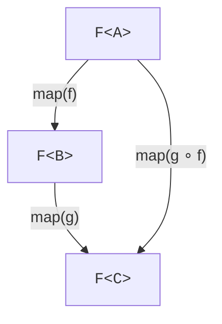

Category theory has a fearsome reputation. The good news is that
*every working functional programmer* uses three category-theoretic
patterns daily, usually without naming them. This chapter gives
you the names and, more importantly, the intuitions.

<Figure
  slug="fp-category-theory-cutout"
  alt="Category theory intuitions, an isometric illustration"
/>

We'll keep all the code in plain TypeScript. No libraries, no
Greek letters.

## A unifying observation

You already know `Array.prototype.map`. And you've just met
`Option`'s `map()` and `Result`'s `map()`. And `Promise`'s `.then` is
`map()` for asynchronous values, under a different name.

<Figure
  slug="fp-category-theory-intuitions-unifying-observation-inline-cutout"
  alt="Four very different machines all wearing the same two fittings, one at the inlet and one at the outlet"
  caption="Very different structures share the same two fittings, which is the whole point."
/>

That's not an accident. **The same operation keeps appearing for
different "container" types.** When a pattern repeats across many
unrelated types, it's worth giving it a name.

| Type      | Means                            | `map()` transforms…         |
| --------- | -------------------------------- | ------------------------- |
| `Array<A>`   | "zero or more `A`"            | every element             |
| `Option<A>`  | "maybe an `A`"                | the value if present      |
| `Result<E,A>`| "`A` or an error `E`"         | the value if ok           |
| `Promise<A>` | "an `A` arriving later"       | the eventual value        |
| `Task<A>`    | "an `A` you can run later"    | the produced value        |
| `(R) => A`   | "an `A` given a context `R`"  | the produced value        |

All of these are **functors**. A functor is just a type `F<A>`
together with a lawful `map()` operation.

## Functor

<CodeBlock
  adapter="typescript"
  files={[
    {
      filename: "main.ts",
      starterCode: `type Option<A> = { kind: "none" } | { kind: "some"; value: A };
const some = <A,>(value: A): Option<A> => ({ kind: "some", value });
const none = <A,>(): Option<A> => ({ kind: "none" });

// Functor-as-record for Option
const OptionFunctor = {
  map: <A, B>(fa: Option<A>, f: (a: A) => B): Option<B> =>
    fa.kind === "none" ? none() : some(f(fa.value)),
};

// Functor-as-record for Array
const ArrayFunctor = {
  map: <A, B>(fa: ReadonlyArray<A>, f: (a: A) => B): ReadonlyArray<B> =>
    fa.map(f),
};

console.log(OptionFunctor.map(some(3), (x) => x * 2));
console.log(ArrayFunctor.map([1, 2, 3], (x) => x * 2));
`,
    },
  ]}
/>

### Functor laws (intuitions)

A functor's `map()` must obey two laws, both perfectly sensible:

1. **Identity:** `map(fa, x => x) === fa`, mapping with the
   identity function changes nothing.
2. **Composition:** `map(map(fa, f), g) === map(fa, x => g(f(x)))`,
mapping with `f` then `g` is the same as mapping with
   `g ∘ f`.

<Figure
  slug="fp-category-theory-intuitions-functor-inline-cutout"
  alt="A sealed box with a block inside, a small tool reaching in through a hatch to change the block without opening the box"
  caption="A functor lets you change what is inside without opening the container."
/>

These laws guarantee `map()` is "structure-preserving": it doesn't
secretly rearrange the container, drop elements, duplicate things,
or fail in surprising ways. If you've ever felt that
`array.map((x) => x)` should equal `array`, that's the functor
identity law.



The two paths must give the same result. Always.

## Applicative

Functors lift a *one-argument* function into the container. What
about two-argument functions? That's where **Applicative** comes
in. It adds two extras:

- `of(a)`, put a plain value into the container ("wrap")
- `ap(ff, fa)`, given a wrapped function and a wrapped value,
  apply one to the other.

With those, you can lift any n-argument function.

<CodeBlock
  adapter="typescript"
  files={[
    {
      filename: "main.ts",
      starterCode: `type Option<A> = { kind: "none" } | { kind: "some"; value: A };
const some = <A,>(value: A): Option<A> => ({ kind: "some", value });
const none = <A,>(): Option<A> => ({ kind: "none" });

const ofO = <A,>(a: A): Option<A> => some(a);
const mapO = <A, B>(fa: Option<A>, f: (a: A) => B): Option<B> =>
  fa.kind === "none" ? none() : some(f(fa.value));

// "apply" a wrapped function to a wrapped value
function apO<A, B>(ff: Option<(a: A) => B>, fa: Option<A>): Option<B> {
  if (ff.kind === "none" || fa.kind === "none") return none();
  return some(ff.value(fa.value));
}

// Lift a 2-arg function into Option:  liftA2 f fa fb = ap (map f fa) fb
function liftA2<A, B, C>(
  f: (a: A) => (b: B) => C,
  fa: Option<A>,
  fb: Option<B>,
): Option<C> {
  return apO(mapO(fa, f), fb);
}

const add = (x: number) => (y: number) => x + y;

console.log(liftA2(add, some(2), some(3))); // some(5)
console.log(liftA2(add, none(), some(3))); // none
console.log(liftA2(add, some(2), none())); // none
`,
    },
  ]}
/>

The intuition: applicative is for combining **independent**
computations. "Get config A AND config B in parallel, then combine
them" is applicative. Either both succeed, or the whole thing
fails (if you use the validation-style applicative, both errors
even get collected, see below).

### Accumulating validation errors

A famous use of applicative: validate several fields and gather
**all** the errors, not just the first one.

<CodeBlock
  adapter="typescript"
  files={[
    {
      filename: "main.ts",
      starterCode: `type Result<E, A> =
  | { kind: "ok"; value: A }
  | { kind: "err"; errors: ReadonlyArray<E> };
const ok = <E, A>(value: A): Result<E, A> => ({ kind: "ok", value });
const err = <E, A>(...es: E[]): Result<E, A> => ({ kind: "err", errors: es });

// "Validation-flavoured" Result: ap collects errors from both sides
function map2<E, A, B, C>(
  f: (a: A, b: B) => C,
  ra: Result<E, A>,
  rb: Result<E, B>,
): Result<E, C> {
  if (ra.kind === "ok" && rb.kind === "ok") return ok(f(ra.value, rb.value));
  if (ra.kind === "err" && rb.kind === "err")
    return err(...ra.errors, ...rb.errors);
  return ra.kind === "err" ? ra : (rb as Result<E, C>);
}

const nameR = err<string, string>("name required");
const ageR = err<string, number>("age must be a number");

const profile = map2<string, string, number, { name: string; age: number }>(
  (n, a) => ({ name: n, age: a }),
  nameR,
  ageR,
);

console.log(profile);
// { kind: 'err', errors: ['name required', 'age must be a number'] }
`,
    },
  ]}
/>

That's the practical superpower of applicative: form validation
that reports *every* problem at once.

## Monad

Finally, **Monad** is the pattern for **dependent** chained
computations: "compute A; then, *using A*, compute B; then, *using
B*, compute C".

A monad adds `flatMap()` (also called `chain()`/`bind`/`andThen`) to a
functor:

```ts
flatMap<A, B>(fa: F<A>, f: (a: A) => F<B>): F<B>
```

The difference from `map()`:
- `map()`     takes `(a: A) => B`, the inner function returns a bare value.
- `flatMap()` takes `(a: A) => F<B>`, the inner function itself returns a container.

`flatMap()` *flattens* the resulting `F<F<B>>` back to `F<B>`. That
flattening is the whole point: each step contributes its own
"context" (failure / asynchrony / nondeterminism), and `flatMap()`
merges them into one.

<CodeBlock
  adapter="typescript"
  files={[
    {
      filename: "main.ts",
      starterCode: `type Option<A> = { kind: "none" } | { kind: "some"; value: A };
const some = <A,>(value: A): Option<A> => ({ kind: "some", value });
const none = <A,>(): Option<A> => ({ kind: "none" });

const flatMapO = <A, B>(fa: Option<A>, f: (a: A) => Option<B>): Option<B> =>
  fa.kind === "none" ? none() : f(fa.value);

// Same shape for Array: flatMap is built in
const flatMapA = <A, B>(fa: ReadonlyArray<A>, f: (a: A) => ReadonlyArray<B>) =>
  fa.flatMap(f);

// Same shape for Promise: .then is flatMap (when the callback returns a Promise)
const flatMapP = <A, B>(fa: Promise<A>, f: (a: A) => Promise<B>): Promise<B> =>
  fa.then(f);

(async () => {
  console.log(flatMapO(some(2), (n) => (n > 0 ? some(n + 1) : none())));
  console.log(flatMapA([1, 2, 3], (n) => [n, n * 10]));
  console.log(
    await flatMapP(Promise.resolve(2), (n) => Promise.resolve(n + 1)),
  );
})();
`,
    },
  ]}
/>

### Functor vs. Applicative vs. Monad

A useful mnemonic:

| Pattern      | Use when…                                                          |
| ------------ | ------------------------------------------------------------------ |
| Functor      | You have one container; you want to transform the inside.          |
| Applicative  | You have several **independent** containers; you want to combine. |
| Monad        | You have a chain where **each step depends on the previous**.      |

A real example combining all three:

```ts
// Independent: validate name AND age in parallel  -> Applicative
const personR = map2((n, a) => ({ name: n, age: a }), nameR, ageR);

// Then dependent: lookup user by valid id          -> Monad
const userR = flatMap(personR, (p) => lookupByName(p.name));

// Then transform the user                          -> Functor
const greeting = map(userR, (u) => `Hello, ${u.name}!`);
```

The three patterns *compose*. Real FP code is a mix of all three,
chosen per step depending on whether things are independent or
sequential.

## A word about the fearsome reputation

Monads earned their mystique honestly. The concept entered
programming through Eugenio Moggi's dense theoretical papers around
1990, and Philip Wadler then showed Haskell programmers how monads
could structure real programs, including, famously, how a *pure*
language could finally do I/O without compromising itself. The
mathematics is real, and it is genuinely abstract.

The internet's favorite summary of the situation comes from James
Iry's 2009 satirical history of programming languages, which has a
fictional Wadler reassuring programmers that there's nothing to
fear because *"a monad is just a monoid in the category of
endofunctors."* The joke stuck precisely because it captures how
most monad explanations feel, technically true and totally
unhelpful.

There is even a name for why tutorials so often fail here: the
**monad tutorial fallacy**, coined by Brent Yorgey. The pattern
finally *clicks* for someone after they've worked through enough
concrete examples, and then, flush with insight, they write a
tutorial built around whatever metaphor (burritos, boxes, conveyor
belts) happened to accompany their personal click, which transfers
nothing. The fix is the approach this chapter took: no metaphors,
just `Option`, `Array`, and `Promise`, side by side, until you
notice they share a shape. If the shape *hasn't* clicked yet, that
is normal, keep writing `flatMap()` chains and it will.

## Why this matters

Once you see Functor / Applicative / Monad, you start noticing
them *everywhere*: lists, options, results, promises, parsers,
streams, optics, state, reducers, even React reducers and Redux
thunks. They're not magic, they're just **the shape of code that
threads a context through**.

Libraries like fp-ts, Effect, and zio formalize these. But the
patterns belong to the structure of computation, not to any
library. You can, and we have, write them in plain TypeScript
in a dozen lines.

## A small challenge

<ChallengeCard
  adapter="typescript"
  title="Use applicative to combine two Options"
  instructions={`In \`combine.ts\`, implement \`map2(f, oa, ob)\` for
\`Option\`: it returns \`some(f(a, b))\` if both are \`some\`,
otherwise \`none\`.

Then in \`main.ts\`, use it to compute \`pair(some(2), some(3))\`,
\`pair(none(), some(3))\`, and \`pair(some(2), none())\`.

**Expected output**

\`\`\`text
{ kind: 'some', value: [ 2, 3 ] }
{ kind: 'none' }
{ kind: 'none' }
\`\`\``}
  entryFilename="main.ts"
  files={[
    {
      filename: "main.ts",
      starterCode: `import { map2, some, none } from "./combine";

const pair = <A, B>(oa: { kind: string }, ob: { kind: string }) =>
  map2<A, B, readonly [A, B]>(
    (a, b) => [a, b] as const,
    oa as never,
    ob as never,
  );

console.log(pair(some(2), some(3)));
console.log(pair(none(), some(3)));
console.log(pair(some(2), none()));
`,
    },
    {
      filename: "combine.ts",
      starterCode: `export type Option<A> = { kind: "none" } | { kind: "some"; value: A };
export const some = <A,>(value: A): Option<A> => ({ kind: "some", value });
export const none = <A,>(): Option<A> => ({ kind: "none" });

export function map2<A, B, C>(
  f: (a: A, b: B) => C,
  oa: Option<A>,
  ob: Option<B>,
): Option<C> {
  // TODO: return some(f(a, b)) when both are some, else none
  return none();
}
`,
      solutionCode: `export type Option<A> = { kind: "none" } | { kind: "some"; value: A };
export const some = <A,>(value: A): Option<A> => ({ kind: "some", value });
export const none = <A,>(): Option<A> => ({ kind: "none" });

export function map2<A, B, C>(
  f: (a: A, b: B) => C,
  oa: Option<A>,
  ob: Option<B>,
): Option<C> {
  if (oa.kind === "some" && ob.kind === "some")
    return some(f(oa.value, ob.value));
  return none();
}
`,
    },
  ]}
  tests={[
    {
      id: "map2-option",
      name: "Applicative-style combine",
      description: "map2 returns some only when both sides are some.",
      expect: { stdoutEquals: "{ kind: 'some', value: [ 2, 3 ] }\n{ kind: 'none' }\n{ kind: 'none' }" },
    },
  ]}
/>

---

<MultipleChoice
  markdown={`When should you reach for \`flatMap()\` (monad) instead of \`map()\` (functor)?

- [o] When the function you want to apply returns another value of the same container type, for example \`(a: A) => Option<B>\`, and you want a flat \`Option<B>\` instead of \`Option<Option<B>>\`
  > \`flatMap()\` is the operator that *flattens* one layer of container. \`map()\` would leave you nested.
- Whenever the operation might throw an error
  > Errors alone don't decide it; it depends on whether the *next step* itself returns a container.
- When you want to combine two independent containers
  > That's applicative (\`map2\`/\`ap\`), not monad.
- When you want to discard the wrapper completely
  > That's \`getOrElse()\` for \`Option\`, not \`flatMap()\`.

The shape of the inner function, \`A => B\` vs \`A => F<B>\`, is what tells you which operator to use.`}
/>
