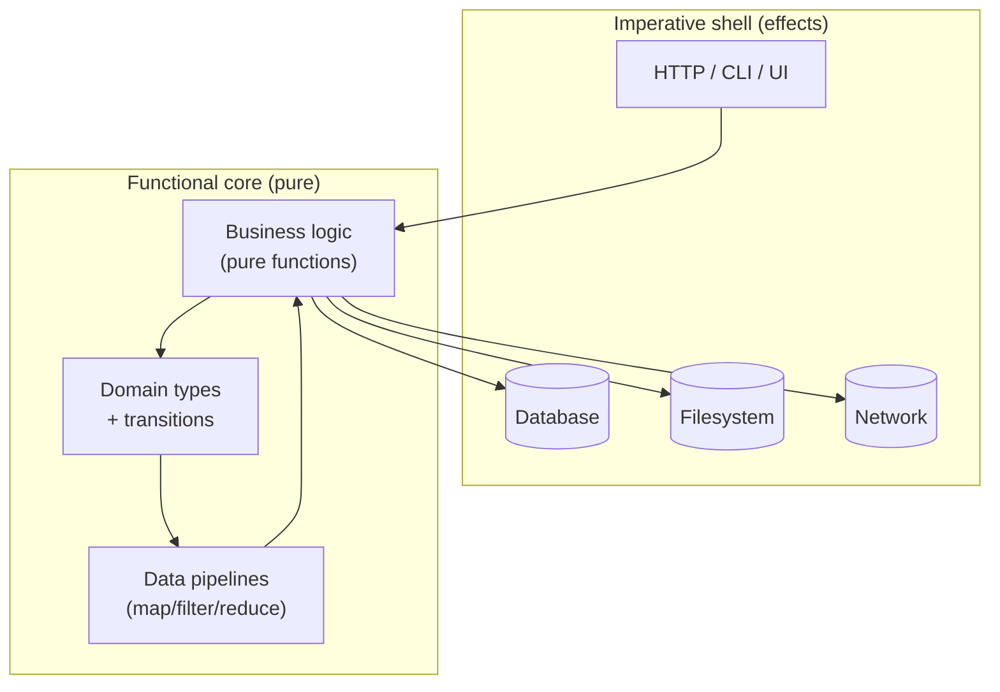

The chapters so far have given you a toolbox. Now we'll talk about
the *shape of a system* that emerges when you use that toolbox
consistently. It's sometimes called **functional core, imperative
shell**, sometimes **onion / hexagonal architecture**. The names
differ; the idea is the same.

<Figure
  slug="fp-composable-architecture-cutout"
  alt="Composable architecture, an isometric illustration"
/>

## The picture



The **core** is a pile of pure functions and immutable types: it
takes in data, produces new data. It contains *all* the business
rules and *none* of the I/O. The **shell** is a thin layer that
fetches data from the world, hands it to the core, and writes the
core's output back out.

Two rules carry the whole architecture:

1. **Effects live at the edge.** Database calls, HTTP requests,
   filesystem access, time, randomness, everything that touches
   the outside world, happens in the shell. The core is given
   data; it doesn't go fetch it.
2. **Decisions live in the core.** No important business decision
   is made in the shell. The shell only knows "call this pure
   function with this data; do what it says".

## Why this design wins

It's not aesthetics. There are concrete benefits.

**Testing.** The core is testable without mocks. You feed it
plain data; you check the data it returns. No need to stub a
database, no test containers, no flaky network. Most of your
business logic gets tested in microseconds.

**Replaceability.** The shell is *boring* and *replaceable*. You
can swap PostgreSQL for SQLite, REST for GraphQL, Express for
Fastify, without touching the core. The core only knows about
your *domain*, not your *infrastructure*.

**Reasoning.** When a bug appears in business logic, you don't
have to think about "did the network glitch?", the logic is
pure. The bug is in the function, end of story.

**Evolution.** New requirements usually live in the core. You add
or modify functions; the shell barely changes.

## A worked example

Suppose we want a small "billing summary" endpoint. The shell
gets the data; the core decides the output.

<CodeBlock
  adapter="typescript"
  files={[
    {
      filename: "main.ts",
      starterCode: `// --- CORE: pure types and functions ---

type Invoice = {
  readonly id: string;
  readonly amount: number;
  readonly paid: boolean;
  readonly dueDate: string; // ISO
};

type Summary = {
  readonly totalDue: number;
  readonly overdueCount: number;
  readonly invoices: ReadonlyArray<{
    id: string;
    status: "paid" | "due" | "overdue";
  }>;
};

const isOverdue = (today: string, inv: Invoice): boolean =>
  !inv.paid && inv.dueDate < today;

const statusOf = (today: string, inv: Invoice): "paid" | "due" | "overdue" =>
  inv.paid ? "paid" : isOverdue(today, inv) ? "overdue" : "due";

function summarize(today: string, invoices: ReadonlyArray<Invoice>): Summary {
  const totalDue = invoices
    .filter((i) => !i.paid)
    .reduce((acc, i) => acc + i.amount, 0);

  const overdueCount = invoices.filter((i) => isOverdue(today, i)).length;

  return {
    totalDue,
    overdueCount,
    invoices: invoices.map((i) => ({ id: i.id, status: statusOf(today, i) })),
  };
}

// --- SHELL: gathers data, calls the core, prints / persists ---
//   In a real app, the shell is the only part that knows about
//   the HTTP framework, the database, the clock, etc.

function todayUTC(): string {
  return new Date().toISOString().slice(0, 10);
}

function fakeFetchInvoices(): ReadonlyArray<Invoice> {
  return [
    { id: "1", amount: 50, paid: true, dueDate: "2024-01-01" },
    { id: "2", amount: 75, paid: false, dueDate: "2020-01-01" },
    { id: "3", amount: 200, paid: false, dueDate: "2099-01-01" },
  ];
}

function handler(): void {
  // Shell: gather inputs
  const invoices = fakeFetchInvoices();
  const today = "2025-06-01"; // deterministic for this demo

  // Core: pure decision
  const summary = summarize(today, invoices);

  // Shell: produce output
  console.log(JSON.stringify(summary, null, 2));
}

handler();
`,
    },
  ]}
/>

Notice how easy it is to test `summarize`: it's a pure function
of `(today, invoices) → Summary`. No mocks, no setup, no
teardown. The shell's `handler` is so thin that almost any bug it
could contain is "I passed the wrong thing in", easy to spot.

## The "ports and adapters" view

Another name for the same pattern: the core defines **ports**
(plain function or interface types) that say "I need a way to
fetch invoices, given an id, that returns `Promise<Invoice[]>`".
The shell provides **adapters** that satisfy those ports against
real systems (a Postgres adapter, an in-memory adapter for tests,
a REST adapter, etc.).

```ts
// PORT, defined by the core, language: domain
type InvoiceRepo = {
  list: (customerId: string) => Promise<ReadonlyArray<Invoice>>;
};

// ADAPTER, lives in the shell, language: infrastructure
const sqlInvoiceRepo: InvoiceRepo = {
  list: async (customerId) => /* SELECT ... */ [],
};

// The core function takes the port as a parameter, it doesn't
// care which adapter is wired in
async function customerSummary(repo: InvoiceRepo, customerId: string, today: string) {
  const invoices = await repo.list(customerId);
  return summarize(today, invoices);
}
```

You can swap `sqlInvoiceRepo` for an in-memory test repo with one
line, no code in the core knows or cares.

## Composing pipelines as architecture

In the small, composability shows up as
`pipe(x, parse, validate, transform, render)`. In the large, the
*same* idea applies: an application is a *pipeline* of
small, composable, well-typed transformations from input to
output, with thin adapters at the ends.

When you internalize that, all the FP techniques you learned
become *architectural*, not just micro-stylistic:

- **`Result<E, A>`** carries domain errors through the pipeline.
- **`Task<A>` / `TaskResult<E, A>`** carry async work without
  scattering try/catch.
- **Reducers** carry state changes without globals.
- **Pure transitions** become testable in microseconds.
- **Adapters** isolate the parts you'll want to change.

That is composable architecture. It scales from a 50-line script
to a hundred-thousand-line system without changing shape.

## A small architecture exercise

<ChallengeCard
  adapter="typescript"
  title="Split a single function into core and shell"
  instructions={`The starter has a function \`reportTopSpender\`
that does everything, it reads orders from a hardcoded array,
computes a top spender, formats a string, and \`console.log\`s it.

Refactor it: in \`core.ts\`, write a pure function
\`topSpender(orders)\` that returns the top customer id (or
\`null\` if the list is empty). In \`main.ts\`, the shell calls
\`topSpender\` with the data and logs the result.

Expected output (unchanged):

\`\`\`
top spender: u2
\`\`\``}
  entryFilename="main.ts"
  files={[
    {
      filename: "main.ts",
      starterCode: `// SHELL: read inputs, call the core, log the result
import { topSpender, Order } from "./core";

const orders: Order[] = [
  { customerId: "u1", amount: 10 },
  { customerId: "u2", amount: 99 },
  { customerId: "u1", amount: 5 },
  { customerId: "u2", amount: 1 },
];

const top = topSpender(orders);
console.log("top spender:", top ?? "(none)");
`,
    },
    {
      filename: "core.ts",
      starterCode: `// CORE: pure, no I/O
export type Order = { readonly customerId: string; readonly amount: number };

// TODO: return the customerId with the highest total amount,
// or null if orders is empty.
export function topSpender(orders: ReadonlyArray<Order>): string | null {
  return null;
}
`,
      solutionCode: `export type Order = { readonly customerId: string; readonly amount: number };

export function topSpender(orders: ReadonlyArray<Order>): string | null {
  if (orders.length === 0) return null;
  const totals = orders.reduce<Record<string, number>>((acc, o) => {
    acc[o.customerId] = (acc[o.customerId] ?? 0) + o.amount;
    return acc;
  }, {});
  return (
    Object.entries(totals).reduce(
      (best, [id, total]) =>
        best === null || total > best[1] ? [id, total] : best,
      null as readonly [string, number] | null,
    )?.[0] ?? null
  );
}
`,
    },
  ]}
  tests={[
    {
      id: "top-spender",
      name: "Pure core + shell separation",
      description: "topSpender is a pure aggregation; the shell only prints.",
      expect: { stdoutEquals: "top spender: u2" },
    },
  ]}
/>

---

<MultipleChoice
  markdown={`In a "functional core, imperative shell" architecture, where do business decisions live?

- In the database, expressed as constraints and triggers
  > Constraints are useful, but they don't make business *decisions*; the application does.
- In the shell, because the shell knows where the data came from
  > The shell should be as dumb as possible: gather inputs, call the core, write outputs.
- [o] In the pure core, as functions of \`(state, input) → output\` that depend on no I/O
  > Centralizing decisions in pure code makes them inspectable, testable, replayable, and independent of infrastructure choices.
- Spread evenly throughout the codebase
  > That's the *anti*-pattern this architecture exists to avoid.

The core decides; the shell ferries data in and out. That single rule produces most of the architectural benefits people praise FP for.`}
/>
