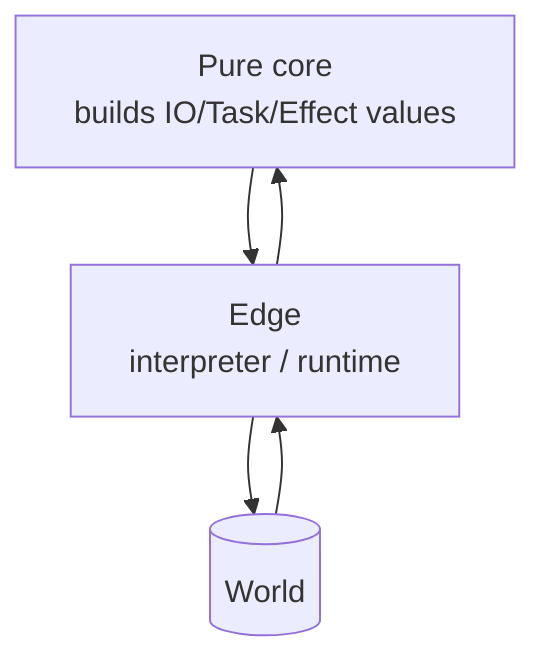

So far, our pure functions have one important limitation: they
can't do anything *interesting* to the outside world. They can't
read files, call APIs, write to a database, or print to the
console. The real world is full of effects, and a real program
has to perform them.

<Figure
  slug="fp-effect-management-cutout"
  alt="Effect management, an isometric illustration"
/>

The functional approach is not to *avoid* effects, it's to
**represent them as values** and then run those values in a
single, controlled place at the edge of the program. Pure
functions stay pure; effects become first-class data.

This idea was forged under unusual pressure. Haskell, defined in
1990 as a *pure and lazy* language, painted itself into a corner: a
language where evaluation order is undefined and side effects are
forbidden cannot simply call `print`. Early Haskell programs did
I/O through awkward schemes involving lazy streams of requests and
responses. The escape came when Philip Wadler connected Eugenio
Moggi's theoretical work on monads to the I/O problem: a Haskell
program could *construct a value describing the I/O it wants*, and
the runtime would execute that description. Simon Peyton Jones later
joked that this machinery made Haskell "the world's finest
imperative programming language", because effects, once they were
values, became more controllable than in languages where they run
loose. You don't need Haskell to use the trick. It's a few lines of
TypeScript.

## The core idea: a thunk

The smallest possible "effect" is just a zero-argument function
that, when called, produces a value:

<CodeBlock
  adapter="typescript"
  files={[
    {
      filename: "main.ts",
      starterCode: `type IO<A> = () => A;

// "describe" some effects (no execution yet)
const sayHi: IO<void> = () => console.log("hi");
const random: IO<number> = () => Math.random();
const now: IO<number> = () => Date.now();

// Constructing them does NOTHING. They are just descriptions.
console.log("nothing happened yet");

// "run" them at the edge
sayHi();
console.log(random());
console.log(now());
`,
    },
  ]}
/>

That's already the entire trick. An `IO<A>` is a recipe for
producing an `A`; nothing happens until you call it. Building one,
passing it around, returning it from a function, all pure.
Running it is the impure act, and it happens at *one* place: the
top of your program.

<Figure
  slug="fp-effect-management-core-idea-thunk-inline-cutout"
  alt="A sealed envelope holding a folded instruction card, set on a bench and not yet opened"
  caption="An effect value is a description of work, not the work itself."
/>

## Map and chain over IO

Once you have `IO<A>`, you can build the familiar trio:

<CodeBlock
  adapter="typescript"
  files={[
    {
      filename: "main.ts",
      starterCode: `type IO<A> = () => A;

const of =
  <A,>(a: A): IO<A> =>
  () =>
    a;

const map =
  <A, B>(io: IO<A>, f: (a: A) => B): IO<B> =>
  () =>
    f(io());

const chain =
  <A, B>(io: IO<A>, f: (a: A) => IO<B>): IO<B> =>
  () =>
    f(io())();

// Build a recipe that:
//  1. reads "now"
//  2. doubles it
//  3. prints it, returning void

const printNumber =
  (n: number): IO<void> =>
  () =>
    console.log("n =", n);

const program: IO<void> = chain(
  map(
    () => Date.now(),
    (t) => t * 2,
  ),
  printNumber,
);

console.log("about to run...");
program(); // <-- the one and only effectful call
`,
    },
  ]}
/>

Notice what just happened: we composed three steps (`read`,
`transform`, `print`) into one *value* called `program`. Building
it did nothing. Only the final `program()` actually performed any
effect.

This is the structure that more advanced libraries (like Effect or
fp-ts) elaborate on enormously: layered effect types that track
errors, dependencies, async, and even resource safety in the type
system.

## Why bother?

Three big reasons:

1. **Pure tests, real production.** You can test functions that
   build `IO` values without ever running them. You only stub the
   "interpreter" at the very edge.
2. **Effects become composable.** Now an effect is *just a value*.
   You can put it in an array, pass it to `map()`/`flatMap()`, store
   it in a config, retry it, parallelize it, log it.
3. **The boundary is visible.** Effectful types like `IO<A>`,
   `Task<A>`, `Effect<R, E, A>` show up in signatures. You can
   tell from a function's type whether it's pure.

<Figure
  slug="fp-effect-management-inline-cutout"
  alt="A clean sealed line of machines with all its hoses, taps and wires gathered at one end of the bench and plugged into a single marked panel"
  caption="Gather the effects at one edge and the middle of the program stays pure."
/>

## A tiny Console / FileSystem effect

For a slightly more realistic example, here's an effect type with
two operations, modeled as a sum type. The "interpreter" runs them
against actual implementations.

<CodeBlock
  adapter="typescript"
  files={[
    {
      filename: "main.ts",
      starterCode: `type Op = { kind: "log"; msg: string } | { kind: "now" };

// A "program" is a list of ops + a continuation that consumes their results.
// We keep it tiny: a fixed sequence with each op's result available to the next.

type Step<A> =
  | { kind: "pure"; value: A }
  | { kind: "do"; op: Op; next: (x: unknown) => Step<A> };

const pure = <A,>(value: A): Step<A> => ({ kind: "pure", value });
const log = (msg: string): Step<void> => ({
  kind: "do",
  op: { kind: "log", msg },
  next: () => pure(undefined),
});
const now = (): Step<number> => ({
  kind: "do",
  op: { kind: "now" },
  next: (x) => pure(x as number),
});

function chain<A, B>(s: Step<A>, f: (a: A) => Step<B>): Step<B> {
  if (s.kind === "pure") return f(s.value);
  return { kind: "do", op: s.op, next: (x) => chain(s.next(x), f) };
}

// --- A program described as DATA ---
const program: Step<void> = chain(now(), (t) =>
  chain(log(\`time is \${t}\`), () => log(\`still describing, nothing has run\`)),
);

console.log("Built program: ", program.kind === "do" ? program.op : "empty");

// --- A real interpreter ---
function runReal<A>(s: Step<A>): A {
  if (s.kind === "pure") return s.value;
  let r: unknown;
  switch (s.op.kind) {
    case "log":
      console.log("[real]", s.op.msg);
      r = undefined;
      break;
    case "now":
      r = Date.now();
      break;
  }
  return runReal(s.next(r));
}

// --- A test interpreter ---
function runTest<A>(s: Step<A>): A {
  if (s.kind === "pure") return s.value;
  let r: unknown;
  switch (s.op.kind) {
    case "log":
      console.log("[test]", s.op.msg);
      r = undefined;
      break;
    case "now":
      r = 1234567890;
      break; // <-- deterministic time!
  }
  return runTest(s.next(r));
}

console.log("--- running real ---");
runReal(program);
console.log("--- running test ---");
runTest(program);
`,
    },
  ]}
/>

Same program, two interpreters. The "real" interpreter calls
`Date.now()`; the "test" interpreter substitutes a fixed value.
Your business logic stays a pure description; the dirty
side-effects are swappable.

This pattern, programs as data, interpreters as functions, is
sometimes called *Free Monad*, *Tagless Final*, or simply
*Dependency Inversion done with values*.

## When is this overkill?

For a small script, an `IO<A> = () => A` is plenty, you don't
need an algebraic effect type. The point of this chapter isn't
"always use Free Monad", it's:

- **Pure functions build descriptions.**
- **One small impure layer at the edge runs them.**
- **You can swap that layer for testing, mocking, retries, batching.**

That separation is the heart of functional effect management.

## A diagram of the boundary

The outer ring is the part that talks to the world. The inner core
never does, it only manipulates *descriptions* of what it would
like to happen.

## A small challenge

Convince yourself that `IO` really is just three tiny functions by
writing two of them.

<ChallengeCard
  adapter="typescript"
  title="Implement map and chain for IO"
  instructions={`In \`io.ts\`, implement:

- \`map(io, f)\`, returns a **new IO** that, when run, runs \`io\` and applies \`f\` to its result.
- \`chain(io, f)\`, returns a new IO that, when run, runs \`io\`, passes the result to \`f\`, and runs the IO that \`f\` returns.

Neither function may execute anything at construction time, all
work must happen inside the returned thunk.

\`main.ts\` builds a program from your combinators and runs it once.

**Expected output**

\`\`\`
nothing has run yet
doubled: 42
\`\`\``}
  entryFilename="main.ts"
  files={[
    {
      filename: "main.ts",
      starterCode: `import { of, map, chain, IO } from "./io";

const readNumber: IO<number> = of(21);
const double = (n: number): number => n * 2;
const describe = (n: number): IO<string> => of(\`doubled: \${n}\`);

const program: IO<string> = chain(map(readNumber, double), describe);

console.log("nothing has run yet");
console.log(program());
`,
    },
    {
      filename: "io.ts",
      starterCode: `export type IO<A> = () => A;

export const of =
  <A,>(a: A): IO<A> =>
  () =>
    a;

export function map<A, B>(io: IO<A>, f: (a: A) => B): IO<B> {
  // your code here
  return () => undefined as unknown as B;
}

export function chain<A, B>(io: IO<A>, f: (a: A) => IO<B>): IO<B> {
  // your code here
  return () => undefined as unknown as B;
}
`,
      solutionCode: `export type IO<A> = () => A;

export const of =
  <A,>(a: A): IO<A> =>
  () =>
    a;

export function map<A, B>(io: IO<A>, f: (a: A) => B): IO<B> {
  return () => f(io());
}

export function chain<A, B>(io: IO<A>, f: (a: A) => IO<B>): IO<B> {
  return () => f(io())();
}
`,
    },
  ]}
  tests={[
    {
      id: "io-combinators",
      name: "Lazy map and chain",
      description: "The composed program produces 'doubled: 42' when run.",
      expect: { stdoutEquals: "nothing has run yet\ndoubled: 42" },
    },
  ]}
/>

---

<MultipleChoice
  markdown={`What's the main benefit of representing a side effect as a value (an \`IO<A>\` thunk or similar) instead of just running it inline?

- [o] It separates *describing* an effect from *running* it, so descriptions can be composed, tested, retried, swapped, or interpreted differently without changing the rest of the code
  > The pure core builds recipes; a small interpreter at the edge executes them. Tests can substitute a different interpreter.
- It guarantees the effect will only run once
  > That's an idempotency guarantee, not what effect-as-value gives you.
- It hides the side effect from the rest of the program
  > Actually, it makes it *visible* in the type signature.
- It eliminates the need for \`async\`/\`await\`
  > Unrelated, effects can still be synchronous or asynchronous.

This separation is the foundation of every "functional effect system" from \`IO\` in Haskell to \`Effect\` in TypeScript.`}
/>
