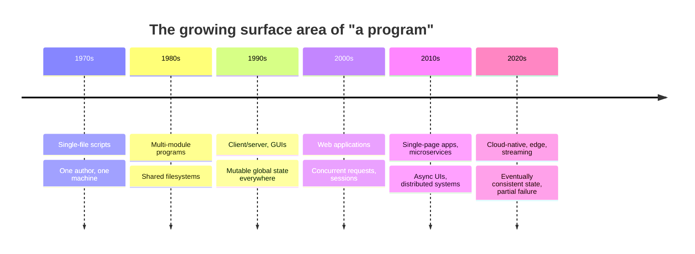
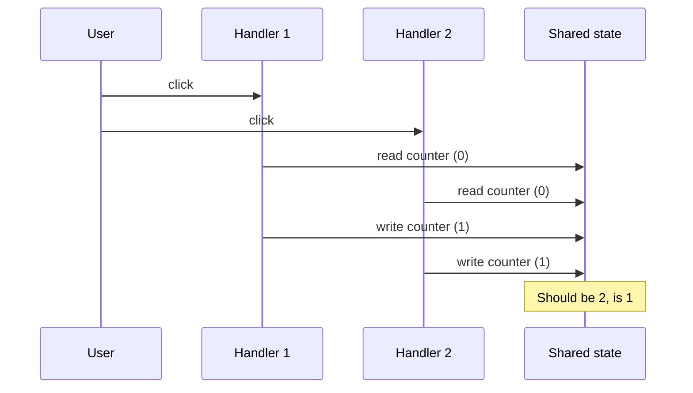

To understand why functional programming exists, it helps to look at
the shape of the software we write today and trace how it got that
way. The constraints that drove FP into the mainstream were not
academic preferences, they were the lived experience of teams
drowning in the complexity of their own programs.

This chapter tells that story.

<svg
  viewBox="0 0 640 220"
  role="img"
  aria-label="Three containers in a row: one holding a single dot, one holding four, and a large one crammed with dots spilling over its rim, programs growing from scripts into systems that overflow our ability to track them"
  style={{ display: "block", width: "100%", maxWidth: "640px", height: "auto", margin: "2.5rem auto" }}
>
  <g fill="currentColor" opacity="0.1">
    <rect x="70" y="140" width="70" height="60" rx="12" />
    <rect x="200" y="100" width="120" height="100" rx="14" />
    <rect x="390" y="40" width="180" height="160" rx="16" />
  </g>
  <g fill="currentColor" opacity="0.3">
    <circle cx="155" cy="168" r="3" />
    <circle cx="172" cy="164" r="3" />
    <circle cx="335" cy="148" r="3" />
    <circle cx="355" cy="142" r="3" />
  </g>
  <g style={{ color: "var(--ds-blue-500)" }} fill="currentColor">
    <circle cx="105" cy="170" r="8" />
    <circle cx="235" cy="135" r="8" />
    <circle cx="285" cy="135" r="8" />
    <circle cx="235" cy="167" r="8" />
    <circle cx="285" cy="167" r="8" />
    <circle cx="420" cy="78" r="8" />
    <circle cx="458" cy="70" r="8" fillOpacity="0.8" />
    <circle cx="498" cy="82" r="8" />
    <circle cx="540" cy="72" r="8" fillOpacity="0.7" />
    <circle cx="426" cy="116" r="8" fillOpacity="0.85" />
    <circle cx="514" cy="120" r="8" />
    <circle cx="552" cy="108" r="8" fillOpacity="0.75" />
    <circle cx="432" cy="156" r="8" />
    <circle cx="476" cy="152" r="8" fillOpacity="0.8" />
    <circle cx="520" cy="160" r="8" />
    <circle cx="556" cy="148" r="8" fillOpacity="0.85" />
  </g>
  <g style={{ color: "var(--ds-yellow-500)" }} fill="currentColor">
    <circle cx="552" cy="36" r="7" />
  </g>
  <g style={{ color: "var(--ds-red-500)" }} fill="currentColor">
    <circle cx="470" cy="112" r="8" />
    <circle cx="592" cy="184" r="7" fillOpacity="0.7" />
  </g>
</svg>

## From scripts to systems

Software started small. In the 1970s and 1980s, a typical program
was a single file, written by one person, executed once, then
discarded. State lived in a handful of variables. Side effects were
explicit: a `printf` here, a file write there. You could fit the
whole thing in your head.

Then the machines connected. Then the users multiplied. Then the
programs started talking to each other across networks. Each step
added a new dimension of complexity that wasn't there before:

- **Concurrency**, multiple things happening at once
- **Distribution**, multiple machines, partial failure
- **Asynchrony**, operations that take time and can be cancelled
- **Persistence**, state that outlives the program
- **Scale**, billions of users, exabytes of data

A modern web service might handle tens of thousands of concurrent
requests, each carrying its own thread of mutable state, each
touching a database, a cache, a queue, a third-party API. The
*surface area* of a typical program has grown by orders of magnitude
in fifty years.

## The hidden enemy: mutable state

The single largest source of complexity in software is **mutable
shared state**, values that change over time and are visible from
many places at once.

Consider the simplest possible mutable program:

<CodeBlock
  adapter="typescript"
  files={[
    {
      filename: "main.ts",
      starterCode: `let count = 0;

function increment(): void {
  count = count + 1;
}

increment();
increment();
increment();
console.log("count:", count);
`,
    },
  ]}
/>

`count` is a single number. Three calls. Easy. Now imagine ten
modules can call `increment`, three of them run in parallel, two of
them are inside event handlers that fire whenever the user clicks,
and one of them lives inside a `setInterval`. Suddenly the question
*"what is the value of `count` right now?"* has no single answer.

The behavior of any individual function now depends on **the entire
history of every other function**, in the order they ran, on the
threads they ran on. The program is no longer a thing you can read
top-to-bottom, it's a four-dimensional cloud of possible execution
traces.

This is sometimes called *spooky action at a distance*: changing a
line in module A breaks a test in module Z, and there is no syntactic
link between them.

## The cost of side effects

A **side effect** is anything a function does besides return a value:
writing to disk, printing to a console, mutating an argument, sending
a network request, reading the clock, throwing an exception, updating
a global counter.

Side effects are not evil, every useful program has them, but they
have *costs*:

- **They make functions hard to test.** You can't just assert on a
  return value; you have to mock the disk, the network, the clock.
- **They make functions hard to compose.** Two functions that both
  mutate the same global state can no longer be reordered safely.
- **They make functions hard to reason about.** Reading the body is
  not enough; you must also know *when* the function was called,
  *who* called it, and *what* the rest of the world looked like at
  the time.

<CodeBlock
  adapter="typescript"
  files={[
    {
      filename: "main.ts",
      starterCode: `// A function that depends on hidden state and time
let lastId = 0;
function nextId(): string {
  lastId = lastId + 1;
  return \`id-\${lastId}-\${Date.now()}\`;
}

console.log(nextId());
console.log(nextId());
console.log(nextId());

// What does nextId() return? You can't answer without knowing:
// 1. What lastId currently is
// 2. What the wall clock says
// 3. Whether any other code is also incrementing lastId
`,
    },
  ]}
/>

Compare with a pure version:

<CodeBlock
  adapter="typescript"
  files={[
    {
      filename: "main.ts",
      starterCode: `function nextId(previous: number, nowMs: number): { id: string; next: number } {
  const n = previous + 1;
  return { id: \`id-\${n}-\${nowMs}\`, next: n };
}

const a = nextId(0, 1_700_000_000_000);
const b = nextId(a.next, 1_700_000_000_001);
console.log(a, b);
`,
    },
  ]}
/>

The second version is longer, but you can reason about it with no
external context. The inputs are *visible*. The outputs are *only*
the return value. There is no hidden channel through which it can
surprise you.

## The rise of concurrency and asynchronous systems

The hardest bugs in modern software almost all involve **time**. Two
requests arrive in the wrong order. A `setTimeout` fires after the
component it was for has unmounted. A `Promise` resolves into a
closure that captured a stale variable. A database write races
against a read.

Imperative programs handle time by *mutating state*: the request
handler updates a session, the timer fires and re-reads it, the
component remounts and re-syncs. Every interaction is a tiny mutual
ritual of "look at the world, change the world, hope the world looks
right the next time someone looks".

Two clicks. One lost update. No error, no exception, no log line,
just a number that is quietly wrong.

Races like this are not just a nuisance, they have a body count.
The **Therac-25**, a radiation therapy machine of the mid-1980s,
massively overdosed six patients, several fatally. Nancy Leveson and
Clark Turner's landmark investigation found that the control software
contained race conditions in shared state: if an experienced operator
edited the treatment setup quickly enough, one part of the program
read a shared variable at exactly the wrong moment and the machine
delivered a radiation beam without its safety configuration. The bug
had been latent in earlier models too, but those machines had
hardware interlocks that masked it, the Therac-25 trusted the
software alone. The case is now taught in every software engineering
program in the world, and its core lesson is the lesson of this
chapter: *state shared across concurrent activities is where the
worst bugs live*.

Functional programming offers a different deal. Instead of "look at
the world, change the world", you say: *"given this snapshot of the
world, what is the next snapshot?"* Time becomes an input, not a
shared resource. Two clicks produce two transformations of two
snapshots, and the system reconciles them on purpose, not by
accident.

## Reasoning at scale

When a codebase is small, you can hold its mental model in your head.
You know which functions mutate what, which call orders are valid,
which states are reachable. As the codebase grows, that mental model
becomes too large for any single person, and yet the *language
itself* still assumes a single coherent reasoner.

The classic symptoms of a codebase that has outgrown its style:

- "I'm afraid to rename this function, I don't know who calls it"
- "Every change requires three days of manual QA"
- "The new hire spent two weeks just learning the data flow"
- "We don't refactor, we add code around the bug"

These are not failures of *people*. They are failures of *technique*.
A language and a style that scaled to 1,000 lines does not
automatically scale to 100,000 or 1,000,000.

## What FP offers, in one sentence

Functional programming responds to the complexity crisis with a
single, radical claim:

> If you build your program out of pure functions over immutable
> values, and you push side effects to the edges, the parts of your
> program you care most about, the logic, become as easy to reason
> about as arithmetic.

The rest of this course is about how to actually do that, in
TypeScript, for real applications.

The shape of a computation changes accordingly:

| | Imperative style | Functional style |
| --- | --- | --- |
| Unit of expression | a statement that mutates a variable | a value produced by a transformation |
| State over time | one box, overwritten in place | a series of snapshots, each derived from the last |
| Side effects | sprinkled wherever convenient | pushed to the edges, visible in the types |
| Reading the code | replay the history in your head | substitute values, like arithmetic |

The next chapter looks at where these ideas *came from*, the
mathematical and historical roots of functional programming, from
lambda calculus through Lisp and Haskell to the modern ecosystem.

---

<MultipleChoice
  markdown={`Why does mutable shared state make large programs hard to reason about?

- It is always slower than immutable data
  > Performance is not the core problem. Mutable code can be very fast. The problem is comprehension and correctness, not speed.
- [o] The behavior of a function depends on the entire history of every other function that touched the same state
  > With mutable shared state, a function's outputs depend not just on its inputs but on *when* it ran and *who* ran before it. That coupling grows quadratically with the size of the codebase.
- TypeScript cannot type-check mutable variables
  > TypeScript does type-check mutable variables. The issue is not typing but reasoning: types describe shape, not history.
- It always causes the program to crash
  > Mutable state rarely crashes, that would be easier to debug. It usually produces *silently incorrect* results, which is much worse.

Mutable shared state turns local code into globally entangled code, which is the single largest source of complexity in real systems.`}
/>
