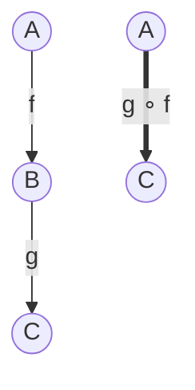

If pure functions are the atoms of FP, **composition** is the
chemistry: the operation that takes two (or many) functions and
glues them into one. Once your functions are pure, you can build
entire programs by composing them, *no shared state, no
intermediate variables, no plumbing*.

<Figure
  slug="fp-function-composition-cutout"
  alt="Function composition, an isometric illustration"
/>

This chapter covers function composition, the closely related
techniques of **currying** and **partial application**, and the two
helper functions (`compose` and `pipe`) you'll use everywhere.

## What composition means, mathematically

In math, given `f: A → B` and `g: B → C`, the composition `g ∘ f`
is the function `A → C` defined by `(g ∘ f)(x) = g(f(x))`. You apply
`f` first, then feed the result into `g`.

The two diagrams above describe the *same* function. Composition is
the operation that lets us treat "do `f` then `g`" as a *single
named thing*.

## Composition in TypeScript

We have to write it ourselves. Here's the simplest possible
binary composer:

<CodeBlock
  adapter="typescript"
  files={[
    {
      filename: "main.ts",
      starterCode: `function compose2<A, B, C>(g: (b: B) => C, f: (a: A) => B): (a: A) => C {
  return (a) => g(f(a));
}

const inc = (n: number) => n + 1;
const double = (n: number) => n * 2;

const incThenDouble = compose2(double, inc);
const doubleThenInc = compose2(inc, double);

console.log(incThenDouble(3)); // (3+1)*2 = 8
console.log(doubleThenInc(3)); // (3*2)+1 = 7
`,
    },
  ]}
/>

Two things to notice:

1. The argument order in `compose2(g, f)` reads "right to left":
   `g(f(x))`. This is the mathematical convention.
2. Composition is *not* commutative: `compose2(g, f)` is different
   from `compose2(f, g)`. Order matters.

<Figure
  slug="fp-function-composition-inline-cutout"
  alt="Three small machines bolted end to end into one longer machine, a single shape entering the left and leaving transformed at the right"
/>

## `pipe`: the left-to-right cousin

In practice, most TypeScript code reads better when the data *flows
forward*: input on the left, transformations on the right. That's
what `pipe` does:

<CodeBlock
  adapter="typescript"
  files={[
    {
      filename: "main.ts",
      starterCode: `function pipe<A>(a: A): A;
function pipe<A, B>(a: A, f1: (a: A) => B): B;
function pipe<A, B, C>(a: A, f1: (a: A) => B, f2: (b: B) => C): C;
function pipe<A, B, C, D>(
  a: A,
  f1: (a: A) => B,
  f2: (b: B) => C,
  f3: (c: C) => D,
): D;
function pipe(value: unknown, ...fns: ((x: unknown) => unknown)[]): unknown {
  return fns.reduce((acc, fn) => fn(acc), value);
}

const inc = (n: number) => n + 1;
const double = (n: number) => n * 2;
const toStr = (n: number) => \`#\${n}\`;

const result = pipe(3, inc, double, toStr);
console.log(result); // "#8"
`,
    },
  ]}
/>

`pipe(value, f, g, h)` evaluates as `h(g(f(value)))`. It is exactly
`compose` reversed. We will use `pipe` throughout the course because
it reads top-to-bottom, like the data flow it represents.

## Variadic `compose`

A `compose` that takes any number of functions is the symmetric
counterpart:

<CodeBlock
  adapter="typescript"
  files={[
    {
      filename: "main.ts",
      starterCode: `function compose<A>(): (a: A) => A;
function compose<A, B>(f1: (a: A) => B): (a: A) => B;
function compose<A, B, C>(f2: (b: B) => C, f1: (a: A) => B): (a: A) => C;
function compose<A, B, C, D>(
  f3: (c: C) => D,
  f2: (b: B) => C,
  f1: (a: A) => B,
): (a: A) => D;
function compose(...fns: ((x: unknown) => unknown)[]): (x: unknown) => unknown {
  return (x) => fns.reduceRight((acc, fn) => fn(acc), x);
}

const f = compose<number, number, number, string>(
  (n: number) => \`#\${n}\`,
  (n: number) => n * 2,
  (n: number) => n + 1,
);

console.log(f(3)); // "#8"
`,
    },
  ]}
/>

For most working code, `pipe` is more readable; `compose` shows up
when you want to *name* a composed function for reuse:

<CodeBlock
  adapter="typescript"
  files={[
    {
      filename: "main.ts",
      starterCode: `function pipe<T>(x: T, ...fns: ((x: T) => T)[]): T {
  return fns.reduce((acc, f) => f(acc), x);
}

// "name" a transformation pipeline
const trim = (s: string) => s.trim();
const lower = (s: string) => s.toLowerCase();
const noSpaces = (s: string) => s.replace(/\\s+/g, "-");
const normalize = (s: string) => pipe(s, trim, lower, noSpaces);

console.log(normalize("  Hello World  "));
console.log(normalize("  Functional Programming  "));
`,
    },
  ]}
/>

`normalize` is a value. You can pass it to `Array#map`, store it,
re-export it, test it. It is just *itself*, three small functions
glued together.

## Pipelines vs nested calls: the readability test

Before pipelines:

<CodeBlock
  adapter="typescript"
  files={[
    {
      filename: "main.ts",
      starterCode: `const xs = ["  Hello  ", "  Functional  ", "  Programming  "];

const result = xs.map((s) => \`#\${s.trim().toLowerCase().replace(/\\s+/g, "-")}\`);
console.log(result);
`,
    },
  ]}
/>

With named composed steps:

<CodeBlock
  adapter="typescript"
  files={[
    {
      filename: "main.ts",
      starterCode: `function pipe<T>(x: T, ...fns: ((x: T) => T)[]): T {
  return fns.reduce((acc, f) => f(acc), x);
}

const trim = (s: string) => s.trim();
const lower = (s: string) => s.toLowerCase();
const slugify = (s: string) => s.replace(/\\s+/g, "-");
const hash = (s: string) => \`#\${s}\`;
const tag = (s: string) => pipe(s, trim, lower, slugify, hash);

const xs = ["  Hello  ", "  Functional  ", "  Programming  "];
console.log(xs.map(tag));
`,
    },
  ]}
/>

Both are correct. The second one is *legible*: each step has a name,
and the pipeline reads like a recipe.

## Currying: one argument at a time

**Currying** is the transformation that turns a function of multiple
arguments into a *chain* of one-argument functions.

<CodeBlock
  adapter="typescript"
  files={[
    {
      filename: "main.ts",
      starterCode: `// Uncurried (the usual way)
const add = (a: number, b: number): number => a + b;

// Curried
const addC =
  (a: number) =>
  (b: number): number =>
    a + b;

console.log(add(2, 3)); // 5
console.log(addC(2)(3)); // 5

// Why? Because addC(2) is now a useful value: a function "add 2 to its input"
const addTwo = addC(2);
console.log([1, 2, 3].map(addTwo)); // [3, 4, 5]
`,
    },
  ]}
/>

A curried function of *N* arguments has type `A1 => A2 => ... => AN
=> R`. Each application "consumes" one argument and returns a smaller
function.

Currying is useful primarily because it makes **partial application**
trivial: you supply some arguments now and the rest later.

## Partial application

You can partially apply any function, curried or not, by binding
some arguments and leaving others as parameters.

<CodeBlock
  adapter="typescript"
  files={[
    {
      filename: "main.ts",
      starterCode: `// A small "partial" helper for ordinary functions
function partial<A, B, C>(f: (a: A, b: B) => C, a: A): (b: B) => C {
  return (b) => f(a, b);
}

const greet = (greeting: string, name: string): string =>
  \`\${greeting}, \${name}!\`;

const hello = partial(greet, "Hello");
const hola = partial(greet, "Hola");

console.log(hello("Ada"));
console.log(hola("Linus"));
console.log(["Ada", "Linus", "Grace"].map(hello));
`,
    },
  ]}
/>

A *partially applied* function is just an ordinary function whose
arguments have been supplied incrementally. It has the same type,
same behavior, and same testability as any other function.

### Why argument order matters

When you curry a function for use in pipelines, the convention is
**"data last"**: the value you're transforming should be the *last*
argument, so partial application gives you a "ready-to-pipe"
function.

<CodeBlock
  adapter="typescript"
  files={[
    {
      filename: "main.ts",
      starterCode: `function pipe<T>(x: T, ...fns: ((x: T) => T)[]): T {
  return fns.reduce((acc, f) => f(acc), x);
}

// "data-last" curried versions of map/filter
const map =
  <A, B>(f: (a: A) => B) =>
  (xs: readonly A[]): readonly B[] =>
    xs.map(f);
const filter = <A>(p: (a: A) => boolean) => (xs: readonly A[]): readonly A[] => xs.filter(p);

const isEven = (n: number) => n % 2 === 0;
const square = (n: number) => n * n;

const evenSquares = (xs: readonly number[]) => pipe(xs, filter(isEven), map(square));

console.log(evenSquares([1, 2, 3, 4, 5, 6])); // [4, 16, 36]
`,
    },
  ]}
/>

Compare with "data-first" (`map(xs, f)`), which doesn't compose into
a pipeline without an extra wrapper. The whole point of currying in
FP is to make `pipe(value, step, step, step)` work without ceremony.

## A real refactor: from imperative to composed pipeline

Same problem we used in [Declarative Thinking](./declarative-thinking):
*"From orders, keep paid > 50, distinct customers, sorted alphabetically."*

<CodeBlock
  adapter="typescript"
  files={[
    {
      filename: "main.ts",
      starterCode: `function pipe<T>(x: T, ...fns: ((x: T) => T)[]): T {
  return fns.reduce((acc, f) => f(acc), x);
}

type Order = {
  readonly id: string;
  readonly status: "paid" | "draft" | "cancelled";
  readonly total: number;
  readonly customer: string;
};

const orders: readonly Order[] = [
  { id: "1", status: "paid", total: 80, customer: "Ada" },
  { id: "2", status: "draft", total: 200, customer: "Linus" },
  { id: "3", status: "paid", total: 30, customer: "Grace" },
  { id: "4", status: "paid", total: 90, customer: "Ada" },
  { id: "5", status: "paid", total: 120, customer: "Linus" },
];

// Reusable building blocks (data-last, curried)
const onlyPaid = <T extends { status: string }>(xs: readonly T[]) =>
  xs.filter((x) => x.status === "paid");
const overAmount =
  (n: number) =>
  <T extends { total: number }>(xs: readonly T[]) =>
    xs.filter((x) => x.total > n);
const customers = <T extends { customer: string }>(xs: readonly T[]) =>
  xs.map((x) => x.customer);
const distinct = <A,>(xs: readonly A[]) => [...new Set(xs)];
const sortAsc = (xs: readonly string[]) => [...xs].sort();

// The composed pipeline
const names = pipe(
  orders,
  onlyPaid,
  overAmount(50),
  customers,
  distinct,
  sortAsc,
);

console.log(names);
`,
    },
  ]}
/>

Each step has a name and a single job. You can read the pipeline as
prose. You can lift any step into a separate file. You can test any
step in isolation. And the *order* of the steps is just the order of
arguments to `pipe`, no reshuffling of loops.

## A multi-file challenge

<ChallengeCard
  adapter="typescript"
  title="Compose a slugger"
  instructions={`In \`text.ts\`, implement five tiny pure helpers and a
\`pipe\` of them. Each helper does exactly one thing.

- \`trim(s)\`, strip surrounding whitespace
- \`lower(s)\`, lowercase
- \`stripPunct(s)\`, replace non-alphanumeric, non-space characters with a space
- \`collapseSpaces(s)\`, collapse runs of whitespace to one
- \`hyphenate(s)\`, replace spaces with hyphens
- \`slug(s)\`, pipeline of the above, in this order

Use \`pipe\` (already in the file). Do not write \`s.trim().toLowerCase()…\`, compose the named helpers explicitly with \`pipe\`.

**Expected output**

\`\`\`
hello-world
functional-programming
nice-to-meet-you
\`\`\``}
  entryFilename="main.ts"
  files={[
    {
      filename: "main.ts",
      starterCode: `import { slug } from "./text";

console.log(slug("  Hello,   World!  "));
console.log(slug("Functional...Programming"));
console.log(slug("  Nice  to !! meet  you  "));
`,
    },
    {
      filename: "text.ts",
      starterCode: `export function pipe<T>(x: T, ...fns: ((x: T) => T)[]): T {
  return fns.reduce((acc, f) => f(acc), x);
}

export const trim = (s: string): string => s; // TODO
export const lower = (s: string): string => s; // TODO
export const stripPunct = (s: string): string => s; // TODO
export const collapseSpaces = (s: string): string => s; // TODO
export const hyphenate = (s: string): string => s; // TODO

export const slug = (s: string): string => s; // TODO: pipe the above
`,
      solutionCode: `export function pipe<T>(x: T, ...fns: ((x: T) => T)[]): T {
  return fns.reduce((acc, f) => f(acc), x);
}

export const trim = (s: string): string => s.trim();
export const lower = (s: string): string => s.toLowerCase();
export const stripPunct = (s: string): string =>
  s.replace(/[^\\p{L}\\p{N}\\s]/gu, " ");
export const collapseSpaces = (s: string): string => s.replace(/\\s+/g, " ");
export const hyphenate = (s: string): string => s.replace(/ /g, "-");

export const slug = (s: string): string =>
  pipe(s, trim, lower, stripPunct, collapseSpaces, hyphenate);
`,
    },
  ]}
  tests={[
    {
      id: "slug",
      name: "Composed slug pipeline",
      description: "trim → lower → stripPunct → collapseSpaces → hyphenate",
      expect: { stdoutEquals: "hello-world\nfunctional-programming\nnice-to-meet-you" },
    },
  ]}
/>

---

<MultipleChoice
  markdown={`What is the difference between \`compose(f, g)\` and \`pipe(x, g, f)\`?

- \`compose\` is for synchronous functions and \`pipe\` is for asynchronous functions
  > Both work for sync functions. Async variants exist but neither is fundamentally one or the other.
- \`compose\` can only combine two functions; \`pipe\` works for any number
  > Both can be variadic depending on the implementation.
- \`compose\` curries its arguments; \`pipe\` does not
  > Currying is independent of composition direction.
- [o] They express the same idea in different argument orders; \`compose(f, g)(x) = f(g(x))\`, while \`pipe(x, g, f)\` applies \`g\` first then \`f\`
  > \`compose\` reads right-to-left (the math convention); \`pipe\` reads left-to-right, which usually matches data flow more naturally in TypeScript.

The two operators are mirror images. Most TypeScript codebases prefer \`pipe\` for everyday use because the order reads top-to-bottom.`}
/>
