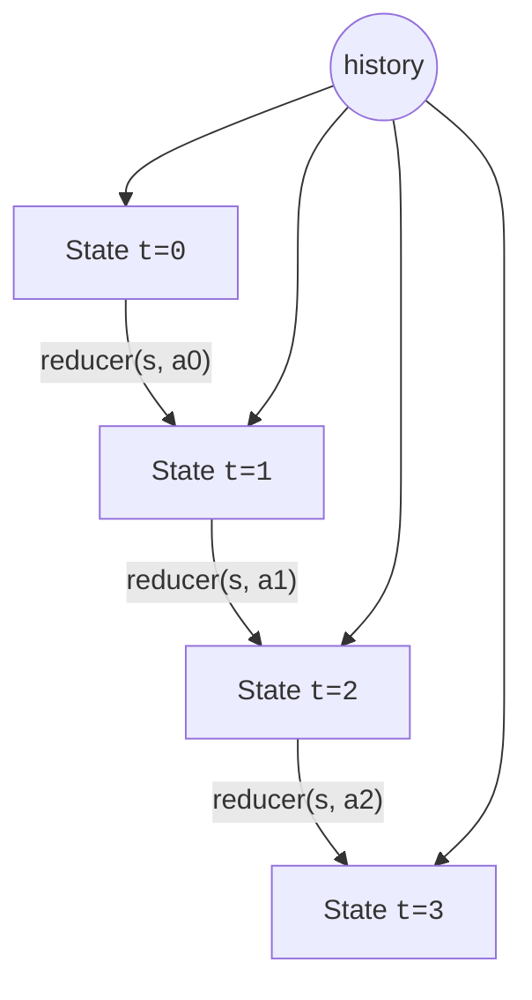

"Functional" and "state" sound like opposites, but the
functional approach to state is actually one of the field's
greatest hits. Two ideas underpin it:

<Figure
  slug="fp-functional-state-cutout"
  alt="Functional state management, an isometric illustration"
/>

1. **State is just a value.** A "state" is whatever data you
   currently have. It is not a hidden, mutable box; it is a plain
   object that flows through the program.
2. **Transitions are pure functions.** Instead of `state.change()`
   you write `next = transition(state, event)`. The old state and
   the new state coexist; nothing was mutated.

If those two ideas sound familiar, they're the foundation of
Redux, React's `useReducer`, Elm's update function, and pretty
much every modern state library.

## The reducer pattern

<CodeBlock
  adapter="typescript"
  files={[
    {
      filename: "main.ts",
      starterCode: `type State = { readonly count: number };
type Action =
  | { kind: "inc" }
  | { kind: "dec" }
  | { kind: "add"; by: number }
  | { kind: "reset" };

const initial: State = { count: 0 };

// Pure: same input -> same output, no mutation
function reducer(state: State, action: Action): State {
  switch (action.kind) {
    case "inc":
      return { count: state.count + 1 };
    case "dec":
      return { count: state.count - 1 };
    case "add":
      return { count: state.count + action.by };
    case "reset":
      return initial;
    default: {
      const _e: never = action;
      return _e;
    }
  }
}

// "Replay" a history of actions on the initial state.
function play(history: ReadonlyArray<Action>): State {
  return history.reduce(reducer, initial);
}

console.log(play([{ kind: "inc" }, { kind: "inc" }, { kind: "add", by: 10 }]));
console.log(play([{ kind: "inc" }, { kind: "reset" }, { kind: "dec" }]));
`,
    },
  ]}
/>

`reducer` is a pure function. `play` is a `reduce()` over actions,
which means our entire state lifecycle is just a `fold()`. That's
how you can think of state functionally:

> **The current state = `reduce(reducer, initial, history)`.**

## Free time-travel

Once `reducer` is pure and `history` is just an array of actions,
you get "time travel" for free: prefix of history → state at any
point in time.

<Figure
  slug="fp-functional-state-management-reducer-pattern-inline-cutout"
  alt="A machine taking a tray and a card together and handing back a new tray, the old tray set aside untouched"
  caption="A reducer takes the old state and an action and returns a new state."
/>

<CodeBlock
  adapter="typescript"
  files={[
    {
      filename: "main.ts",
      starterCode: `type State = { readonly count: number };
type Action = { kind: "inc" } | { kind: "add"; by: number } | { kind: "reset" };
const initial: State = { count: 0 };
const reducer = (s: State, a: Action): State => {
  switch (a.kind) {
    case "inc":
      return { count: s.count + 1 };
    case "add":
      return { count: s.count + a.by };
    case "reset":
      return initial;
  }
};

const history: Action[] = [
  { kind: "inc" },
  { kind: "inc" },
  { kind: "add", by: 10 },
  { kind: "reset" },
  { kind: "inc" },
];

// All intermediate states
const snapshots = history.reduce<{ state: State; trace: State[] }>(
  ({ state, trace }, action) => {
    const next = reducer(state, action);
    return { state: next, trace: [...trace, next] };
  },
  { state: initial, trace: [initial] },
).trace;

snapshots.forEach((s, i) => console.log(\`t=\${i}\`, s));
`,
    },
  ]}
/>

You can scrub the timeline forward and backward without recomputing
anything that hasn't changed. You can also persist the history,
replay it on another machine, or save it for debugging.

This exact property launched one of the most popular libraries in
JavaScript history. In 2015, Dan Abramov wanted a flashy demo for
his React Europe talk, *"Live React: Hot Reloading with Time
Travel"*, edit your code while the app runs, then scrub the app's
state backward and forward like a video. To make the demo possible
he and Andrew Clark distilled state management down to exactly what
this page describes: one state value, a pure reducer, a list of
actions. That demo library was **Redux**. The time-travel debugger
wasn't a feature bolted onto Redux, Redux was the *minimum
machinery required* for time travel to work at all. Purity wasn't
the marketing; it was the engineering.

## Modeling undo / redo

Undo/redo is a state machine over *stacks of states*. As a pure
data structure:

<CodeBlock
  adapter="typescript"
  files={[
    {
      filename: "main.ts",
      starterCode: `type Doc = { readonly text: string };

type Editor = {
  readonly past: ReadonlyArray<Doc>;
  readonly present: Doc;
  readonly future: ReadonlyArray<Doc>;
};

type Action =
  | { kind: "type"; ch: string }
  | { kind: "undo" }
  | { kind: "redo" };

const initial: Editor = {
  past: [],
  present: { text: "" },
  future: [],
};

function step(e: Editor, a: Action): Editor {
  switch (a.kind) {
    case "type":
      return {
        past: [...e.past, e.present],
        present: { text: e.present.text + a.ch },
        future: [],
      };
    case "undo":
      if (e.past.length === 0) return e;
      return {
        past: e.past.slice(0, -1),
        present: e.past[e.past.length - 1],
        future: [e.present, ...e.future],
      };
    case "redo":
      if (e.future.length === 0) return e;
      return {
        past: [...e.past, e.present],
        present: e.future[0],
        future: e.future.slice(1),
      };
  }
}

const actions: Action[] = [
  { kind: "type", ch: "h" },
  { kind: "type", ch: "i" },
  { kind: "undo" },
  { kind: "undo" },
  { kind: "redo" },
  { kind: "type", ch: "!" },
];

let state = initial;
for (const a of actions) {
  state = step(state, a);
  console.log(JSON.stringify(state.present.text));
}
`,
    },
  ]}
/>

Nothing is mutated. Each previous `Editor` snapshot is still alive
in memory (cheap, because of structural sharing on the
not-actually-changed parts). Undo and redo are just "shift a
value from one stack to the other".

This is the same pattern Photoshop, Git, VSCode, and every serious
text editor use internally.

## The `State<S, A>` sketch (briefly)

Sometimes you want to **thread** a state through a sequence of pure
computations without making the state a global. That's modeled in
functional programming by `State<S, A> = (s: S) => [A, S]`, "given the current state,
produce a value and the next state".

<Figure
  slug="fp-functional-state-management-inline-cutout"
  alt="A shelf of successive trays, each a copy of the last with one slot changed, none of them altered after being set down"
  caption="Each state is a new value; the previous one is left exactly as it was."
/>

<CodeBlock
  adapter="typescript"
  files={[
    {
      filename: "main.ts",
      starterCode: `// State<S, A> = a function from state to [value, newState]
type State<S, A> = (s: S) => readonly [A, S];

const of =
  <S, A>(a: A): State<S, A> =>
  (s) => [a, s];

const map =
  <S, A, B>(sa: State<S, A>, f: (a: A) => B): State<S, B> =>
  (s) => {
    const [a, s2] = sa(s);
    return [f(a), s2];
  };

const chain =
  <S, A, B>(sa: State<S, A>, f: (a: A) => State<S, B>): State<S, B> =>
  (s) => {
    const [a, s2] = sa(s);
    return f(a)(s2);
  };

const get =
  <S,>(): State<S, S> =>
  (s) => [s, s];
const put =
  <S,>(s: S): State<S, void> =>
  () => [undefined, s];

// --- Example: stateful counter that produces unique ids ---
const fresh: State<number, string> = chain(get<number>(), (n) =>
  chain(put(n + 1), () => of(\`id-\${n}\`)),
);

// Build a small program: three IDs in a row
const program = chain(fresh, (a) =>
  chain(fresh, (b) => map(fresh, (c) => [a, b, c])),
);

const [ids, finalCounter] = program(0);
console.log(ids);
console.log("counter advanced to:", finalCounter);
`,
    },
  ]}
/>

The point isn't that you should write a State monad in production
TypeScript every day, it's to *see* that mutable state isn't
required. The same effect is achievable with a function that
returns both an answer and the next state, composed with `chain()`.

## Why this matters

Treating state as a value gives you:

- **Predictability:** every transition is a function. Same inputs,
  same output.
- **Inspectability:** the state and the action are both just data
  you can log, persist, replay.
- **Testability:** test transitions like ordinary functions.
- **Time travel & undo:** essentially free, because old states
  weren't destroyed.
- **Concurrency safety:** immutable values can be shared between
  threads, workers, requests, components without locking.

The diagram is the model: time as a stream of pure transitions,
the history as the source of truth.

## A small challenge

<ChallengeCard
  adapter="typescript"
  title="Write a pure cart reducer"
  instructions={`Implement \`reduce(state, action)\` in
\`cart.ts\` for these actions:

- \`{ kind: "add"; sku: string; qty: number }\`, add (or merge) an item; if SKU exists, increase its qty
- \`{ kind: "remove"; sku: string }\`, drop the matching item
- \`{ kind: "clear" }\`, empty the cart

The reducer must be **pure**, return a new \`State\`; do not mutate
\`state\` or \`state.items\`.

**Expected output**

\`\`\`
[ { sku: 'A', qty: 1 } ]
[ { sku: 'A', qty: 3 } ]
[ { sku: 'A', qty: 3 }, { sku: 'B', qty: 1 } ]
[ { sku: 'A', qty: 3 } ]
[]
\`\`\``}
  entryFilename="main.ts"
  files={[
    {
      filename: "main.ts",
      starterCode: `import { reduce, initial, Action } from "./cart";

const actions: Action[] = [
  { kind: "add", sku: "A", qty: 1 },
  { kind: "add", sku: "A", qty: 2 },
  { kind: "add", sku: "B", qty: 1 },
  { kind: "remove", sku: "B" },
  { kind: "clear" },
];

let state = initial;
for (const a of actions) {
  state = reduce(state, a);
  console.log(state.items);
}
`,
    },
    {
      filename: "cart.ts",
      starterCode: `export type Item = { readonly sku: string; readonly qty: number };
export type State = { readonly items: ReadonlyArray<Item> };
export type Action =
  | { kind: "add"; sku: string; qty: number }
  | { kind: "remove"; sku: string }
  | { kind: "clear" };

export const initial: State = { items: [] };

export function reduce(state: State, action: Action): State {
  // TODO: implement purely (no mutation; return a new state)
  return state;
}
`,
      solutionCode: `export type Item = { readonly sku: string; readonly qty: number };
export type State = { readonly items: ReadonlyArray<Item> };
export type Action =
  | { kind: "add"; sku: string; qty: number }
  | { kind: "remove"; sku: string }
  | { kind: "clear" };

export const initial: State = { items: [] };

export function reduce(state: State, action: Action): State {
  switch (action.kind) {
    case "add": {
      const exists = state.items.find((i) => i.sku === action.sku);
      const items = exists
        ? state.items.map((i) =>
            i.sku === action.sku ? { sku: i.sku, qty: i.qty + action.qty } : i,
          )
        : [...state.items, { sku: action.sku, qty: action.qty }];
      return { items };
    }
    case "remove":
      return { items: state.items.filter((i) => i.sku !== action.sku) };
    case "clear":
      return initial;
    default: {
      const _e: never = action;
      return _e;
    }
  }
}
`,
    },
  ]}
  tests={[
    {
      id: "cart-reducer",
      name: "Pure cart reducer",
      description: "Reducer produces new states; never mutates the previous.",
      expect: { stdoutEquals: "[ { sku: 'A', qty: 1 } ]\n[ { sku: 'A', qty: 3 } ]\n[ { sku: 'A', qty: 3 }, { sku: 'B', qty: 1 } ]\n[ { sku: 'A', qty: 3 } ]\n[]" },
    },
  ]}
/>

---

<MultipleChoice
  markdown={`Why does the reducer pattern (\`(state, action) => newState\`) make state management easier to reason about?

- Because reducers can mutate the state in place for performance
  > That defeats almost every benefit listed above.
- Because reducers can be written without TypeScript
  > Irrelevant, most reducers in real codebases *do* use TypeScript.
- [o] Because each transition is a pure function, same inputs give the same output, so state changes are predictable, replayable, and trivially testable
  > Purity buys you predictability, replayability, time-travel debugging, and ordinary unit-testability for free.
- Because actions are usually classes
  > They're usually plain discriminated-union objects, which makes them easy to serialize and log.

The combination of "state is data" + "transitions are pure functions" + "history is just a list of actions" is one of the most powerful ideas in modern software design.`}
/>
