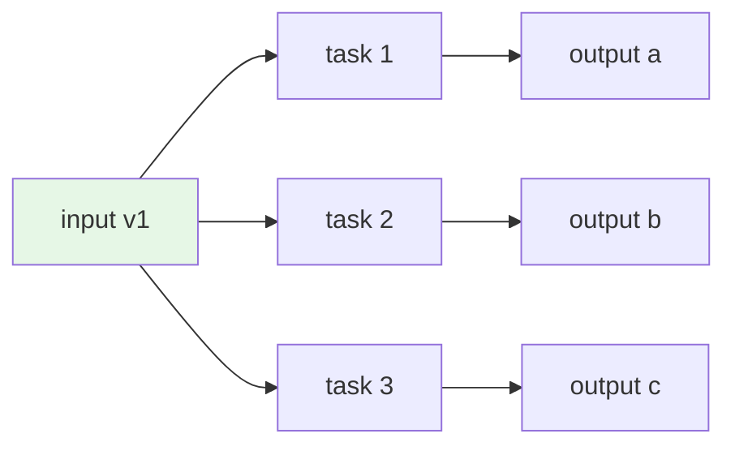

A value is **immutable** if, once created, it cannot be changed.
You can build *new* values from it, but the original stays as it was,
forever. In functional programming, this is the default. Mutation
is the exception, not the rule.

<Figure
  slug="fp-immutability-cutout"
  alt="Immutability, an isometric illustration"
/>

Immutability is not about asceticism. It is about *reasoning*.

## The cost of mutation, in one example

Consider a simple function that "increments a user's age" and a
caller that uses the user afterward.

<CodeBlock
  adapter="typescript"
  files={[
    {
      filename: "main.ts",
      starterCode: `type User = { id: string; name: string; age: number };

function birthday(u: User): void {
  u.age = u.age + 1;
}

const alice: User = { id: "u1", name: "Alice", age: 29 };
console.log("before:", alice);

birthday(alice);
console.log("after:", alice);
`,
    },
  ]}
/>

Reading the function `birthday`, you might assume it returns a new
user. It doesn't, it mutates the one you gave it. Every caller
who held a reference to `alice` is now silently affected.

This is the entire problem with mutation: **it leaks across
boundaries that are invisible in the code**. The caller of
`birthday` cannot tell from its signature that anything has changed.

The immutable version is unambiguous:

<CodeBlock
  adapter="typescript"
  files={[
    {
      filename: "main.ts",
      starterCode: `type User = {
  readonly id: string;
  readonly name: string;
  readonly age: number;
};

function birthday(u: User): User {
  return { ...u, age: u.age + 1 };
}

const alice: User = { id: "u1", name: "Alice", age: 29 };
const olderAlice = birthday(alice);

console.log("alice:     ", alice); // unchanged
console.log("olderAlice:", olderAlice); // new value
`,
    },
  ]}
/>

The change is *explicit*: a new value is returned, the old one is
unchanged, and the type system told you about it (`birthday: (u:
User) => User`).

## `readonly` is your default

TypeScript gives you several ways to mark immutability. Use them
liberally.

<CodeBlock
  adapter="typescript"
  files={[
    {
      filename: "main.ts",
      starterCode: `// readonly on a single field
type Point = { readonly x: number; readonly y: number };

// readonly on an array, disables push/pop/splice etc.
type Path = readonly Point[];

// readonly tuple
type Pair = readonly [number, number];

// 'as const' on a literal makes everything inside readonly + narrow types
const config = {
  retries: 3,
  endpoints: ["a", "b", "c"],
} as const;

const p: Point = { x: 0, y: 0 };
// p.x = 1;                  // ❌
const path: Path = [p];
// path.push(p);             // ❌
const pair: Pair = [1, 2];
// pair[0] = 9;              // ❌
// config.retries = 5;       // ❌

console.log(p, path, pair, config);
`,
    },
  ]}
/>

A useful policy: **start everything as `readonly` and remove the
modifier only when you have a specific reason**. Most fields never
need to change.

## Building new values: spread, map, filter, reduce

Once you commit to immutability, you stop *changing* values and start
*producing* new ones. The vocabulary is small.

### Updating a record

<CodeBlock
  adapter="typescript"
  files={[
    {
      filename: "main.ts",
      starterCode: `type User = {
  readonly id: string;
  readonly name: string;
  readonly age: number;
};

const alice: User = { id: "u1", name: "Alice", age: 29 };

// "alice with name = Alicia"
const renamed: User = { ...alice, name: "Alicia" };

// "alice with age incremented"
const older: User = { ...alice, age: alice.age + 1 };

console.log(alice, renamed, older);
`,
    },
  ]}
/>

`{ ...x, k: v }` is the canonical "update a field" idiom. It builds
a brand-new object that shares everything with `x` except `k`.

### Updating a nested record

<CodeBlock
  adapter="typescript"
  files={[
    {
      filename: "main.ts",
      starterCode: `type Address = { readonly city: string; readonly country: string };
type User = {
  readonly id: string;
  readonly name: string;
  readonly address: Address;
};

const alice: User = {
  id: "u1",
  name: "Alice",
  address: { city: "Berlin", country: "DE" },
};

// Update the city, explicit re-spread of nested object
const moved: User = {
  ...alice,
  address: { ...alice.address, city: "Munich" },
};

console.log("before:", alice);
console.log("after: ", moved);
`,
    },
  ]}
/>

This nesting gets tedious for very deep updates. We will see in
later chapters how *lenses* (a pure functional pattern) make this
ergonomic, and how flatter data designs avoid the problem
altogether.

### Updating a list

<CodeBlock
  adapter="typescript"
  files={[
    {
      filename: "main.ts",
      starterCode: `type Todo = {
  readonly id: number;
  readonly text: string;
  readonly done: boolean;
};

const todos: readonly Todo[] = [
  { id: 1, text: "Buy milk", done: false },
  { id: 2, text: "Write FP", done: false },
  { id: 3, text: "Sleep", done: false },
];

// Mark id=2 as done, returns a NEW array
const updated: readonly Todo[] = todos.map((t) =>
  t.id === 2 ? { ...t, done: true } : t,
);

// Remove id=1, returns a NEW array
const remaining: readonly Todo[] = updated.filter((t) => t.id !== 1);

// Add a new one, returns a NEW array
const withNew: readonly Todo[] = [
  ...remaining,
  { id: 4, text: "Refactor", done: false },
];

console.log(todos); // unchanged
console.log(withNew); // new value
`,
    },
  ]}
/>

Notice: every operation returns a new array. The original `todos`
is forever the original `todos`.

## Performance: isn't this wasteful?

A common worry: *"if every update copies, isn't immutability slow?"*

The honest answer is: **it can be**, naively, but it usually isn't
for two reasons.

1. **Structural sharing.** When you spread an object, the new object
   shares all the *inner* values with the old one. You don't deep-copy.
   For a 20-field record, an update copies 20 pointers, not 20
   payloads.
2. **The bottleneck is usually elsewhere.** Most programs spend their
   time on I/O, rendering, JSON parsing, or framework overhead, not
   on object allocation. The allocations from immutability are
   typically rounding error compared to a network call or a React
   render.

For the rare cases where allocation *is* the bottleneck (huge data
structures, hot inner loops), persistent data structure libraries
like Immer (using copy-on-write proxies) or Immutable.js (using hash
array mapped tries) give you immutability with O(log n) updates.
But you almost never need them.

That O(log n) is worth seeing, because it is the number that makes the
naive worry wrong. A persistent structure rewrites only the nodes between
the root and the element you changed; everything else is shared with the
version you started from:

<Chart slug="structural-sharing-copy" />

## Immutability + parallelism = free

Two pieces of code that share *no mutable state* cannot race.
Period. They might run in any order, on any thread, on any machine,
and the result is the same.

Three tasks reading the same immutable `v1` can all run in parallel
with no locks, no atomics, no mutexes, no worry. That's the
property that lets `Array.prototype.map` be safely parallelizable in
languages that do so.

## A practical example: an undo stack

Immutability makes whole categories of feature trivially easy.
Consider an "undo" feature.

<CodeBlock
  adapter="typescript"
  files={[
    {
      filename: "main.ts",
      starterCode: `type State = { readonly counter: number; readonly note: string };

// Pure transformations
const inc = (s: State): State => ({ ...s, counter: s.counter + 1 });
const dec = (s: State): State => ({ ...s, counter: s.counter - 1 });
const setNote =
  (note: string) =>
  (s: State): State => ({ ...s, note });

// History is just an array of past states
const initial: State = { counter: 0, note: "" };

let history: readonly State[] = [initial];

function apply(transition: (s: State) => State): void {
  const current = history[history.length - 1];
  history = [...history, transition(current)];
}

function undo(): void {
  if (history.length > 1) history = history.slice(0, -1);
}

apply(inc);
apply(inc);
apply(setNote("hi"));
apply(dec);
console.log("history length:", history.length);
console.log("now:           ", history[history.length - 1]);

undo();
undo();
console.log("after 2 undos: ", history[history.length - 1]);
`,
    },
  ]}
/>

This implementation is ~20 lines and *correct*. In an imperative
world, undo means snapshotting state, deep-cloning it, tracking
diffs, or wiring elaborate command-pattern machinery. With
immutability, the "snapshot" is the old value itself, you couldn't
have changed it if you tried.

## Mutation, hidden in plain sight

A few sneaky ways mutation gets in even when you're "trying":

<CodeBlock
  adapter="typescript"
  files={[
    {
      filename: "main.ts",
      starterCode: `// 1. Methods that mutate AND return a value (lying about purity)
const xs = [3, 1, 2];
const sorted = xs.sort(); // sort() mutates xs AND returns it
console.log("xs:    ", xs); // [1, 2, 3]  (mutated!)
console.log("sorted:", sorted); // [1, 2, 3]

// Fix: copy first
const xs2 = [3, 1, 2];
const sorted2 = [...xs2].sort();
console.log("xs2:    ", xs2); // unchanged
console.log("sorted2:", sorted2);
`,
    },
  ]}
/>

<CodeBlock
  adapter="typescript"
  files={[
    {
      filename: "main.ts",
      starterCode: `// 2. Date objects are mutable
const d = new Date(2024, 0, 1);
const tomorrow = d;
tomorrow.setDate(tomorrow.getDate() + 1);
console.log("d:        ", d.toISOString()); // changed!
console.log("tomorrow: ", tomorrow.toISOString()); // same reference

// Treat Date as a value: create a new one
const d2 = new Date(2024, 0, 1);
const tomorrow2 = new Date(d2.getTime() + 24 * 3600 * 1000);
console.log("d2:        ", d2.toISOString());
console.log("tomorrow2: ", tomorrow2.toISOString());
`,
    },
  ]}
/>

The standard library is full of these traps. As a rule:

- `Array#sort`, `Array#reverse`, `Array#splice`, `Array#push`,
  `Array#pop`, `Array#shift`, `Array#unshift`, **mutate**
- `Array#map`, `Array#filter`, `Array#slice`, `Array#concat`,
  `Array#flatMap`, `Array#toSorted`, `Array#toReversed`,
  `Array#toSpliced`, `Array#with`, **return new**

When in doubt, prefer the new immutable variants (`toSorted`,
`toReversed`, etc.) introduced in ES2023.

## A multi-file challenge

<ChallengeCard
  adapter="typescript"
  title="Immutable cart operations"
  instructions={`Implement three **pure** functions in \`cart.ts\` that all
return *new* carts and never mutate the input.

- \`add(cart, item)\`, append \`item\`.
- \`remove(cart, itemId)\`, remove the entry whose \`id\` matches.
- \`setQty(cart, itemId, qty)\`, update the matching entry's
  quantity.

If \`itemId\` is not found in \`remove\` or \`setQty\`, return the cart
unchanged.

**Expected output**

\`\`\`
total items: 3
after remove: 2
after setQty: 5
original unchanged: 3
\`\`\``}
  entryFilename="main.ts"
  files={[
    {
      filename: "main.ts",
      starterCode: `import { add, remove, setQty, totalQty } from "./cart";

const empty: readonly { id: string; qty: number }[] = [];
const cart1 = add(add(add(empty, { id: "a", qty: 1 }), { id: "b", qty: 1 }), {
  id: "c",
  qty: 1,
});
console.log(\`total items: \${totalQty(cart1)}\`);

const cart2 = remove(cart1, "b");
console.log(\`after remove: \${totalQty(cart2)}\`);

const cart3 = setQty(cart2, "a", 4);
console.log(\`after setQty: \${totalQty(cart3)}\`);

console.log(\`original unchanged: \${totalQty(cart1)}\`);
`,
    },
    {
      filename: "cart.ts",
      starterCode: `export type Item = { readonly id: string; readonly qty: number };
export type Cart = readonly Item[];

export function add(cart: Cart, item: Item): Cart {
  // your code here
  return cart;
}

export function remove(cart: Cart, itemId: string): Cart {
  // your code here
  return cart;
}

export function setQty(cart: Cart, itemId: string, qty: number): Cart {
  // your code here
  return cart;
}

export function totalQty(cart: Cart): number {
  return cart.reduce((s, i) => s + i.qty, 0);
}
`,
      solutionCode: `export type Item = { readonly id: string; readonly qty: number };
export type Cart = readonly Item[];

export function add(cart: Cart, item: Item): Cart {
  return [...cart, item];
}

export function remove(cart: Cart, itemId: string): Cart {
  return cart.filter((i) => i.id !== itemId);
}

export function setQty(cart: Cart, itemId: string, qty: number): Cart {
  return cart.map((i) => (i.id === itemId ? { ...i, qty } : i));
}

export function totalQty(cart: Cart): number {
  return cart.reduce((s, i) => s + i.qty, 0);
}
`,
    },
  ]}
  tests={[
    {
      id: "cart-ops",
      name: "Immutable add/remove/setQty",
      description: "All operations should return new carts and leave originals untouched.",
      expect: { stdoutEquals: "total items: 3\nafter remove: 2\nafter setQty: 5\noriginal unchanged: 3" },
    },
  ]}
/>

---

<MultipleChoice
  markdown={`What is the most important *practical* benefit of immutability in a large codebase?

- It always makes programs faster
  > It often makes them somewhat slower in micro-benchmarks. The benefit isn't speed; it's reasoning.
- [o] You can pass a value across modules and be certain nobody can change it behind your back
  > The contract "this value will not change" is the single most useful guarantee for reasoning about cross-module behavior. It eliminates an entire class of bug ("who mutated my data?") without any runtime cost.
- It removes the need for unit tests
  > It makes unit tests easier, but you still write them. Immutability isn't a replacement for testing.
- It makes \`==\` always work correctly
  > Equality in JavaScript is reference-based by default for objects, regardless of mutability. Immutability doesn't change that.

Immutability is fundamentally about *trust*: once a value is created, no caller, library, framework, or future maintainer can secretly change it.`}
/>
