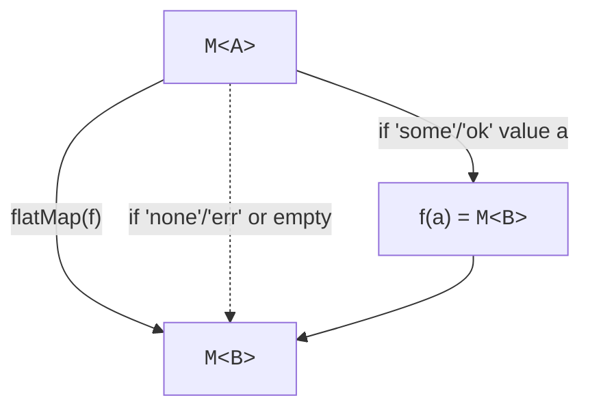

The two most common sources of bugs in everyday TypeScript are:

<Figure
  slug="fp-option-and-result-cutout"
  alt="Option and Result, an isometric illustration"
/>

1. **Forgetting** that a value might be missing (`null`, `undefined`).
2. **Forgetting** that a function might fail (exceptions).

Both are *invisible* in JavaScript: `null` looks like a value, an
exception flies up the stack invisibly through every function it
passes. Both can be fixed by the same idea: **encode possibility
in the type**, so the compiler forces you to think about it.

The two types are `Option<A>` and `Result<E, A>`. They are the
single most useful pair of patterns in this entire course.

The problem they solve is old and expensive. Tony Hoare, who
introduced the null reference into ALGOL W in 1965, publicly
apologized for it in 2009, calling it his "billion-dollar mistake"
for the decades of crashes and vulnerabilities it enabled. The
industry's verdict is now in: every major language designed since,
Rust's `Option`, Swift's optionals, Kotlin's nullable types, Haskell
and ML's `Maybe` before them all, replaces the invisible null with
a type the compiler can see. That is exactly what we're about to
build, in about six lines of TypeScript.

## Option: "maybe there is an A"

<CodeBlock
  adapter="typescript"
  files={[
    {
      filename: "main.ts",
      starterCode: `type Option<A> = { kind: "none" } | { kind: "some"; value: A };

const some = <A,>(value: A): Option<A> => ({ kind: "some", value });
const none = <A,>(): Option<A> => ({ kind: "none" });

// Using it
function findUser(id: string): Option<{ name: string }> {
  if (id === "u1") return some({ name: "Ada" });
  return none();
}

const r1 = findUser("u1");
const r2 = findUser("u2");

// You CANNOT just do r1.value, the type doesn't have a .value yet
if (r1.kind === "some") console.log("found:", r1.value.name);
if (r2.kind === "none") console.log("not found");
`,
    },
  ]}
/>

The compiler refuses to let you read `.value` until you've checked
`.kind === "some"`. That's the safety: every read is *preceded* by
a check, and the compiler enforces it.

<Figure
  slug="fp-option-and-result-option-maybe-there-inline-cutout"
  alt="Two sealed envelopes on a bench, one opened to show a block and one opened to show nothing at all"
  caption="An option makes the possibility of nothing part of the type itself."
/>

### Operations on Option

The whole point of these types is that you don't have to keep
`switch`-ing manually. You define a small library of operations
once, and from then on you transform `Option` values directly.

<CodeBlock
  adapter="typescript"
  files={[
    {
      filename: "main.ts",
      starterCode: `type Option<A> = { kind: "none" } | { kind: "some"; value: A };
const some = <A,>(value: A): Option<A> => ({ kind: "some", value });
const none = <A,>(): Option<A> => ({ kind: "none" });

// "If there's a value, transform it"
function map<A, B>(o: Option<A>, f: (a: A) => B): Option<B> {
  return o.kind === "none" ? none() : some(f(o.value));
}

// "If there's a value, run an operation that can also fail"
function flatMap<A, B>(o: Option<A>, f: (a: A) => Option<B>): Option<B> {
  return o.kind === "none" ? none() : f(o.value);
}

// "Pull the value out, or fall back"
function getOrElse<A>(o: Option<A>, fallback: A): A {
  return o.kind === "none" ? fallback : o.value;
}

const ageStr = some("36");
const age = flatMap(ageStr, (s) => {
  const n = Number(s);
  return Number.isNaN(n) ? none() : some(n);
});
const doubledAge = map(age, (n) => n * 2);
console.log("doubled age or 0:", getOrElse(doubledAge, 0));

const missing: Option<string> = none();
console.log("missing fallback:", getOrElse(missing, "none"));
`,
    },
  ]}
/>

Three operators: **`map()`** (transform inside), **`flatMap()`** (chain
operations that also return Option), **`getOrElse()`** (escape with a
fallback). With these three, you can compose long chains of "this
might or might not be there" without a single `if`.

### A pipeline of fallible lookups

<CodeBlock
  adapter="typescript"
  files={[
    {
      filename: "main.ts",
      starterCode: `type Option<A> = { kind: "none" } | { kind: "some"; value: A };
const some = <A,>(value: A): Option<A> => ({ kind: "some", value });
const none = <A,>(): Option<A> => ({ kind: "none" });
const flatMap = <A, B>(o: Option<A>, f: (a: A) => Option<B>): Option<B> =>
  o.kind === "none" ? none() : f(o.value);
const map = <A, B>(o: Option<A>, f: (a: A) => B): Option<B> =>
  o.kind === "none" ? none() : some(f(o.value));
const getOrElse = <A,>(o: Option<A>, fb: A): A =>
  o.kind === "none" ? fb : o.value;

const users: Record<string, { id: string; managerId?: string; name: string }> =
  {
    u1: { id: "u1", name: "Ada" },
    u2: { id: "u2", name: "Linus", managerId: "u1" },
    u3: { id: "u3", name: "Grace", managerId: "u2" },
  };

const findUser = (
  id: string,
): Option<{ id: string; managerId?: string; name: string }> =>
  id in users ? some(users[id]) : none();

const managerOf = (id: string): Option<string> => {
  const u = findUser(id);
  return u.kind === "some" && u.value.managerId !== undefined
    ? some(u.value.managerId)
    : none();
};

// "What is the name of u3's manager's manager?"
const result = flatMap(flatMap(managerOf("u3"), managerOf), (id) =>
  map(findUser(id), (u) => u.name),
);

console.log(getOrElse(result, "no such chain"));
`,
    },
  ]}
/>

No null checks, no nested ternaries, no exceptions. If *any* step
returns `none`, the whole chain short-circuits to `none` and the
fallback kicks in.

## Result: "an A or an error E"

`Option` answers "is there a value?" `Result` answers "what went
wrong?". You use it when you need *information* about the failure,
not just its absence.

<Figure
  slug="fp-option-and-result-inline-cutout"
  alt="Two sealed envelopes on a bench, one opened to show a block inside and one opened to show it empty, with a small tray waiting for each case"
  caption="`Option` says whether there is a value; `Result` says what went wrong."
/>

<CodeBlock
  adapter="typescript"
  files={[
    {
      filename: "main.ts",
      starterCode: `type Result<E, A> = { kind: "ok"; value: A } | { kind: "err"; error: E };

const ok = <E, A>(value: A): Result<E, A> => ({ kind: "ok", value });
const err = <E, A>(error: E): Result<E, A> => ({ kind: "err", error });

function parseAge(s: string): Result<string, number> {
  const n = Number(s);
  if (Number.isNaN(n)) return err("not a number");
  if (n < 0) return err("negative age");
  if (!Number.isInteger(n)) return err("not an integer");
  return ok(n);
}

["36", "x", "-1", "1.5"].forEach((s) => {
  const r = parseAge(s);
  console.log(s.padEnd(4), r);
});
`,
    },
  ]}
/>

The error type is *generic*. You can use a string, an enum, or,
best of all, a discriminated union of structured errors:

```ts
type ParseError =
  | { kind: "not_a_number"; input: string }
  | { kind: "out_of_range"; value: number; min: number; max: number }
  | { kind: "not_an_integer"; value: number };
```

With an error union like this, the caller can `switch` on the
failure exhaustively, render a precise message for each case, and,
because it's all just data, log it, serialize it, or translate it
at a service boundary. Errors stop being opaque strings and become
part of your domain model, designed with the same care as the happy
path. The [Type-Driven Design](./type-driven-design) chapter pushes
this idea further.

### Operations on Result

Same three operators, with error-handling versions:

<CodeBlock
  adapter="typescript"
  files={[
    {
      filename: "main.ts",
      starterCode: `type Result<E, A> = { kind: "ok"; value: A } | { kind: "err"; error: E };
const ok = <E, A>(value: A): Result<E, A> => ({ kind: "ok", value });
const err = <E, A>(error: E): Result<E, A> => ({ kind: "err", error });

// Transform the value if ok; pass errors through unchanged
function map<E, A, B>(r: Result<E, A>, f: (a: A) => B): Result<E, B> {
  return r.kind === "ok" ? ok(f(r.value)) : r;
}

// Chain a fallible step
function flatMap<E, A, B>(
  r: Result<E, A>,
  f: (a: A) => Result<E, B>,
): Result<E, B> {
  return r.kind === "ok" ? f(r.value) : r;
}

// Transform the error (useful for translating between layers)
function mapErr<E, F, A>(r: Result<E, A>, f: (e: E) => F): Result<F, A> {
  return r.kind === "err" ? err(f(r.error)) : r;
}

function parseInt2(s: string): Result<string, number> {
  const n = Number.parseInt(s, 10);
  return Number.isNaN(n) ? err(\`"\${s}" is not an integer\`) : ok(n);
}

function positive(n: number): Result<string, number> {
  return n > 0 ? ok(n) : err(\`\${n} is not positive\`);
}

const result = flatMap(parseInt2("42"), positive);
console.log(result);

const failed = flatMap(parseInt2("nope"), positive);
console.log(failed);
`,
    },
  ]}
/>

The contract is the same in every step: *if ok, transform; if err,
pass through unchanged*. Errors propagate without explicit
re-throwing. The pipeline short-circuits the moment something fails.

## Why this is so much better than exceptions

| Exceptions | `Result` |
| --- | --- |
| Invisible in the function signature | Visible: `Result<E, A>` |
| Caller can forget to catch | Caller *cannot* read `.value` without checking `.kind` |
| Hard to narrow by error type | Error type is whatever discriminated union you choose |
| Stack unwinding is opaque | Errors flow as ordinary values you can map, log, transform |
| Unsuitable for predictable failures | Designed for them |

Exceptions remain valid for **truly unexpected** situations
("invariant broken", "out of memory"). `Result` is for **expected**
failures: validation, parsing, I/O outcomes, business rule
violations.

## The diagram of `flatMap()`

`flatMap()` (also called `chain()`, `bind`, or `andThen`) is the operator
that turns "a chain of fallible steps" into "one composed
computation". Every later chapter will use it for some `M<A>`:
`Option<A>`, `Result<E, A>`, `Task<A>`, `Promise<A>`.



The diagram captures the idea exactly: `flatMap()` *threads* the
"surrounding context" (failure, asynchrony, nondeterminism) through
the chain, so each step can pretend it just sees an ordinary `A`.

## Converting at the boundary

Many APIs return nullable values or throw. Wrap them at the
boundary so the rest of your code only sees `Option`/`Result`.

<CodeBlock
  adapter="typescript"
  files={[
    {
      filename: "main.ts",
      starterCode: `type Option<A> = { kind: "none" } | { kind: "some"; value: A };
const some = <A,>(value: A): Option<A> => ({ kind: "some", value });
const none = <A,>(): Option<A> => ({ kind: "none" });

type Result<E, A> = { kind: "ok"; value: A } | { kind: "err"; error: E };
const ok = <E, A>(value: A): Result<E, A> => ({ kind: "ok", value });
const err = <E, A>(error: E): Result<E, A> => ({ kind: "err", error });

// nullable -> Option
const fromNullable = <A,>(a: A | null | undefined): Option<A> =>
  a === null || a === undefined ? none() : some(a);

// throwing -> Result
function tryRun<A>(work: () => A): Result<unknown, A> {
  try {
    return ok(work());
  } catch (e) {
    return err(e);
  }
}

const maybeName = fromNullable(process?.env?.NAME ?? null);
console.log("name:", maybeName);

const parsed = tryRun(() => JSON.parse('{"a": 1}'));
const failed = tryRun(() => JSON.parse("not json"));
console.log("parsed:", parsed);
console.log("failed:", failed);
`,
    },
  ]}
/>

The boundary is the *only* place exceptions and nullables touch your
code. From there inward, you work in the type system.

## A multi-file challenge

<ChallengeCard
  adapter="typescript"
  title="Find a user's manager's email"
  instructions={`In \`lookups.ts\`, implement \`emailOfManagerOf(id)\`
using \`flatMap()\` and \`map()\` on \`Option\`. **Do not use \`if\` or
\`switch\` inside this function**, chain the helpers.

The helpers \`findUser\`, \`managerOf\`, \`emailOf\` are already
provided.

**Expected output**

\`\`\`
u3 -> ada@example.com
u2 -> grace@example.com
u1 -> none
ux -> none
\`\`\``}
  entryFilename="main.ts"
  files={[
    {
      filename: "main.ts",
      starterCode: `import { emailOfManagerOf, getOrElse } from "./lookups";

for (const id of ["u3", "u2", "u1", "ux"]) {
  const r = emailOfManagerOf(id);
  console.log(\`\${id} -> \${getOrElse(r, "none")}\`);
}
`,
    },
    {
      filename: "lookups.ts",
      starterCode: `export type Option<A> = { kind: "none" } | { kind: "some"; value: A };
export const some = <A,>(value: A): Option<A> => ({ kind: "some", value });
export const none = <A,>(): Option<A> => ({ kind: "none" });

export const map = <A, B>(o: Option<A>, f: (a: A) => B): Option<B> =>
  o.kind === "none" ? none() : some(f(o.value));
export const flatMap = <A, B>(
  o: Option<A>,
  f: (a: A) => Option<B>,
): Option<B> => (o.kind === "none" ? none() : f(o.value));
export const getOrElse = <A,>(o: Option<A>, fb: A): A =>
  o.kind === "none" ? fb : o.value;

type User = { id: string; managerId?: string; email?: string };

const db: Record<string, User> = {
  u1: { id: "u1", email: "grace@example.com" },
  u2: { id: "u2", managerId: "u1", email: "ada@example.com" },
  u3: { id: "u3", managerId: "u2", email: "linus@example.com" },
};

export const findUser = (id: string): Option<User> =>
  id in db ? some(db[id]) : none();

export const managerOf = (u: User): Option<string> =>
  u.managerId !== undefined ? some(u.managerId) : none();

export const emailOf = (u: User): Option<string> =>
  u.email !== undefined ? some(u.email) : none();

export function emailOfManagerOf(id: string): Option<string> {
  // your code: chain findUser -> managerOf -> findUser -> emailOf
  return none();
}
`,
      solutionCode: `export type Option<A> = { kind: "none" } | { kind: "some"; value: A };
export const some = <A,>(value: A): Option<A> => ({ kind: "some", value });
export const none = <A,>(): Option<A> => ({ kind: "none" });

export const map = <A, B>(o: Option<A>, f: (a: A) => B): Option<B> =>
  o.kind === "none" ? none() : some(f(o.value));
export const flatMap = <A, B>(
  o: Option<A>,
  f: (a: A) => Option<B>,
): Option<B> => (o.kind === "none" ? none() : f(o.value));
export const getOrElse = <A,>(o: Option<A>, fb: A): A =>
  o.kind === "none" ? fb : o.value;

type User = { id: string; managerId?: string; email?: string };

const db: Record<string, User> = {
  u1: { id: "u1", email: "grace@example.com" },
  u2: { id: "u2", managerId: "u1", email: "ada@example.com" },
  u3: { id: "u3", managerId: "u2", email: "linus@example.com" },
};

export const findUser = (id: string): Option<User> =>
  id in db ? some(db[id]) : none();

export const managerOf = (u: User): Option<string> =>
  u.managerId !== undefined ? some(u.managerId) : none();

export const emailOf = (u: User): Option<string> =>
  u.email !== undefined ? some(u.email) : none();

export function emailOfManagerOf(id: string): Option<string> {
  return flatMap(flatMap(flatMap(findUser(id), managerOf), findUser), emailOf);
}
`,
    },
  ]}
  tests={[
    {
      id: "manager-email",
      name: "Chained Option lookups",
      description: "Compose findUser/managerOf/findUser/emailOf via flatMap.",
      expect: { stdoutEquals: "u3 -> ada@example.com\nu2 -> grace@example.com\nu1 -> none\nux -> none" },
    },
  ]}
/>

---

<MultipleChoice
  markdown={`Why does \`Result<E, A>\` make error handling safer than throwing exceptions?

- It is faster than \`throw\` at runtime
  > Possibly, but speed isn't the point.
- [o] The error possibility appears in the function's return type, so the caller is forced by the compiler to handle it
  > With exceptions, a function's failure modes are invisible in its type. With \`Result<E, A>\`, the failure is part of the signature; you literally cannot read \`.value\` without first checking \`.kind\`.
- It hides errors from the caller
  > The opposite, it makes errors *unhideable*.
- It eliminates the need for the \`try\`/\`catch\` keyword
  > You can still use \`try\`/\`catch\` at boundaries (e.g. wrapping a throwing API). \`Result\` is about *what flows through your own code*, not what the language permits.

\`Result\` turns "errors that propagate invisibly" into "errors that are values the type checker tracks".`}
/>
