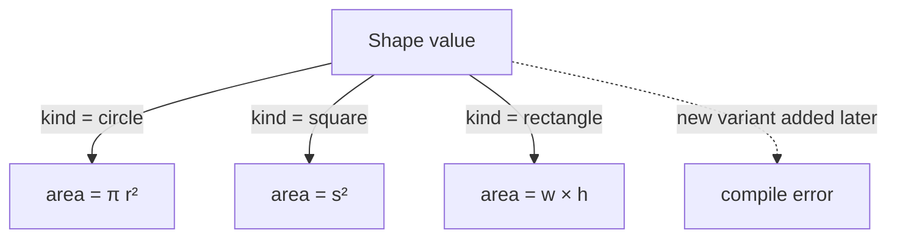

In a language like Haskell, ML, Rust, or Scala, pattern matching
is a first-class syntactic construct. TypeScript doesn't have a
`match` keyword, but it has something close enough: **discriminated
unions** + **exhaustiveness checking** via the `never` type.

<Figure
  slug="fp-pattern-matching-cutout"
  alt="Pattern matching, an isometric illustration"
/>

Used well, this pair gives you the central guarantee of pattern
matching: *the compiler refuses to build code that forgets a case*.

## The setup: a discriminated union

A discriminated union is a sum type where every variant has a
**literal tag** (called a *discriminant*) on the same property name.

<CodeBlock
  adapter="typescript"
  files={[
    {
      filename: "main.ts",
      starterCode: `type Shape =
  | { kind: "circle"; radius: number }
  | { kind: "square"; side: number }
  | { kind: "rectangle"; w: number; h: number };

const s1: Shape = { kind: "circle", radius: 3 };
const s2: Shape = { kind: "rectangle", w: 4, h: 5 };

// Without checking 'kind', the only properties available are the
// common ones (none here). The compiler protects you.
function show(s: Shape): string {
  switch (s.kind) {
    case "circle":
      return \`circle r=\${s.radius}\`;
    case "square":
      return \`square s=\${s.side}\`;
    case "rectangle":
      return \`rect \${s.w}x\${s.h}\`;
  }
}

console.log(show(s1));
console.log(show(s2));
`,
    },
  ]}
/>

Inside `case "circle":`, the compiler **narrows** `s` to the circle
variant, `s.radius` works; `s.side` doesn't. That narrowing is the
heart of pattern matching in TypeScript.

## The exhaustiveness trick: `never`

Now we add the safety net. Inside the `default:` branch of a
`switch`, the value's type should be `never`, because we've
covered every case. If a future change adds a new variant and we
forget to handle it, the type stops being `never` and the compiler
catches it.

<CodeBlock
  adapter="typescript"
  files={[
    {
      filename: "main.ts",
      starterCode: `type Shape =
  | { kind: "circle"; radius: number }
  | { kind: "square"; side: number }
  | { kind: "rectangle"; w: number; h: number };

function area(s: Shape): number {
  switch (s.kind) {
    case "circle":
      return Math.PI * s.radius * s.radius;
    case "square":
      return s.side * s.side;
    case "rectangle":
      return s.w * s.h;
    default: {
      const _exhaustive: never = s;
      throw new Error(\`unhandled: \${JSON.stringify(_exhaustive)}\`);
    }
  }
}

console.log(area({ kind: "circle", radius: 2 }).toFixed(3));
console.log(area({ kind: "rectangle", w: 3, h: 4 }));
`,
    },
  ]}
/>

Try adding `| { kind: "triangle"; base: number; height: number }`
to `Shape` (locally on your machine) and re-running the type
checker, the `default` branch starts erroring, because `s` is no
longer `never`. The compiler has told you, *before* you ship, that
you forgot a case.

This is "compiler-assisted correctness" in its purest form. The
type checker is doing the audit you'd otherwise pay a senior
engineer to do in code review.

## A `match` helper for expressions

`switch` is a *statement*. Sometimes you want pattern matching as
an *expression*, for instance, when assigning a result. You can
build a tiny helper that achieves both exhaustiveness and a nice
calling syntax:

<CodeBlock
  adapter="typescript"
  files={[
    {
      filename: "main.ts",
      starterCode: `type Shape =
  | { kind: "circle"; radius: number }
  | { kind: "square"; side: number }
  | { kind: "rectangle"; w: number; h: number };

// A "match" that requires a handler for every kind.
type Handlers<T extends { kind: string }, R> = {
  [K in T["kind"]]: (v: Extract<T, { kind: K }>) => R;
};

function match<T extends { kind: string }, R>(
  value: T,
  handlers: Handlers<T, R>,
): R {
  return handlers[value.kind as T["kind"]](
    value as Extract<T, { kind: T["kind"] }>,
  );
}

const describe = (s: Shape) =>
  match(s, {
    circle: (c) => \`○ r=\${c.radius}\`,
    square: (sq) => \`□ s=\${sq.side}\`,
    rectangle: (r) => \`▭ \${r.w}x\${r.h}\`,
  });

console.log(describe({ kind: "circle", radius: 2 }));
console.log(describe({ kind: "square", side: 5 }));
console.log(describe({ kind: "rectangle", w: 3, h: 4 }));
`,
    },
  ]}
/>

The `Handlers<T, R>` mapped type forces you to provide a handler
for **every** variant of `T`. Forget one, the compiler complains
the moment you call `match`.

This is much closer to what pattern matching feels like in
Haskell or Rust: an *expression* with a per-case handler,
type-checked.

## Nested matching

Sometimes a variant *contains* another variant. You can pattern
match through layers by chaining `match` calls, or by destructuring
inside a case.

<CodeBlock
  adapter="typescript"
  files={[
    {
      filename: "main.ts",
      starterCode: `type Json =
  | { kind: "null" }
  | { kind: "bool"; value: boolean }
  | { kind: "num"; value: number }
  | { kind: "str"; value: string }
  | { kind: "arr"; items: Json[] }
  | { kind: "obj"; entries: ReadonlyArray<readonly [string, Json]> };

function size(j: Json): number {
  switch (j.kind) {
    case "null":
    case "bool":
    case "num":
    case "str":
      return 1;
    case "arr":
      return 1 + j.items.reduce((acc, x) => acc + size(x), 0);
    case "obj":
      return 1 + j.entries.reduce((acc, [, v]) => acc + size(v), 0);
    default: {
      const _e: never = j;
      return _e;
    }
  }
}

const example: Json = {
  kind: "obj",
  entries: [
    ["a", { kind: "num", value: 1 }],
    [
      "b",
      { kind: "arr", items: [{ kind: "bool", value: true }, { kind: "null" }] },
    ],
  ],
};

console.log("size:", size(example));
`,
    },
  ]}
/>

Recursive sum types like `Json` show why exhaustive matching
matters: the data structure has *six* possible shapes, and the
recursive walk must handle all of them. The compiler enforces it.

## Pattern matching over multiple values

True pattern-matching languages also let you match *tuples* of
values:

<CodeBlock
  adapter="typescript"
  files={[
    {
      filename: "main.ts",
      starterCode: `type Light = "red" | "yellow" | "green";

// Pretend we're computing the next light from current + a flag
function next(current: Light, emergency: boolean): Light {
  if (emergency) return "red";
  switch (current) {
    case "red":
      return "green";
    case "green":
      return "yellow";
    case "yellow":
      return "red";
  }
}

for (const l of ["red", "green", "yellow"] as const) {
  console.log(\`\${l}            -> \${next(l, false)}\`);
  console.log(\`\${l} emergency  -> \${next(l, true)}\`);
}
`,
    },
  ]}
/>

For more complex tuple cases, you can build a tagged "pair" type
and match on it the same way:

```ts
type Pair = readonly [Light, boolean];
```

…then `switch` on a derived discriminant such as
``` `${current}:${emergency}` ```.

## A visual model

Pattern matching forces you to think of code as a **branching
function over a finite set of shapes**:



The dotted line is the safety: the *moment* somebody adds a new
shape, the diagram literally cannot be drawn anymore, the compiler
fails, and the developer is forced to extend every match.

## A small challenge

<ChallengeCard
  adapter="typescript"
  title="Implement an exhaustive event interpreter"
  instructions={`In \`interpret.ts\`, finish \`apply\` so it handles
every variant of \`Event\` using a \`switch\` with an exhaustiveness
check in the \`default\` branch.

Rules:

- \`{ kind: "deposit",  amount }\`  →  balance + amount
- \`{ kind: "withdraw", amount }\`  →  balance - amount
- \`{ kind: "interest", rate }\`    →  balance * (1 + rate), rounded to 2 decimals
- \`{ kind: "reset" }\`             →  0

**Expected output**

\`\`\`
100
70
73.5
0
\`\`\``}
  entryFilename="main.ts"
  files={[
    {
      filename: "main.ts",
      starterCode: `import { apply, Event } from "./interpret";

const events: Event[] = [
  { kind: "deposit", amount: 100 },
  { kind: "withdraw", amount: 30 },
  { kind: "interest", rate: 0.05 },
  { kind: "reset" },
];

let balance = 0;
for (const e of events) {
  balance = apply(balance, e);
  console.log(balance);
}
`,
    },
    {
      filename: "interpret.ts",
      starterCode: `export type Event =
  | { kind: "deposit"; amount: number }
  | { kind: "withdraw"; amount: number }
  | { kind: "interest"; rate: number }
  | { kind: "reset" };

export function apply(balance: number, e: Event): number {
  // Implement using a switch + exhaustiveness check
  switch (
    e.kind
    // TODO: handle every variant
  ) {
  }
  return balance;
}
`,
      solutionCode: `export type Event =
  | { kind: "deposit"; amount: number }
  | { kind: "withdraw"; amount: number }
  | { kind: "interest"; rate: number }
  | { kind: "reset" };

export function apply(balance: number, e: Event): number {
  switch (e.kind) {
    case "deposit":
      return balance + e.amount;
    case "withdraw":
      return balance - e.amount;
    case "interest":
      return Math.round(balance * (1 + e.rate) * 100) / 100;
    case "reset":
      return 0;
    default: {
      const _exhaustive: never = e;
      throw new Error(\`unhandled \${JSON.stringify(_exhaustive)}\`);
    }
  }
}
`,
    },
  ]}
  tests={[
    {
      id: "apply-events",
      name: "Exhaustive interpretation",
      description: "Handles every event variant; the default never branch enforces exhaustiveness.",
      expect: { stdoutEquals: "100\n70\n73.5\n0" },
    },
  ]}
/>

---

<MultipleChoice
  markdown={`What does assigning the matched value to a \`const _: never\` in the \`default\` branch of a \`switch\` accomplish?

- [o] It causes a compile error if a new variant is added to the union and not handled, because the value would no longer be of type \`never\`
  > The pattern turns "I forgot to handle this case" from a runtime surprise into a build-time error.
- It throws an error at runtime when an unhandled case occurs
  > Only as a secondary effect. The real value is at *compile* time.
- It silences ESLint warnings about empty \`default\` branches
  > Not really the point.
- It improves runtime performance of the \`switch\`
  > No measurable effect.

This trick, *exhaustiveness via \`never\`*, is the closest TypeScript gets to ML/Haskell-style pattern matching, and it's astonishingly powerful when combined with discriminated unions.`}
/>
