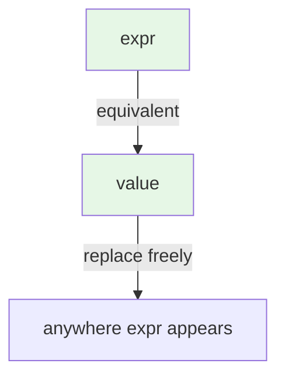

**Referential transparency** is a fancy name for a simple idea:
*an expression is referentially transparent if you can replace it
with its value without changing the meaning of the program.*

<Figure
  slug="fp-referential-transparency-cutout"
  alt="Referential transparency, an isometric illustration"
/>

If `f(2)` always evaluates to `4`, and `f` has no side effects, then
*everywhere you see `f(2)` you can swap in `4`*, and the program does
the same thing. That is referential transparency.

Pure functions produce referentially transparent expressions.
Impure functions don't.

## A concrete demonstration

<CodeBlock
  adapter="typescript"
  files={[
    {
      filename: "main.ts",
      starterCode: `// Pure: referentially transparent
const square = (x: number): number => x * x;

const a = square(3) + square(3);
const b = 9 + 9; // replaced square(3) with 9
const c = square(3) * 2; // factored out the common subexpression

console.log(a, b, c); // all 18
`,
    },
  ]}
/>

Every transformation we just did, substituting `square(3)` for `9`,
factoring out the common subexpression, is *safe* because `square`
is pure. You don't even have to think about it.

Compare with an impure function:

<CodeBlock
  adapter="typescript"
  files={[
    {
      filename: "main.ts",
      starterCode: `let counter = 0;
function nextId(): number {
  counter = counter + 1;
  return counter;
}

const a = nextId() + nextId(); // 1 + 2 = 3
console.log("a:", a);

counter = 0;
const b = nextId() * 2; // 1 * 2 = 2
console.log("b:", b);

counter = 0;
const c = 2 * nextId(); // 2 * 1 = 2
console.log("c:", c);
`,
    },
  ]}
/>

You cannot replace `nextId()` with a fixed value. Two calls give
*different* answers. Reordering changes the result. You cannot
factor out `nextId()` as a common subexpression. The expression is
**referentially opaque**.

## Why this matters

Once you know an expression is referentially transparent, an
enormous toolbox opens up. You can:

- **Inline** it freely, replace a function call with its body
- **Hoist** it, move it earlier or later in a function
- **Cache** it, compute it once, reuse the result
- **Parallelize** it, run it on another thread without coordination
- **Reorder** it, swap independent expressions without changing
  meaning
- **Factor** it, extract common subexpressions into named values
- **Substitute** equals for equals, anywhere you see `expr1`, if
  `expr1 === expr2`, you can substitute

These are exactly the optimizations a compiler wants to do. They
are also exactly the *refactorings* a human wants to do. Pure code
makes both safe.



## The substitution model of evaluation

When a language is built out of referentially transparent
expressions, you can understand any program by **substituting
definitions**. There's no need to track "what the world looks like"
at each step.

<CodeBlock
  adapter="typescript"
  files={[
    {
      filename: "main.ts",
      starterCode: `const double = (x: number): number => x * 2;
const inc = (x: number): number => x + 1;

const result = double(inc(3));
//             = double(3 + 1)
//             = double(4)
//             = 4 * 2
//             = 8

console.log(result);
`,
    },
  ]}
/>

You evaluated that in your head using *substitution*: replace
`inc(3)` with `3 + 1`, replace `double(4)` with `4 * 2`. You did
not have to ask "what's the value of any other variable at that
moment?" because nothing else exists.

That mode of reading code, top-down substitution, no hidden state,
is what makes purely functional code so easy to reason about,
especially compared to imperative code where every line might depend
on something invisible.

## Memoization: the operational consequence

Because pure expressions can be replaced by their values, you can
*remember* the value the first time you compute it and reuse it
forever. This is **memoization**, and it's free for any pure
function.

<CodeBlock
  adapter="typescript"
  files={[
    {
      filename: "main.ts",
      starterCode: `function memoize<A, B>(f: (a: A) => B): (a: A) => B {
  const cache = new Map<A, B>();
  return (a: A): B => {
    if (cache.has(a)) return cache.get(a)!;
    const b = f(a);
    cache.set(a, b);
    return b;
  };
}

// A slow pure function: compute the n-th Fibonacci by raw recursion
function fib(n: number): number {
  return n < 2 ? n : fib(n - 1) + fib(n - 2);
}

const fastFib = memoize<number, number>((n) =>
  n < 2 ? n : fastFib(n - 1) + fastFib(n - 2),
);

console.time("slow fib(30)");
console.log(fib(30));
console.timeEnd("slow fib(30)");

console.time("fast fib(30)");
console.log(fastFib(30));
console.timeEnd("fast fib(30)");
`,
    },
  ]}
/>

The memoized version is correct only *because* `fib` is referentially
transparent. If `fib(30)` could mean different things in different
moments, caching would be wrong.

## Common subexpression elimination

The compiler equivalent of the above: if you compute the same
expression twice in one block, you can compute it once and reuse it.

<CodeBlock
  adapter="typescript"
  files={[
    {
      filename: "main.ts",
      starterCode: `function distance(
  a: { x: number; y: number },
  b: { x: number; y: number },
): number {
  // dx and dy are computed twice in the naive version
  return Math.sqrt((a.x - b.x) ** 2 + (a.y - b.y) ** 2);
}

function distanceCSE(
  a: { x: number; y: number },
  b: { x: number; y: number },
): number {
  const dx = a.x - b.x;
  const dy = a.y - b.y;
  return Math.sqrt(dx * dx + dy * dy);
}

console.log(distance({ x: 0, y: 0 }, { x: 3, y: 4 }));
console.log(distanceCSE({ x: 0, y: 0 }, { x: 3, y: 4 }));
`,
    },
  ]}
/>

The refactor from `distance` to `distanceCSE` is *only* safe because
`a.x - b.x` is referentially transparent, it has no side effects
and depends only on its inputs. In an imperative world where reading
a property might trigger code, you couldn't do this without
analysis.

## Equational reasoning

Mathematicians get to use *equations*: write down a chain of
substitutions and trust each step. Programmers usually don't, because
imperative code doesn't support it. Referentially transparent code
*does*.

```text
sumOfSquares(xs)
  = xs.map(square).reduce(add, 0)
  = xs.map(x => x*x).reduce((a,b) => a+b, 0)
  // for xs = [1, 2, 3]:
  = [1, 4, 9].reduce((a,b) => a+b, 0)
  = 0 + 1 + 4 + 9
  = 14
```

Each `=` is a substitution. The proof writes itself. This is what
the functional programming community means when it says "you can *reason about* the code",
not "stare at it harder" but literally *prove* properties of it by
substitution.

## What breaks referential transparency

Anything impure:

- `Date.now()`, different result every call
- `Math.random()`, different result every call
- `console.log(...)`, same return value but the side effect matters
- mutation of a captured variable
- exceptions on some inputs (technically: the call has no value at all)

<CodeBlock
  adapter="typescript"
  files={[
    {
      filename: "main.ts",
      starterCode: `// Innocent-looking but NOT referentially transparent
function greetWith(name: string): string {
  console.log(\`(building greeting for \${name})\`);
  return \`Hello, \${name}!\`;
}

// These two are NOT equivalent
const a = greetWith("Ada") + " " + greetWith("Ada"); // logs twice
const ga = greetWith("Ada"); // logs once
const b = ga + " " + ga; // no extra log

console.log("a:", a);
console.log("b:", b);
`,
    },
  ]}
/>

Both produce the same string, but the *programs* are different,
because the side effect (logging) happens a different number of
times. If anyone is observing those logs, the programs are *not*
equivalent. That's what "referentially opaque" means in practice.

<Figure
  slug="fp-referential-transparency-inline-cutout"
  alt="A block on a bench and the finished result of that block, either one dropping into the same slot and the machine behaving identically"
  caption="Referential transparency is what makes that substitution always safe."
/>

## A practical refactor

A short, realistic refactor: a function whose interface is impure
because of hidden randomness, made referentially transparent by
exposing the randomness as an input.

<CodeBlock
  adapter="typescript"
  files={[
    {
      filename: "main.ts",
      starterCode: `// Before: not referentially transparent, output depends on the RNG
function pickWinner(candidates: readonly string[]): string {
  const idx = Math.floor(Math.random() * candidates.length);
  return candidates[idx];
}

console.log(pickWinner(["A", "B", "C"])); // ??? depends on RNG
console.log(pickWinner(["A", "B", "C"])); // ??? depends on RNG
`,
    },
  ]}
/>

<CodeBlock
  adapter="typescript"
  files={[
    {
      filename: "main.ts",
      starterCode: `// After: pure. The randomness is now an explicit input.
function pickWinner(candidates: readonly string[], roll01: number): string {
  const idx = Math.floor(roll01 * candidates.length);
  return candidates[idx];
}

// Same inputs → same output. Always.
console.log(pickWinner(["A", "B", "C"], 0.1)); // "A"
console.log(pickWinner(["A", "B", "C"], 0.5)); // "B"
console.log(pickWinner(["A", "B", "C"], 0.99)); // "C"

// The impure shell that actually rolls
const winner = pickWinner(["A", "B", "C"], Math.random());
console.log("random winner:", winner);
`,
    },
  ]}
/>

The first version cannot be tested, replayed, or reasoned about
without simulating the RNG. The second version is fully
deterministic and the actual random sampling moves to the program's
edge, exactly the same pattern as in [Pure Functions](./pure-functions).

---

<MultipleChoice
  markdown={`Why is referential transparency such a powerful property in practice?

- It makes pointer aliasing safe
  > Aliasing is mostly a non-issue in TypeScript, and it's not what referential transparency is about.
- It speeds up TypeScript compilation
  > The compiler itself doesn't care. The benefit is to *programmers* and *runtime optimizations*, not type-checking speed.
- [o] It lets you replace an expression with its value anywhere it appears, enabling caching, parallelism, inlining, reordering, and equational reasoning
  > The single property "this expression equals this value, everywhere" unlocks essentially every classical compiler optimization *and* every refactoring you'd want to do by hand.
- It eliminates the need for unit tests
  > It makes tests easier and more reliable, but you still write them.

If \`f(x)\` can be replaced by its value, you can move it, cache it, inline it, parallelize it, and prove things about it without rerunning anything.`}
/>
