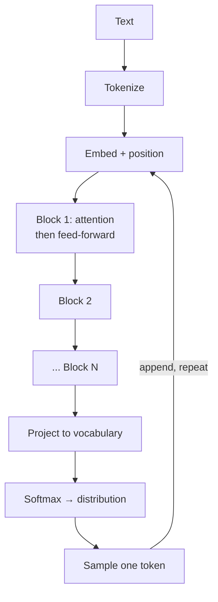

You now have every component. This chapter assembles them and puts
some numbers on the result.

<Figure
  slug="llm-transformer-shape-cutout"
  alt="A tall stack of identical paired layers rendered as a cutaway tower, each floor showing a mixing chamber beside a larger processing chamber, with a bypass channel running up the outside"
/>

## The full path of a prompt

<Steps>

<Step>
### Tokenize

Your text becomes a list of token ids using the learned merges from
the BPE chapter.
</Step>

<Step>
### Embed

Each id is replaced by its vector from the embedding table, and
positional information is added so order is visible.
</Step>

<Step>
### Repeat N times: attention, then feed-forward

Each block has two halves. **Attention** mixes information between
tokens. A **feed-forward network** then processes each token's vector
independently, which is where much of the model's stored knowledge
lives. Both halves have residual connections around them, so the
original signal is preserved alongside whatever the block added.

A large model repeats this block dozens of times.
</Step>

<Step>
### Project to the vocabulary

The final token's vector is multiplied by a matrix that produces one
score per vocabulary entry. Softmax turns those scores into the
probability distribution from chapter one.
</Step>

<Step>
### Sample

One token is drawn from that distribution, appended to the input, and
the whole thing runs again.
</Step>

</Steps>

## What the parameters are

A "70 billion parameter" model has 70 billion learned numbers, spread
across:

* The embedding table (vocabulary size times embedding dimension).
* Per block: the query, key, and value projection matrices, the output
  projection, and the feed-forward network's two large matrices.
* The final projection to vocabulary scores.

<Figure
  slug="llm-the-shape-of-a-transformer-inline-cutout"
  alt="A stack of identical boxed layers, a ribbon of chips entering the bottom and leaving the top, each layer wired to look back along the ribbon"
/>

The feed-forward networks typically hold the majority. That is worth
knowing, because popular explanations focus on attention while most of
the parameters, and much of the factual knowledge, sit in the
per-token processing between attention steps.

<CodeBlock
  adapter="python"
  files={[
    {
      filename: "main.py",
      starterCode: `# Where the parameters actually go, for a mid-sized model.
vocab, d_model, n_layers, d_ff = 128_000, 4096, 32, 14_336

embedding = vocab * d_model
per_layer_attn = 4 * d_model * d_model        # Q, K, V, and output
per_layer_ff = 2 * d_model * d_ff             # up and down projections
per_layer = per_layer_attn + per_layer_ff
output_proj = vocab * d_model

total = embedding + n_layers * per_layer + output_proj

print(f"embedding table:   {embedding/1e9:6.2f}B")
print(f"attention (x{n_layers}):  {n_layers*per_layer_attn/1e9:6.2f}B")
print(f"feed-forward (x{n_layers}): {n_layers*per_layer_ff/1e9:6.2f}B")
print(f"output projection: {output_proj/1e9:6.2f}B")
print(f"{'-'*30}")
print(f"total:             {total/1e9:6.2f}B parameters")
print()
ff_share = n_layers * per_layer_ff / total
print(f"Feed-forward share: {ff_share:.0%} of all parameters")
`,
    },
  ]}
/>

## Why depth and width both matter

* **Width** (the embedding dimension) sets how much information a
  single token's representation can carry.
* **Depth** (the number of blocks) sets how many rounds of refinement
  that representation goes through.

Neither substitutes for the other. A very wide, shallow model has rich
representations it cannot refine; a very deep, narrow one refines
repeatedly but has little room to hold intermediate conclusions.

## What this does not include

Two things people assume are in the architecture and are not:

* **No memory between requests.** Nothing persists. Any apparent
  memory comes from the conversation being resent.
* **No fact database.** There is no lookup table. Everything the model
  "knows" is encoded in the same weights that determine its grammar,
  which is why knowledge and style cannot be updated independently.

<Figure
  slug="llm-the-shape-of-a-transformer-full-path-prompt-inline-cutout"
  alt="A ribbon entering the bottom of a stack of identical boxed layers and one new chip leaving the top"
/>

## Concept check

<MultipleChoice
  markdown={`Which component holds the majority of a large model's parameters?

- The attention projections.
  > Smaller than the feed-forward networks in standard configurations.
- [o] The feed-forward networks inside each block.
  > Their two large matrices per layer usually dominate, which is where much of the stored knowledge sits.
- The embedding table.
  > Substantial but typically a modest share of the total.
- The output projection to vocabulary scores.
  > Comparable to the embedding table and far short of a majority.

Popular explanations emphasize attention, while most of the parameters
are in the per-token processing between attention steps.`}
/>

<MultipleChoice
  markdown={`What do residual connections around each block do?

- Reduce the number of parameters required.
  > They add no parameters and remove none.
- Convert vectors back into token ids between layers.
  > No conversion happens between layers.
- [o] Preserve the original signal alongside whatever the block computed.
  > The block's output is added to its input rather than replacing it, so information survives many layers.
- Prevent the model from attending to distant tokens.
  > They have no effect on attention range.

Each block refines the representation rather than replacing it.`}
/>

<MultipleChoice
  markdown={`What is projected to vocabulary scores at the end?

- The concatenation of every layer's output.
  > Layers feed forward sequentially rather than being concatenated.
- The original embedding of the first token.
  > The first token's embedding carries no information about the rest.
- [o] The final token's vector, after passing through every block.
  > Predicting what comes next depends on the representation at the current end of the sequence.
- The average of all token vectors in the sequence.
  > Averaging would discard positional information needed for prediction.

Next-token prediction reads from the position where the next token
will go.`}
/>

<MultipleChoice
  markdown={`Why can a model's knowledge not be updated independently of its style?

- Because style is determined entirely by the sampling settings.
  > Sampling affects variability, not the model's characteristic voice.
- [o] Because both are encoded in the same weights.
  > Facts and grammar share the parameters, so adjusting one perturbs the other.
- Because updates require retraining from scratch.
  > Fine-tuning exists, which does not restart training.
- Because knowledge is stored in a separate read-only component.
  > There is no separate knowledge component.

The absence of a fact store is exactly why targeted knowledge editing is
difficult.`}
/>

<MultipleChoice
  markdown={`What does increasing model *width* buy?

- More rounds of refinement on each representation.
  > That is what depth provides.
- [o] More capacity in each token's representation.
  > A wider vector can carry more distinctions simultaneously.
- A larger vocabulary.
  > Vocabulary size is chosen independently.
- A larger context window.
  > Window size is a separate design parameter.

Width is how much a representation can hold; depth is how many times it
gets improved.`}
/>

<MultipleChoice
  markdown={`Where does the apparent "memory" in a chat conversation come from?

- A per-user memory store maintained by the model.
  > The model maintains no store between requests.
- [o] The entire conversation being resent with every request.
  > The model is stateless, so continuity comes from the client including the history in each new request.
- A cache of previous responses keyed by user id.
  > Caching reduces cost and does not create memory.
- Weights updated incrementally during the conversation.
  > No training occurs during inference.

Statelessness plus resending explains both the memory and the cost
growth.`}
/>

<MultipleChoice
  markdown={`What are the two halves of a transformer block?

- Tokenization and embedding.
  > Both happen once, before any block runs.
- Encoding and decoding.
  > That describes a different architecture family.
- [o] Attention, then a feed-forward network.
  > Attention mixes information between tokens, and the feed-forward network processes each token independently.
- Softmax and sampling.
  > Both occur once at the end, not per block.

Mix between tokens, then process each token: that pair repeated is the
whole stack.`}
/>

<MultipleChoice
  markdown={`In the parameter calculation, what does \`vocab * d_model\` compute twice?

- [o] The embedding table and the final output projection.
  > Both map between vocabulary space and model space, so both have the same shape.
- The positional encodings added at input and output.
  > Positional information is added once, at the input.
- The feed-forward network's two matrices.
  > Those involve \`d_ff\` rather than the vocabulary size.
- The attention projections at the input and output of each layer.
  > Those are computed per layer and scale with \`d_model\` squared.

Going in and coming out both require a vocabulary-sized matrix.`}
/>
