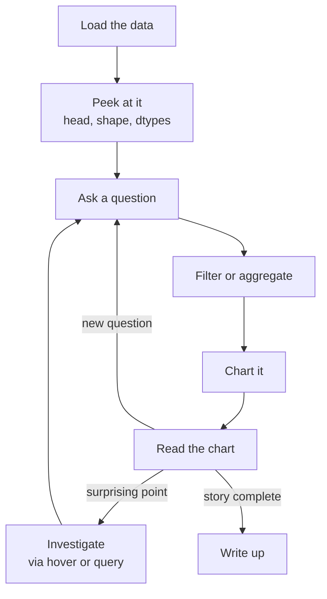

By now you've met all the chart-building pieces. This page is about
*the rhythm* of using them, the loop a real analyst follows when
sitting down with a new dataset. The loop is short, and once you
internalize it, you'll feel much more confident in front of an
unknown dataset.

<Figure
  slug="viz-exploratory-workflow-cutout"
  alt="The exploratory workflow, an isometric illustration"
/>

## The loop

It's an *iteration*. You make a chart, you read it, you ask the
next question. After 5-15 iterations, you usually have a story
worth sharing.

<Figure
  slug="viz-exploratory-workflow-loop-inline-cutout"
  alt="A ring of four benches with one tray travelling round, returning to its start changed"
  caption="Each chart raises the next question, which is why exploring is a loop."
/>

## Step 1: Load and peek

Whether the data comes from a CSV, a database, or a built-in
dataset, your first 30 seconds should always look the same:

<CodeBlock
  adapter="python"
  files={[
    {
      filename: "main.py",
      starterCode: `import plotly.express as px

df = px.data.tips()

# The standard "what do I have?" peek:
print("Shape:", df.shape)
print("Columns:", list(df.columns))
print("Dtypes:")
print(df.dtypes)
print()
print("Head:")
print(df.head())
print()
print("Numeric summary:")
print(df.describe())
`,
    },
  ]}
/>

This *single block* answers most "what is this dataset?" questions.
Make it a habit. Many bugs later in the analysis trace back to
*not noticing*, in the first 30 seconds, that one column had the
wrong dtype or one value was suspicious.

<Figure
  slug="viz-exploratory-workflow-step-1-load-inline-cutout"
  alt="A carton opened on a bench with its first few rows lifted out and set in a line"
  caption="Look at the first rows before plotting; most later bugs start here."
/>

## Step 2: Chart every numeric column

Not to tune anything yet. This pass is looking for the handful of shapes
that mean "stop and deal with me", and a summary table reports every one of
them as a perfectly reasonable set of numbers:

<Chart slug="chart-every-column" />

Before asking any specific question, just histogram every numeric
column. This is your "vibe check", you'll spot skewed
distributions, weird spikes, and outliers immediately.

<CodeBlock
  adapter="python"
  files={[
    {
      filename: "main.py",
      starterCode: `import plotly.express as px

df = px.data.tips()

for col in df.select_dtypes("number").columns:
    fig = px.histogram(
        df,
        x=col,
        template="simple_white",
        title=f"Distribution of {col}",
    )
    fig.show()
`,
    },
  ]}
/>

You'll see three histograms, one each for `total_bill`, `tip`, and
`size`. In about 15 seconds you know the distribution of every numeric
column.

## Step 3: Ask a real question

Now pick a real question. For the `tips` dataset, a natural one:
*"Do larger parties tip a higher percentage?"*

The chart almost writes itself once the question is precise:

<CodeBlock
  adapter="python"
  files={[
    {
      filename: "main.py",
      starterCode: `import plotly.express as px

df = px.data.tips()
df["pct"] = df["tip"] / df["total_bill"] * 100

fig = px.box(
    df,
    x="size",
    y="pct",
    template="simple_white",
    title="Tip percentage by party size",
    labels={"size": "Party size", "pct": "Tip percentage (%)"},
)
fig.show()
`,
    },
  ]}
/>

Read the chart: is there a pattern? Maybe smaller parties tip a
*bigger* percentage on average. Interesting. That observation is
the next question: *"Why? Is it because lunch parties are smaller
than dinner parties, and lunch tips are different?"*

## Step 4: Investigate surprising points

When the chart shows something you didn't expect, *investigate*
before believing it. Hover over the outlier. Filter to those rows
and look at them.

<CodeBlock
  adapter="python"
  files={[
    {
      filename: "main.py",
      starterCode: `import plotly.express as px

df = px.data.tips()
df["pct"] = df["tip"] / df["total_bill"] * 100

# Suspiciously high tip percentages
suspicious = df[df["pct"] > 30].sort_values("pct", ascending=False)
print(suspicious)
`,
    },
  ]}
/>

You found three rows with very high tip percentages, all tiny
bills. That's a real pattern: small bills tend to round up to "I
have a $5 minimum tip in my head." Good, you've turned an outlier
into an insight.

Step 4 earns its place because a single point can move a summary a long way:

<Chart slug="outlier-influence" />

## Step 5: Iterate until the story is done

Real exploratory analysis rarely ends with one chart. You'll cycle
through *many* iterations, and your DataFrame will grow with
derived columns, filtered slices, and reshaped views. That's
normal. Use a Jupyter notebook (or this page's CodeBlocks) and
*keep the iteration visible*, your future self will thank you.

## Exploratory vs presentation

The chart that found the answer and the chart that carries it, from the
same fourteen series:

<Chart slug="exploratory-vs-presentation" />

The charts you make *during* exploration are not the charts you
publish. Exploratory charts are quick, ugly, and iterative.
Presentation charts are slow, polished, and intentional.

A common mistake: showing your exploratory work in a meeting as if
it were finished. The audience needs the polished version, with
titles, labels, annotations, and *just the charts that matter*.

| Exploratory | Presentation |
| --- | --- |
| Many small charts | One or two important charts |
| Default labels | Hand-tuned titles and annotations |
| One per question | Each one polished |
| For *you* | For *them* |
| Throwaway | Lasts |

## A heuristic: "what would a stranger see?"

Every time you finish a chart, look at it as if you'd never seen
the data before. Can you tell what it's saying? Is the title
helpful? Are the axes labeled? Is the message obvious?

If not, you have one more iteration to do.

## Check your understanding

<MultipleChoice
  markdown={`What should you do **first** when you receive a new dataset?

- [o] Peek at it, **df.head()**, **df.shape**, **df.dtypes**, **df.describe()**, to understand what you've got.
  > The first 30 seconds of a new dataset should always be the same: peek at the structure. This catches dtype issues, missing values, outliers, and unexpected categories *before* you build analysis on top of bad assumptions.
- Filter to a small subset and stop there.
  > Filtering to a small subset can be a useful second step, but doing it without first peeking at the full dataset risks missing important context, like the fact that a critical column is all nulls or has the wrong dtype.
- Make the most beautiful chart you can.
  > Building a polished chart before understanding the data's shape, types, and missing values means your styling effort may be wasted on a chart that answers the wrong question or is built on flawed assumptions.
- Start a machine-learning model.
  > Building a model before examining the data is a common cause of poor results. Knowing the column types, distribution shapes, and missing-value patterns first allows you to make informed decisions about feature engineering and model choice.

Build the habit. Future-you will catch many bugs by looking at the first 5 rows of every new DataFrame.`}
/>

<MultipleChoice
  markdown={`Why is **histogramming every numeric column** a useful early step?

- [o] It gives a "vibe check" on the data, you'll spot skewed distributions, weird spikes, and outliers in about 15 seconds.
  > A grid of histograms is the visual equivalent of **df.describe()** but reveals shape, multimodality, and outliers that summary statistics hide. Make it a habit on every new dataset.
- It encrypts the data.
  > Histograms are visualization tools for exploring distributions; they have nothing to do with encryption or data security. Creating a histogram reads the data, it does not transform or protect it.
- It's required by Plotly.
  > Plotly Express does not require histograms as a prerequisite. Histogramming each numeric column is a best-practice workflow habit, not a technical requirement of the charting library.
- It computes correlations.
  > Correlation measures the linear relationship between two variables and requires at least two columns. A histogram shows the distribution of a single column; it does not compute correlations.

Histogram first, ask questions second.`}
/>

<MultipleChoice
  markdown={`What's the **key difference** between exploratory and presentation charts?

- Exploratory charts use Python, presentation charts use Excel.
  > The tool used is irrelevant to the exploratory vs presentation distinction. Both types can be made in Python or any other tool. The difference is in purpose, polish, and intended audience, not the software.
- Exploratory charts are interactive, presentation charts are static.
  > Interactivity is a feature, not a defining characteristic of either type. Presentation charts can be interactive (e.g., a Plotly chart in a report), and exploratory charts can be static. The real difference is audience and polish level.
- Exploratory charts use color, presentation charts don't.
  > Color is used in both exploratory and presentation charts whenever it aids understanding. Presentation charts often rely heavily on color to highlight key findings. The difference between the two types is about audience and polish, not whether color is present.
- [o] Exploratory charts are quick, many, and for *you*; presentation charts are polished, few, and for the *audience*.
  > The two have different audiences and different standards. Exploratory: throw away after each question. Presentation: titles, annotations, labels, hand-tuned. Mixing them up, showing exploratory work in a stakeholder meeting, is a common mistake.

Many analysts make 50 charts during exploration and ship 2.`}
/>
