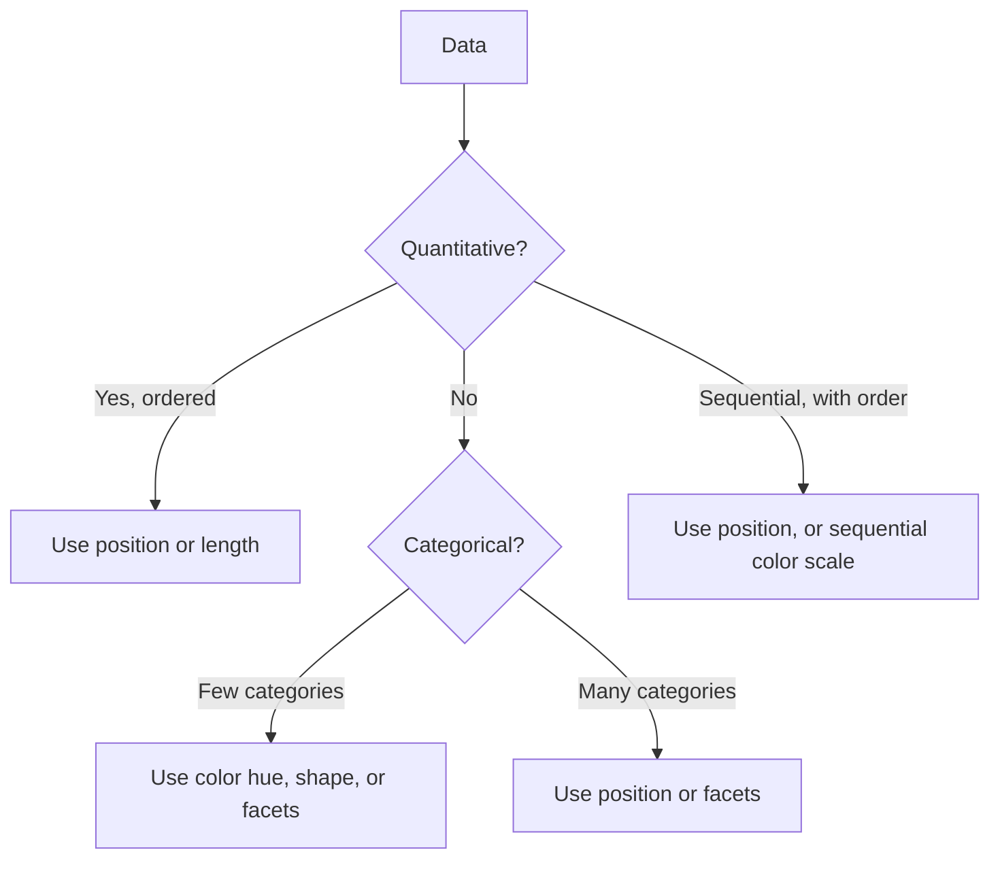

You have now met *encoding* twice, first as the formal definition
of what a visualization is, and then through the Cleveland-McGill
ranking of how *accurately* different encodings convey magnitude.
This page consolidates everything into a single working vocabulary.

The ranking those experiments produced, and the reason this course keeps
reaching for position and length first:

<Chart slug="encoding-accuracy" />


<Figure
  slug="viz-graphical-encodings-cutout"
  alt="Graphical encodings, an isometric illustration"
/>

By the end of this page you will be able to look at any chart and
say: "This chart maps column **A** to position-on-x, column **B**
to position-on-y, column **C** to color hue, and column **D** to
marker size." That sentence is the *anatomy* of a Plotly Express
call.

## The seven (or so) visual channels

One set of five numbers in all seven, ordered from the channel that is
read most accurately to the ones that carry no order at all:

<Chart slug="channels-same-number" />

Every chart that has ever been made encodes data through some
combination of these channels:

| Channel | What it shows well | Plotly Express argument |
| --- | --- | --- |
| **Position (x)** | Quantity or ordered category | `x="..."` |
| **Position (y)** | Quantity or ordered category | `y="..."` |
| **Length** | Quantity (bar charts) | implicit from `y` in `px.bar()` |
| **Color hue** | Categorical grouping | `color="..."` |
| **Color luminance** | Sequential quantity | `color="..."` with continuous scale |
| **Size** | Quantity (less precise) | `size="..."` |
| **Shape** | Categorical grouping (small N) | `symbol="..."` |
| **Facets** | Categorical grouping (split panels) | `facet_col="..."`, `facet_row="..."` |
| **Hover text** | Identification of a single point | `hover_name="..."`, `hover_data=[...]` |

That is essentially the entire Plotly Express argument vocabulary
for "what data maps to what." Master these and you can describe
any Plotly Express chart in one sentence.

<Figure
  slug="viz-graphical-encodings-seven-or-so-inline-cutout"
  alt="One measure shown seven ways along a bench, as height, length, angle, area, depth of ink, shape and position"
  caption="The same number can be drawn as length, angle, area, shade or position."
/>

## The grammar in action

Here is a four-encoding chart. Notice how each `=` is mapping a
*column name* to a *visual channel*.

<CodeBlock
  adapter="python"
  files={[
    {
      filename: "main.py",
      starterCode: `import plotly.express as px

df = px.data.gapminder().query("year == 2007")

fig = px.scatter(
    df,
    x="gdpPercap",  # position-x  -> GDP per capita
    y="lifeExp",  # position-y  -> life expectancy
    color="continent",  # color hue   -> continent (categorical)
    size="pop",  # size        -> population
    hover_name="country",
    log_x=True,
    size_max=55,
    template="simple_white",
    title="Gapminder 2007: four encodings in one chart",
    labels={
        "gdpPercap": "GDP per capita (USD, log)",
        "lifeExp": "Life expectancy (years)",
    },
)
fig.show()
`,
    },
  ]}
/>

Read the call out loud:

> Scatter plot. **GDP** on x. **Life expectancy** on y. Color by
> **continent**. Size by **population**.

The function call *is* the chart specification. There is nothing
hidden.

The idea that a chart *has* a specification, that its marks are a language
with rules rather than a matter of taste, is Jacques Bertin's. His 1967
*Sémiologie graphique* asks four questions of every visual channel, and none
of them is about what looks nice:

<Chart slug="bertin-1967-variables" />

Read down the *Quantitative* column. Exactly one channel lets a reader say
how much more, which is why almost every serious chart spends its position
and length on the thing that matters most. Read down *Ordered* and you have
the reason a rainbow scale on a continuous quantity is a mistake and not a
preference: hue has no order for a reader to consult.

## Which channel is right for which kind of data?

Data comes in several flavors, and they suit different channels:



A bit more formally, four common data types:

- **Quantitative** (numbers with a meaningful magnitude): age,
  temperature, dollars. Use **position** or **length**.
- **Ordinal** (ordered but not numeric): low / medium / high.
  Use **position** along a ranked axis, or a sequential color scale.
- **Nominal** (unordered categories): country, color, sport. Use
  **color hue**, **shape**, or **facets**.
- **Temporal** (time): dates and times. Use the **x-axis**, almost
  always. Time is sacred, keep it on x.

The same advice as a grid, with accuracy folded in alongside capability:

<Chart slug="channel-by-data-type" />


## Encodings tell a story about importance

Recall the perceptual ranking. **Whichever variable you put on
the most accurate channel implicitly becomes the most important
one in the chart.** The reader's eye will go to it first.

<Figure
  slug="viz-graphical-encodings-inline-cutout"
  alt="The same four data blocks shown four times across the frame, once as bar heights, once as dot positions, once as sizes and once as colors"
  caption="Whichever channel you choose decides how precisely the reader can compare."
/>

This means you can convey your *narrative* through encoding
choice. Consider three variations of the same scatter:

```python
# Variation A: GDP on x, life expectancy on y
px.scatter(df, x="gdpPercap", y="lifeExp", color="continent")

# Variation B: continent on x, life expectancy on y
px.scatter(df, x="continent", y="lifeExp", color="gdpPercap")

# Variation C: GDP on x, life expectancy on y, but use color for population
px.scatter(df, x="gdpPercap", y="lifeExp", color="pop")
```

Variation A tells a story about *the relationship between GDP and
life expectancy*. Variation B tells a story about *how continents
differ in life expectancy*. Variation C makes *population* the
prominent third variable. Same data; three different stories.

The commonest one, drawn: scaling a circle by radius rather than area
exaggerates every difference.

<Chart slug="bubble-area-vs-radius" />

## Encoding mistakes to avoid

- **Using color for a quantity that needs precise comparison.**
  Use position or length instead.
- **Using shape with more than ~6 categories.** People can't tell
  ●  ■  ▲  ▼  ◆  ★  ✦  ✚  apart in a crowded plot.
- **Doubling up two channels redundantly when one would do.** If
  you `color="continent"` AND `facet_col="continent"`, you've used
  two channels for one variable, wasteful and busy.
- **Using `size` for a *negative* meaning** (bigger dot = worse).
  The eye reads "bigger" as "more important" by default; flipping
  this confuses readers.

Two encodings that fail in specific, learnable ways. The first turns a count
into a row of icons, which lets a reader count exactly, right up until the
values stop being multiples of the unit:

<Chart slug="pictogram-unit-rounding" />

The second turns quantity into rectangle area, and the rectangles have
different shapes:

<Chart slug="treemap-area-precision" />

Use a treemap for structure and scale, where the answer is one or two obviously
large boxes, and not when the question is a ranking of similar values.

## A vocabulary check

Test yourself: read the chart below and say, in one sentence,
which column is mapped to which channel.

<CodeBlock
  adapter="python"
  datasets={[{ path: "palmer-penguins.csv", stageAs: "penguins.csv" }]}
  files={[
    {
      filename: "main.py",
      initCode: `import pandas as pd
import plotly.express as px

# Palmer Penguins, the friendly stand-in for the old iris dataset.
penguins = pd.read_csv("penguins.csv").dropna(
    subset=["bill_depth_mm", "bill_length_mm", "flipper_length_mm"]
)`,
      starterCode: `fig = px.scatter(
    penguins,
    x="bill_depth_mm",
    y="bill_length_mm",
    color="species",
    symbol="species",
    size="flipper_length_mm",
    template="simple_white",
    title="Penguins: four encodings",
    labels={"bill_depth_mm": "Bill depth (mm)", "bill_length_mm": "Bill length (mm)"},
)
fig.show()
`,
    },
  ]}
/>

The answer: **x = bill depth**, **y = bill length**, **color &
shape = species**, **size = flipper length**. The chart spends color
*and* shape on `species` (redundant encoding) which is sometimes
useful for color-blind viewers but can also be argued as wasted
ink. Tradeoffs.

## Check your understanding

<MultipleChoice
  markdown={`Which Plotly Express argument maps a column to **horizontal position**?

- **size="..."**
  > **size="column_name"** maps a column to marker size, encoding a quantitative variable through the area of each marker. It has no effect on horizontal or vertical position.
- **facet_col="..."**
  > **facet_col="column_name"** splits the chart into multiple side-by-side panels, one per unique value of that column. It controls panel layout, not the horizontal position of data within a panel.
- **color="..."**
  > **color="column_name"** maps a column to the color channel, which distinguishes categories by hue or encodes a continuous variable by color intensity. It does not control horizontal position.
- [o] **x="..."**
  > **x="column_name"** tells Plotly Express to use that column for the horizontal axis. Combined with **y**, these two arguments do most of the work in any scatter, line, or bar chart.

Position along x and y are the two most powerful encodings, use them for what matters most.`}
/>

<MultipleChoice
  markdown={`You want the reader to judge precisely **how price relates to square footage**. Which mapping puts *those two* variables on the **strongest** (most accurate) channels?

- Put **square footage** on size and **price** on color.
  > Size and color are both weak channels for precise comparison, so neither variable in the relationship is on a strong channel.
- Put **square footage** on x and **price** on color.
  > Price lands on color, a weak channel, so the price-vs-square-footage relationship can't be read from position. Only one of the two variables is on an axis.
- [o] Put **square footage** on x and **price** on y.
  > Position along x and y is the most accurate channel, so placing both variables of the relationship there gives the clearest read of how they relate.

A general rule: the two most important *quantitative* variables go on x and y.

*Hint: position (x and y) is the most accurate channel, so reserve it for the two variables in the relationship you most want the reader to judge.*`}
/>

<MultipleChoice
  markdown={`Which kind of data is **best** encoded with **color hue** (rainbow categorical colors like the default Plotly palette)?

- Continuous prices (e.g., \\$0 to \\$1,000,000).
  > Continuous quantities need an encoding that conveys gradual change, such as position on an axis or a sequential color intensity scale (light→dark). Categorical hue can only distinguish a handful of discrete groups, not represent a numeric continuum.
- [o] A small number (~3-7) of distinct, unordered categories such as continents or product lines.
  > Hue is excellent at saying "these dots belong together" for a handful of categories, and the eye distinguishes the colors instantly. For continuous or ordered data, prefer a sequential or diverging *intensity* scale instead of a categorical hue palette.
- An ordered scale of customer satisfaction (1-5).
  > An ordered scale is ordinal data, which is best encoded with a sequential or diverging color intensity scale, or position along an axis, so the viewer can perceive the ordering. Categorical hue treats each level as equally distinct, losing the rank information.
- Time stamps over a 100-year span.
  > Time is an ordered, continuous dimension best encoded on a position axis (the x-axis for a line chart). Using categorical hue for 100 years of timestamps would produce an unreadable rainbow with no indication of order or proximity.

Color hue = categories. Color intensity (light → dark) = quantity. Mixing them up is a classic beginner mistake.`}
/>

<MultipleChoice
  markdown={`You facet a Plotly Express chart by **facet_col="region"** *and* also color by **color="region"**. What is the result?

- The chart will fail to render.
  > Using the same column for both **facet_col** and **color** is perfectly valid syntax and will render without errors. The issue is not technical correctness but wasted visual channels.
- [o] The chart will work, but you've spent two visual channels on a single variable, a missed opportunity that often adds clutter without adding information.
  > Redundant encoding is sometimes deliberate (e.g., for colorblind accessibility), but it's frequently a wasted channel. Each facet panel will be a single color anyway, so the color encoding adds nothing new, and you've used up a channel you could have given to a different variable.
- Plotly will use a random color per facet.
  > Plotly assigns colors consistently according to the color scale and the unique values of the **color=** column. It does not use random colors, each value maps to the same color every time.
- Plotly will crash.
  > Plotly handles redundant encodings gracefully, it does not crash or produce an error. The result is a valid chart that happens to use two channels for the same variable instead of reserving one for a different variable.

Use each channel intentionally. If you have five variables, try to give each its own channel before doubling up.`}
/>
