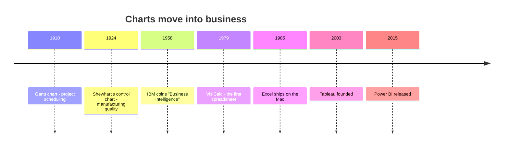
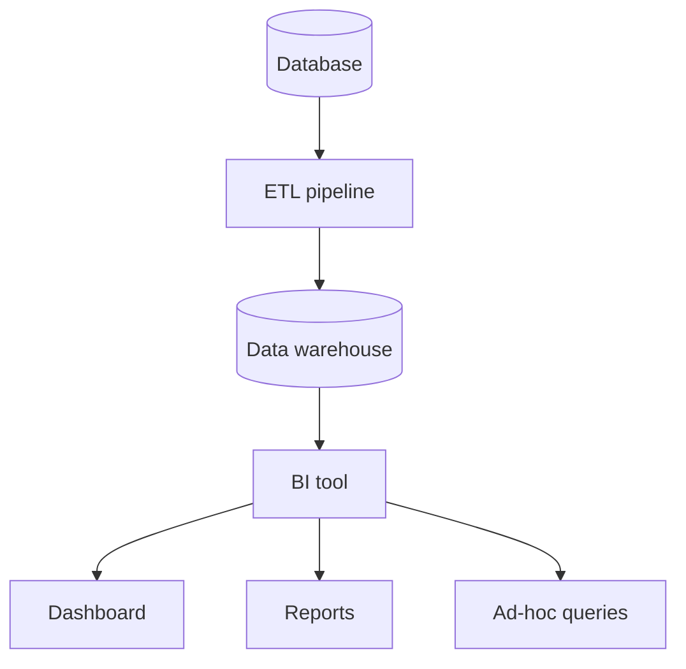
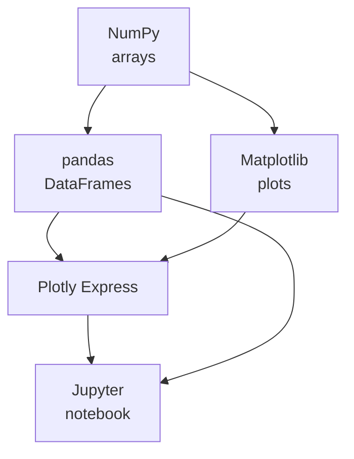

The course opened with a single, deliberately compressed history
page, because the goal was to get you making charts quickly. This is
the director's cut: the threads we trimmed, for readers who want the
longer version now that the mechanics are behind you. None of it is
required. All of it is true.

## Charts move into the corner office

The hundred years between Nightingale's rose diagram and your first
Plotly chart are the story of how visualization went from a rare,
dramatic gesture to the everyday language of business.

Statistical graphics spread out of public health and into commerce.
**Henry Gantt** invented his bar chart for project scheduling around
1910. **Walter Shewhart**, at Bell Labs in the 1920s, invented the
**control chart** to keep telephone components within spec, the
foundation of statistical process control and, eventually, Six
Sigma.



The phrase **"business intelligence"** was coined in a 1958 IBM paper
by Hans Peter Luhn, but it took 30 years to catch on. In the late
1980s, the Gartner analyst **Howard Dresner** popularized it to
describe software that let *managers*, not statisticians, ask
questions of corporate data. Its promise has never changed:

> **You should not need a programmer to ask a question of your data.**

## The decade of the spreadsheet

The single biggest event in the history of business visualization
was not a research breakthrough, it was **VisiCalc**, the first
electronic spreadsheet, released in **1979** for the Apple II.
Suddenly an accountant with no programming background could put
numbers in a grid, write a formula, and see the result update
instantly. **Lotus 1-2-3** followed in 1983; **Microsoft Excel**
arrived on the Mac in 1985 and on Windows soon after.

By the early 1990s, every business ran on Excel, and Excel could
draw charts. For a generation, "data visualization" *meant* "click
the Chart Wizard." This had two consequences:

- **Good:** hundreds of millions of people learned to think in rows,
  columns, and charts. The cultural infrastructure went mainstream.
- **Bad:** many chart types Excel made easy (3-D pie charts, garish
  gradient bars) are *exactly* the kinds of charts that mislead.

## The dashboard era, a good idea, executed badly

By the late 1990s, BI tools like **Cognos**, **Business Objects**,
and **MicroStrategy** sold expensive enterprise dashboards: a single
screen with many charts, arranged like a car's instrument panel.



The dashboard was a *good idea executed badly*, again and again, for
two decades. They became dumping grounds, a typical executive
dashboard in 2005 had 30+ charts on one screen and needed a written
guide to interpret. (We cover how to do better in the dashboard
chapter.)

In **2003**, three Stanford researchers, Chris Stolte, Pat Hanrahan,
and Christian Chabot, founded **Tableau**, based on a PhD thesis
about a "visual query language" called VizQL. Its pitch: drag a
column onto a chart and Tableau picks a reasonable visualization.
This was a turning point, **visualization stopped being the *output*
of an analysis and became the *interface* to the data.** Tableau,
Power BI (2015), and Looker now dominate corporate analytics.

These tools are wonderful for fast exploration and reporting, but
they make it hard to *reproduce* an analysis exactly six months
later, to *version-control* a chart the way you version code, or to
*customize* a chart beyond the menu options. For all those reasons, a
generation of analysts went back to *code*, and Python, with Plotly
Express, became the quiet workhorse.

## The libraries that made Python the language of analytics

A little more on the four pieces that turned Python from a scripting
language into an analytics platform.

- **NumPy** (2005) gave Python its first proper numerical array type.
  You could write `a + b` to add two arrays of a million numbers in a
  single line, running as fast as C. Every analytics library since is
  built on it.
- **pandas** (2008) added the **DataFrame**. If NumPy made Python
  *numerical*, pandas made it *tabular*.
- **Matplotlib** (2003) was deliberately designed to feel like
  MATLAB's plotting commands, so scientists could switch with zero
  friction. It is the grandparent of every Python visualization
  library, Plotly Express included.
- **Jupyter** (the IPython Notebook, 2010, by Fernando Pérez) made
  the notebook the default working environment for data scientists
  worldwide.



## Why Plotly's old API scared people off

The first Python wrapper around Plotly.js (plotly.py, around 2014)
was *powerful* but verbose. A simple bar chart looked like this:

```python
import plotly.graph_objects as go

fig = go.Figure()
fig.add_trace(go.Bar(x=["A", "B", "C"], y=[10, 7, 14], name="Counts"))
fig.update_layout(
    title="Counts by category",
    xaxis_title="Category",
    yaxis_title="Count",
    template="simple_white",
)
fig.show()
```

That is *nine lines* for the most basic chart in the world. The
verbosity scared off beginners and frustrated experts. Plotly Express
(2019) collapsed it to one meaningful line, which is exactly why
this course starts there. The `graph_objects` API is still under the
hood, and you can always drop down to it for the last 10% of control.

## D3, SVG, and the engine under the interactivity

The modern interactive era rests on two browser technologies, **SVG**
(scalable shapes that respond to mouse and touch) and **JavaScript**
(which reacts to input in real time). In 2011, **Mike Bostock**
released **D3.js**, a library for binding data to SVG elements. D3
became the foundation of nearly every interactive newspaper graphic
for a decade (New York Times, FiveThirtyEight, The Pudding).

D3 was the *engine* of the interactive era, but an engine that
required a mechanic; a single chart could take hundreds of lines.
Plotly.js is one of the friendlier wrappers built on top of it, which
is why, when you make a Plotly chart in Python, you are quietly
standing on the D3 stack.

## Linked views and brushing

A more advanced interactive idea is **linked views** (or **linked
brushing**): two or three charts side by side where selecting a
subset in one *highlights or filters* the same rows in the others.
The same observation gets looked at through several lenses at once.

Plotly Express supports a piece of this through **facets**, and full
dashboard frameworks like **Dash** support true selection events.
You won't need linked brushing for most beginner analysis, but it's
worth knowing the term, you'll meet it again in any serious
dashboard course.
