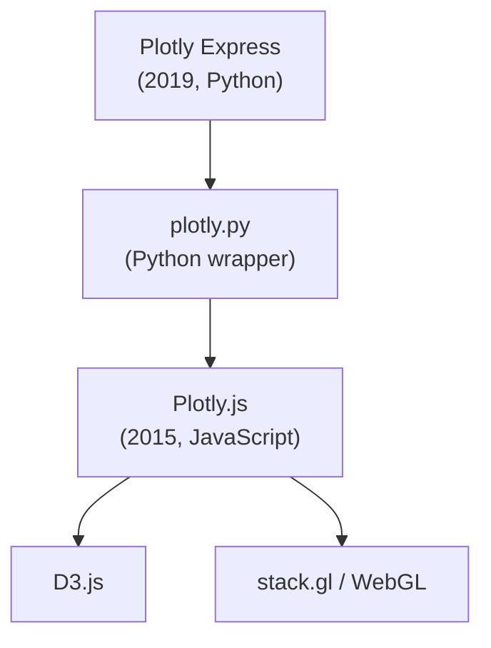

The last page ended with a teaser: an interactive chart written in a
handful of lines of Python. This page explains *why this course uses
Python and Plotly Express at all* — and gives you the shape of the
tool before we slow down and learn it properly.

<svg
  viewBox="0 0 640 240"
  role="img"
  aria-label="Three nested translucent containers: a large company, a library inside it, and at the core a bright capsule with rising dots — Plotly Express inside Plotly inside Plotly"
  style={{ display: "block", width: "100%", maxWidth: "640px", height: "auto", margin: "2.5rem auto" }}
>
  <g style={{ color: "var(--ds-blue-500)" }} fill="currentColor">
    <rect x="80" y="30" width="480" height="180" rx="24" fillOpacity="0.07" />
    <circle cx="106" cy="52" r="5" fillOpacity="0.3" />
    <rect x="150" y="60" width="340" height="120" rx="20" fillOpacity="0.13" />
    <circle cx="174" cy="80" r="5" fillOpacity="0.45" />
    <rect x="230" y="90" width="180" height="60" rx="30" />
  </g>
  <g style={{ color: "var(--ds-white)" }} fill="currentColor">
    <circle cx="272" cy="126" r="6" />
    <circle cx="304" cy="118" r="6" />
    <circle cx="336" cy="110" r="6" />
    <circle cx="368" cy="102" r="6" />
  </g>
  <g style={{ color: "var(--ds-yellow-500)" }} fill="currentColor">
    <circle cx="437" cy="120" r="6" />
  </g>
  <g style={{ color: "var(--ds-green-500)" }} fill="currentColor">
    <circle cx="522" cy="160" r="4" fillOpacity="0.6" />
    <circle cx="534" cy="190" r="4" fillOpacity="0.4" />
  </g>
</svg>

## Why Python won analytics

Walk into any data team today and ask "what language do you use?"
and the most common answer, by a wide margin, is **Python**. This was
not obvious twenty years ago. In 2005, serious analysts used SAS,
SPSS, Stata, R, or MATLAB; Python was a "scripting language" with no
good numerical library, no DataFrame, and no notebook. Three
libraries — and a notebook — changed that between 2005 and 2014:

- **NumPy** (2005) gave Python fast numerical arrays.
- **pandas** (2008, by Wes McKinney) added the **DataFrame** — a
  labeled, in-memory table that behaves like a spreadsheet but scales
  to millions of rows. The DataFrame is the **central object** of the
  rest of this course; every chart starts with one.
- **Matplotlib** (2003) gave Python its first real plotting library.
- **Jupyter** (the notebook, 2010) let you write code and prose side
  by side with charts appearing inline.

Python "won" not because it was the *best* at any one thing, but
because it was *good enough at everything* — pipelines, machine
learning, web apps, and visualization in one language. Once every
tool had a Python interface, *not* using Python became the costly
choice. (The fuller version of this story lives in the
[Interesting discussions](/courses/intro-data-viz-plotly/interesting-discussions)
appendix.)

## What "Plotly" actually means

The name "Plotly" gets used for three different things. Let's be
precise:

- **Plotly** — a company founded in **Montréal in 2013**. Its
  original product was a web app for making charts collaboratively.
- **Plotly.js** — an open-source JavaScript charting library the
  company released in **2015**, built on top of **D3.js** and
  **stack.gl**. It is what actually *renders* every Plotly chart you
  see.
- **plotly.py** — the Python wrapper around Plotly.js.
- **Plotly Express** — a much simpler, higher-level API on top of
  plotly.py, released in **2019** by Nicolas Kruchten.



For most of this course, "Plotly" means **Plotly Express**. It is
the gateway. Almost every chart you need is one line of it. When you
outgrow it, you drop down to `plotly.graph_objects` for full control
— but that day is months away.

## One line, one chart

The pitch of Plotly Express is radical and simple:

> **A single function call, with a DataFrame as input, should
> produce a publication-quality, interactive chart.**

That call always has the same shape: data first, then *encodings*
(which column maps to which visual property), then styling.

```python
fig = px.bar(
    df,                      # the data
    x="category",            # what goes on x
    y="count",               # what goes on y
    color="group",           # optional: color encoding
    title="My chart",        # optional: title
    template="simple_white", # optional: visual theme
)
fig.show()
```

Try it — and notice how the code reads almost like a *sentence about
the data*:

<CodeBlock
  adapter="python"
  files={[
    {
      filename: "main.py",
      initCode: `import pandas as pd
import plotly.express as px

df = pd.DataFrame({
    "category": ["A", "B", "C", "D", "E"],
    "count": [10, 7, 14, 4, 11],
})`,
      starterCode: `fig = px.bar(
    df,
    x="category",
    y="count",
    title="Counts by category",
    template="simple_white",
)
fig.show()
`,
    },
  ]}
/>

The chart that came out is *fully interactive* — hover, zoom,
download — for free. There is no trade-off for the brevity. (For
comparison, the equivalent chart in the older `graph_objects` API
took about nine lines; that history is in the appendix.)

## Three design choices that make it different

1. **It takes a DataFrame and *column names*,** not raw arrays. You
   write `x="category"`, not `x=df["category"]`.
2. **Encodings are arguments.** Want color? Pass `color="..."`. Want
   small-multiple panels? Pass `facet_col="..."`. The *grammar* is
   uniform across every chart type.
3. **Charts are interactive by default.** You don't opt in.

That third point is the heart of why interactivity matters for
*analysis*, not just for showing off. A static chart can only answer
the questions the author anticipated. An interactive chart lets the
*reader* hover, filter, and zoom to ask questions the author never
thought of — and lets *you*, while writing the analysis, catch a bug
or an outlier in seconds. **Treat interactivity as your default
analytical surface**, hovering and clicking every chart while you
build it. That single habit will make you faster.

## Plotly Express in the ecosystem

You'll hear about other Python chart libraries. A fair summary:

- **Matplotlib** — foundational, static, total control, verbose.
  Great for publication figures.
- **Seaborn** — statistical charts with beautiful defaults; built on
  Matplotlib; not interactive.
- **Altair** — declarative grammar-of-graphics, interactive web
  output.
- **Bokeh** — another interactive web library.
- **Plotly Express** — the easiest path from DataFrame to
  *interactive* chart. This course's choice.

There is no single "best" library. Plotly Express is the right
*beginner* library because it gives you the modern interactive
experience with the fewest lines of code. Once you're comfortable,
branch out.

## A peek at the range

Here is a denser chart to show what one Plotly Express call can do —
the famous Gapminder bubble chart, mapping four variables at once.
We'll build up to this; for now, just hover the big bubbles.

<CodeBlock
  adapter="python"
  files={[
    {
      filename: "main.py",
      initCode: `import plotly.express as px

# A built-in dataset of life expectancy & GDP for 142 countries.
df = px.data.gapminder().query("year == 2007")`,
      starterCode: `fig = px.scatter(
    df,
    x="gdpPercap",
    y="lifeExp",
    size="pop",
    color="continent",
    hover_name="country",
    log_x=True,
    size_max=55,
    template="simple_white",
    title="Life expectancy vs GDP per capita (2007)",
    labels={
        "gdpPercap": "GDP per capita (USD, log)",
        "lifeExp": "Life expectancy (years)",
    },
)
fig.show()
`,
    },
  ]}
/>

That density of meaning per line of code — four variables, a log
scale, labeled axes, full interactivity — is exactly why Plotly
Express is the right tool to start with.

## Check your understanding

<MultipleChoice
  markdown={`Which Python library introduced the **DataFrame** — a labeled, spreadsheet-like table that has become the central object of Python data analysis?

- NumPy
  > NumPy (2005) introduced efficient numerical arrays, but its primary structure is a homogeneous multidimensional array, not a labeled table with named columns. The DataFrame came later, with pandas.
- Matplotlib
  > Matplotlib (2003) is a plotting library built on NumPy. Its focus is rendering charts, not storing tabular data with named columns.
- [o] pandas
  > pandas (2008, by Wes McKinney) brought the DataFrame to Python, building on NumPy's arrays. Plotly Express expects DataFrames as input, so pandas is the workhorse you'll use throughout this course.
- Jupyter
  > Jupyter is a notebook environment for writing code and prose side by side. It provides an interactive interface but did not introduce the DataFrame data structure.

Almost every page of this course starts by loading data into a pandas DataFrame.`}
/>

<MultipleChoice
  markdown={`What is the relationship between **Plotly Express** and **Plotly.js**?

- They are two unrelated libraries that happen to share a name.
  > They are directly related: Plotly Express was built by the same organization as Plotly.js, and every chart Plotly Express produces is ultimately rendered by the Plotly.js engine.
- Plotly Express is a different programming language.
  > Plotly Express is a Python library; it builds objects that are serialized and passed to Plotly.js for rendering in the browser.
- [o] Plotly Express is a high-level Python API on top of plotly.py, which wraps the Plotly.js JavaScript library.
  > When you call **px.bar(...)**, Plotly Express builds a configuration object, plotly.py serializes it, and Plotly.js renders the interactive chart in the browser. You write Python; the browser executes JavaScript — invisibly.
- Plotly.js is a fork of Plotly Express.
  > The dependency runs the other way: Plotly Express (2019) was built on top of plotly.py and Plotly.js (2015). Plotly.js is not derived from Plotly Express.

This three-layer stack is invisible most of the time. You'll only notice it when something breaks.`}
/>

<MultipleChoice
  markdown={`Why is **interactivity** more than a cosmetic feature for analytical work?

- It makes charts look more professional.
  > Professionalism is a side effect; a static chart can look just as polished but cannot support the interactive exploration loop that changes how analysis is done.
- It allows charts to animate.
  > Animation is one specific form of interactivity, not the core benefit. The fundamental value is that the viewer can explore the data themselves rather than being limited to what the author anticipated.
- [o] It lets the *viewer* ask follow-up questions — hover for detail, filter to subsets, zoom into regions — without re-running code.
  > Interactivity changes the *cognitive workload* of analysis. A static chart answers only the questions the author anticipated; an interactive chart answers questions the viewer discovers on the spot — and helps you catch bugs and outliers as you build.
- It is required by web browsers.
  > Browsers have no such requirement; static images display perfectly. Interactivity is a deliberate enhancement, not a prerequisite.

The exploratory loop "overview → zoom → filter → detail" is dramatically faster with interactive charts than with static ones.`}
/>

<MultipleChoice
  markdown={`What is the **distinguishing design idea** of Plotly Express compared to the older **plotly.graph_objects** API?

- It is faster than plotly.graph_objects.
  > Both APIs produce the same Plotly.js output; rendering speed is identical. Plotly Express trades fine-grained control for brevity, not performance.
- It produces static images.
  > Plotly Express charts are fully interactive by default — pannable, zoomable, hoverable — just like charts made with \`graph_objects\`.
- [o] It is a high-level wrapper that takes a DataFrame and column names, producing a complete chart in essentially one function call.
  > One line of **px.bar(df, x=..., y=...)** replaces about nine lines of **graph_objects** code, and the chart is just as interactive. When you outgrow Plotly Express, you can drop down to **graph_objects** for fine control.
- It requires a paid Plotly subscription.
  > Both Plotly Express and \`graph_objects\` are free, open-source libraries under the MIT license; no subscription is required.

Both are free and open source. Plotly Express is simply the easier front door.`}
/>
