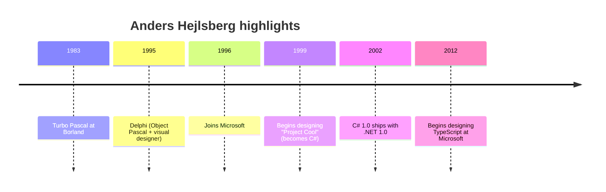

*This is one of the optional deep-dive chapters promised in
[The Road to C#](./the-road-to-csharp), the full story of the
person behind the language.*

<Figure
  slug="mcs-birth-of-csharp-cutout"
  alt="The birth of C#, an isometric illustration"
/>

Languages don't just appear. They are designed by people, and the
*tastes* of those people end up baked into every line of code their
language touches. C# is no exception. To understand why C# looks
the way it does, it helps to know the story of its chief designer:
**Anders Hejlsberg**.

<Figure
  slug="mcs-anders-turbo-pascal-cutout"
  alt="A single floppy disk, a boxy home computer with a stopwatch beside it, and one finished program block"
  caption="Turbo Pascal, 1983: fifty dollars, one floppy, and a compiler faster than its rivals could load."
/>

## A short biography of Anders

Anders Hejlsberg is a Danish software engineer. He started his
career in the early 1980s writing compilers, small programs that
translate human-readable source code into machine code.

His first famous product was **Turbo Pascal**, released by Borland
in 1983. Turbo Pascal was extraordinary for its time: it cost about
$50, fit on a single floppy disk, and could compile a program
faster than other compilers could even *load*. Generations of
students learned to program with it.

In 1995, Anders led the design of **Delphi** at Borland, an
object-oriented version of Pascal married to a visual GUI designer.
Delphi was beloved for the same reasons as Turbo Pascal: fast
compiles, productive tooling, real power without C++'s sharp edges.

In 1996, Microsoft hired him. He worked on Visual J++ (Microsoft's
Java) and the **Windows Foundation Classes**, and then, when the
Java relationship collapsed, he was given a much bigger mandate:
design a new flagship language for the .NET runtime.

## What Anders brought to C#

You can see Anders's fingerprints all over C#. He had spent fifteen
years thinking about three things:

1. **Compiler ergonomics.** A language should compile *fast* and
   give *useful* error messages.
2. **IDE-first design.** A language should be easy for a tool to
   analyze, so that the editor can offer autocomplete, refactoring,
   and live error squiggles.
3. **Pragmatism over purity.** A language should pick the right
   trade-off for everyday work, not chase theoretical elegance.

<Figure
  slug="mcs-anders-and-birth-of-csharp-short-biography-anders-inline-cutout"
  alt="A workbench carrying three finished machines in a row, each built by the same hand and clearly related"
  caption="Turbo Pascal, Delphi and C# came from one designer, and it shows."
/>

These are *not* the values of every language designer. Some
languages chase mathematical purity. Some chase raw performance.
C# chases **developer productivity on big, long-lived projects**.
That's what its DNA was for.

## The values baked into C#

Here are the values, plus a tiny example of what each one feels
like in practice.

### Strong static typing, but ergonomic

Variables have types, and the compiler checks them. But you don't
have to repeat yourself when the compiler can figure it out.

<CodeBlock
  adapter="csharp"
  files={[
    {
      filename: "main.cs",
      starterCode: `using System;
using System.Collections.Generic;

// Full type written out:
List<string> namesA = new List<string>();

// Same thing, more ergonomic, 'var' lets the compiler infer the type:
var namesB = new List<string>();

namesA.Add("Anders");
namesB.Add("Anders");

Console.WriteLine(namesA[0]);
Console.WriteLine(namesB[0]);

// The compiler still knows namesB is List<string>:
// namesB.Add(42);  // would not compile
`,
    },
  ]}
/>

That's the Hejlsberg-style trade-off in miniature: keep the safety
of static types, but don't make the programmer suffer for it.

### Tooling-friendly syntax

C#'s syntax is designed so that an editor can almost always tell
what you mean even when you're halfway through typing. That is why
C# in Visual Studio or Rider has such powerful autocomplete and
refactoring, the language itself was built to be easy to analyze.

### Pragmatic feature additions

C# has shipped new versions roughly every year or two, each one
adding features that solve real, common problems. Some highlights:

| Version | Year | Notable additions |
| --- | --- | --- |
| 1.0 | 2002 | Classes, structs, interfaces, generics-less collections |
| 2.0 | 2005 | **Generics**, nullable value types, iterators |
| 3.0 | 2007 | **LINQ**, lambdas, `var`, extension methods |
| 5.0 | 2012 | **`async` / `await`** |
| 6.0 | 2015 | String interpolation, `nameof`, expression-bodied members |
| 7+  | 2017+ | Tuples, pattern matching, ref locals |
| 8.0 | 2019 | **Nullable reference types**, default interface methods |
| 9–12 | 2020+ | Records, top-level statements, file-scoped namespaces |

Each addition was scoped to fix a *real* pain. (And many of them
were borrowed back into Java a few years later, the influence has
flowed both ways.)

## A quick tour of "modern C# feel"

The example below uses several of these modern features. Don't
worry about every line, just notice how clean and *readable* the
program looks compared with, say, C++ or older Java.

<CodeBlock
  adapter="csharp"
  files={[
    {
      filename: "main.cs",
      starterCode: `using System;
using System.Collections.Generic;
using System.Linq;

// Top-level statements: no class wrapping required.
var people = new List<Person> {
    new Person("Alice", 30),
    new Person("Bob", 17),
    new Person("Cara", 45),
    new Person("Dan", 12),
};

// LINQ: a query-style transformation of the list.
var adults = people.Where(p => p.Age >= 18).OrderBy(p => p.Name).Select(p => $"{p.Name} ({p.Age})").ToList();

Console.WriteLine("Adults:");
foreach (var line in adults)
    Console.WriteLine($"  {line}");

// 'record' makes a small immutable value type in one line.
record Person(string Name, int Age);
`,
    },
  ]}
/>

Five features from five different C# versions appear in that tiny
program: `var`, lambdas (`p => ...`), LINQ (`Where()`, `Select()`),
`record`, and top-level statements.

## Anders today

Anders is still active at Microsoft. After C#, he led the design of
**TypeScript**, a typed superset of JavaScript that has become
just as influential in the web world as C# was in the .NET world.
Many design choices in TypeScript will feel familiar after this
course: structural typing, generics, nullable types, ergonomic
inference. The same hand drew both languages.

<Figure
  slug="mcs-anders-and-birth-of-csharp-anders-brought-c-inline-cutout"
  alt="Parts lifted from two older machines and fitted into a new one on the bench between them"
  caption="Ideas from the older languages were carried straight into C#."
/>

## Why this matters for you

You have just learned a language whose primary author cared about
*ergonomics*, *tooling*, and *real-world productivity*. Whenever a
piece of C# syntax felt surprisingly convenient during this course,
`var`, `async`, pattern matching, records, there was usually a
story behind it: a real frustration in earlier languages, and a
deliberate choice in C# to make it nicer.

C# is not a *minimal* language. It is a *generous* one, deliberately
shaped by someone who has spent forty years watching people write
software.

## Test your understanding

<MultipleChoice
  markdown={`Which of these is *most* characteristic of Anders Hejlsberg's design philosophy?

- Minimalism, keep the language as small as possible
  > C# is the opposite, it has grown a lot of pragmatic features over time.
- Direct memory control, like C
  > C# leaves low-level memory control to the runtime, deliberately.
- Mathematical purity above all else
  > That's closer to languages like Haskell. C# is explicitly pragmatic.
- [o] Pragmatic productivity: strong static typing, but ergonomic syntax and great tooling support
  > You can trace this philosophy from Turbo Pascal through Delphi, C#, and TypeScript.`}
/>

<MultipleChoice
  markdown={`What does \`var\` do in C#?

- It declares a variable that has no type
  > Every C# variable has a type, including \`var\` ones.
- [o] It tells the compiler to infer the variable's type from the expression on the right, while still treating the variable as statically typed
  > \`var x = "hi";\` is exactly equivalent to \`string x = "hi";\`, the compiler figures it out.
- It's the same as \`dynamic\`
  > \`dynamic\` defers type checks to runtime; \`var\` does not.
- It declares a global variable
  > It has nothing to do with scope.`}
/>
