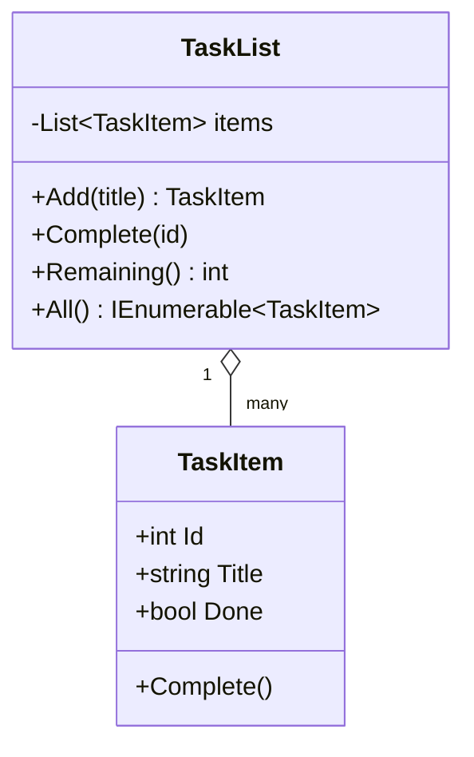

Time to put it all together. In this capstone you'll build a
small **task tracker** — the simplest possible to-do app, organized
across multiple files just like real C# code.

You'll touch nearly every concept from the course:

- **Classes** to model a `TaskItem` and a `TaskList`
- **Encapsulation** so the list owns its rules
- **Collections** (`List<TaskItem>`) for storage
- **Methods** for behavior
- **Error handling** for invalid IDs
- **Polymorphism**? Not this time — keep it simple

You'll write the two domain files. `Program.cs` will exercise them
in a fixed scenario and your job is to make the output match.

<svg
  viewBox="0 0 640 230"
  role="img"
  aria-label="A small board with to-do, doing, and done columns — yellow tasks waiting, a blue one in progress, and green ones ticked off with check strokes — the capstone task tracker"
  style={{ display: "block", width: "100%", maxWidth: "640px", height: "auto", margin: "2.5rem auto" }}
>
  <rect x="110" y="30" width="420" height="170" rx="16" fill="currentColor" opacity="0.07" />
  <g
    fill="none"
    stroke="currentColor"
    strokeWidth="2"
    strokeLinecap="round"
    opacity="0.15"
  >
    <path d="M250 46 V 184" />
    <path d="M390 46 V 184" />
  </g>
  <g style={{ color: "var(--ds-yellow-500)" }} fill="currentColor">
    <rect x="134" y="66" width="84" height="16" rx="8" fillOpacity="0.55" />
    <rect x="134" y="96" width="66" height="16" rx="8" fillOpacity="0.55" />
    <rect x="134" y="126" width="76" height="16" rx="8" fillOpacity="0.35" />
  </g>
  <g style={{ color: "var(--ds-blue-500)" }} fill="currentColor">
    <rect x="274" y="66" width="88" height="16" rx="8" fillOpacity="0.85" />
    <rect x="274" y="96" width="50" height="16" rx="8" fillOpacity="0.25" />
  </g>
  <g style={{ color: "var(--ds-green-500)" }} fill="currentColor">
    <rect x="414" y="66" width="76" height="16" rx="8" fillOpacity="0.5" />
    <rect x="414" y="96" width="60" height="16" rx="8" fillOpacity="0.5" />
    <g
      fill="none"
      stroke="currentColor"
      strokeWidth="3"
      strokeLinecap="round"
      strokeLinejoin="round"
    >
      <path d="M500 75 L 505 81 L 515 67" />
      <path d="M500 105 L 505 111 L 515 97" />
    </g>
  </g>
</svg>

## The design



Each `TaskItem` knows about itself. `TaskList` owns the collection
and the rules: assigning IDs, marking by ID, throwing if the ID
isn't there.

## The scenario `Program.cs` will run

The driver does this:

1. Create a `TaskList`.
2. Add three tasks: "Buy milk", "Write course", "Sleep".
3. Mark the first two as complete using their IDs.
4. Print `remaining = N` where N is how many items are NOT done.
5. Print each task as `[X] id: title` (X is `x` if done, space if
   not).
6. Try to complete an unknown ID `999` and print `not found` when
   it throws.

Expected output (exact):

```
remaining=1
[x] 1: Buy milk
[x] 2: Write course
[ ] 3: Sleep
not found
```

## The challenge

<ChallengeCard
  adapter="csharp"
  title="Task tracker"
  instructions={`Implement \`TaskItem\` and \`TaskList\` so \`Program.cs\` produces the expected output.

Requirements:

- \`TaskItem\` has an \`Id\` (int), a \`Title\` (string), and \`Done\` (bool).
- \`TaskItem.Complete()\` sets \`Done\` to true.
- \`TaskList.Add(string title)\` returns the new \`TaskItem\`. IDs start at 1 and increment.
- \`TaskList.Complete(int id)\` marks the matching task done; throws \`KeyNotFoundException\` if no task with that ID exists.
- \`TaskList.Remaining()\` returns the number of tasks that aren't done.
- \`TaskList.All()\` returns the tasks in insertion order.

Expected output:

\`\`\`
remaining=1
[x] 1: Buy milk
[x] 2: Write course
[ ] 3: Sleep
not found
\`\`\``}
  entryFilename="Program.cs"
  files={[
    {
      filename: "Program.cs",
      starterCode: `using System;
using System.Collections.Generic;

var list = new TaskList();
list.Add("Buy milk");
list.Add("Write course");
list.Add("Sleep");

list.Complete(1);
list.Complete(2);

Console.WriteLine($"remaining={list.Remaining()}");

foreach (var t in list.All())
{
    var mark = t.Done ? "x" : " ";
    Console.WriteLine($"[{mark}] {t.Id}: {t.Title}");
}

try
{
    list.Complete(999);
    Console.WriteLine("oops");
}
catch (KeyNotFoundException)
{
    Console.WriteLine("not found");
}
`,
    },
    {
      filename: "TaskItem.cs",
      starterCode: `public class TaskItem
{
    // TODO: Id, Title, Done, Complete()
}
`,
      solutionCode: `public class TaskItem
{
    public int Id { get; }
    public string Title { get; }
    public bool Done { get; private set; }

    public TaskItem(int id, string title)
    {
        Id = id;
        Title = title;
        Done = false;
    }

    public void Complete() => Done = true;
}
`,
    },
    {
      filename: "TaskList.cs",
      starterCode: `using System.Collections.Generic;

public class TaskList
{
    // TODO: implement
    public TaskItem Add(string title) => null!;
    public void Complete(int id)
    {
    }
    public int Remaining() => 0;
    public IEnumerable<TaskItem> All() => System.Array.Empty<TaskItem>();
}
`,
      solutionCode: `using System.Collections.Generic;

public class TaskList
{
    private readonly List<TaskItem> _items = new();
    private int _nextId = 1;

    public TaskItem Add(string title)
    {
        var item = new TaskItem(_nextId++, title);
        _items.Add(item);
        return item;
    }

    public void Complete(int id)
    {
        foreach (var t in _items)
        {
            if (t.Id == id)
            {
                t.Complete();
                return;
            }
        }
        throw new KeyNotFoundException($"no task with id {id}");
    }

    public int Remaining()
    {
        int n = 0;
        foreach (var t in _items)
            if (!t.Done)
                n++;
        return n;
    }

    public IEnumerable<TaskItem> All() => _items;
}
`,
    },
  ]}
  tests={[
    {
      id: "scenario",
      name: "Matches the expected output exactly",
      expect: {
        stdoutLines: [
          "remaining=1",
          "[x] 1: Buy milk",
          "[x] 2: Write course",
          "[ ] 3: Sleep",
          "not found",
        ],
        stdoutLinesExact: true,
      },
    },
  ]}
/>

## What you just exercised

Even at this small scale, you used:

- **Encapsulation**: `Done` has a private setter, so only `Complete()`
  can flip it.
- **Object identity**: each `TaskItem` is a distinct object on the
  heap; the list holds references.
- **Collections**: a `List<TaskItem>` is the natural choice for
  "ordered, indexed, growable."
- **Error handling**: unknown IDs throw, callers can react.
- **Modularity**: three files, one class each, each with one job.

That's the *whole shape* of professional C# code — just bigger.

## Stretch goals (if you're enjoying yourself)

If you'd like to push further on your own (no tests for these,
just for fun):

1. Add a `Remove(int id)` method that deletes a task.
2. Add a `Rename(int id, string newTitle)` method.
3. Add a `Priority` (enum: `Low`, `Normal`, `High`) and sort
   `All()` by priority then by ID.
4. Add an `IDictionary<int, TaskItem>` index so lookups by ID don't
   require scanning the list.
