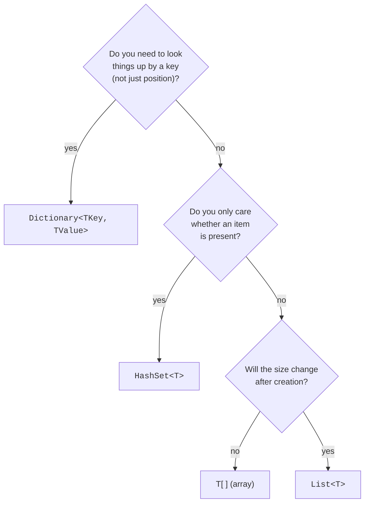

A single variable holds one value. Real programs need to organize
*lots* of values: a list of users, a phone book keyed by name, a
set of seen URLs, a grid of game tiles.

<Figure
  slug="mcs-collections-cutout"
  alt="Collections and data organization, an isometric illustration"
/>

C# ships with a small set of go-to **collections** that cover 95%
of everyday needs. Picking the right one for a given problem is
one of the most valuable habits you can build.

<Figure
  slug="mcs-collections-inline-cutout"
  alt="Four different containers standing in a row, one a plain rail of slots, one a drawstring bag whose contents lie in no order, one a channel with a gate at each end, one a wall of small drawers each with a keyhole"
  caption="List, set, queue or dictionary: each is shaped for a different question."
/>

## The big four

| Collection                  | Think of it as                       | Lookup by              |
|-----------------------------|---------------------------------------|------------------------|
| `T[]` (array)               | Fixed-size sequence                   | Position (index)       |
| `List<T>`                   | Growable sequence                     | Position (index)       |
| `Dictionary<TKey, TValue>`  | Phone book / map                      | Key                    |
| `HashSet<T>`                | Bag of distinct items                 | Membership ("is X in here?") |

Each one is good at something the others are bad at.

## Arrays: fixed-size, indexed

<CodeBlock
  adapter="csharp"
  files={[
    {
      filename: "main.cs",
      starterCode: `using System;

int[] scores = { 91, 84, 77, 65 };

Console.WriteLine(scores[0]); // 91, first element
Console.WriteLine(scores[3]); // 65, last element
Console.WriteLine(scores.Length);

scores[2] = 80;
foreach (var s in scores)
    Console.WriteLine(s);
`,
    },
  ]}
/>

Arrays have a fixed size at creation time. They're fast and
lightweight, but you can't `Add()` or `Remove()`.

<Figure
  slug="mcs-collections-arrays-fixed-size-inline-cutout"
  alt="A rail with exactly six slots, all filled, and a seventh block waiting with nowhere to go"
  caption="An array's size is fixed when it is created, so the seventh item has nowhere to go."
/>

## `List<T>`: the everyday sequence

If you don't know exactly how many items you'll have, reach for
`List<T>`.

<Figure
  slug="mcs-collections-list-t-everyday-inline-cutout"
  alt="A rail that grows one more slot as a seventh block is set down on it"
  caption="A `List<T>` grows a slot whenever you add one more item."
/>

<CodeBlock
  adapter="csharp"
  files={[
    {
      filename: "main.cs",
      starterCode: `using System;
using System.Collections.Generic;

var names = new List<string>();
names.Add("Alice");
names.Add("Bob");
names.Add("Cara");

Console.WriteLine($"count = {names.Count}");
Console.WriteLine(names[1]); // "Bob"

names.Remove("Bob");
names.Insert(0, "Zoe");

foreach (var n in names)
    Console.WriteLine(n);
`,
    },
  ]}
/>

Mental model: a `List<T>` is "an array that grows for you." It
*is* backed by an array internally; when you add too many items,
it allocates a bigger one and copies the old contents.

## `Dictionary<TKey, TValue>`: a phone book

A dictionary maps **keys** to **values**. Lookup by key is fast,
even for a dictionary with millions of entries.

<CodeBlock
  adapter="csharp"
  files={[
    {
      filename: "main.cs",
      starterCode: `using System;
using System.Collections.Generic;

var phoneBook = new Dictionary<string, string> {
    ["Alice"] = "555-1234",
    ["Bob"] = "555-5678",
};

Console.WriteLine(phoneBook["Alice"]);

phoneBook["Cara"] = "555-9999"; // add
phoneBook["Bob"] = "555-0000";  // update

if (phoneBook.TryGetValue("Dave", out var n))
    Console.WriteLine($"Dave: {n}");
else
    Console.WriteLine("Dave not found");

foreach (var (name, number) in phoneBook)
    Console.WriteLine($"{name} -> {number}");
`,
    },
  ]}
/>

`TryGetValue` is the idiomatic way to look up a key that *might
not be there* without crashing. Using `dict[key]` on a missing key
throws a `KeyNotFoundException`.

## `HashSet<T>`: "is this thing in here?"

Use a set when you only care about *membership and uniqueness*,
not order.

<CodeBlock
  adapter="csharp"
  files={[
    {
      filename: "main.cs",
      starterCode: `using System;
using System.Collections.Generic;

var visited = new HashSet<string>();
visited.Add("home");
visited.Add("about");
visited.Add("home"); // ignored, already there

Console.WriteLine(visited.Count);            // 2
Console.WriteLine(visited.Contains("home")); // True
Console.WriteLine(visited.Contains("blog")); // False
`,
    },
  ]}
/>

A set's `Contains()` is roughly as fast as a dictionary's lookup,
much faster than scanning a list.

## Picking the right collection

The reason this decision matters is that the three lookup strategies grow
differently, and the difference is invisible until the collection is big:

<Chart slug="collection-lookup-growth" />

Rough cost picture:

| Operation              | Array / List | Dictionary | HashSet |
|------------------------|--------------|------------|---------|
| Access by index        | very fast    | n/a        | n/a     |
| Lookup by key          | slow (scan)  | very fast  | n/a     |
| Test membership        | slow (scan)  | very fast  | very fast |
| Add at end             | fast         | very fast  | very fast |
| Insert in the middle   | slow         | n/a        | n/a     |
| Maintain order         | yes          | no         | no      |

"Slow" here means "time grows with the size of the collection."

## Iterating with `foreach`

`foreach` works for every standard collection:

<CodeBlock
  adapter="csharp"
  files={[
    {
      filename: "main.cs",
      starterCode: `using System;
using System.Collections.Generic;

var nums = new List<int> { 10, 20, 30 };
var counts = new Dictionary<string, int> { ["a"] = 1, ["b"] = 2 };
var seen = new HashSet<string> { "x", "y" };

foreach (var n in nums)
    Console.WriteLine(n);
foreach (var (k, v) in counts)
    Console.WriteLine($"{k}={v}");
foreach (var s in seen)
    Console.WriteLine(s);
`,
    },
  ]}
/>

Inside a `foreach`, **don't modify** the collection you're
iterating over. Take a copy first or iterate over the indices of a
list if you really need to mutate.

## A worked example: word frequencies

A classic use of `Dictionary<string, int>`:

<CodeBlock
  adapter="csharp"
  files={[
    {
      filename: "main.cs",
      starterCode: `using System;
using System.Collections.Generic;

string text = "the rain in spain falls mainly on the plain the rain stays";
var counts = new Dictionary<string, int>();

foreach (var word in text.Split(' '))
{
    if (counts.ContainsKey(word))
        counts[word]++;
    else
        counts[word] = 1;
}

foreach (var (w, c) in counts)
    Console.WriteLine($"{w}: {c}");
`,
    },
  ]}
/>

Notice the pattern: "if key exists, increment; otherwise initialize."
You'll write this dozens of times in real programs.

## Practice

<ChallengeCard
  adapter="csharp"
  title="Word frequency counter"
  instructions={`Implement \`WordCounter.Counts(string text)\` returning a \`Dictionary<string, int>\` where each key is a word from the input and the value is how many times it appeared.

Words are separated by single spaces. Compare words *as-is*, case-sensitive, no trimming.

\`Program.cs\` uses the sentence \`"the cat and the dog and the cat"\` and prints (one line per word, in any order, but matching the expected lines exactly):

\`\`\`
and=2
cat=2
dog=1
the=3
\`\`\``}
  entryFilename="Program.cs"
  files={[
    {
      filename: "Program.cs",
      starterCode: `using System;
using System.Linq;

var counts = WordCounter.Counts("the cat and the dog and the cat");

foreach (var (w, c) in counts.OrderBy(kv => kv.Key))
    Console.WriteLine($"{w}={c}");
`,
    },
    {
      filename: "WordCounter.cs",
      starterCode: `using System.Collections.Generic;

public static class WordCounter
{
    public static Dictionary<string, int> Counts(string text)
    {
        // TODO
        return new Dictionary<string, int>();
    }
}
`,
      solutionCode: `using System.Collections.Generic;

public static class WordCounter
{
    public static Dictionary<string, int> Counts(string text)
    {
        var d = new Dictionary<string, int>();
        foreach (var word in text.Split(' '))
        {
            if (d.ContainsKey(word))
                d[word]++;
            else
                d[word] = 1;
        }
        return d;
    }
}
`,
    },
  ]}
  tests={[
    {
      id: "freq",
      name: "Word counts match",
      expect: { stdoutLines: ["and=2", "cat=2", "dog=1", "the=3"], stdoutLinesExact: true },
    },
  ]}
/>

## Test your understanding

<MultipleChoice
  markdown={`You want to remember every URL the crawler has visited and quickly check whether a given URL has already been seen. Which collection fits best?

- [o] \`HashSet<string>\`
  > Sets are designed for fast membership tests and automatic de-duplication.
- \`string[]\`
  > Same problem, and arrays don't grow.
- \`List<string>\`
  > Scanning a list for membership becomes slow as it grows.
- \`Dictionary<string, string>\`
  > Possible, but wasteful: there's no value to associate with each key.`}
/>

<MultipleChoice
  markdown={`What happens if you read \`dict[key]\` for a key that doesn't exist in a \`Dictionary\`?

- It adds the key with a default value
  > That would be surprising; the indexer doesn't do that on read.
- It returns a default value silently
  > It doesn't, \`TryGetValue\` is the safe alternative.
- [o] It throws a \`KeyNotFoundException\`
  > Use \`ContainsKey()\` or \`TryGetValue\` to look up safely.
- It returns \`null\`
  > The indexer doesn't return \`null\` for a missing key, it throws instead.`}
/>
