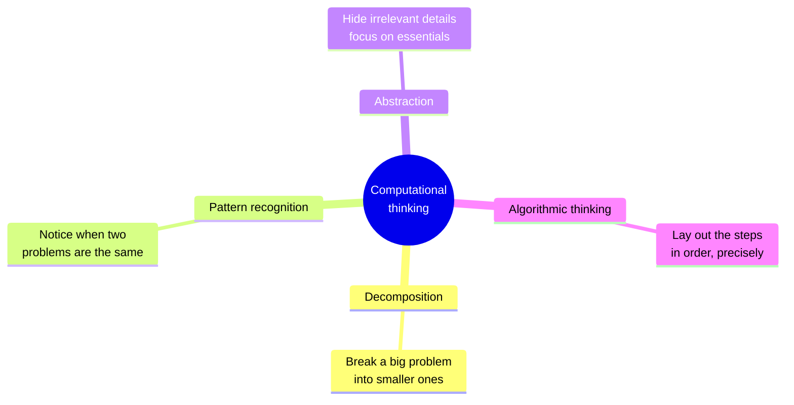
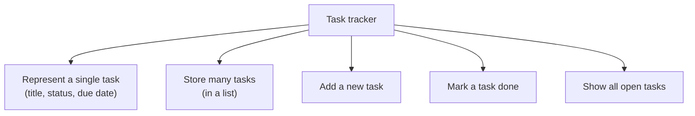
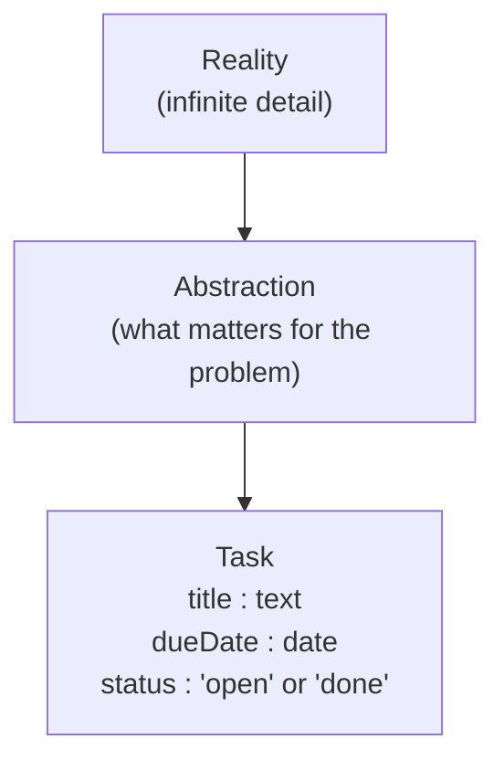
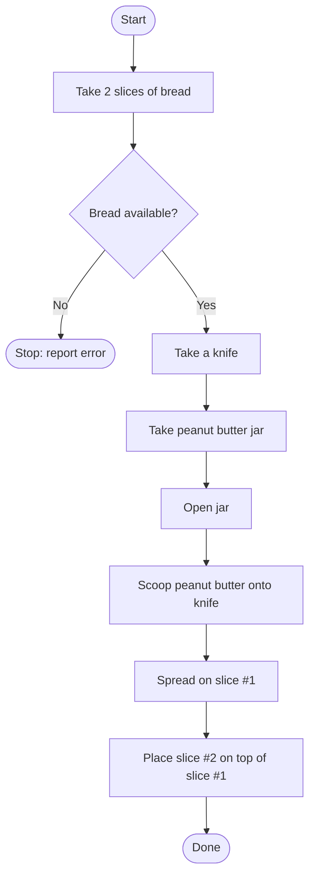
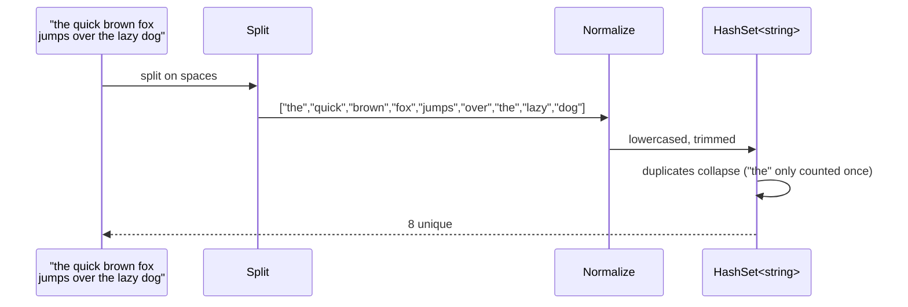

Programming is not really about typing. It is about a particular
way of thinking. Before you can write good code in any language,
you have to develop a small set of mental habits that let you take
a messy real-world problem and break it down into something
*concrete enough* for a computer to handle.

<Figure
  slug="mcs-computational-thinking-cutout"
  alt="Computational thinking, an isometric illustration"
/>

That cluster of habits is called **computational thinking**, and it
is the most transferable skill in this entire course. It applies
to C#, but it also applies to JavaScript, Python, Excel formulas,
SQL queries, even managing your inbox.

## The four habits

That's the whole framework: **decompose, recognize patterns,
abstract, and design a step-by-step solution**. The rest of this
page is just examples.

## Decomposition

**Decomposition** means taking a problem that is too big to think
about all at once and breaking it into smaller subproblems.

<Figure
  slug="mcs-computational-thinking-decomposition-inline-cutout"
  alt="One awkward slab split along scored lines into four blocks that each fit a waiting slot"
  caption="Split the problem until each piece fits a slot you already know."
/>

Suppose someone says: *"build me a system to track tasks."*

That sentence is huge. There are dozens of decisions hidden in it:
what is a task? Who owns it? When is it due? How is it stored? How
do you list them?

A decomposed view looks more like:

Each box on the bottom row is a problem you actually know how to
attack. The big box on top *isn't*. Decomposition is the bridge.

## Pattern recognition

Once you've solved a few small problems, you start to **notice**
when two problems are really the same problem with different
names:

| Problem in words | Underlying pattern |
| --- | --- |
| Find the largest score in a class | Find the maximum of a list |
| Find the longest word in a sentence | Find the maximum of a list |
| Find the highest-paying job listing | Find the maximum of a list |

Three completely different domains. One underlying pattern: "go
through a collection, remember the best one you've seen so far."

Programmers spend their whole careers building a personal library of
recognized patterns. Every time you do, you stop having to invent
that wheel.

Here is the "max of a list" pattern, in C#:

<CodeBlock
  adapter="csharp"
  files={[
    {
      filename: "main.cs",
      starterCode: `using System;
using System.Collections.Generic;

int[] scores = { 71, 88, 65, 92, 80, 77 };

int best = scores[0];
foreach (var s in scores)
{
    if (s > best)
        best = s;
}

Console.WriteLine($"highest score: {best}");
`,
    },
  ]}
/>

Once you know this pattern, you can apply it to longest word,
warmest day, most expensive product, anything where "biggest /
best of a collection" comes up.

## Abstraction

**Abstraction** is the habit of *ignoring details that don't
matter for the problem at hand*.

When you describe a task in a task tracker, you might say "a task
has a title, a due date, and a status." That description ignores:

- The font the title is displayed in
- The number of pixels of padding around the due date
- The exact disk file the task is saved to
- Whether the task is stored as JSON, XML, or a database row

All of those things might matter *somewhere*, but they don't
matter for *modeling what a task is*. By ignoring them, you can
think clearly about the part that actually matters.

Whole programming-language features exist to *support* abstraction:
classes, methods, interfaces, modules. We will meet all of them.
But the habit comes first. You have to know what to ignore before
you know what to model.

## Algorithmic thinking

Finally, **algorithmic thinking** is the habit of being *precise
about steps*. A computer cannot guess what you mean. If your
instructions are vague, they will be wrong.

<Figure
  slug="mcs-computational-thinking-inline-cutout"
  alt="A route of footplates crossing a bench from a start pad to a finish pad, each plate laid down in turn after the last"
  caption="An algorithm is precise steps in order, with nothing left to guess."
/>

Try this exercise: write down, in words, exactly how to make a
peanut butter sandwich, for someone who has never seen one.

A first attempt:

> 1. Spread peanut butter on bread.
> 2. Put another slice on top.

A more *algorithmic* version:

The second version is uglier, but it covers cases the first one
doesn't: *what if there's no bread?* That kind of "are you sure?"
question is exactly what bugs come from. Computers do not have
common sense; you have to supply it.

In code, the same instinct shows up like this:

<CodeBlock
  adapter="csharp"
  files={[
    {
      filename: "main.cs",
      starterCode: `using System;

double DivideSafely(double a, double b)
{
    // Algorithmic precision: what if b is zero?
    if (b == 0)
    {
        Console.WriteLine("warning: division by zero");
        return 0;
    }
    return a / b;
}

Console.WriteLine(DivideSafely(10, 2));
Console.WriteLine(DivideSafely(10, 0));
`,
    },
  ]}
/>

A vague programmer writes `return a / b;` and ships it. A
*computationally-thinking* programmer asks "what could `b` be?" and
covers the cases.

## A worked example: counting unique words

Let's put all four habits together. Problem: *"Given a string, tell
me how many distinct words it contains."*

<Figure
  slug="mcs-computational-thinking-four-habits-inline-cutout"
  alt="Four small tools hanging above a bench, each shown taking a different bite out of the same awkward slab"
  caption="Decompose, spot the pattern, abstract, then write the steps down."
/>

**Decomposition.** What pieces are involved?
- Read the string.
- Split it into words.
- Throw away duplicates.
- Count what's left.

**Pattern recognition.** "Throw away duplicates and count" is the
**set** pattern, every collection language has a tool for it.

**Abstraction.** What's a "word"? For now: a sequence of letters
separated by whitespace. Ignore punctuation. Ignore upper/lower
case differences. Those decisions are *the model*.

**Algorithmic thinking.** What about empty input? A string of only
spaces? We should make those return zero, not crash.

Here is the program:

<CodeBlock
  adapter="csharp"
  files={[
    {
      filename: "main.cs",
      starterCode: `using System;
using System.Collections.Generic;

int CountUniqueWords(string text)
{
    if (string.IsNullOrWhiteSpace(text))
        return 0;

    var seen = new HashSet<string>();
    foreach (var raw in text.Split(' ', StringSplitOptions.RemoveEmptyEntries))
    {
        var word = raw.Trim().ToLowerInvariant();
        if (word.Length > 0)
            seen.Add(word);
    }
    return seen.Count;
}

Console.WriteLine(CountUniqueWords("the quick brown fox jumps over the lazy dog"));
Console.WriteLine(CountUniqueWords("hello hello HELLO  world"));
Console.WriteLine(CountUniqueWords(""));
Console.WriteLine(CountUniqueWords("    "));
`,
    },
  ]}
/>

Trace the execution mentally:

Each habit shows up:

- **Decomposition:** split, normalize, dedupe, count, four small
  steps instead of one big "count unique words".
- **Pattern recognition:** "set of strings" is the right tool.
- **Abstraction:** we chose what counts as a word.
- **Algorithmic thinking:** empty and whitespace inputs are
  handled deliberately.

## Practice

<ChallengeCard
  adapter="csharp"
  title="Sum of even numbers"
  instructions={`Write a program that reads a hard-coded array \`int[] nums = { 1, 2, 3, 4, 5, 6, 7, 8, 9, 10 };\` and prints the **sum of its even numbers**.

The expected output is exactly:

\`\`\`
sum of evens = 30
\`\`\`

Apply computational thinking:

1. *Decompose:* loop over the numbers, decide if each is even, accumulate.
2. *Pattern:* this is the "filter + sum" pattern.
3. *Abstraction:* ignore odd numbers entirely.
4. *Algorithm:* be explicit about starting the sum at \`0\`.`}
  files={[
    {
      filename: "main.cs",
      starterCode: `using System;

int[] nums = { 1, 2, 3, 4, 5, 6, 7, 8, 9, 10 };

// your code here
`,
      solutionCode: `using System;

int[] nums = { 1, 2, 3, 4, 5, 6, 7, 8, 9, 10 };

int sum = 0;
foreach (var n in nums)
{
    if (n % 2 == 0)
        sum += n;
}
Console.WriteLine($"sum of evens = {sum}");
`,
    },
  ]}
  tests={[
    {
      id: "sum_evens",
      name: "Prints exactly `sum of evens = 30`",
      description: "Filter the evens and sum them",
      expect: { stdoutEquals: "sum of evens = 30" },
    },
  ]}
/>

## Test your understanding

<MultipleChoice
  markdown={`Which of these is the *best* example of **abstraction**?

- Using fewer comments
  > Comments are not the issue.
- Writing very short variable names
  > That's just terseness.
- [o] Deciding that, for your task tracker, a task is just "title + due date + status", and ignoring colors, fonts, file formats, and disk layout
  > Abstraction is choosing what to ignore so you can focus on what matters.
- Always using \`var\` instead of a full type
  > That's a style choice; it has nothing to do with abstraction.`}
/>

<MultipleChoice
  markdown={`Two problems, "find the longest sentence in a paragraph" and "find the most expensive product in a catalog", share the same underlying solution shape. What is the name for noticing that?

- Decomposition
  > Decomposition is breaking *one* problem into smaller ones.
- [o] Pattern recognition
  > Both problems are the "find the maximum of a collection" pattern.
- Abstraction
  > Abstraction is ignoring irrelevant details, not spotting that two problems share a solution shape.
- Refactoring
  > Refactoring changes existing code without changing behavior; that's a different activity.`}
/>
