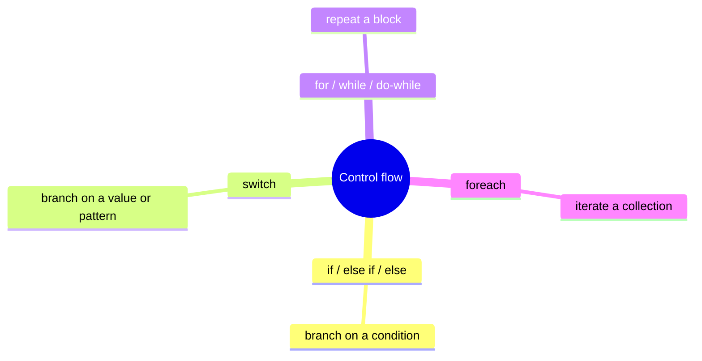
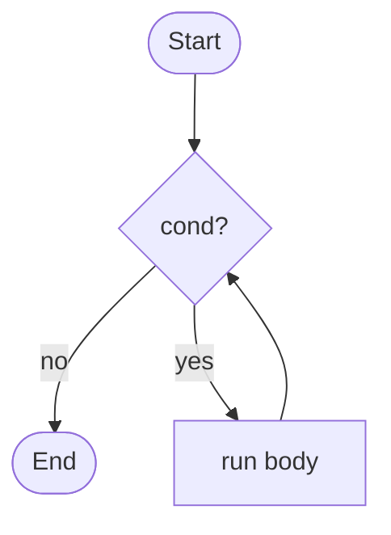
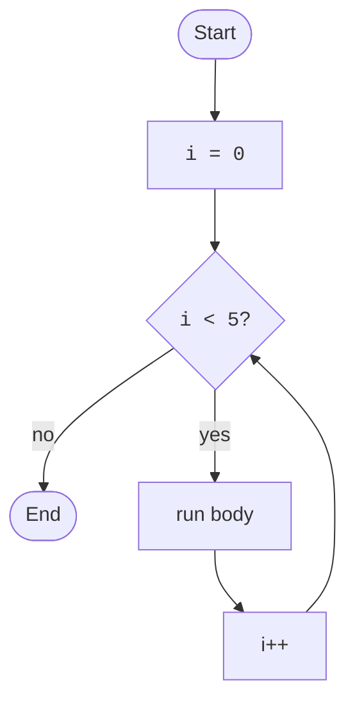
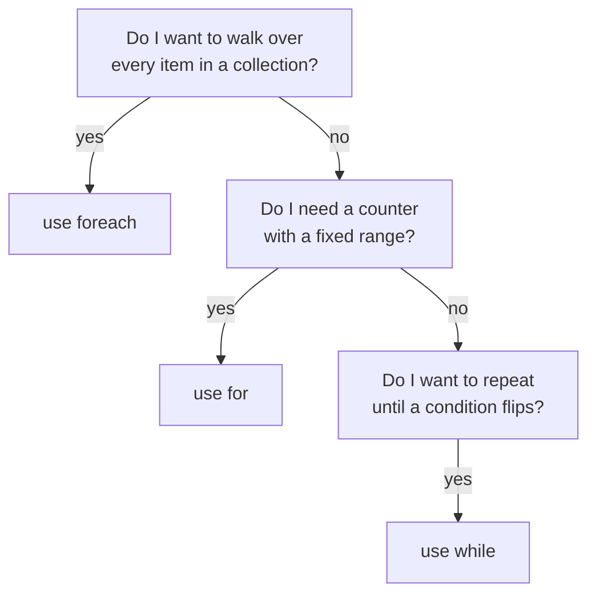

So far our programs have been straight-line: do this, then this,
then this. Real programs need to *make decisions* ("if the user is
an admin, show the admin panel") and *repeat work* ("for every item
in the cart, add up the price"). These ideas together are called
**control flow**.

<svg
  viewBox="0 0 640 212"
  role="img"
  aria-label="A thin track runs from a start dot to a yellow decision diamond; one branch curves up to a green result while the other drops to a blue work block whose loop line sweeps back to run again, branching and repetition in one picture"
  style={{ display: "block", width: "100%", maxWidth: "640px", height: "auto", margin: "2.5rem auto" }}
>
  <g
    style={{ color: "var(--ds-gray-400)" }}
    fill="none"
    stroke="currentColor"
    strokeWidth="2"
    strokeLinecap="round"
  >
    <path d="M94 100 H 214" />
    <path d="M276 82 C 320 60, 372 50, 424 47" />
    <path d="M276 118 C 320 140, 372 150, 426 152" />
    <path d="M466 176 C 410 208, 232 206, 198.1 118.9" />
  </g>
  <polygon points="203.7,120.3 197,110 192.8,121.6" fill="var(--ds-gray-400)" />
  <g style={{ color: "var(--ds-blue-500)" }} fill="currentColor">
    <circle cx="80" cy="100" r="9" />
    <rect x="432" y="138" width="70" height="28" rx="10" />
  </g>
  <g style={{ color: "var(--ds-yellow-500)" }} fill="currentColor">
    <polygon points="250,68 282,100 250,132 218,100" />
  </g>
  <g style={{ color: "var(--ds-green-500)" }} fill="currentColor">
    <circle cx="446" cy="46" r="13" />
  </g>
</svg>

C# gives you four core control-flow tools:

We'll go through each one with small, runnable examples.

## `if` / `else if` / `else`

The most fundamental decision-making tool.

<CodeBlock
  adapter="csharp"
  files={[
    {
      filename: "main.cs",
      starterCode: `using System;

int score = 78;

if (score >= 90)
{
    Console.WriteLine("A");
}
else if (score >= 80)
{
    Console.WriteLine("B");
}
else if (score >= 70)
{
    Console.WriteLine("C");
}
else
{
    Console.WriteLine("F");
}
`,
    },
  ]}
/>

A few things to notice:

- The condition must be a **`bool`**. In C#, you cannot write
  `if (score)` and have the language interpret it as "non-zero is
  true" the way C does.
- Branches are evaluated **top-down**, and **only the first matching
  branch runs**. Once one matches, the rest are skipped.
- You always want `{ }` around the body, even for one-line bodies.
  It prevents subtle bugs when you add a second line later.

## Boolean expressions

The condition inside an `if` is just a boolean expression. The
basic operators:

| Operator | Meaning |
|----------|---------|
| `==`     | equal |
| `!=`     | not equal |
| `<`, `<=`, `>`, `>=` | comparisons |
| `&&`     | and (both must be true) |
| `\|\|`   | or (at least one must be true) |
| `!`      | not |

<CodeBlock
  adapter="csharp"
  files={[
    {
      filename: "main.cs",
      starterCode: `using System;

int age = 25;
bool hasLicense = true;

if (age >= 18 && hasLicense)
{
    Console.WriteLine("can drive");
}

if (!hasLicense)
{
    Console.WriteLine("get a license first");
}
else
{
    Console.WriteLine("you're set");
}
`,
    },
  ]}
/>

`&&` and `||` are **short-circuit**, they stop as soon as the
answer is known. That can matter when one side might be expensive
or unsafe to evaluate.

## `switch`: branch on a value

When you have many possible values for one variable, a chain of
`if`/`else if` gets noisy. `switch` is cleaner.

<CodeBlock
  adapter="csharp"
  files={[
    {
      filename: "main.cs",
      starterCode: `using System;

string day = "Tue";

string kind = day switch {
    "Sat" or "Sun" => "weekend",
    "Mon" or "Tue" or "Wed" or "Thu" or "Fri" => "weekday",
    _ => "unknown",
};

Console.WriteLine($"{day} is a {kind}");
`,
    },
  ]}
/>

That's a modern **switch expression** (introduced in C# 8). The
older **switch statement** form also exists, but the expression
form is cleaner for the simple "pick one of these values" case.

The `_` (underscore) is the catch-all "anything else" pattern.

## Loops: doing the same thing many times

A **loop** is a block of code that runs repeatedly. C# has four
loop forms; you'll mostly use two (`foreach` and `for`).

### `while`, "as long as this is true"

<CodeBlock
  adapter="csharp"
  files={[
    {
      filename: "main.cs",
      starterCode: `using System;

int n = 1;
while (n <= 5)
{
    Console.WriteLine($"n = {n}");
    n++;
}
Console.WriteLine($"after loop, n = {n}");
`,
    },
  ]}
/>

The condition is checked **before** each iteration. If it's false
to begin with, the body never runs.

### `do-while`, "run, then check"

The body runs at least once, and the condition is checked **after**
each iteration.

<CodeBlock
  adapter="csharp"
  files={[
    {
      filename: "main.cs",
      starterCode: `using System;

int n = 10;
do
{
    Console.WriteLine($"n = {n}");
    n--;
} while (n > 7);
`,
    },
  ]}
/>

You'll use this less often than `while`. Mostly when you want a
"prompt-and-validate" loop and the first prompt always happens.

### `for`, "counter loop"

Used when you know up front how many iterations you want, or you
need a counter variable.

<CodeBlock
  adapter="csharp"
  files={[
    {
      filename: "main.cs",
      starterCode: `using System;

for (int i = 0; i < 5; i++)
{
    Console.WriteLine($"i = {i}");
}
`,
    },
  ]}
/>

A `for` loop has three parts in its header:

1. **Initializer**: runs once before the loop starts (`int i = 0`).
2. **Condition**: checked before each iteration (`i < 5`).
3. **Increment**: runs after each iteration (`i++`).

### `foreach`, "do this to every item"

Almost always your best choice when iterating a collection.

<CodeBlock
  adapter="csharp"
  files={[
    {
      filename: "main.cs",
      starterCode: `using System;

var names = new[] { "Ada", "Bob", "Cara" };

foreach (var name in names)
{
    Console.WriteLine($"hello, {name}");
}
`,
    },
  ]}
/>

`foreach` works on arrays, lists, dictionaries, sets, strings, and
anything else that implements an interface called
`IEnumerable<T>`. You'll meet that interface later. For now, just
know: if it looks like a collection, `foreach` works on it.

## `break` and `continue`

Two useful escape hatches:

- **`break`** exits the current loop immediately.
- **`continue`** skips to the next iteration of the current loop.

<CodeBlock
  adapter="csharp"
  files={[
    {
      filename: "main.cs",
      starterCode: `using System;

for (int i = 1; i <= 10; i++)
{
    if (i == 7)
        break; // stop the loop completely
    if (i % 2 == 0)
        continue; // skip even numbers
    Console.WriteLine(i);
}
`,
    },
  ]}
/>

That prints `1, 3, 5` and then stops when `i` reaches `7`.

## A worked example: FizzBuzz

The classic small problem: print numbers 1 to 15, but for multiples
of 3 print "Fizz", for multiples of 5 print "Buzz", and for
multiples of both print "FizzBuzz".

<CodeBlock
  adapter="csharp"
  files={[
    {
      filename: "main.cs",
      starterCode: `using System;

for (int i = 1; i <= 15; i++)
{
    if (i % 15 == 0)
        Console.WriteLine("FizzBuzz");
    else if (i % 3 == 0)
        Console.WriteLine("Fizz");
    else if (i % 5 == 0)
        Console.WriteLine("Buzz");
    else
        Console.WriteLine(i);
}
`,
    },
  ]}
/>

This brings together loops, `if`/`else if`/`else`, and the modulo
(`%`) operator. The order of the branches matters: check
"divisible by 15" *first*, because every multiple of 15 is also a
multiple of 3 and 5.

## Picking the right loop

A quick rule of thumb:

If you're not sure, start with `foreach`. It's the safest and
clearest in most situations.

## Practice

<ChallengeCard
  adapter="csharp"
  title="Count vowels"
  instructions={`Write code that counts the number of vowels (\`a\`, \`e\`, \`i\`, \`o\`, \`u\`, in upper or lower case) in the hard-coded string \`text\`. The string \`"Hello, World!"\` contains three vowels (\`e\`, \`o\`, \`o\`), so your program must print exactly:

\`\`\`
vowels = 3
\`\`\`

Hint: \`foreach (char c in text) { ... }\` lets you iterate the characters of a string. \`char.ToLower(c)\` gives you the lowercase version of a character.`}
  files={[
    {
      filename: "main.cs",
      starterCode: `using System;

string text = "Hello, World!";

// your code here
`,
      solutionCode: `using System;

string text = "Hello, World!";
int count = 0;
foreach (char c in text)
{
    char lc = char.ToLower(c);
    if (lc == 'a' || lc == 'e' || lc == 'i' || lc == 'o' || lc == 'u')
        count++;
}
Console.WriteLine($"vowels = {count}");
`,
    },
  ]}
  tests={[
    {
      id: "vowels",
      name: "Counts 3 vowels in 'Hello, World!'",
      expect: { stdoutEquals: "vowels = 3" },
    },
  ]}
/>

## Test your understanding

<MultipleChoice
  markdown={`In a chain of \`if\` / \`else if\` / \`else\`:

- All matching branches run, in order
  > No, only the first matching branch runs.
- All branches always run
  > Definitely not.
- [o] Only the *first* matching branch runs; the rest are skipped
  > Conditions are tested top-down and the chain stops at the first one that is true.
- The compiler picks the branch with the shortest condition
  > It does not.`}
/>

<MultipleChoice
  markdown={`Which loop would you reach for first to walk through every element of a \`List<string>\`?

- \`do-while\`
  > Possible, but clumsier than needed.
- \`while\` with a manual index
  > Possible, but more error-prone than needed.
- \`for\` with a counter
  > Possible, but \`foreach\` makes intent clearer for "every element."
- [o] \`foreach\`
  > \`foreach\` says "for every element" directly and avoids off-by-one errors.`}
/>

<MultipleChoice
  markdown={`What does \`continue\` do inside a loop?

- Exits the entire loop
  > That's \`break\`.
- Restarts the entire loop from the beginning
  > It doesn't reset the loop variable; it just moves on to the next iteration.
- [o] Skips the rest of the current iteration's body and goes on to the next iteration
  > Execution jumps straight to the next pass of the loop, leaving the remaining statements in the body unrun.
- Ends the program
  > It does not.`}
/>
