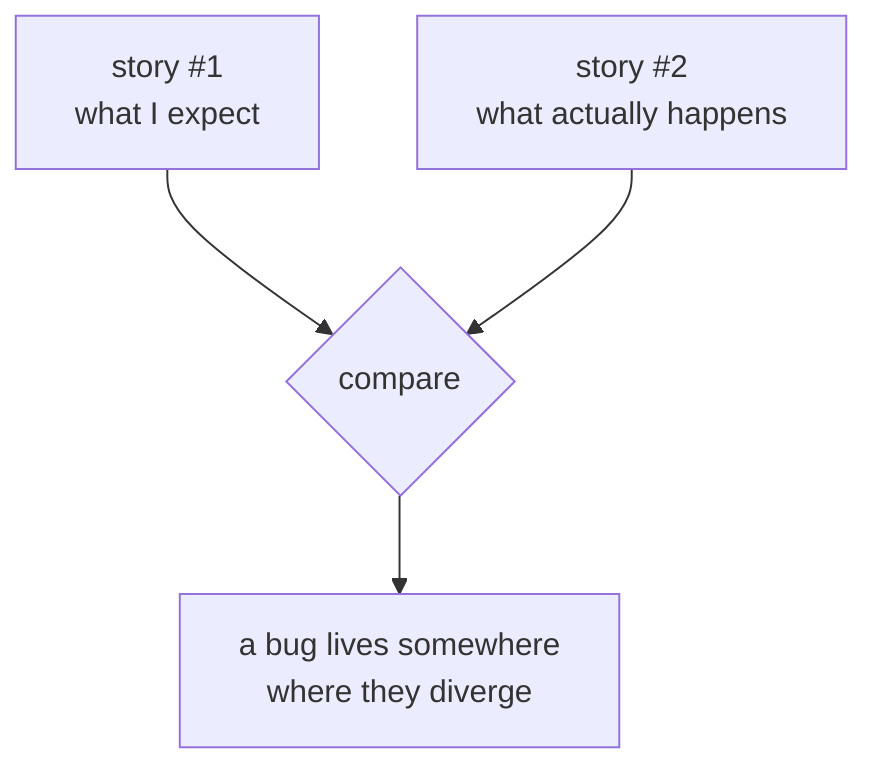

Every program you write will have bugs. That's not a personal
failing; it's the human condition. What separates beginners from
experienced developers isn't fewer bugs, it's how quickly and
calmly they *find* them.

<Figure
  slug="mcs-debugging-cutout"
  alt="Debugging and reasoning, an isometric illustration"
/>

This chapter is less about syntax and more about the *method* of
debugging, a mental discipline you can practice on every program.

## A bug is a gap between two stories

Whenever a program misbehaves, you really have two stories:

1. **What you think the program does.**
2. **What the program actually does.**

A bug is the place where those two diverge. Debugging is the work
of figuring out which step in your mental story doesn't match
reality, and then fixing one or the other.

<Figure
  slug="mcs-debugging-and-reasoning-bug-gap-between-inline-cutout"
  alt="Two written cards pinned side by side describing the same machine differently, a lamp on the line between them"
  caption="A bug is the gap between what you believe and what the program does."
/>



## The scientific method, applied

Every productive debugging session looks like this:

1. **Observe.** Read the actual symptom, error message, wrong
   output, hang. Don't guess; *look*.
2. **Hypothesize.** Form one specific theory: "I think `total` is
   wrong before line 27 because the loop never runs."
3. **Test.** Make ONE change, a print, a breakpoint, an extra
   assertion, that would *prove or disprove* your hypothesis.
4. **Compare** the result to what you expected.
5. **Refine.** Either narrow the suspect zone or update the
   hypothesis.

<Figure
  slug="mcs-debugging-and-reasoning-scientific-method-applied-inline-cutout"
  alt="A written guess pinned above a stopped machine, one part changed, the result checked against the guess"
  caption="Guess, change one thing, and check the result against the guess."
/>

The single biggest beginner mistake is to change five things at
once and hope something works. That doesn't *teach* you anything,
even if the symptom goes away.

The method works even on bugs that sound impossible. A famous
example from sysadmin lore: in the 1990s, Trey Harris, then a
university systems administrator, got a complaint from a statistics
department chairman that his team **couldn't send email farther
than about 500 miles**, they had mapped it, and emails to anywhere
closer worked. It sounds like a prank. Harris took the observation
seriously anyway: he confirmed the symptom, examined the mail
server, and found that an operating system upgrade had quietly downgraded the
mail software's configuration, leaving the connection timeout
effectively near zero, a few milliseconds. And how far can a
signal travel through the network in a few milliseconds before the
timeout kills the connection? Roughly... 500 miles. The "impossible"
geography was the timeout, measured in the speed of light. The
lesson is not about email. It's that *observing carefully and
trusting the evidence* beats dismissing a weird symptom, the
weirder the bug, the more precisely its cause is hiding in plain
sight.

## Reading a stack trace

When an unhandled exception is thrown, C# prints a **stack trace**
showing the chain of method calls that led to the failure. Read
it from the top:

```text
System.DivideByZeroException: Attempted to divide by zero.
   at SimpleMath.Divide(Int32 a, Int32 b) in /src/SimpleMath.cs:line 7
   at Program.<Main>$(String[] args) in /src/Program.cs:line 5
```

This is gold:

- **What** broke: `DivideByZeroException`.
- **Where** it broke: `SimpleMath.Divide`, line 7.
- **Why we got there**: `Program.<Main>$` called it at line 5.

The vast majority of "I can't figure this out" cases evaporate
when you stop and actually read the trace top to bottom.

## Print debugging, undervalued but powerful

You don't need a debugger to find most bugs. A handful of
well-placed `Console.WriteLine()`s often gets you there faster.

<CodeBlock
  adapter="csharp"
  files={[
    {
      filename: "main.cs",
      starterCode: `using System;

int Sum(int n)
{
    int total = 0;
    for (int i = 1; i < n; i++) // bug: should be i <= n
    {
        Console.WriteLine($"loop i={i}, total before add = {total}");
        total += i;
    }
    Console.WriteLine($"returning total = {total}");
    return total;
}

Console.WriteLine($"Sum(5) = {Sum(5)}");
`,
    },
  ]}
/>

Run it. The trace makes the bug obvious, the loop stops at
`i = 4` when we expected it to include `5`. The fix is `i <= n`.

After fixing, **delete the prints**. Leftover diagnostic prints
become noise that hides the next bug.

## Mental tracing: pretending to be the CPU

Pick a small input and walk through the code line by line on
paper, tracking each variable's value. It's tedious, and it
*works*. Most off-by-one bugs and most logic bugs surface within
five lines of mental tracing.

<Figure
  slug="mcs-debugging-and-reasoning-inline-cutout"
  alt="A machine running with a printed ribbon spooling out beside it, each step it takes leaving a mark on the ribbon"
  caption="Walking the code by hand surfaces most logic bugs within a few lines."
/>

Try it for this snippet, then run it:

<CodeBlock
  adapter="csharp"
  files={[
    {
      filename: "main.cs",
      starterCode: `using System;

int[] arr = { 5, 2, 8, 1, 4 };
int max = 0; // ← think hard about this initial value
foreach (var x in arr)
    if (x > max)
        max = x;

Console.WriteLine(max);
`,
    },
  ]}
/>

That program *happens* to give the right answer for this input,
because the array contains a value bigger than 0. But what if the
array were `{ -5, -2, -8 }`? The bug is hiding behind a friendly
input.

The fix is to initialize `max` from the array itself: `int max = arr[0];`

## Invariants: facts that should always be true

An **invariant** is a property of your program that must hold at
some point: "after `Withdraw()`, `Balance >= 0`", "the list is
sorted", "this index is between 0 and `length`".

Writing them down (in comments, or as assertions) is one of the
single most useful debugging habits.

<CodeBlock
  adapter="csharp"
  files={[
    {
      filename: "main.cs",
      starterCode: `using System;
using System.Diagnostics;

int Average(int[] xs)
{
    Debug.Assert(xs.Length > 0, "Average requires a non-empty array");
    int sum = 0;
    foreach (var x in xs)
        sum += x;
    return sum / xs.Length;
}

Console.WriteLine(Average(new[] { 10, 20, 30 })); // 20
// Average(new int[0]);   // would trip the assertion in Debug mode
`,
    },
  ]}
/>

Assertions document your assumptions and catch them being violated
as soon as something goes wrong, instead of much later when the
damage is harder to trace.

## Common bug categories, what to look for first

| Symptom                          | Suspect                                      |
|----------------------------------|----------------------------------------------|
| Off-by-one in a loop             | Wrong comparison (`<` vs `<=`), wrong start  |
| `NullReferenceException`         | A variable that should have been initialized |
| `IndexOutOfRangeException`       | A loop runs one too many times               |
| Wrong total / wrong count        | Initializer wrong, or condition skips items  |
| Code "doesn't run"               | Wrong branch taken; check the `if` condition |
| Random crashes between runs      | Uninitialized data or shared mutable state   |

Knowing the *shape* of common bugs lets you skip straight to the
likely cause.

## Practice, a tiny bug hunt

The function below is *supposed* to return the largest value in
the array. It has a bug. Run it, observe the wrong answer, fix it,
and verify.

<CodeBlock
  adapter="csharp"
  files={[
    {
      filename: "main.cs",
      starterCode: `using System;

int Largest(int[] xs)
{
    int max = 0; // suspicious initializer
    for (int i = 0; i < xs.Length; i++)
    {
        if (xs[i] > max)
            max = xs[i];
    }
    return max;
}

Console.WriteLine(Largest(new[] { -5, -2, -8, -1 })); // expected: -1
Console.WriteLine(Largest(new[] { 3, 1, 4, 1, 5 }));  // expected: 5
`,
    },
  ]}
/>

The first call prints `0`, clearly wrong. The bug is the
initial value of `max`. Initialize it to `xs[0]` and try again.

## Test your understanding

<MultipleChoice
  markdown={`What's the most useful first step when a program crashes with an exception?

- Add a \`try/catch\` to make it go away
  > That hides the bug, not solves it.
- Run it a few times to see if the problem repeats
  > Sometimes useful, but secondary.
- [o] Read the stack trace from the top, the exception type and the file/line tell you what went wrong and where
  > Most bugs are visible right there.
- Reinstall the .NET SDK
  > Extremely unlikely to be the cause.`}
/>

<MultipleChoice
  markdown={`Why is it a bad idea to change five things at once when debugging?

- It might break the build
  > Possible, but not the main problem.
- [o] Even if the symptom goes away, you don't know *which* change fixed it, so you've learned nothing and may have introduced new bugs
  > One controlled change at a time is how you actually make progress.
- The compiler refuses to compile multi-change files
  > It does not.
- Git makes it impossible
  > Git is perfectly happy with multi-change commits.`}
/>
