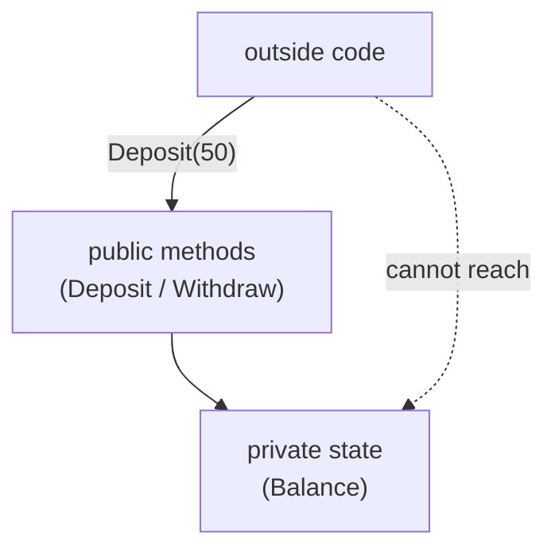

A class isn't truly useful just because it bundles data and methods.
Its real value comes from the fact that *outside code can't mess
with the data directly*, only the methods of the class itself can.

<Figure
  slug="mcs-encapsulation-cutout"
  alt="Encapsulation and abstraction, an isometric illustration"
/>

That discipline goes by two related names:

- **Encapsulation**, keep the data and the rules that govern it in
  one place; let no one else touch the data directly.
- **Abstraction**, expose only what callers need to know; hide the
  rest.

They are two angles on the same idea: *separating "what" from "how."*

## A class that's badly encapsulated

<CodeBlock
  adapter="csharp"
  files={[
    {
      filename: "main.cs",
      starterCode: `using System;

var a = new BankAccount();
a.Balance = 100;
a.Balance = -9999; // oops
Console.WriteLine(a.Balance);

public class BankAccount
{
    public double Balance; // anyone can write this
}
`,
    },
  ]}
/>

Nothing about the class prevents an outside caller from setting the
balance to nonsense. The "rules of being a bank account" don't live
*inside the class*, they're scattered across every place that
touches `Balance`. That's the problem encapsulation solves.

<Figure
  slug="mcs-encapsulation-and-abstraction-properly-encapsulated-version-inline-cutout"
  alt="A sealed cabinet with a solid back and two handles on its front, the only way in"
  caption="With the state sealed, the handles are the only way anything changes."
/>

## Access modifiers: the basic tools

C# gives you a few keywords to control who can see what.

| Modifier              | Visible to                                       |
|-----------------------|---------------------------------------------------|
| `public`              | Everyone                                          |
| `private`             | Only the class itself                             |
| `protected`           | The class and its subclasses                      |
| `internal`            | Code in the same assembly (project)               |
| `protected internal`  | Subclasses *or* same-assembly code                |
| `private protected`   | Subclasses in the same assembly                   |

For now, focus on **`private` for state, `public` for behavior**.

## The properly encapsulated version

<CodeBlock
  adapter="csharp"
  files={[
    {
      filename: "main.cs",
      starterCode: `using System;

var a = new BankAccount("Alice", 100);
a.Deposit(50);
a.Withdraw(30);
Console.WriteLine($"{a.Owner}: {a.Balance}");

// a.Balance = -9999;   // won't compile, Balance has a private setter

public class BankAccount
{
    public string Owner { get; }
    public double Balance { get; private set; } // outsiders read; only this class writes

    public BankAccount(string owner, double openingBalance)
    {
        if (openingBalance < 0)
            throw new ArgumentException("opening balance can't be negative");
        Owner = owner;
        Balance = openingBalance;
    }

    public void Deposit(double amount)
    {
        if (amount <= 0)
            throw new ArgumentException("must be positive");
        Balance += amount;
    }

    public void Withdraw(double amount)
    {
        if (amount <= 0)
            throw new ArgumentException("must be positive");
        if (amount > Balance)
            throw new InvalidOperationException("insufficient funds");
        Balance -= amount;
    }
}
`,
    },
  ]}
/>

Now the *only* way the balance can change is by calling `Deposit()`
or `Withdraw()`, and those methods enforce the invariants. The class
owns its rules.

<Figure
  slug="mcs-encapsulation-and-abstraction-class-s-badly-inline-cutout"
  alt="A cabinet with its back panel missing, hands reaching in from behind to move its contents"
  caption="Public fields leave a way in round the back, and rules cannot be enforced."
/>

## Encapsulation as a picture

The public surface is small and intentional. The internal data is
locked behind it.

## Abstraction: hide the *how*

Where encapsulation is about access, abstraction is about
*ignorance*, a *good* kind of ignorance. Callers should be able to
use your class without knowing how it works.

Consider a `TemperatureSensor`:

<CodeBlock
  adapter="csharp"
  files={[
    {
      filename: "main.cs",
      starterCode: `using System;

var s = new TemperatureSensor();
Console.WriteLine($"C: {s.Celsius:F2}");
Console.WriteLine($"F: {s.Fahrenheit:F2}");

public class TemperatureSensor
{
    private double _rawVoltage = 1.23;

    public double Celsius => (_rawVoltage - 0.5) * 100; // some calibration

    public double Fahrenheit => Celsius * 9.0 / 5.0 + 32;
}
`,
    },
  ]}
/>

Callers never need to know there's a voltage involved, or that the
calibration formula could change. If we later swap the sensor model,
the `Celsius` and `Fahrenheit` properties keep working, the API is
stable even when the internals shift.

That stability is the practical payoff of abstraction.

## Encapsulation vs abstraction, at a glance

| Encapsulation                              | Abstraction                                  |
|--------------------------------------------|----------------------------------------------|
| About **access** to state                  | About **what callers see**                    |
| "Don't let anyone touch the variable"      | "Don't make anyone learn how it works"       |
| Enforced by `private`, properties, methods | Enforced by API design                       |
| Tactic                                     | Strategy                                     |

They work together. Encapsulation makes abstraction safe; abstraction
makes encapsulation *useful*.

## A larger example: a `Wallet`

A wallet has cash inside, but no one should be able to reach in
and edit the cash directly. They have to ask the wallet to do
something.

<CodeBlock
  adapter="csharp"
  entryFilename="Program.cs"
  files={[
    {
      filename: "Program.cs",
      starterCode: `using System;

var w = new Wallet("Ada", 50);
w.Add(100);
w.Spend(30);
Console.WriteLine($"{w.Owner} has {w.Cash}");
try
{
    w.Spend(9999);
}
catch (Exception ex)
{
    Console.WriteLine($"refused: {ex.Message}");
}
`,
    },
    {
      filename: "Wallet.cs",
      starterCode: `public class Wallet
{
    public string Owner { get; }
    public decimal Cash { get; private set; }

    public Wallet(string owner, decimal initialCash)
    {
        if (initialCash < 0)
            throw new ArgumentException("initial cash can't be negative");
        Owner = owner;
        Cash = initialCash;
    }

    public void Add(decimal amount)
    {
        if (amount <= 0)
            throw new ArgumentException("must be positive");
        Cash += amount;
    }

    public void Spend(decimal amount)
    {
        if (amount <= 0)
            throw new ArgumentException("must be positive");
        if (amount > Cash)
            throw new InvalidOperationException("not enough cash");
        Cash -= amount;
    }
}
`,
    },
  ]}
/>

Notice the **invariants** the class guarantees:

1. `Cash >= 0` always, it's impossible to construct or transition
   into a negative balance.
2. `Add()` and `Spend` only accept positive amounts.

These guarantees are local to `Wallet.cs`. You can audit them by
reading one file.

## Practice

<ChallengeCard
  adapter="csharp"
  title="A safe Counter"
  instructions={`Build a \`Counter\` class with:

- A read-only property \`Value\` (int).
- A constructor that takes an int starting value. If the starting value is negative, throw an \`ArgumentException\`.
- An \`Increment()\` method that adds 1 to \`Value\`.
- A \`Reset()\` method that sets \`Value\` back to 0.

The outside world must NOT be able to set \`Value\` directly.

\`Program.cs\` runs a few operations and should print exactly:

\`\`\`
0
3
0
caught
\`\`\``}
  entryFilename="Program.cs"
  files={[
    {
      filename: "Program.cs",
      starterCode: `using System;

var c = new Counter(0);
Console.WriteLine(c.Value);

c.Increment();
c.Increment();
c.Increment();
Console.WriteLine(c.Value);

c.Reset();
Console.WriteLine(c.Value);

try
{
    var bad = new Counter(-1);
    Console.WriteLine("oops");
}
catch (ArgumentException)
{
    Console.WriteLine("caught");
}
`,
    },
    {
      filename: "Counter.cs",
      starterCode: `public class Counter
{
    // TODO: implement
}
`,
      solutionCode: `public class Counter
{
    public int Value { get; private set; }

    public Counter(int start)
    {
        if (start < 0)
            throw new ArgumentException("start cannot be negative");
        Value = start;
    }

    public void Increment() => Value++;
    public void Reset() => Value = 0;
}
`,
    },
  ]}
  tests={[
    {
      id: "counter",
      name: "Counter prints expected lines",
      expect: { stdoutLines: ["0", "3", "0", "caught"], stdoutLinesExact: true },
    },
  ]}
/>

## Test your understanding

<MultipleChoice
  markdown={`What is the *main* benefit of encapsulation?

- It reduces the number of lines of code
  > Often it adds a few lines (properties, validation).
- It makes classes immutable
  > Encapsulation does not require immutability.
- It makes the code faster
  > It doesn't significantly affect performance.
- [o] It localizes the rules that govern a piece of data, so the rest of the program can't accidentally violate them
  > Invariants are enforced in one place.`}
/>

<MultipleChoice
  markdown={`Which best captures "abstraction"?

- [o] Hiding *how* something works behind a stable interface that says *what* it does
  > Abstraction is about what callers see.
- A class with no fields
  > That's just an empty class.
- Making all members \`public\`
  > That's the opposite of abstraction.
- Replacing classes with structs
  > Unrelated to abstraction.`}
/>
