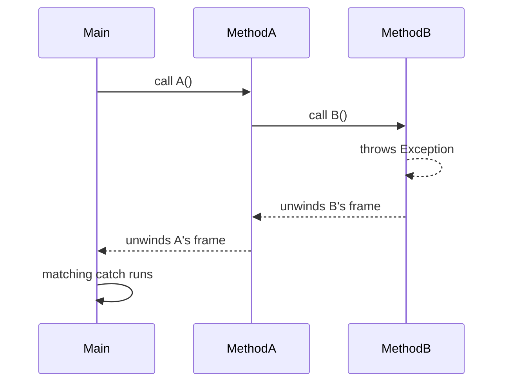

So far our programs have assumed everything works: files exist,
inputs parse, math never overflows, networks never go down. Real
programs aren't that lucky.

C# splits "things that go wrong" into two camps:

1. **Expected failures** that you can predict and check for, these
   should be handled with **regular control flow** (return values,
   `TryParse`, `bool` flags).
2. **Exceptional failures** that you can't easily prevent and
   shouldn't have to write a defensive check for at every call site,
these use the **exception system**.

The discipline of knowing which is which is most of what "good
error handling" means.

<svg
  viewBox="0 0 640 200"
  role="img"
  aria-label="A blue line of execution snaps at a red cross, drops into a green catching curve, and climbs back up to continue to a safe green end, an exception thrown, caught, and handled"
  style={{ display: "block", width: "100%", maxWidth: "640px", height: "auto", margin: "2.5rem auto" }}
>
  <g style={{ color: "var(--ds-blue-500)" }}>
    <circle cx="72" cy="80" r="9" fill="currentColor" />
    <g
      fill="none"
      stroke="currentColor"
      strokeWidth="3.5"
      strokeLinecap="round"
      strokeOpacity="0.6"
    >
      <path d="M86 80 H 282" />
      <path d="M462 92 H 544" />
    </g>
  </g>
  <g style={{ color: "var(--ds-red-500)" }}>
    <path
      d="M294 68 L 318 92 M318 68 L 294 92"
      fill="none"
      stroke="currentColor"
      strokeWidth="3.5"
      strokeLinecap="round"
    />
  </g>
  <g style={{ color: "var(--ds-green-500)" }}>
    <path
      d="M306 100 C 330 158, 430 158, 456 100"
      fill="none"
      stroke="currentColor"
      strokeWidth="3.5"
      strokeLinecap="round"
      strokeOpacity="0.7"
    />
    <circle cx="560" cy="88" r="11" fill="currentColor" />
  </g>
</svg>

## Exceptions, the mechanism

An **exception** is an object that represents a failure. When code
*throws* one, normal execution stops, and the runtime unwinds the
call stack looking for a matching `catch` block. If no `catch` is
found, the program crashes.

<CodeBlock
  adapter="csharp"
  files={[
    {
      filename: "main.cs",
      starterCode: `using System;

try
{
    int x = int.Parse("not a number");
    Console.WriteLine(x);
}
catch (FormatException ex)
{
    Console.WriteLine($"couldn't parse: {ex.Message}");
}

Console.WriteLine("program continues");
`,
    },
  ]}
/>

Without the `try/catch`, the program would crash with a stack
trace. The `catch` block lets us *respond* instead.

## The flow of an exception

The exception travels *up* the stack until something catches it.
Anything in its path (open files, half-built objects) gets cleaned
up by stack unwinding plus `finally` blocks.

## `try` / `catch` / `finally`

<CodeBlock
  adapter="csharp"
  files={[
    {
      filename: "main.cs",
      starterCode: `using System;

try
{
    Console.WriteLine("trying...");
    throw new InvalidOperationException("something bad");
}
catch (InvalidOperationException ex)
{
    Console.WriteLine($"caught specific: {ex.Message}");
}
catch (Exception ex)
{
    Console.WriteLine($"caught general: {ex.Message}");
}
finally
{
    Console.WriteLine("finally always runs");
}
`,
    },
  ]}
/>

Rules:

- The **most specific** `catch` blocks should come first. The
  runtime picks the first matching one.
- A `finally` block **always runs**, whether or not an exception
  was thrown, perfect for cleanup.

## Throwing your own exceptions

When *your* method receives nonsense input or hits an impossible
state, the right thing to do is usually to throw, not to silently
return wrong data.

<CodeBlock
  adapter="csharp"
  files={[
    {
      filename: "main.cs",
      starterCode: `using System;

double Divide(int a, int b)
{
    if (b == 0)
        throw new ArgumentException("b cannot be zero", nameof(b));
    return (double)a / b;
}

try
{
    Console.WriteLine(Divide(10, 2));
    Console.WriteLine(Divide(10, 0)); // throws
}
catch (ArgumentException ex)
{
    Console.WriteLine($"refused: {ex.Message}");
}
`,
    },
  ]}
/>

A few common built-in exception types:

| Exception                     | Use when…                                                  |
|-------------------------------|-------------------------------------------------------------|
| `ArgumentException`           | An argument is invalid for some reason                     |
| `ArgumentNullException`       | A required argument was `null`                             |
| `ArgumentOutOfRangeException` | A number/index is outside an allowed range                 |
| `InvalidOperationException`   | The object is in a state where this call isn't allowed     |
| `NotImplementedException`     | "I plan to write this method, but haven't yet"             |
| `FormatException`             | A string couldn't be parsed                                |
| `KeyNotFoundException`        | A dictionary key didn't exist                              |

## Exceptions are NOT for ordinary control flow

This is a really common beginner trap:

<CodeBlock
  adapter="csharp"
  files={[
    {
      filename: "main.cs",
      starterCode: `using System;

// BAD, using exceptions as if they were "if not a number"
int ParseOrZero(string s)
{
    try
    {
        return int.Parse(s);
    }
    catch
    {
        return 0;
    }
}

Console.WriteLine(ParseOrZero("42"));
Console.WriteLine(ParseOrZero("oops"));
`,
    },
  ]}
/>

It works, but it's wasteful and obscures intent. The whole point
of `TryParse` is to *not* throw for the perfectly ordinary case
"this string isn't a number":

<CodeBlock
  adapter="csharp"
  files={[
    {
      filename: "main.cs",
      starterCode: `using System;

// GOOD, use TryParse for an expected failure
int ParseOrZero(string s) => int.TryParse(s, out var n) ? n : 0;

Console.WriteLine(ParseOrZero("42"));
Console.WriteLine(ParseOrZero("oops"));
`,
    },
  ]}
/>

Rule of thumb: **if the failure is normal and frequent, use a
return value. Use exceptions only for situations the caller
shouldn't have to expect at every call site.**

## Catching the right thing

Avoid catching `Exception` (or worse, swallowing all exceptions
silently) unless you're at the *very top* of the program and just
want to log and exit gracefully. In ordinary code, catch only the
specific exceptions you actually know how to handle.

<CodeBlock
  adapter="csharp"
  files={[
    {
      filename: "main.cs",
      starterCode: `using System;

// BAD, hides everything, including bugs
try
{ /* important work */
}
catch
{ /* nothing */
}

// BETTER, handle what you know; let the rest bubble up
try
{ /* important work */
}
catch (FormatException ex)
{
    Console.WriteLine($"bad input: {ex.Message}");
}
`,
    },
  ]}
/>

A silent `catch` block is one of the most dangerous things in any
codebase. It turns bugs into mysterious wrong answers.

## Re-throwing

If you catch an exception only to log or annotate it but don't
actually know how to recover, **re-throw**:

<CodeBlock
  adapter="csharp"
  files={[
    {
      filename: "main.cs",
      starterCode: `using System;

void Risky()
{
    try
    {
        throw new InvalidOperationException("boom");
    }
    catch (Exception ex)
    {
        Console.WriteLine($"logging: {ex.Message}");
        throw; // re-throws preserving the original stack trace
        // throw ex;    // BAD, resets the stack trace
    }
}

try
{
    Risky();
}
catch (Exception ex)
{
    Console.WriteLine($"top level got: {ex.Message}");
}
`,
    },
  ]}
/>

`throw;` re-throws the *same* exception. `throw ex;` looks similar
but loses the original stack trace, making debugging harder.

## Null and `NullReferenceException`

The single most common runtime error in C# is calling a method on
a variable that turned out to be `null`:

<CodeBlock
  adapter="csharp"
  files={[
    {
      filename: "main.cs",
      starterCode: `using System;

string? maybeName = null;

// One way: explicit check
if (maybeName != null)
    Console.WriteLine(maybeName.Length);
else
    Console.WriteLine("(none)");

// Null-conditional operator: returns null if maybeName is null
Console.WriteLine(maybeName?.Length);

// Null-coalescing: provide a default
Console.WriteLine(maybeName ?? "(none)");
`,
    },
  ]}
/>

Modern C# (with nullable reference types) lets the compiler warn
you when a variable could be null, making
`NullReferenceException` largely a thing of the past if you pay
attention to the warnings.

## Practice

<ChallengeCard
  adapter="csharp"
  title="Safe number summer"
  instructions={`Implement \`SafeMath.SumNumbers(string[] inputs)\` which:

- Parses each string as an int.
- Skips any string that can't be parsed (do NOT throw).
- Returns the sum of the ones that parsed successfully.

\`Program.cs\` calls it with \`{"10", "x", "20", "y", "5"}\` and prints exactly:

\`\`\`
35
\`\`\``}
  entryFilename="Program.cs"
  files={[
    {
      filename: "Program.cs",
      starterCode: `using System;

string[] data = { "10", "x", "20", "y", "5" };
Console.WriteLine(SafeMath.SumNumbers(data));
`,
    },
    {
      filename: "SafeMath.cs",
      starterCode: `public static class SafeMath
{
    public static int SumNumbers(string[] inputs)
    {
        // TODO
        return 0;
    }
}
`,
      solutionCode: `public static class SafeMath
{
    public static int SumNumbers(string[] inputs)
    {
        int total = 0;
        foreach (var s in inputs)
        {
            if (int.TryParse(s, out var n))
                total += n;
        }
        return total;
    }
}
`,
    },
  ]}
  tests={[
    {
      id: "sum",
      name: "Skips unparsable and sums the rest",
      expect: { stdoutEquals: "35\n" },
    },
  ]}
/>

## Test your understanding

<MultipleChoice
  markdown={`When should you use an exception instead of a return value to signal failure?

- For every possible error
  > That overloads the exception system and harms performance and clarity.
- Only when you want to crash the program
  > Exceptions are designed to be *caught*, not just to crash.
- [o] When the failure is unusual or unexpected, and forcing every call site to check for it would be noisy
  > Ordinary, expected failures should use return values like \`TryParse\`.
- Whenever your method touches a file
  > Reaching for exceptions reflexively misses the real distinction.`}
/>

<MultipleChoice
  markdown={`Why is a silent \`catch { }\` block dangerous?

- It's slower than a specific catch
  > Performance isn't the issue.
- The compiler removes it
  > It doesn't.
- [o] It hides bugs by swallowing every exception, even ones you never anticipated
  > The program continues with corrupt state and you have no idea anything went wrong.
- It uses too much memory
  > Memory isn't the issue.`}
/>
