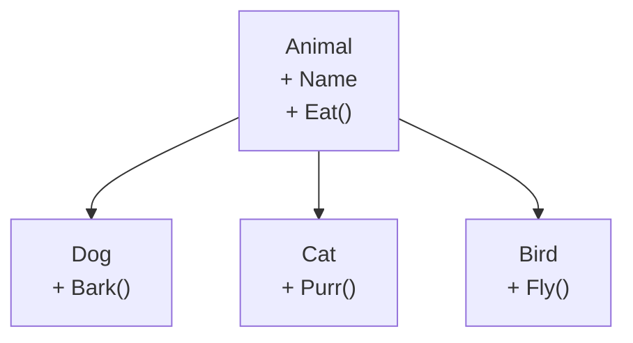

Real-world things come in families. A *Dog* is a kind of *Animal*.
A *SavingsAccount* is a kind of *BankAccount*. A *Circle* and a
*Rectangle* are both kinds of *Shape*.

<Figure
  slug="mcs-inheritance-cutout"
  alt="Inheritance and polymorphism, an isometric illustration"
/>

Object-oriented languages let you mirror that "is-a" structure in
code through **inheritance**. And once you have a family of related
types, you can write code that doesn't care which member it's
holding, that's **polymorphism**.

## Inheritance: the basic mechanics

A **base class** holds the common state and behavior. A **derived
class** adds to or overrides what the base provides.

<CodeBlock
  adapter="csharp"
  files={[
    {
      filename: "main.cs",
      starterCode: `using System;

var d = new Dog("Rex");
d.Eat();  // inherited from Animal
d.Bark(); // defined on Dog

public class Animal
{
    public string Name { get; }
    public Animal(string name)
    {
        Name = name;
    }

    public void Eat() => Console.WriteLine($"{Name} is eating.");
}

public class Dog : Animal // "Dog : Animal" reads "Dog inherits from Animal"
{
    public Dog(string name) : base(name)
    {
    } // forward to the base constructor

    public void Bark() => Console.WriteLine($"{Name} says woof!");
}
`,
    },
  ]}
/>

`Dog` doesn't have to re-implement `Name` or `Eat`. They come "for
free" because every `Dog` *is* an `Animal`.

## A class hierarchy as a picture



The arrow always points "up" toward the more general type. The
shared parts live at the top.

## Overriding behavior with `virtual` and `override`

Sometimes a derived class needs to **change** how a base method
works, not just add new methods. The base marks the method
`virtual`; the derived class marks its replacement `override`.

<CodeBlock
  adapter="csharp"
  files={[
    {
      filename: "main.cs",
      starterCode: `using System;

Animal a = new Dog("Rex");
a.Speak(); // "Rex barks!", even though a's declared type is Animal

a = new Cat("Whiskers");
a.Speak(); // "Whiskers meows."

public class Animal
{
    public string Name { get; }
    public Animal(string name)
    {
        Name = name;
    }

    public virtual void Speak() => Console.WriteLine($"{Name} makes a sound.");
}

public class Dog : Animal
{
    public Dog(string name) : base(name)
    {
    }
    public override void Speak() => Console.WriteLine($"{Name} barks!");
}

public class Cat : Animal
{
    public Cat(string name) : base(name)
    {
    }
    public override void Speak() => Console.WriteLine($"{Name} meows.");
}
`,
    },
  ]}
/>

Look at the last block carefully. The variable `a` is declared as
`Animal`. The *actual* object is sometimes a `Dog`, sometimes a
`Cat`. At runtime, `a.Speak()` calls **the right version** based
on what `a` really is.

That ability, "one call site, many possible behaviors", is
**polymorphism**.

## Why polymorphism matters

Imagine writing this without polymorphism:

```csharp
if (kind == "dog") BarkLikeADog(name);
else if (kind == "cat") MeowLikeACat(name);
else if (kind == "cow") MooLikeACow(name);
```

Every new animal forces you to edit *every* if/else chain in the
program. With polymorphism, you just add a new derived class with
its own `Speak()`, and every existing call site that says
`animal.Speak()` already does the right thing.

## `abstract` classes: forcing the family to fill in the blanks

Sometimes the base class can't define a method itself, it only
knows that every subclass *must* provide one. That's an **abstract
method** on an **abstract class**.

<CodeBlock
  adapter="csharp"
  files={[
    {
      filename: "main.cs",
      starterCode: `using System;

Shape[] shapes = { new Circle(3), new Square(4) };
foreach (var s in shapes)
    s.Describe();

public abstract class Shape
{
    public abstract double Area(); // no body, derived classes MUST override

    public void Describe() => Console.WriteLine($"area = {Area():F2}");
}

public class Circle : Shape
{
    public double Radius { get; }
    public Circle(double r)
    {
        Radius = r;
    }
    public override double Area() => Math.PI * Radius * Radius;
}

public class Square : Shape
{
    public double Side { get; }
    public Square(double s)
    {
        Side = s;
    }
    public override double Area() => Side * Side;
}
`,
    },
  ]}
/>

`Shape` *cannot* be instantiated directly, there's no such thing
as "a shape" with no specific kind. But the array `Shape[]` can
hold any subclass, and `Describe()` uses each subclass's `Area()`
without caring which kind it is.

## Interfaces: a contract, not a family

An **interface** is a list of methods/properties that a class
promises to provide. It's pure shape, no fields, no behavior.

<CodeBlock
  adapter="csharp"
  files={[
    {
      filename: "main.cs",
      starterCode: `using System;

void GreetEveryone(IGreeter g, string[] names)
{
    foreach (var n in names)
        Console.WriteLine(g.Greet(n));
}

GreetEveryone(new English(), new[] { "Ada", "Bob" });
GreetEveryone(new Japanese(), new[] { "アダ", "ボブ" });

public interface IGreeter
{
    string Greet(string name);
}

public class English : IGreeter
{
    public string Greet(string name) => $"Hello, {name}!";
}

public class Japanese : IGreeter
{
    public string Greet(string name) => $"こんにちは、{name}さん!";
}
`,
    },
  ]}
/>

A class can only inherit from **one** base class but can implement
**many** interfaces. Interfaces are the everyday tool for saying
"these unrelated types all happen to support this same capability."

## Composition vs inheritance

A common beginner trap is to use inheritance for *every*
relationship. A better rule:

- Use **inheritance** when the relationship is genuinely "is-a"
  and the subclass extends the base in a substitutable way.
- Use **composition** ("has-a") when one class merely uses another.

A `Car` *has* an `Engine`, it isn't *a kind of* `Engine`. So
`Car` should hold a field of type `Engine`, not inherit from it.

## Practice

<ChallengeCard
  adapter="csharp"
  title="Shapes with polymorphism"
  instructions={`Complete the \`Shape\` hierarchy:

- \`Shape\` is abstract with an abstract \`double Area()\`.
- \`Circle\` takes a radius and returns π × r².
- \`Rectangle\` takes width and height and returns w × h.

\`Program.cs\` builds an array of shapes and prints exactly:

\`\`\`
12.57
12.00
\`\`\``}
  entryFilename="Program.cs"
  files={[
    {
      filename: "Program.cs",
      starterCode: `using System;

Shape[] shapes = { new Circle(2), new Rectangle(3, 4) };
foreach (var s in shapes)
    Console.WriteLine(s.Area().ToString("F2"));
`,
    },
    {
      filename: "Shape.cs",
      starterCode: `public abstract class Shape
{
    // TODO: declare abstract Area()
}
`,
      solutionCode: `public abstract class Shape
{
    public abstract double Area();
}
`,
    },
    {
      filename: "Circle.cs",
      starterCode: `public class Circle : Shape
{
    // TODO
    public override double Area() => 0;
}
`,
      solutionCode: `public class Circle : Shape
{
    public double Radius { get; }
    public Circle(double r)
    {
        Radius = r;
    }
    public override double Area() => System.Math.PI * Radius * Radius;
}
`,
    },
    {
      filename: "Rectangle.cs",
      starterCode: `public class Rectangle : Shape
{
    // TODO
    public override double Area() => 0;
}
`,
      solutionCode: `public class Rectangle : Shape
{
    public double Width { get; }
    public double Height { get; }
    public Rectangle(double w, double h)
    {
        Width = w;
        Height = h;
    }
    public override double Area() => Width * Height;
}
`,
    },
  ]}
  tests={[
    {
      id: "shapes",
      name: "Polymorphic Area() calls produce expected output",
      expect: { stdoutLines: ["12.57", "12.00"], stdoutLinesExact: true },
    },
  ]}
/>

## Test your understanding

<MultipleChoice
  markdown={`Why is polymorphism useful?

- [o] One call site (\`shape.Area()\`) automatically does the right thing for every subclass, so new subclasses don't require changes to existing code
  > This is the "open for extension, closed for modification" idea.
- It eliminates the need for classes
  > It depends on classes.
- It makes programs run faster
  > Performance is neutral to slightly worse than direct calls.
- It allows multiple inheritance
  > C# does not allow multiple base classes.`}
/>

<MultipleChoice
  markdown={`When should you use inheritance vs composition?

- Inheritance for unrelated types, composition for related types
  > That's backwards.
- Always prefer composition
  > Too absolute, sometimes "is-a" really is the right model.
- [o] Use inheritance for genuine "is-a" relationships; use composition for "has-a" relationships
  > Many design problems get simpler when you reach for composition first.
- Always prefer inheritance
  > A common over-use that produces brittle hierarchies.`}
/>
