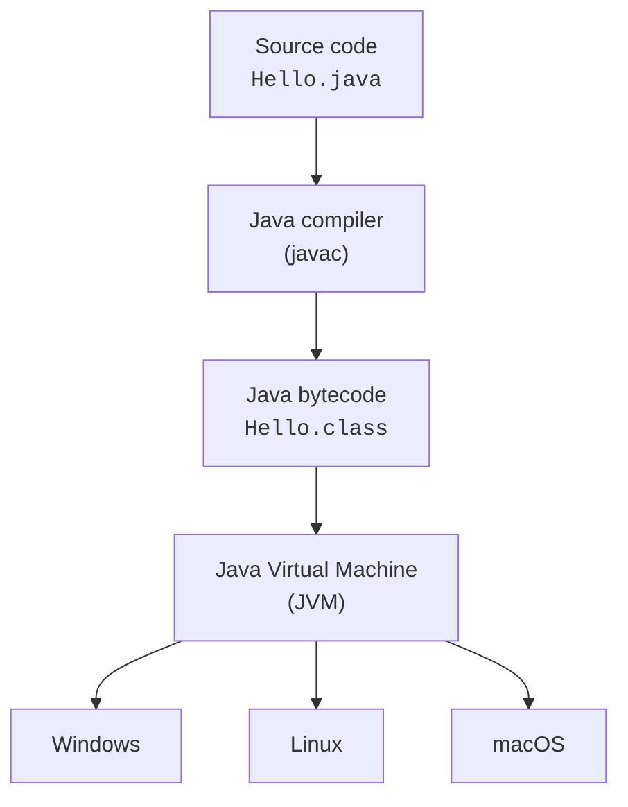
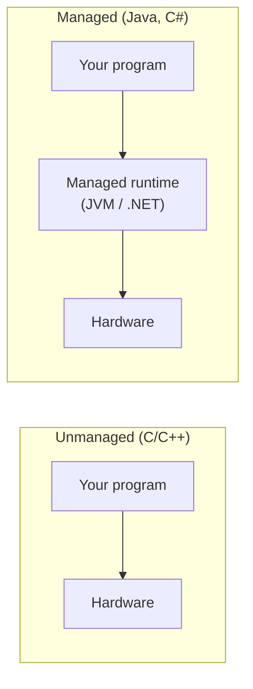
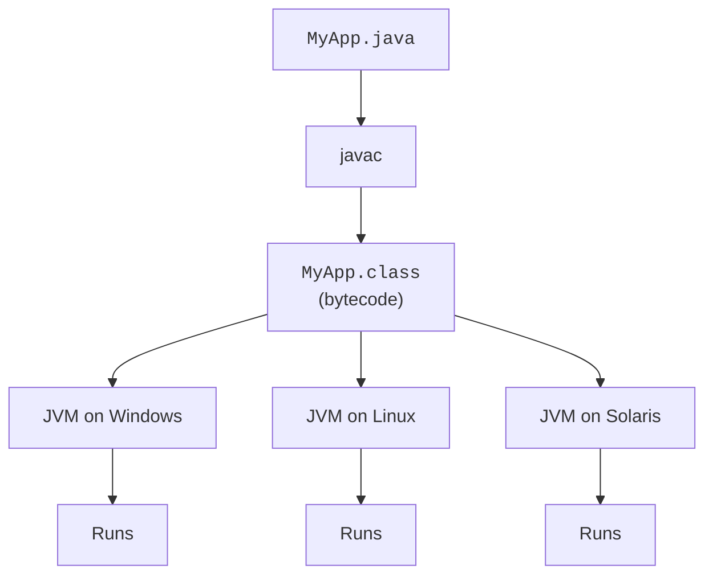
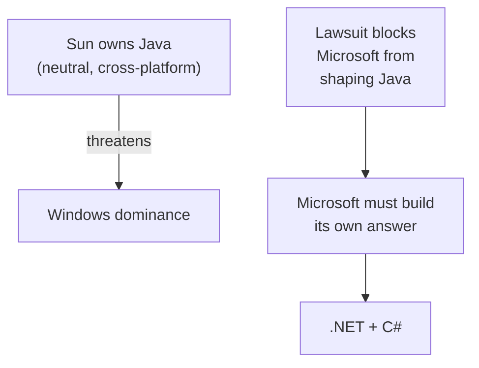

*This is one of the optional deep-dive chapters promised in
[The Road to C#](./the-road-to-csharp), the full version of the
Java story, and a closer look at where "managed runtimes" came
from.*

<Figure
  slug="mcs-java-managed-runtimes-cutout"
  alt="Java and the rise of managed runtimes, an isometric illustration"
/>

If C# has a single parent in the world of language design, it is
**Java**. The two languages look astonishingly similar at the syntax
level, and that is not an accident. To understand C#, you have to
understand what Java did first, and *why* Microsoft eventually felt
the need to build its own answer.

## Java in one paragraph

**Java** was created by **James Gosling** and his team at **Sun
Microsystems**, starting in 1991. It was originally aimed at small
embedded devices (set-top boxes for cable TV), but by the time it
shipped publicly in 1995, the web was exploding and Java was
repositioned as the language that would let small programs (called
*applets*) run safely inside any web browser.

<Figure
  slug="mcs-java-and-managed-runtimes-java-one-paragraph-inline-cutout"
  alt="One program block set on a platform that can be carried between three different benches"
  caption="Compile once to bytecode and the same program runs on any machine with a runtime."
/>

That positioning, plus an aggressive **"Write Once, Run Anywhere"**
marketing campaign, made Java one of the fastest-adopted languages
in history. Within a few years, banks, insurance companies, and
governments around the world were betting their core systems on
Java.

## The killer idea: a virtual machine

The single most important technical idea in Java was that programs
were **not compiled directly to machine code**. Instead, they were
compiled to a portable intermediate language called **Java
bytecode**, which ran on a small program called the **Java Virtual
Machine** (JVM).

<Figure
  slug="mcs-java-and-managed-runtimes-killer-idea-virtual-machine-inline-cutout"
  alt="One set of cards running on three different machines, each machine carrying the same small adapter at its front"
  caption="Compile once to bytecode and any machine with a runtime can run the same program."
/>

Two key consequences:

1. **One bytecode, many platforms.** A `.class` file compiled on
   Windows could be copied to Linux and run there *unchanged*, as
   long as a JVM was installed. This was a huge promise, and it
   mostly held up.
2. **The JVM stood between your code and the operating system.**
   The JVM could enforce rules: no reading memory you didn't own,
   no overflowing arrays, no calling random operating-system APIs
   without permission.

This second consequence is the *real* point. We call a system like
the JVM a **managed runtime**, and it changed what programming
*felt like*.

## What "managed" means

A **managed runtime** is a piece of software that sits between your
program and the hardware, and *manages* the things programmers
historically got wrong.

<Figure
  slug="mcs-java-and-managed-runtimes-managed-means-inline-cutout"
  alt="A workshop where a caretaker clears and re-tools the bench between jobs, the work standing still for a moment each time"
  caption="The runtime reclaims memory for you, at the cost of pausing occasionally to do it."
/>

The managed runtime takes responsibility for three painful things:

| Painful thing | Unmanaged | Managed |
| --- | --- | --- |
| **Allocating memory** | You call `malloc` / `new`. | You call `new`. |
| **Freeing memory** | You must call `free` / `delete`. | The **garbage collector** does it automatically. |
| **Memory safety** | A wrong pointer can read or corrupt any memory. | The runtime refuses; you get an exception instead. |

The benefit is enormous. Whole categories of bugs that haunted C
and C++ programmers, use-after-free, double-free, memory leaks,
buffer overflows, *largely disappear* in a managed language.

The cost is that the runtime is doing real work for you: the
garbage collector occasionally pauses your program to clean up; the
bytecode has to be translated to real machine code at run time
(usually by a **just-in-time** or **JIT** compiler).

For most software, this trade, slight runtime overhead for
*dramatically* fewer bugs, is one of the best deals in computing.

## The "Write Once, Run Anywhere" promise

In an era when every operating system had its own incompatible
APIs, the ability to ship one binary that ran *everywhere* was
revolutionary. Banks, telecoms, and governments, which often ran a
zoo of different machines, fell in love with the idea.

## Why this terrified Microsoft

Java was a strategic threat to Microsoft for two reasons.

First, **Java was platform-neutral by design.** If "Write Once, Run
Anywhere" really took hold, then *Windows stopped mattering*.
Companies could write their software in Java and run it on whatever
operating system was cheapest. That was a direct attack on
Microsoft's core business.

Second, **Java's owner was Sun Microsystems**, a Microsoft
competitor. Microsoft built its own implementation of Java
("Visual J++") and tried to add Windows-specific extensions, which
Sun argued violated the contract. The two companies ended up in a
multi-year lawsuit. Microsoft eventually settled, and effectively
withdrew from the Java world.

That left Microsoft with a choice: either continue with a hostile
relationship to Java, or build its **own** managed runtime, a
direct, Microsoft-owned competitor to the JVM, with a brand-new
language designed around it.

It chose the latter. The runtime would be called the **Common
Language Runtime** (CLR), and the language would be **C#**.

## What a managed program *feels* like

You will not run unmanaged C code in this course, so let us just
look at how easy memory feels in a managed language. The program
below creates a list with a million numbers, throws it away, and
creates another. There is no `free`, no `delete`, no manual
cleanup. The runtime will reclaim memory whenever it likes.

<Figure
  slug="mcs-java-and-managed-runtimes-managed-program-feels-like-inline-cutout"
  alt="A bench where a caretaker clears the offcuts as they fall, the worker never stopping to sweep"
  caption="You never free anything, and you pay for that in pauses you did not schedule."
/>

<CodeBlock
  adapter="csharp"
  files={[
    {
      filename: "main.cs",
      starterCode: `using System;
using System.Collections.Generic;

void MakeAndForget()
{
    var big = new List<int>();
    for (int i = 0; i < 1_000_000; i++)
        big.Add(i);
    Console.WriteLine($"created a list with {big.Count} ints");
    // We return without doing anything, no cleanup.
    // The .NET runtime will reclaim 'big' later, automatically.
}

MakeAndForget();
MakeAndForget();
MakeAndForget();
Console.WriteLine("done");
`,
    },
  ]}
/>

In an unmanaged language, forgetting to `free` `big` three times
would leak about 12 MB of memory permanently. In C#, the runtime
takes care of it.

## The trade-offs of managed runtimes

Managed runtimes are not magic. They make explicit trade-offs:

| Pros | Cons |
| --- | --- |
| Far fewer memory bugs | Slightly higher memory and CPU overhead |
| Automatic memory management | Occasional pauses for garbage collection |
| Strong type safety | A startup cost while the runtime warms up |
| Same code on multiple OSes | A runtime must be installed alongside your app |
| Rich standard library | Harder to do *extremely* low-level work |

For 95% of software, web apps, business systems, games (most of
Unity is C#), tools, scripts, these trade-offs are an obviously
good deal. That is why managed runtimes won, and why every major
new language since 2000 (C#, Go, Swift, Kotlin, Rust's high-level
ergonomics) has borrowed ideas from them.

<Figure
  slug="mcs-java-and-managed-runtimes-terrified-microsoft-inline-cutout"
  alt="One sealed crate shown fitting three different loading docks, and a fourth dock standing empty beside them"
  caption="Write once and run anywhere means the operating system stops being the thing that matters."
/>

## Test your understanding

<MultipleChoice
  markdown={`What is a "managed runtime"?

- A type of database
  > Unrelated.
- [o] A piece of software that sits between your program and the hardware, automatically handling memory, type safety, and other low-level concerns
  > The JVM and the .NET CLR are the two most famous examples.
- A new kind of operating system
  > Managed runtimes run on top of normal operating systems.
- A team of engineers who manage software releases
  > That's a release management team, not a runtime.`}
/>

<MultipleChoice
  markdown={`Why was Java a strategic threat to Microsoft in the late 1990s?

- Microsoft was legally barred from using Java
  > Microsoft *did* implement Java; the legal trouble came after, over extensions.
- Java had a nicer logo
  > Marketing helped Java's adoption, but the threat was about platform neutrality.
- [o] Java's "Write Once, Run Anywhere" model meant applications could leave Windows behind, undermining Microsoft's platform lock-in
  > The threat was strategic, not just technical.
- Java was faster than any Microsoft language
  > Speed wasn't the primary issue.`}
/>
