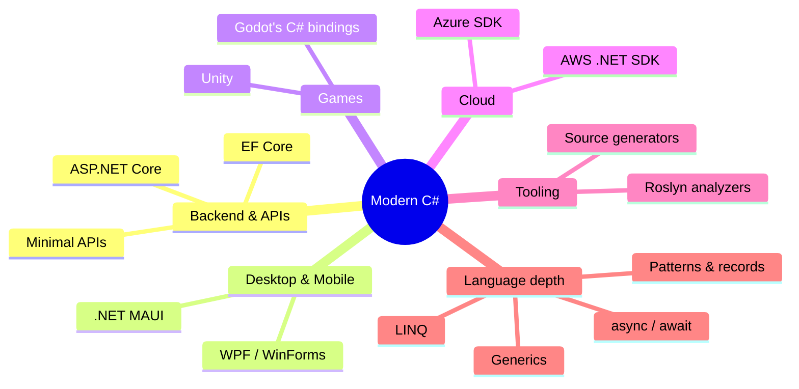

You've just walked a long path:

- **The story** of how C# came to be, from punch cards to .NET 8.
- **Computational thinking** and what programs actually do at
  runtime.
- **Variables, types, and control flow** — the everyday
  vocabulary.
- **Methods and modularity** — small named pieces composed into
  bigger ones.
- **Classes and objects** — bundling state and behavior.
- **Encapsulation, abstraction, inheritance, and polymorphism** —
  the core ideas of OOP.
- **Collections** for organizing data.
- **Error handling, debugging, and resource management** — making
  programs robust.
- **Maintainable code and software organization** — building things
  that age well.
- **A capstone** that pulled it all together.

You're no longer "starting out." You're ready to *build*.

<svg
  viewBox="0 0 640 230"
  role="img"
  aria-label="A single blue dot fans out along three thin lines to three colored doors, each with its own small knob — the course complete, several ways to keep going"
  style={{ display: "block", width: "100%", maxWidth: "640px", height: "auto", margin: "2.5rem auto" }}
>
  <g
    style={{ color: "var(--ds-gray-400)" }}
    fill="none"
    stroke="currentColor"
    strokeWidth="2"
    strokeLinecap="round"
  >
    <path d="M116 118 C 220 92, 330 62, 412 52" />
    <path d="M116 124 C 220 124, 330 122, 412 120" />
    <path d="M116 130 C 220 156, 330 180, 412 188" />
  </g>
  <g style={{ color: "var(--ds-blue-500)" }} fill="currentColor">
    <circle cx="100" cy="124" r="11" />
  </g>
  <g style={{ color: "var(--ds-green-500)" }} fill="currentColor">
    <rect x="420" y="24" width="60" height="56" rx="10" fillOpacity="0.85" />
  </g>
  <g style={{ color: "var(--ds-yellow-500)" }} fill="currentColor">
    <rect x="420" y="92" width="60" height="56" rx="10" fillOpacity="0.85" />
  </g>
  <g style={{ color: "var(--ds-blue-500)" }} fill="currentColor">
    <rect x="420" y="160" width="60" height="56" rx="10" fillOpacity="0.85" />
  </g>
  <g style={{ color: "var(--ds-white)" }} fill="currentColor" fillOpacity="0.9">
    <circle cx="466" cy="52" r="4" />
    <circle cx="466" cy="120" r="4" />
    <circle cx="466" cy="188" r="4" />
  </g>
</svg>

## What level are you at, really?

Honestly: junior developer territory. You'll still find new
syntax (records, pattern matching, LINQ, async/await, generics in
depth) — but you have the *concepts* you need to absorb them
without floundering. Every language feature, no matter how fancy,
will land somewhere in the picture you've built.

## A few directions to grow into

There's no single "next thing." Pick the one that excites you.

### Backend (most common path)

The de-facto path for professional C# is web services with
**ASP.NET Core**. It's fast, free, cross-platform, and runs anywhere.
Start with the official "Minimal API" tutorial; once you're
comfortable, learn **Entity Framework Core** for database access.

### Desktop apps

If you want to build apps people install:

- **.NET MAUI** — modern cross-platform UI (Windows, macOS, iOS,
  Android).
- **WPF / WinForms** — Windows-only, mature, lots of business
  software.
- **Avalonia** — community cross-platform UI framework.

### Games

Many games are written in C#:

- **Unity** uses C# as its scripting language and powers an
  enormous share of indie and AAA titles.
- **Godot** has first-class C# support (alongside its own
  GDScript).

### Cloud and DevOps

Azure has rich first-party C# SDKs, and most major cloud providers
support .NET fully. Once you're comfortable with ASP.NET Core,
hosting it on Azure, AWS, or in Docker becomes straightforward.

## Language features you'll naturally pick up next

Now that the fundamentals are solid, these are worth learning in
roughly this order:

1. **Generics** — `List<T>`, `Dictionary<K,V>` you've already used.
   Now learn to write your own `Cache<T>` or `Repository<T>`.
2. **LINQ** — fluent operations over collections (`.Where`, `.Select`,
   `.GroupBy`). Once it clicks, you'll write half as much code.
3. **`record` and pattern matching** — modern, expressive value
   types and `switch` expressions.
4. **`async` / `await`** — how modern C# does concurrency without
   manual threads.
5. **Nullable reference types** — let the compiler help you avoid
   `NullReferenceException`.
6. **Dependency injection** — the standard way ASP.NET Core glues
   apps together.

Don't rush. Each of these is a small ocean. They reward steady
study and lots of writing-real-code time.

## Habits that compound

Of everything in this course, the chapter on **writing maintainable
software** is the one that will keep paying you back for the rest
of your career. To recap the most important ones:

- **Name things well.** Always.
- **Keep methods small.**
- **Prefer immutability when you can.**
- **Write tests as you go.**
- **Read other people's code.** A lot of it.

## A reading list

A few timeless books that have shaped how good C#/OOP code is
written:

- *Clean Code* by Robert C. Martin — strongly opinionated, very
  influential.
- *Refactoring* by Martin Fowler — naming the moves you'll make
  every day.
- *Code Complete* by Steve McConnell — the classic "how to build
  software" book.
- *The Pragmatic Programmer* by Hunt & Thomas — wisdom that goes
  beyond any single language.
- *Domain-Driven Design Distilled* by Vaughn Vernon — when your
  programs get big enough to need it.

For C# specifically, the **official .NET documentation**
(`learn.microsoft.com/dotnet`) is genuinely excellent. The C# spec
is approachable. The .NET team blogs are worth subscribing to.

## A small parting thought

Programming is one of those rare crafts where the only way to get
better is to write a lot of programs — and the only way to write a
lot of programs you care about is to build things you actually
want to exist.

Build something. Then build something better. Then build something
smaller. Then build something with someone else. The fundamentals
you've practiced here will hold every one of them up.

Welcome to the field.

<Callout type="success">
Course complete. You've gone from "what is a variable?" to
designing and shipping a small, well-organized C# program. Take a
breath, pick a project, and keep going.
</Callout>
