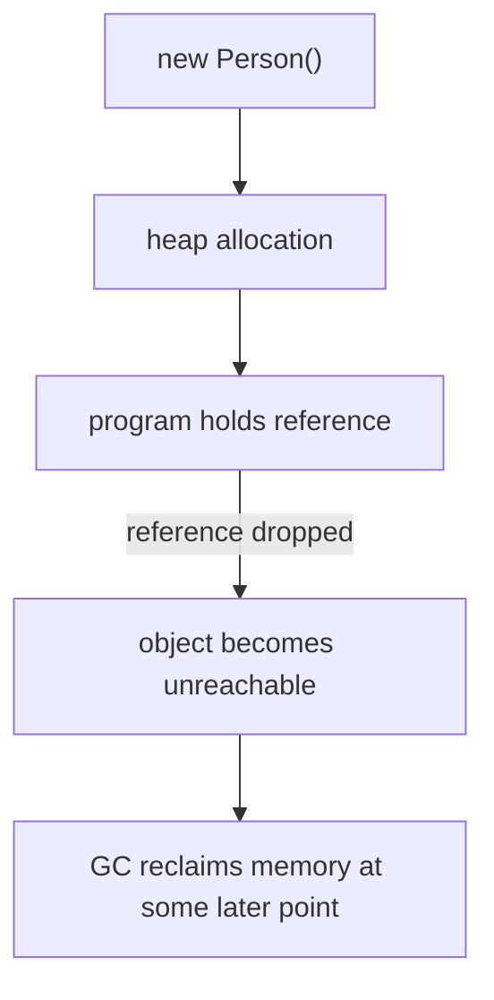
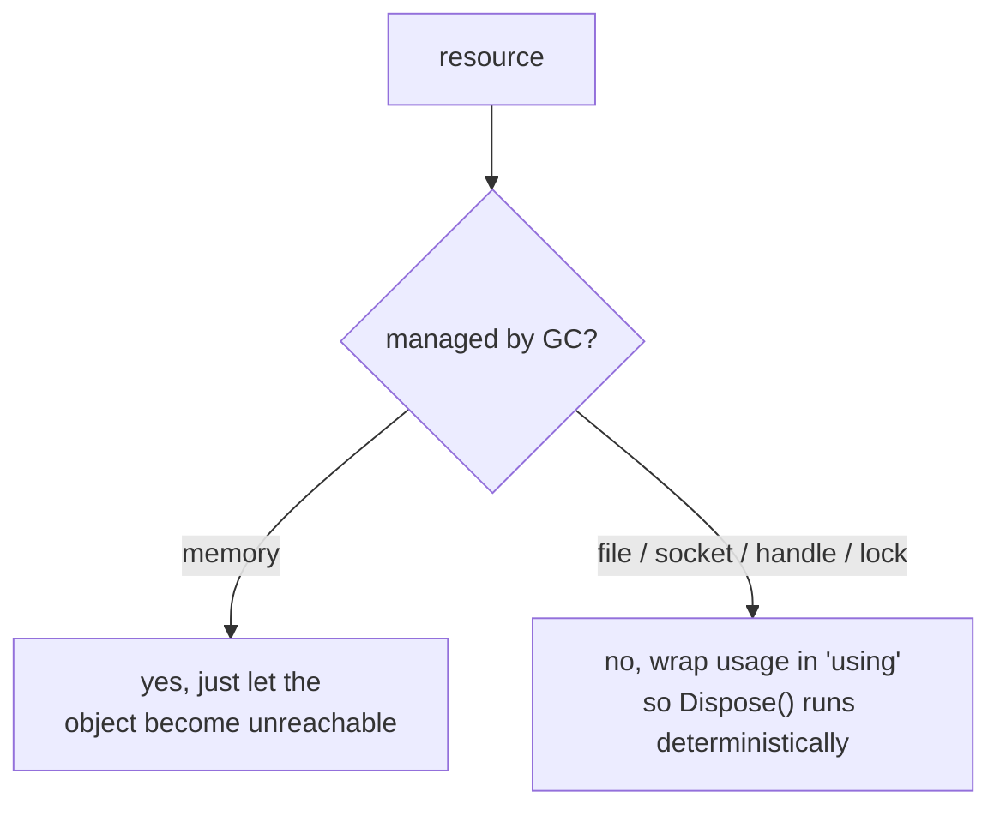

Every program uses **resources**, memory, file handles, network
sockets, database connections, locks. Most of them are *finite*:
the operating system gives you a budget, and if you don't return
what you've borrowed, eventually the program (or the whole
machine) runs out.

<Figure
  slug="mcs-resource-management-cutout"
  alt="Resource management, an isometric illustration"
/>

C# splits resources into two camps:

1. **Memory**, which is reclaimed automatically by the **garbage
   collector** (GC).
2. **Everything else**, usually called **unmanaged resources**,
   which the runtime can *help* you release but can't fully manage
   on its own.

Understanding this split is the foundation of clean, leak-free C#.

## Memory: handled (mostly) for you

In low-level languages like C, you call `malloc` and `free` by
hand. Forget the `free` and you leak memory; double-free and you
corrupt memory.

In C#, when you write `new Person(...)`, the runtime allocates
memory on the heap. When nothing points to that object anymore,
the GC eventually reclaims the space:

Two important consequences:

1. You don't have to (and **shouldn't**) try to free memory yourself.
2. GC runs whenever it decides to, not at a precise moment after the
   object becomes unreachable. So for memory, "when" is fuzzy.

That fuzziness is *fine* for memory. It's a **problem** for the
second category.

## Unmanaged resources: not the GC's job

Consider opening a file. Behind the scenes, the OS gives you a
**file handle**, a small numeric ticket the kernel tracks. The
OS only allows a limited number per process.

If you open a file, never close it, and let the variable go out of
scope, the GC will *eventually* reclaim the .NET object, but it
might be seconds or minutes later. Meanwhile, the file handle is
still held by the OS. Do this in a loop and you'll hit "too many
open files" long before memory becomes a concern.

So C# offers a way to say "I'm done with this resource, release
it *now*, deterministically": the **`IDisposable`** pattern.

## `IDisposable` and `using`

Any class that owns an unmanaged resource implements
`IDisposable` with a `Dispose()` method. You can call `Dispose()`
yourself, but the language has a better tool: the `using`
statement, which guarantees `Dispose()` runs even if an exception
is thrown.

<CodeBlock
  adapter="csharp"
  files={[
    {
      filename: "main.cs",
      starterCode: `using System;

using (var c = new Connection("A"))
{
    c.Send("hello");
    c.Send("world");
} // c.Dispose() runs here, even if an exception was thrown inside the block

Console.WriteLine("done");

public class Connection : IDisposable
{
    public string Name { get; }
    public Connection(string name)
    {
        Name = name;
        Console.WriteLine($"opened {name}");
    }

    public void Send(string msg) => Console.WriteLine($"{Name}: {msg}");

    public void Dispose()
    {
        Console.WriteLine($"closed {Name}");
    }
}
`,
    },
  ]}
/>

Run that. You'll see "closed A" *before* "done", proof that
`Dispose()` ran deterministically at the end of the block.

## The shorter "using declaration"

Modern C# offers an even tidier form: a `using` *declaration*
attached to a local variable. The resource is disposed at the end
of the enclosing scope.

<CodeBlock
  adapter="csharp"
  files={[
    {
      filename: "main.cs",
      starterCode: `using System;

void DoWork()
{
    using var c = new Connection("B");
    c.Send("ping");
    c.Send("pong");
} // c.Dispose() runs here

DoWork();
Console.WriteLine("done");

public class Connection : IDisposable
{
    public string Name { get; }
    public Connection(string name)
    {
        Name = name;
        Console.WriteLine($"opened {name}");
    }
    public void Send(string msg) => Console.WriteLine($"{Name}: {msg}");
    public void Dispose() => Console.WriteLine($"closed {Name}");
}
`,
    },
  ]}
/>

## Why `using` and not just `Dispose()`?

You *could* call `Dispose()` manually:

<CodeBlock
  adapter="csharp"
  expectError
  files={[
    {
      filename: "main.cs",
      starterCode: `using System;

var c = new Connection("C");
try
{
    // ... use c ...
    throw new Exception("boom");
}
finally
{
    c.Dispose(); // we have to remember
}

public class Connection : IDisposable
{
    public string Name { get; }
    public Connection(string name)
    {
        Name = name;
        Console.WriteLine($"opened {name}");
    }
    public void Dispose() => Console.WriteLine($"closed {Name}");
}
`,
    },
  ]}
/>

But `using` *is* exactly that try/finally, written for you and
impossible to forget. Reach for it every time.

## The two-tier picture

Beginners often misremember this and think the GC handles
*everything*. It doesn't. It handles memory. The rest is your job,
made easy by `IDisposable` and `using`.

## Finalizers (briefly)

A class can also have a **finalizer** (`~ClassName()`) that the GC
calls before reclaiming the object, a *last-ditch* chance to
release unmanaged resources if the user forgot to call `Dispose()`.

You will almost never write a finalizer in everyday code. They run
at unpredictable times and add complexity. Use `IDisposable` and
make your callers use `using`.

## Practice (conceptual)

We're running C# inside a browser via WebAssembly here, so we
don't have a real filesystem to open. But you can practice the
**shape** of resource management against a tiny mock:

<CodeBlock
  adapter="csharp"
  files={[
    {
      filename: "main.cs",
      starterCode: `using System;
using System.Collections.Generic;

void Job()
{
    using var log = new Logger("job-1");
    log.Write("start");
    log.Write("doing work");
    log.Write("end");
} // Logger flushed and closed here

Job();
Console.WriteLine("program continues");

public class Logger : IDisposable
{
    public string Name { get; }
    private List<string> _entries = new();

    public Logger(string name)
    {
        Name = name;
        Console.WriteLine($"open {name}");
    }
    public void Write(string s) => _entries.Add(s);
    public void Dispose()
    {
        Console.WriteLine($"flushing {_entries.Count} entries from {Name}");
        Console.WriteLine($"close {Name}");
    }
}
`,
    },
  ]}
/>

The `using` ensures the log is flushed and closed even if `Job()`
threw. That's the whole game.

## A guideline that pays for itself forever

> If a class implements `IDisposable`, treat every instance as
> requiring `using`, unless the documentation explicitly says
> otherwise.

It's a one-line rule that prevents an enormous category of
production bugs.

## Test your understanding

<MultipleChoice
  markdown={`What does the garbage collector reclaim automatically?

- [o] Memory only, other resources still need to be released explicitly, typically via \`IDisposable\` / \`using\`
  > The GC reclaims managed heap memory; file handles, sockets, and locks are not its job.
- Only unmanaged memory
  > It collects managed objects on the .NET heap.
- Variables on the stack
  > The stack is unwound automatically when a method returns; that's not the GC.
- Memory, file handles, and network sockets
  > Just memory.`}
/>

<MultipleChoice
  markdown={`Why is the \`using\` statement preferred over calling \`Dispose()\` manually?

- It doesn't actually call \`Dispose()\`
  > It does, that's the whole point.
- It hides what's happening
  > It makes the intent *clearer*, not more hidden.
- [o] It guarantees \`Dispose()\` runs at the end of the block, even if an exception is thrown, so you can't forget cleanup
  > \`using\` expands to a try/finally that calls \`Dispose()\` for you, so cleanup can't be skipped.
- It's faster
  > Performance is essentially the same.`}
/>
