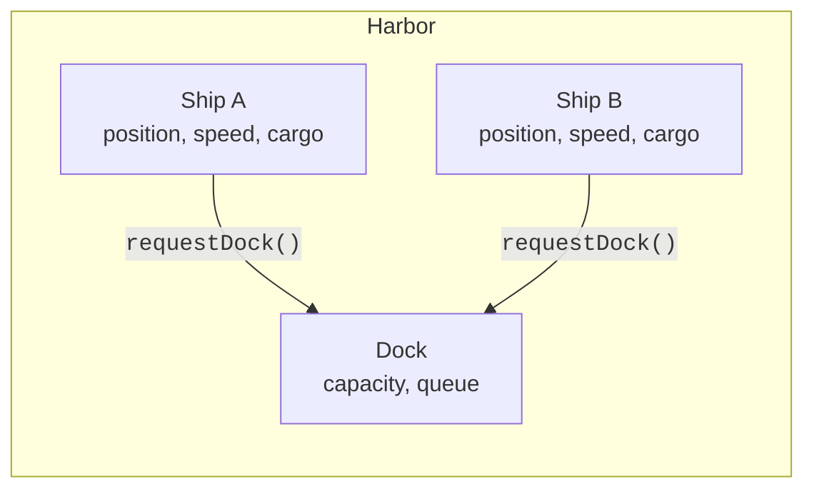
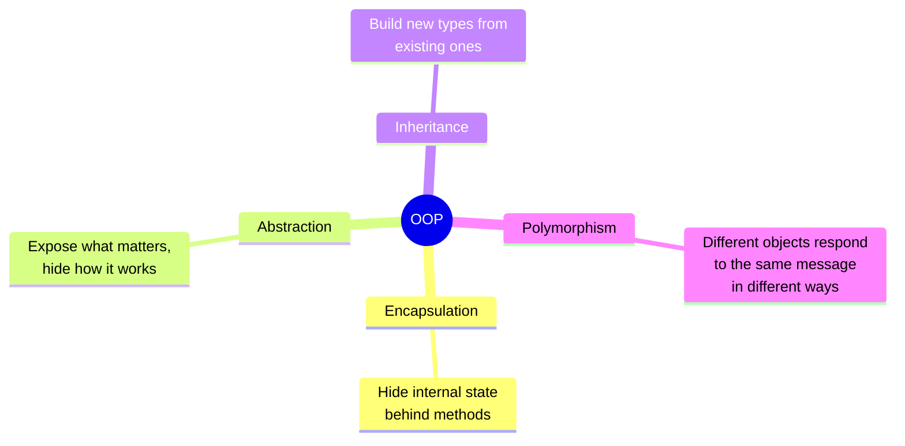

*This is one of the optional deep-dive chapters promised in
[The Road to C#](./the-road-to-csharp) — the long version of a story
told there in two paragraphs.*

The software crisis of the late 1960s left the industry with a
problem: as programs grew, the **procedural style** of "many
functions over shared global data" collapsed under its own weight.
The fix was a different way of organizing programs —
**object-oriented programming**, or **OOP**.

The idea sounds simple once you have heard it:

> Instead of separating *data* and the *functions that act on it*,
> bundle them together into a single thing called an **object**.

That single move, taken seriously, changes almost everything about
how software is structured.

<svg
  viewBox="0 0 640 200"
  role="img"
  aria-label="Loose data dots and behavior bars drifting apart on the left become three sealed capsules on the right, each bundling one dot with its bar — data and functions becoming objects"
  style={{ display: "block", width: "100%", maxWidth: "640px", height: "auto", margin: "2.5rem auto" }}
>
  <g style={{ color: "var(--ds-blue-500)" }} fill="currentColor">
    <circle cx="95" cy="62" r="8" fillOpacity="0.55" />
    <circle cx="160" cy="118" r="8" fillOpacity="0.55" />
    <circle cx="105" cy="162" r="8" fillOpacity="0.55" />
  </g>
  <g style={{ color: "var(--ds-yellow-500)" }} fill="currentColor">
    <rect x="170" y="52" width="28" height="9" rx="4.5" fillOpacity="0.6" />
    <rect x="78" y="106" width="28" height="9" rx="4.5" fillOpacity="0.6" />
    <rect x="196" y="156" width="28" height="9" rx="4.5" fillOpacity="0.6" />
  </g>
  <g fill="currentColor" opacity="0.3">
    <circle cx="268" cy="100" r="3" />
    <circle cx="288" cy="100" r="3" />
    <circle cx="308" cy="100" r="3" />
  </g>
  <polygon points="322,91 322,109 340,100" fill="currentColor" opacity="0.35" />
  <g style={{ color: "var(--ds-green-500)" }} fill="currentColor">
    <rect x="380" y="22" width="160" height="44" rx="22" fillOpacity="0.15" />
    <rect x="380" y="78" width="160" height="44" rx="22" fillOpacity="0.15" />
    <rect x="380" y="134" width="160" height="44" rx="22" fillOpacity="0.15" />
  </g>
  <g style={{ color: "var(--ds-blue-500)" }} fill="currentColor">
    <circle cx="412" cy="44" r="8" />
    <circle cx="412" cy="100" r="8" />
    <circle cx="412" cy="156" r="8" />
  </g>
  <g style={{ color: "var(--ds-yellow-500)" }} fill="currentColor">
    <rect x="444" y="39.5" width="64" height="9" rx="4.5" />
    <rect x="444" y="95.5" width="64" height="9" rx="4.5" />
    <rect x="444" y="151.5" width="64" height="9" rx="4.5" />
  </g>
</svg>

## Simula: simulating the real world

<IllustrationPrompt subject="Ole-Johan Dahl and Kristen Nygaard" photo />

The first object-oriented language was **Simula**, designed in
Norway by **Ole-Johan Dahl** and **Kristen Nygaard** in the 1960s.
Simula was created to simulate real-world systems — ships docking in
a harbor, customers queueing at a bank, particles in a physics
experiment.

When you simulate the real world, you very quickly notice that the
world isn't made of *functions and global variables*. The world is
made of **things** — ships, customers, particles — and each thing
has its own state and its own behavior.



Dahl and Nygaard's insight was: let's just *say that* in the
language. A ship is a `Ship`. It carries its own data and its own
behavior with it. That single idea — packaging data and behavior
together — is the heart of OOP.

## Smalltalk: everything is an object

<IllustrationPrompt subject="Alan Kay" photo />

A few years later in California, **Alan Kay** and his colleagues at
**Xerox PARC** built **Smalltalk**, a language and environment that
pushed the idea to its limit: in Smalltalk, *everything is an
object* — numbers, text, even the code itself. Objects communicated
by **sending messages** to each other.

Smalltalk also gave us many other ideas we now take for granted:
the graphical user interface with overlapping windows, the
WYSIWYG editor, and the mouse. It is no exaggeration to say that
the way you interact with your computer right now traces back to
that lab.

## What an "object" actually is

Forget the jargon for a moment. An **object** is just:

1. **Some data** ("state") that the object owns.
2. **Some operations** ("behavior", or "methods") that act on that
   data.
3. A **boundary** that prevents outsiders from messing with the
   data directly.

Here is one of the simplest possible objects in C#: a counter that
can be incremented and read, but never reset to a nonsense value.

<CodeBlock
  adapter="csharp"
  files={[
    {
      filename: "main.cs",
      starterCode: `using System;

class Counter
{
    // STATE: the data this object owns.
    private int count;

    // BEHAVIOR: operations the outside world is allowed to perform.
    public void Increment()
    {
        count++;
    }

    public int Value()
    {
        return count;
    }
}

class Program
{
    static void Main()
    {
        var c = new Counter();
        c.Increment();
        c.Increment();
        c.Increment();
        Console.WriteLine($"count = {c.Value()}");
    }
}
`,
    },
  ]}
/>

Look closely:

- The variable `count` is marked `private`. Code *outside* the
  `Counter` class cannot reach in and assign `count = -999`. The
  only way to change `count` is to call `Increment`.
- `Increment` and `Value` are marked `public`. They are the
  **interface** the rest of the program is allowed to use.
- The class itself is the *boundary*.

That tiny example contains the entire seed of OOP. Everything else —
inheritance, polymorphism, design patterns — is just elaboration on
this idea.

## Procedural vs object-oriented, side by side

Imagine modeling a bank account. The procedural way might look like
this (in pseudocode):

```text
balance = 0

function deposit(amount):
    balance = balance + amount

function withdraw(amount):
    balance = balance - amount   # oops: no check!
```

Nothing stops someone, somewhere, from writing `balance = -1000000`
directly. The "rule" that a balance cannot go negative lives in a
comment, not in the code.

The object-oriented way:

<CodeBlock
  adapter="csharp"
  files={[
    {
      filename: "main.cs",
      starterCode: `using System;

class BankAccount
{
    private decimal balance; // hidden — nobody outside can touch it

    public void Deposit(decimal amount)
    {
        if (amount <= 0)
            throw new ArgumentException("must be positive");
        balance += amount;
    }

    public bool Withdraw(decimal amount)
    {
        if (amount <= 0)
            throw new ArgumentException("must be positive");
        if (amount > balance)
            return false; // refuse to go negative
        balance -= amount;
        return true;
    }

    public decimal Balance() => balance;
}

class Program
{
    static void Main()
    {
        var a = new BankAccount();
        a.Deposit(100m);
        Console.WriteLine($"balance after deposit: {a.Balance()}");
        bool ok = a.Withdraw(1000m);
        Console.WriteLine($"big withdraw allowed? {ok}");
        Console.WriteLine($"final balance: {a.Balance()}");
    }
}
`,
    },
  ]}
/>

The rule "balance is never negative" is now **enforced by the
class itself**. There is no path through the public API that can
break it. That is the gift of OOP.

## The four ideas you keep hearing about

OOP is usually summarized with four words. We will spend whole
pages on each later in the course. For now, just a one-line
preview:



- **Encapsulation.** Each object hides its data behind a small
  interface of methods. (You just saw this with `BankAccount`.)
- **Abstraction.** You can use an object without knowing how it
  works internally. You drive a car without knowing how the engine
  is built.
- **Inheritance.** You can build a new kind of object on top of an
  existing one. A `SavingsAccount` *is a* `BankAccount` with
  interest.
- **Polymorphism.** The same call (`account.Withdraw(50)`) can do
  different things depending on which *kind* of account it is.

## Why OOP became dominant

By the late 1980s and 1990s, OOP had been picked up and refined by
**C++** (a superset of C with classes, designed by Bjarne
Stroustrup) and then by **Java** (1995, designed by James Gosling
at Sun Microsystems). Big companies bet enormous amounts of money
on OOP because it offered something procedural code couldn't:

- A way to *structure* very large codebases.
- A way to *reuse* code across projects.
- A way to *enforce* rules at the language level instead of in a
  comment.

When Microsoft eventually designed C#, OOP was the default
assumption. C# was object-oriented from line one — which is why you
spent a large part of this course learning to think in objects. The
`Counter` and `BankAccount` you met in the Objects section of this
course are direct descendants of the ships Dahl and Nygaard
simulated in a Norwegian harbor sixty years ago.

## Test your understanding

<MultipleChoice
  markdown={`What is the single most important idea introduced by object-oriented programming?

- Programs run faster
  > OOP doesn't fundamentally change how fast code runs.
- Computers can be replaced more often
  > Unrelated.
- [o] Data and the operations that act on it are bundled together, with a boundary that prevents outsiders from changing the data directly
  > That is the seed idea — every other OOP concept is built on top of it.
- Programs no longer need variables
  > They very much do; OOP is about organizing them, not removing them.`}
/>

<MultipleChoice
  markdown={`In the \`BankAccount\` example, why is \`balance\` declared \`private\`?

- The compiler is faster on private fields
  > Performance is not the reason.
- Private fields take less memory
  > Visibility doesn't change memory size.
- [o] So no code outside \`BankAccount\` can bypass the rules in \`Deposit\` and \`Withdraw\` and corrupt the balance
  > \`private\` is what gives the class authority to enforce its own invariants.
- C# requires every field to be private
  > It doesn't — \`public\` and other modifiers are also allowed; you choose deliberately.`}
/>
