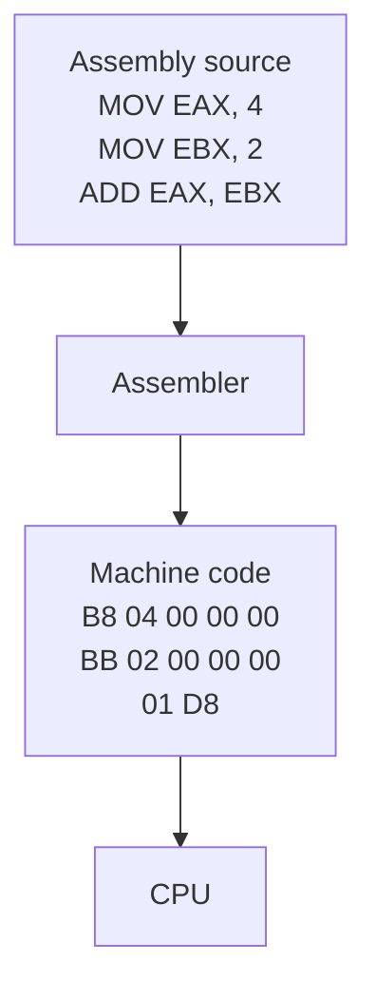
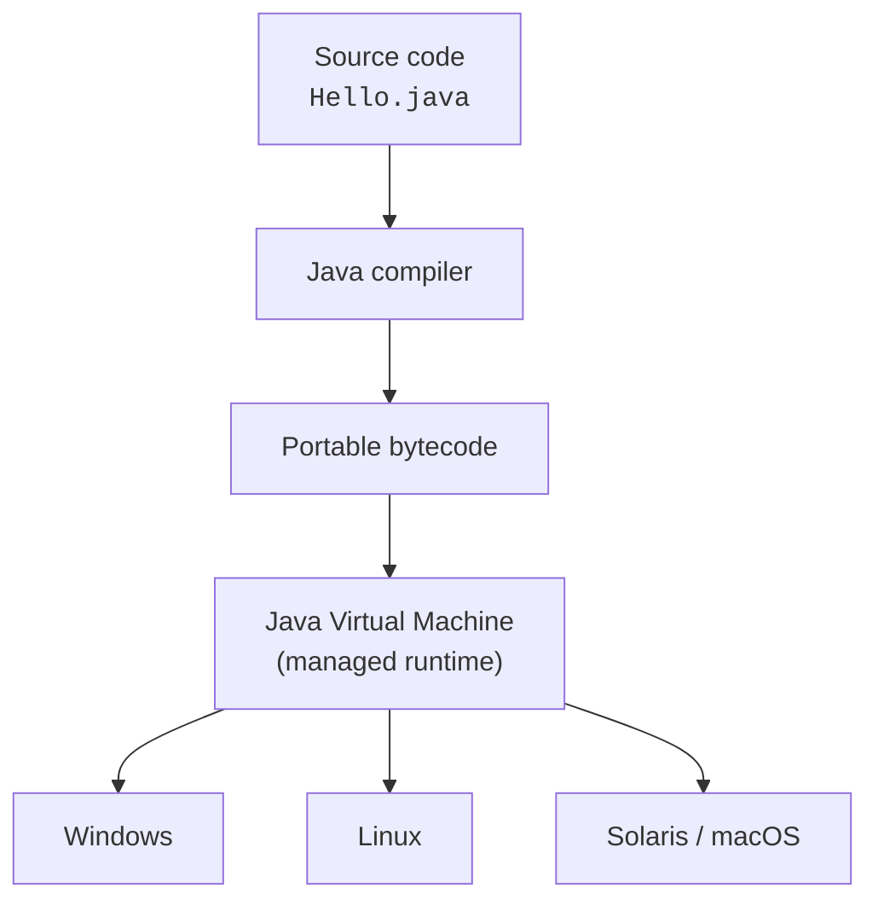
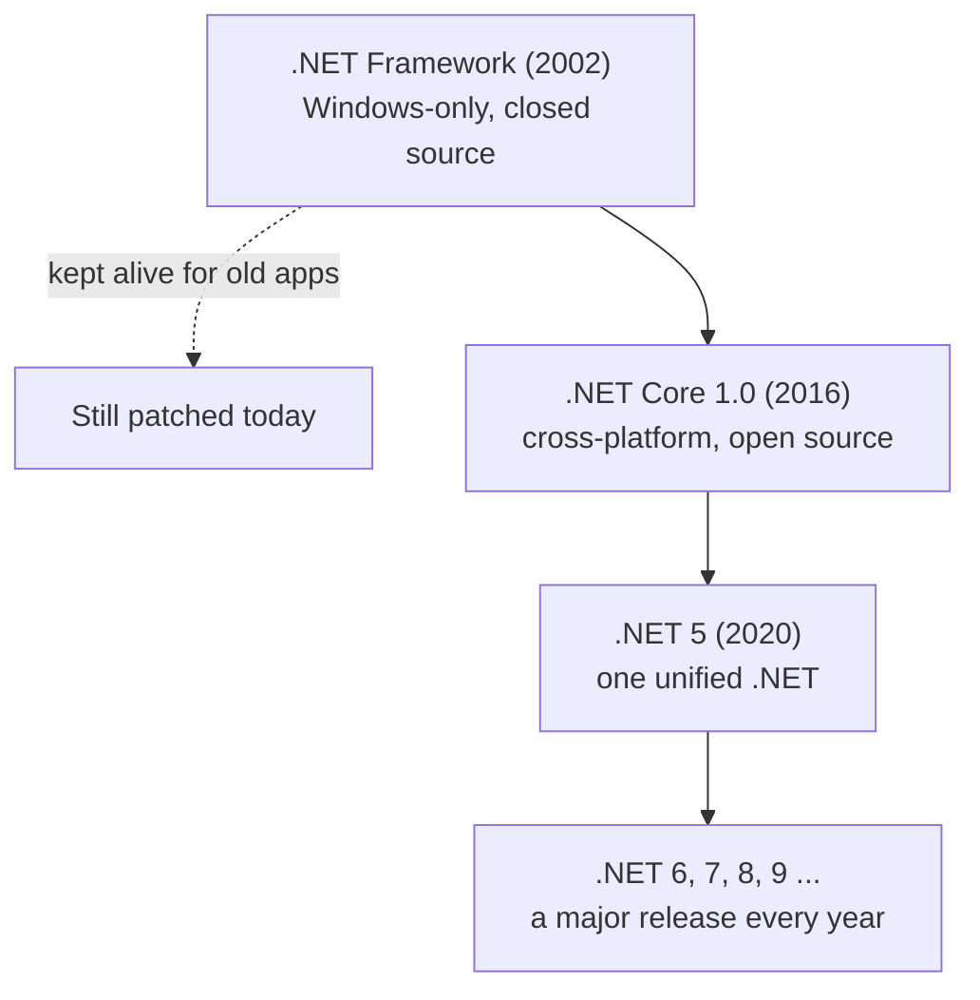

Every feature of C# is a scar from an old wound. The garbage
collector exists because a generation of programmers lost years of
their lives to memory bugs. Classes exist because thousand-function
programs collapsed under their own weight. The runtime exists
because one language terrified Microsoft into reinventing itself.

You don't need the full fifty-year history to write C# — but
knowing the story turns the language from an arbitrary pile of rules
into a series of sensible answers. This chapter is that story, told
quickly. (If you enjoy it, four longer chapters at the end of the
course — collected under *Interesting discussions* — tell the best
parts properly: [the birth of objects](./rise-of-oop),
[Java and managed runtimes](./java-and-managed-runtimes),
[Anders Hejlsberg](./anders-and-birth-of-csharp), and
[.NET's open-source rebirth](./evolution-of-dotnet).)

<svg
  viewBox="0 0 640 230"
  role="img"
  aria-label="Three block towers along a ground line, growing from a tidy pair of blocks into a tall teetering jumble with one red block wedged in — programs swelling from hundreds of lines into millions"
  style={{ display: "block", width: "100%", maxWidth: "640px", height: "auto", margin: "2.5rem auto" }}
>
  <rect x="60" y="202" width="520" height="4" rx="2" fill="currentColor" opacity="0.2" />
  <g style={{ color: "var(--ds-green-500)" }} fill="currentColor">
    <rect x="96" y="180" width="48" height="18" rx="4" />
    <rect x="96" y="158" width="48" height="18" rx="4" fillOpacity="0.6" />
  </g>
  <g style={{ color: "var(--ds-blue-500)" }} fill="currentColor">
    <rect x="244" y="180" width="48" height="18" rx="4" />
    <rect x="249" y="158" width="48" height="18" rx="4" fillOpacity="0.85" />
    <rect x="241" y="136" width="48" height="18" rx="4" fillOpacity="0.7" />
    <rect x="250" y="114" width="48" height="18" rx="4" fillOpacity="0.55" />
    <rect x="245" y="92" width="48" height="18" rx="4" fillOpacity="0.4" />
  </g>
  <g style={{ color: "var(--ds-blue-500)" }} fill="currentColor">
    <rect x="436" y="180" width="52" height="18" rx="4" />
    <rect x="430" y="158" width="52" height="18" rx="4" fillOpacity="0.85" />
    <rect x="442" y="136" width="52" height="18" rx="4" fillOpacity="0.75" transform="rotate(-3 468 145)" />
    <rect x="432" y="113" width="52" height="18" rx="4" fillOpacity="0.6" transform="rotate(4 458 122)" />
    <rect x="446" y="68" width="52" height="18" rx="4" fillOpacity="0.45" transform="rotate(7 472 77)" />
    <rect x="452" y="44" width="52" height="18" rx="4" fillOpacity="0.3" transform="rotate(-8 478 53)" />
  </g>
  <g style={{ color: "var(--ds-red-500)" }} fill="currentColor">
    <rect x="438" y="90" width="52" height="18" rx="4" transform="rotate(-6 464 99)" />
  </g>
  <g style={{ color: "var(--ds-yellow-500)" }} fill="currentColor">
    <circle cx="530" cy="36" r="5" fillOpacity="0.8" />
    <circle cx="548" cy="62" r="4" fillOpacity="0.5" />
  </g>
</svg>

## From wires to words

The earliest computers were programmed by **rewiring them**.
Programmers like Grace Hopper and the women of ENIAC connected
cables and flipped switches by hand to set up one specific
calculation; running a different one meant physically rebuilding
the machine's "program."

The first leap was storing the program as **numbers in memory** —
machine code. The second was **assembly language**, which gave
those numbers human-readable names: instead of `B8 04`, you wrote
`MOV EAX, 4`, and a small program called an assembler translated it
back.



Assembly was readable, but it was still chained to one specific
CPU. The third leap broke that chain: **high-level languages** like
Fortran (1957), COBOL (1959), and later C (1972) let you write
something close to mathematical notation and let a **compiler**
translate it for whatever machine you owned. Here is that
fifty-year-old idea, expressed in the language you're about to
learn — press **Run**:

<CodeBlock
  adapter="csharp"
  files={[
    {
      filename: "main.cs",
      starterCode: `using System;

int total = 0;
for (int i = 1; i <= 100; i++)
{
    total = total + i;
}

Console.WriteLine($"total = {total}");
`,
    },
  ]}
/>

No registers, no CPU model, no wiring diagram. You describe the
*algorithm*; the toolchain handles the machine. Every language in
use today stands on this idea.

## The software crisis

High-level languages made programs easier to write — so the world
immediately wrote vastly more of them. By the late 1960s, operating
systems, banking systems, and airline booking systems had grown to
hundreds of thousands of lines, almost all in the **procedural**
style: long lists of functions reading and writing a shared pile of
global variables. Any function could change any variable. A bug in
one corner corrupted data in another. Adding a feature broke three
others.

It got bad enough that in 1968, NATO convened a conference of
senior engineers in Garmisch, Germany, where the industry admitted
something embarrassing in public: **we do not actually know how to
build large software reliably.** They named the problem the
**software crisis**, and the phrase stuck.

Two responses to that crisis shaped everything that followed:

1. **Object-oriented programming.** Beginning with the Norwegian
   simulation language **Simula** and crystallized at Xerox PARC in
   **Smalltalk**, OOP proposed bundling data together with the code
   that's allowed to touch it — so the rules about a bank balance
   live *inside* the account, not scattered across five hundred
   functions. We'll spend a whole section of this course learning to
   think this way; the [full origin story](./rise-of-oop) is in the
   discussions section.
2. **Managed runtimes.** If programmers keep making the same memory
   and type mistakes, let a layer of software *between the program
   and the machine* make those mistakes impossible. This idea took
   thirty years to go mainstream — and the language that finally
   mainstreamed it is the reason C# exists.

<Callout type="info" title="Why this matters for C#">
Every major language designed after 1970 — C++, Java, Python, and
C# — is shaped by the software crisis. Encapsulation, types,
classes, garbage collection, and exceptions are all answers to
"how do we stop large programs from collapsing?"
</Callout>

## Java changes the rules

In 1995, **Sun Microsystems** released **Java**, created by James
Gosling's team. Java's killer idea was that programs were not
compiled to machine code at all. They compiled to a portable
intermediate **bytecode** that ran on the **Java Virtual Machine**
(JVM) — a managed runtime that allocated memory for you, freed it
for you (the **garbage collector**), and refused to let a wrong
pointer corrupt anything. One compiled program ran on Windows,
Linux, or Solaris, unchanged. Sun marketed it relentlessly:
**"Write Once, Run Anywhere."**



Banks, telecoms, and governments adopted Java at a pace few
languages have matched, before or since. And this terrified
Microsoft — for a structural reason. Microsoft's business stood on
Windows: if applications could be written once and run anywhere,
then *Windows stopped mattering*. Worse, Microsoft's own developer
tools each had a hole. **Visual C++** was powerful but unsafe —
pointer bugs and memory leaks were daily life. **Visual Basic** was
delightfully productive but didn't scale to large systems.
**Visual J++**, Microsoft's licensed Java, filled the gap — until
Microsoft added Windows-specific extensions, Sun sued for breaching
the license, and a multi-year legal battle ended with Microsoft
effectively exiled from the Java world.

So at the turn of the millennium, Microsoft faced a choice: live
with a hostile dependence on a competitor's platform, or build its
own managed runtime, with its own flagship language. It chose to
build. (The [full Java story](./java-and-managed-runtimes) — and a
proper explanation of what "managed" means — is in the discussions
section, and the next part of this course returns to managed
runtimes in depth.)

## .NET and the language designed by a toolmaker

Microsoft announced **.NET** in 2000 and shipped it in 2002. The
architecture deliberately echoed the JVM — a managed runtime called
the **CLR** (Common Language Runtime), a portable intermediate
language, a garbage collector, a giant "batteries included"
standard library — with one distinctive twist: the runtime was
designed from day one to host **many languages** that share one
type system. A class written in C# can be used from F# or VB.NET
with no glue code at all.

The flagship language needed a designer, and Microsoft had hired a
legendary one: **Anders Hejlsberg**, the Danish engineer behind
**Turbo Pascal** — the beloved $50 compiler of the 1980s that could
compile a program faster than its competitors could even load — and
later Borland's **Delphi**. Hejlsberg had spent his whole career on
the same three obsessions: fast compilers, tooling-friendly
languages, and pragmatism over purity. He poured them into the new
language, initially code-named "Cool," shipped in 2002 as **C# 1.0**.

You will feel his taste on every page of this course. C# is
statically typed but lets you write `var` and have the compiler
infer the type. Its syntax is designed so editors can autocomplete
and refactor confidently. Its features — `async`/`await`, LINQ,
records, pattern matching — were each added to dissolve a specific,
everyday frustration. (A decade later, the same man designed
**TypeScript**. If you ever learn it, you'll recognize the
handwriting. [His full story](./anders-and-birth-of-csharp) is in
the discussions section.)

## The rebirth: open source and everywhere

The .NET of 2002 had one strategic flaw baked in: it was
**Windows-only** and closed-source — and the world spent the next
fifteen years moving to everything-*but*-Windows. The cloud ran on
Linux servers. Developers bought MacBooks. Phones ran iOS and
Android.

The community saw it first: Miguel de Icaza's open-source **Mono**
project — version 1.0 shipped in 2004 — reimplemented .NET for
Linux and macOS, and ended up powering Xamarin's mobile apps and
the **Unity** game engine, which is why millions of game developers
write C# today.
Microsoft itself turned around under Satya Nadella, who became CEO
in 2014 and declared, to widespread disbelief, that "Microsoft
loves Linux." The company then did something genuinely radical: it
rebuilt .NET from scratch as a **cross-platform, open-source**
project on GitHub.



That modern .NET — the one this course teaches — runs on Windows,
Linux, macOS, and even **WebAssembly**, which is how every example
on this site compiles and runs *inside your browser*. The language
modernized along with the runtime. Compare the original C# 1.0
ceremony:

```csharp
using System;

namespace HelloApp
{
    class Program
    {
        static void Main(string[] args)
        {
            Console.WriteLine("Hello, World!");
        }
    }
}
```

…with the modern equivalent, which you can run right here:

<CodeBlock
  adapter="csharp"
  files={[
    {
      filename: "main.cs",
      starterCode: `using System;

Console.WriteLine("Hello, World!");
`,
    },
  ]}
/>

Both compile to the same thing. The second simply stopped making
you say things the compiler already knew. That, in one example, is
the direction C# has moved for twenty years. (The
[full rebirth story](./evolution-of-dotnet) is in the discussions
section.)

## Why C#, now

So where does that leave you, the person learning to program in the
2020s? With one of the most broadly useful languages in existence.
C# is the default language for enterprise backends (ASP.NET Core),
the scripting language of the world's most-used game engine
(Unity), a first-class citizen on every major cloud, and the
workhorse behind an enormous hidden iceberg of internal business
software. The job market for it is not the flashiest in any given
year — it is something better: reliably strong, at every seniority
level, year after year.

And modern C# is no longer just "the OOP language." It grew into a
**multi-paradigm** language. Here is the same problem solved three
ways — imperative, functional, and object-oriented — in one
program:

<CodeBlock
  adapter="csharp"
  files={[
    {
      filename: "main.cs",
      starterCode: `using System;
using System.Linq;

int[] xs = { 3, 1, 4, 1, 5, 9, 2, 6, 5, 3 };

// 1. Imperative: spell out the steps
int sumImp = 0;
foreach (var x in xs)
{
    if (x % 2 == 0)
        sumImp += x;
}
Console.WriteLine($"imperative sum of evens: {sumImp}");

// 2. Functional / declarative with LINQ: describe the result
int sumFn = xs.Where(x => x % 2 == 0).Sum();
Console.WriteLine($"LINQ sum of evens:       {sumFn}");

// 3. Object-oriented: wrap the data and behavior together
var stats = new Stats(xs);
Console.WriteLine($"OO sum of evens:         {stats.SumOfEvens()}");

class Stats
{
    private readonly int[] data;
    public Stats(int[] data)
    {
        this.data = data;
    }
    public int SumOfEvens() => data.Where(x => x % 2 == 0).Sum();
}
`,
    },
  ]}
/>

Same answer, three styles, one language. You will learn all three
in this course — and more importantly, you'll learn when each one
is the clearest tool.

That's the story. A crisis, a threat, a toolmaker, and a rebirth —
and at the end of it, a safe, fast, productive language waiting in
your browser. Next, we set the history aside and start building the
mental habits programming actually runs on: **computational
thinking**.

## Test your understanding

<MultipleChoice
  markdown={`What was the core complaint of the 1968 "software crisis"?

- Computers were too slow to run large programs
  > Hardware was improving rapidly; the machines weren't the bottleneck.
- Programming languages were too high-level
  > The complaint pointed the other way — the tools and styles weren't powerful enough to *organize* big programs.
- [o] As programs grew, the dominant style — procedural code over shared global state — became impossible to maintain reliably
  > That admission drove the search for better organizing principles, which led to object-oriented programming and, eventually, languages like C#.
- There weren't enough programmers being trained
  > Workforce size was a separate concern; the crisis was about the *practice* of building software.`}
/>

<MultipleChoice
  markdown={`Why did Java alarm Microsoft enough to trigger the creation of .NET and C#?

- Java programs ran faster than anything Microsoft offered
  > Speed was not the issue — early Java was actually fairly slow.
- [o] Java's "Write Once, Run Anywhere" model meant applications no longer needed Windows, striking at the platform Microsoft's business stood on — and a lawsuit had pushed Microsoft out of the Java world
  > The threat was strategic. Microsoft needed its own managed platform and its own flagship language, on its own terms.
- Java was free and Microsoft's tools were expensive
  > Pricing wasn't the decisive factor.
- Sun Microsystems tried to buy Microsoft
  > That never happened.`}
/>

<MultipleChoice
  markdown={`What changed between the original .NET Framework (2002) and the modern .NET this course uses?

- Nothing — only the name changed
  > The differences are substantial and structural.
- Modern .NET dropped support for C#
  > C# remains the flagship language.
- [o] .NET went from Windows-only and closed-source to cross-platform and open-source, rebuilt as .NET Core and unified as .NET 5+, with a major release every year
  > This rebirth is why C# now runs on Linux servers, Macs, game consoles, and even the WebAssembly runtime executing the examples on this page.
- Modern .NET removed the garbage collector
  > The GC is still central to the platform.`}
/>
