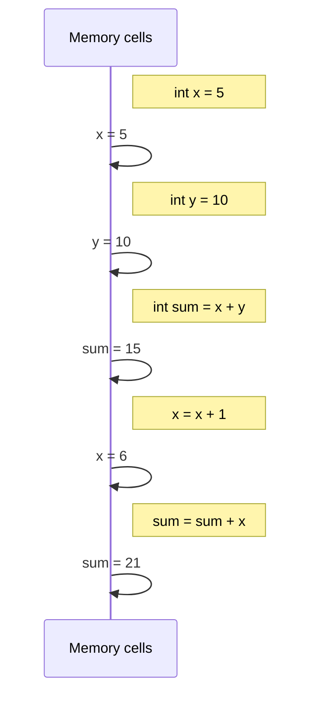

This is the first hands-on programming chapter. Everything that
follows in the course builds on this single idea: a **variable** is
a *named box* somewhere in memory that holds a value of a known
**type**.

<Figure
  slug="mcs-variables-and-memory-cutout"
  alt="Variables and memory, an isometric illustration"
/>

If you only take three things from this page, take these:

1. A variable is a *name* the compiler gives to a *piece of memory*.
2. Every variable in C# has a *type*, the compiler always knows it.
3. Assignment `x = y` copies a value from one box into another (for
   value types) or copies a *reference* (for reference types, more
   on that next chapter).

## Declaring and using variables

<CodeBlock
  adapter="csharp"
  files={[
    {
      filename: "main.cs",
      starterCode: `using System;

int age = 30;
double price = 19.99;
string name = "Ada";
bool isAdmin = true;

Console.WriteLine($"{name} is {age} years old.");
Console.WriteLine($"price = {price}, admin? {isAdmin}");
`,
    },
  ]}
/>

Read each declaration left to right:

- `int age = 30;`, "make a variable named `age`, of type `int`,
  whose initial value is `30`."
- `double price = 19.99;`, "of type `double`" (floating-point
  number).
- `string name = "Ada";`, "of type `string`."
- `bool isAdmin = true;`, "of type `bool`."

Once a variable has a type, it keeps that type *forever*. You
cannot later put a string into `age`.

```csharp
int age = 30;
age = "thirty";   // ❌ does not compile
```

The compiler refuses. That refusal is a feature, not an
annoyance, it prevents whole categories of bugs.

## `var`: let the compiler figure it out

Repeating the type name on both sides can feel noisy:

```csharp
List<string> names = new List<string>();
```

C# lets you replace the left-hand type with `var`. The variable is
*still* statically typed, the compiler just figures the type out
from the right-hand side.

<CodeBlock
  adapter="csharp"
  files={[
    {
      filename: "main.cs",
      starterCode: `using System;
using System.Collections.Generic;

var age = 30;                   // compiler infers: int
var name = "Ada";               // compiler infers: string
var names = new List<string>(); // compiler infers: List<string>

names.Add(name);

Console.WriteLine($"age type:   {age.GetType()}");
Console.WriteLine($"name type:  {name.GetType()}");
Console.WriteLine($"names type: {names.GetType()}");
`,
    },
  ]}
/>

`var` is a convenience, not a way to opt out of types. `age` is
just as much an `int` as if you'd written `int age`.

## What does a variable look like in memory?

Imagine memory as a long strip of numbered cells. When you write
`int age = 30;`, the compiler picks a cell (or a few cells), labels
it `age`, and writes the number `30` into it.

<Figure
  slug="mcs-variables-and-memory-inline-cutout"
  alt="A name plate on a stand joined by a short cord to a locker in a row of lockers, the plate moved to a different locker while both lockers stay put"
/>

| Variable | Value |
| --- | --- |
| `age` | `30` |
| `price` | `19.99` |
| `name` | `'Ada'` |
| `isAdmin` | `true` |

That is slightly oversimplified, strings and lists
actually live on the *heap*, with a small reference on the stack
pointing to them, but for value types like `int` and `bool` it's
exactly right.

When you write:

```csharp
age = 31;
```

…you don't make a new box. You **overwrite** the existing box.
`age` now holds `31`.

## Constants and read-only variables

Sometimes you want a value that you absolutely cannot change after
it's set. C# gives you two tools.

`const`, set at compile time, never changes:

<CodeBlock
  adapter="csharp"
  files={[
    {
      filename: "main.cs",
      starterCode: `using System;

const double Pi = 3.14159;
const int MaxRetries = 5;

Console.WriteLine($"Pi = {Pi}, max retries = {MaxRetries}");

// Pi = 3.0;   // would not compile
`,
    },
  ]}
/>

`readonly`, set once, usually in a constructor (we'll see this
later with classes). It's the same *intent* as `const`, but works
for values you can't know at compile time.

Use these freely. A variable that *can't* change is a variable
that can't be wrong later.

## Scope: where a variable is visible

A variable is only visible inside the **block** where it was
declared. A block is a section of code surrounded by `{ }`.

<CodeBlock
  adapter="csharp"
  files={[
    {
      filename: "main.cs",
      starterCode: `using System;

int outer = 10;

if (outer > 5)
{
    int inner = 99;
    Console.WriteLine($"inside: outer={outer}, inner={inner}");
}

Console.WriteLine($"outside: outer={outer}");
// Console.WriteLine(inner);   // ❌ would not compile, 'inner' is out of scope
`,
    },
  ]}
/>

This is a *good* thing. Limiting how widely a variable is visible
makes programs much easier to understand. We will spend most of the
course trying to make scopes as small as possible.

## A trace of values changing

Let's do a small trace of how the variables in this program evolve:

<CodeBlock
  adapter="csharp"
  files={[
    {
      filename: "main.cs",
      starterCode: `using System;

int x = 5;
int y = 10;
int sum = x + y;
x = x + 1;
sum = sum + x;

Console.WriteLine($"x = {x}");
Console.WriteLine($"y = {y}");
Console.WriteLine($"sum = {sum}");
`,
    },
  ]}
/>

Step-by-step view of memory:



Trace it on paper if it isn't obvious yet. *Reading code in this
"what's in each box right now?" way* is one of the most valuable
skills you can build.

## Common primitive types you'll use constantly

| Type    | Holds                                    | Example literal |
|---------|------------------------------------------|-----------------|
| `int`   | 32-bit whole number                       | `42`            |
| `long`  | 64-bit whole number                       | `42L`           |
| `double`| 64-bit floating-point number              | `3.14`          |
| `decimal` | High-precision decimal (money!)         | `19.99m`        |
| `bool`  | `true` or `false`                         | `true`          |
| `char`  | One Unicode character                     | `'A'`           |
| `string`| Sequence of characters                    | `"hello"`       |

A few small rules:

- For money, prefer `decimal` over `double`. `double` has
  rounding quirks for things like `0.1 + 0.2`.
- `string` is technically a *reference* type but it acts like a
  value most of the time (we'll explain that in the next chapter).
- `int` is the default integer; use it unless you need something
  bigger.

<CodeBlock
  adapter="csharp"
  files={[
    {
      filename: "main.cs",
      starterCode: `using System;

double cents = 0.1 + 0.2;
decimal pennies = 0.1m + 0.2m;

Console.WriteLine($"double  : 0.1 + 0.2 = {cents}");
Console.WriteLine($"decimal : 0.1 + 0.2 = {pennies}");
`,
    },
  ]}
/>

If that output surprises you, great, that surprise is exactly why
this rule matters.

## Practice

<ChallengeCard
  adapter="csharp"
  title="Swap two variables"
  instructions={`Two variables \`a\` and \`b\` are declared and given values \`10\` and \`20\`. Write code so that after your code runs, \`a\` holds the old value of \`b\` (i.e. \`20\`) and \`b\` holds the old value of \`a\` (i.e. \`10\`).

You must **not** change the \`Console.WriteLine\` lines at the bottom. The expected output is exactly:

\`\`\`
a = 20
b = 10
\`\`\`

Hint: you'll need a temporary variable.`}
  files={[
    {
      filename: "main.cs",
      starterCode: `using System;

int a = 10;
int b = 20;

// your code here

Console.WriteLine($"a = {a}");
Console.WriteLine($"b = {b}");
`,
      solutionCode: `using System;

int a = 10;
int b = 20;

int tmp = a;
a = b;
b = tmp;

Console.WriteLine($"a = {a}");
Console.WriteLine($"b = {b}");
`,
    },
  ]}
  tests={[
    {
      id: "swap",
      name: "Outputs `a = 20` and `b = 10`",
      description: "Variables were swapped correctly",
      expect: { stdoutLines: ["a = 20", "b = 10"], stdoutLinesExact: true },
    },
  ]}
/>

## Test your understanding

<MultipleChoice
  markdown={`What does \`var x = 42;\` do?

- It creates a variable with no type
  > Every C# variable has a type.
- It creates a variable whose type can change later
  > It cannot.
- It creates a runtime-only variable
  > That would be \`dynamic\`, which is a different feature.
- [o] It creates a statically typed \`int\` variable; the compiler infers the type from the literal \`42\`
  > \`var\` is shorthand for "let the compiler write the type for me."`}
/>

<MultipleChoice
  markdown={`Why prefer \`decimal\` over \`double\` for money?

- \`decimal\` uses less memory
  > It uses more.
- They're the same, pick either one
  > They behave differently for fractions, which is exactly why money needs \`decimal\`.
- \`decimal\` is faster
  > It's actually slower than \`double\`.
- [o] \`double\` has small rounding errors for decimal fractions (e.g., \`0.1 + 0.2 != 0.3\`); \`decimal\` is exact for the decimal numbers humans care about
  > \`decimal\` stores base-10 fractions precisely, so money amounts add up correctly.`}
/>
