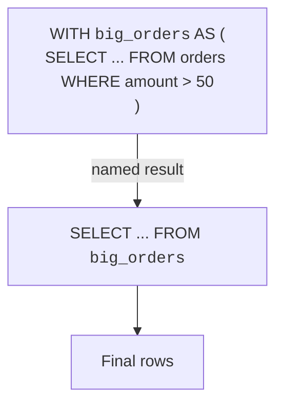
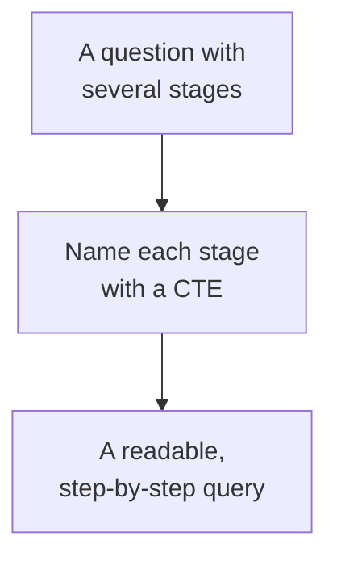

Subqueries are powerful, but stacking them inside one another quickly
becomes hard to read. A **common table expression** (CTE) lets you
give a subquery a **name** and write it *before* the main query, so a
complex question reads as a sequence of clear steps.

<Figure
  slug="sql-ctes-cutout"
  alt="Common table expressions, an isometric illustration"
/>

## WITH: name a query, then use it

A CTE is introduced by the keyword `WITH`. You name a query, and
then refer to that name in the rest of the statement as if it were a
table.

<Figure
  slug="sql-common-table-expressions-inline-cutout"
  alt="Three small named trays prepared along the top of a bench, and one final machine below drawing from each tray in turn"
  caption="A `WITH` clause names a result so the query below can read it like a table."
/>

The CTE runs first and produces a temporary, named result; the main
query then reads from that name. It is the same idea as a subquery,
but pulled out and labelled.

## A subquery rewritten as a CTE

Compare the two styles. First a nested subquery, then the same logic
as a CTE, notice how the CTE version reads top-to-bottom:

<SqlCodeBlock
  dialect="postgres"
  title="The same question, written as a CTE"
  initSql={`CREATE TABLE orders (
  id          INTEGER PRIMARY KEY,
  customer_id INTEGER,
  amount      NUMERIC
);
INSERT INTO orders (id, customer_id, amount) VALUES
  (1,1,20),(2,1,80),(3,2,60),(4,2,15),(5,3,95);`}
  starterCode={`WITH
  big_orders AS (
    SELECT
      customer_id,
      amount
    FROM
      orders
    WHERE
      amount > 50
  )
SELECT
  customer_id,
  COUNT(*) AS big_count
FROM
  big_orders
GROUP BY
  customer_id
ORDER BY
  customer_id;`}
/>

The `big_orders` CTE defines "orders over 50" once, with a clear
name. The main query then groups and counts them. Anyone reading it
sees the steps in order: *find big orders → count them per
customer.*

<Figure
  slug="sql-common-table-expressions-subquery-rewritten-as-inline-cutout"
  alt="A small machine lifted out of a larger one's hopper and set on the bench in front of it, feeding it by a short chute"
  caption="Lifting a subquery out and naming it makes the steps readable in order."
/>

<Callout type="info" title="CTEs are about readability">
A CTE rarely changes *what* a query computes, you could usually
write the same thing with a subquery. What changes is **clarity**.
Naming each step makes intricate queries far easier to read, debug,
and revisit weeks later.
</Callout>

## Chaining multiple steps

The real payoff comes when a question has several stages. You can
list **multiple** CTEs separated by commas, and each can build on the
ones before it:

<SqlCodeBlock
  dialect="postgres"
  title="Two CTEs, each building on the last"
  initSql={`CREATE TABLE orders (
  id          INTEGER PRIMARY KEY,
  customer_id INTEGER,
  amount      NUMERIC
);
INSERT INTO orders (id, customer_id, amount) VALUES
  (1,1,20),(2,1,80),(3,2,60),(4,2,15),(5,3,95),(6,3,40);`}
  starterCode={`WITH
  per_customer AS (
    SELECT
      customer_id,
      SUM(amount) AS total
    FROM
      orders
    GROUP BY
      customer_id
  ),
  big_spenders AS (
    SELECT
      customer_id,
      total
    FROM
      per_customer
    WHERE
      total > 50
  )
SELECT
  customer_id,
  total
FROM
  big_spenders
ORDER BY
  total DESC;`}
/>

Read it as a pipeline: `per_customer` sums each customer's spending,
`big_spenders` keeps the large totals, and the final query sorts
them. Each CTE is a labelled stage, and the data flows from one to
the next, much clearer than nesting these as two subqueries.

## When to reach for a CTE

Reach for a CTE when a query has **multiple logical steps**, when a
subquery is getting **deeply nested**, or when you simply want the
query to **document itself** with meaningful names. For a one-line
filter, a plain query is fine, use CTEs where they earn their keep.

## Check your understanding

<MultipleChoice
  markdown={`What does a common table expression (CTE) let you do?

- Run a query without a SELECT.
  > A CTE is itself written as a SELECT; it does not remove the need for one.
- Permanently create a new table in the database.
  > A CTE is temporary to the statement; it does not create a stored table.
- Automatically index a table.
  > CTEs are about structuring queries, not creating indexes.
- [o] Give a query a name with \`WITH\`, then reference that name in the rest of the statement.
  > A CTE labels a query so the main query can read from it like a named, temporary result.

A CTE names a query with \`WITH\` so later parts of the statement can use that name.`}
/>

<MultipleChoice
  markdown={`Compared with a deeply nested subquery, the main advantage of a CTE is usually:

- [o] Improved readability, because each step is named and written in order.
  > Naming stages turns nested logic into a clear top-to-bottom sequence.
- It always produces different results.
  > A CTE typically computes the same result; the difference is how the query reads.
- It removes the need for joins.
  > CTEs and joins are independent; a CTE does not replace joins.
- It runs without accessing any tables.
  > A CTE still reads from tables; it just organizes the query around them.

CTEs mainly improve clarity by naming each step rather than nesting it.`}
/>

<MultipleChoice
  markdown={`How do you write several steps that build on each other in one \`WITH\` clause?

- You cannot; a statement allows only one CTE.
  > A single \`WITH\` can define many CTEs.
- [o] List multiple CTEs separated by commas, where later ones can reference earlier ones.
  > Comma-separated CTEs form a pipeline, each able to read from those defined before it.
- Write a separate \`WITH\` keyword before each step.
  > Only one leading \`WITH\` is used; additional CTEs follow after commas.
- Nest each CTE inside the previous one's parentheses.
  > CTEs are listed sequentially, not nested inside each other.

Multiple comma-separated CTEs let each stage build on the previous one.`}
/>
