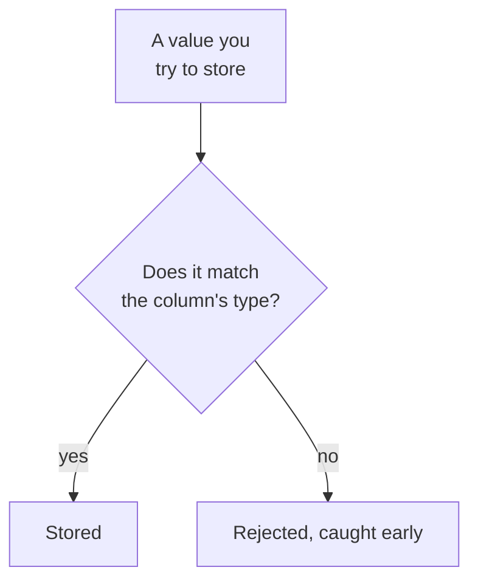

Every column in a relational table has a **data type**, a declared
kind of value it is allowed to hold. This page demystifies types so
they feel like a helpful guardrail rather than a hurdle.

<Figure
  slug="sql-data-types-cutout"
  alt="Data types, an isometric illustration"
/>

## Why types exist

A type answers the question *"what kind of value goes here?"* and
then the database **enforces** that answer. Declare a column as a
number, and the database will refuse the text `"banana"`. Declare it
as a date, and `"someday"` is rejected.

This is the database fending off one of the five nightmares from
the first pages of the course, nonsense values,
**protecting** your data by refusing invalid values *at the moment
they are entered*, before they can pollute reports and break logic.

## The types you will actually use

There are many types, but a small handful covers the vast majority
of real work. Meet them:

| Type (PostgreSQL) | Holds | Examples |
| --- | --- | --- |
| `INTEGER` | Whole numbers | `0`, `42`, `-7` |
| `NUMERIC` | Exact decimal numbers (great for money) | `19.99`, `0.05` |
| `TEXT` | Text of any length | `'Ada'`, `'hello world'` |
| `BOOLEAN` | True/false values | `true`, `false` |
| `DATE` | A calendar date | `'2026-03-14'` |
| `TIMESTAMP` | A date *and* time | `'2026-03-14 09:30:00'` |

<Callout type="info" title="A note on money">
Use `NUMERIC` for money, never a floating-point type. `NUMERIC`
stores decimals *exactly*, so `0.10 + 0.20` is exactly `0.30`.
Floating-point types can introduce tiny rounding errors that are
unacceptable when counting cents.
</Callout>

## Types shape what operations make sense

A column's type does not just restrict storage, it also decides
what you can *do* with the values:

- You can do arithmetic on `INTEGER` and `NUMERIC` (`price * 2`).
- You can compare and concatenate `TEXT` (`'Ms. ' || name`).
- You can compare and subtract `DATE`s to get a number of days.
- You can filter `BOOLEAN` columns directly (`WHERE is_active`).

| Type | Natural operations |
| --- | --- |
| Numbers (`INTEGER`, `NUMERIC`) | add, subtract, average, sum |
| Text (`TEXT`) | join, search, change case |
| Dates (`DATE`, `TIMESTAMP`) | compare, find differences in days |

Choosing the right type up front means the natural operations are
available and the nonsensical ones (like multiplying two names) are
impossible.

<Figure
  slug="sql-data-types-inline-cutout"
  alt="A rack of sockets of four distinct profiles with matching blocks resting above each"
  caption="Each column admits one kind of value and refuses the others."
/>

## See types accept and reject values

The first query stores well-typed values happily. Then try the
commented-out line to watch the type system reject nonsense.

<Figure
  slug="sql-data-types-types-will-actually-inline-cutout"
  alt="Four sockets of clearly different profiles on one rack, a matching block above each"
  caption="The type is a promise the database enforces on every value you store."
/>

<SqlCodeBlock
  dialect="postgres"
  title="Types in action"
  initSql={`CREATE TABLE products (
  id       INTEGER,
  name     TEXT,
  price    NUMERIC,
  in_stock BOOLEAN,
  added_on DATE
);
INSERT INTO products (id, name, price, in_stock, added_on) VALUES
  (1, 'Keyboard', 79.99, true,  '2026-01-10'),
  (2, 'Monitor',  299.00, false, '2026-02-02');`}
  starterCode={`SELECT
  name,
  price,
  price * 2 AS double_price,
  in_stock,
  added_on
FROM
  products;

-- Now uncomment the next line and run again to see a type be enforced:
-- INSERT INTO products (id, name, price) VALUES (3, 'Mouse', 'banana');`}
/>

Notice you could compute `price * 2` because `price` is a number.
You could *not* do that with the `name` column, and that is the
type system quietly steering you toward correct, meaningful queries.

## Check your understanding

<MultipleChoice
  markdown={`What is the main job of a column's **data type**?

- [o] To declare what kind of value the column holds and let the database reject values that don't fit.
  > A type both describes the allowed values and enables the database to refuse invalid ones early.
- To automatically translate values into other languages.
  > Types do not translate languages; they constrain the kind of value stored.
- To make the column appear bold when displayed.
  > Display styling is not a function of data types.
- To decide the column's position in the table.
  > Column position is unrelated to type; a type defines what kind of value the column holds.

A data type defines the allowed kind of value and lets the database enforce it.`}
/>

<MultipleChoice
  markdown={`Which PostgreSQL type is the best choice for storing a price like \`19.99\`?

- \`TEXT\`, so you can store the dollar sign too.
  > Storing money as text prevents arithmetic like summing prices and invites inconsistent formatting.
- [o] \`NUMERIC\`, because it stores exact decimal values, which is important for money.
  > \`NUMERIC\` represents decimals exactly, avoiding the rounding errors that make floating-point unsuitable for money.
- \`BOOLEAN\`, because a price is either present or not.
  > \`BOOLEAN\` stores only true/false; it cannot hold a numeric amount.
- \`INTEGER\`, because prices are basically numbers.
  > \`INTEGER\` holds only whole numbers, so it cannot represent the cents in \`19.99\`.

Use \`NUMERIC\` for money so decimal amounts are stored and calculated exactly.`}
/>

<MultipleChoice
  markdown={`You declare a column as \`DATE\` and try to insert the value \`'someday'\`. What happens, and why is that good?

- It is silently converted to today's date.
  > The database does not guess a replacement; it refuses values that do not fit the declared type.
- The whole table is deleted to protect it.
  > Rejecting one bad value never destroys the table; the database simply refuses that value.
- It is stored as-is, because databases accept any text.
  > A typed column does not accept arbitrary text; that strictness is exactly the point.
- [o] The database rejects the value because it is not a valid date, catching the error early.
  > Enforcing the \`DATE\` type stops invalid data from entering, protecting later queries and reports.

Type enforcement rejects invalid values at entry, which keeps the stored data trustworthy.`}
/>
