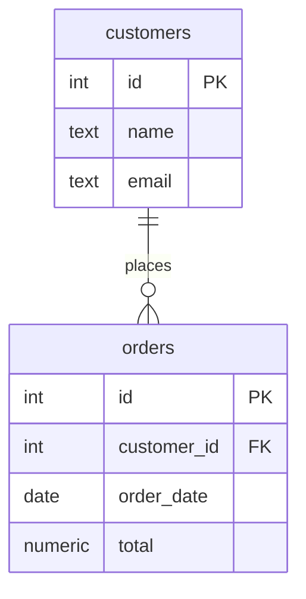
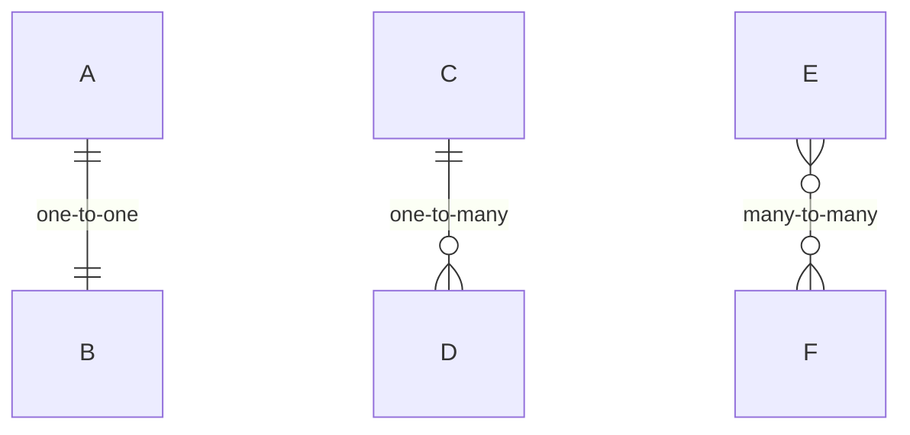
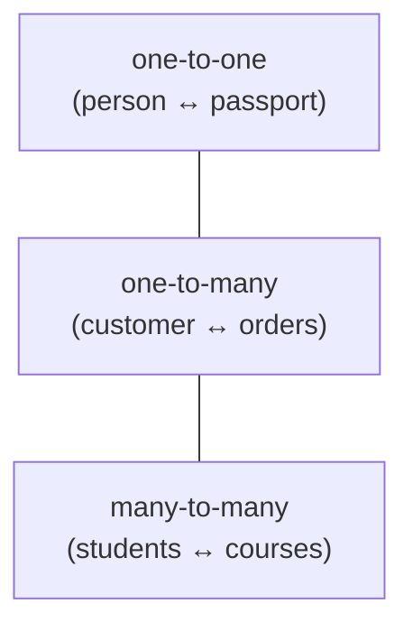
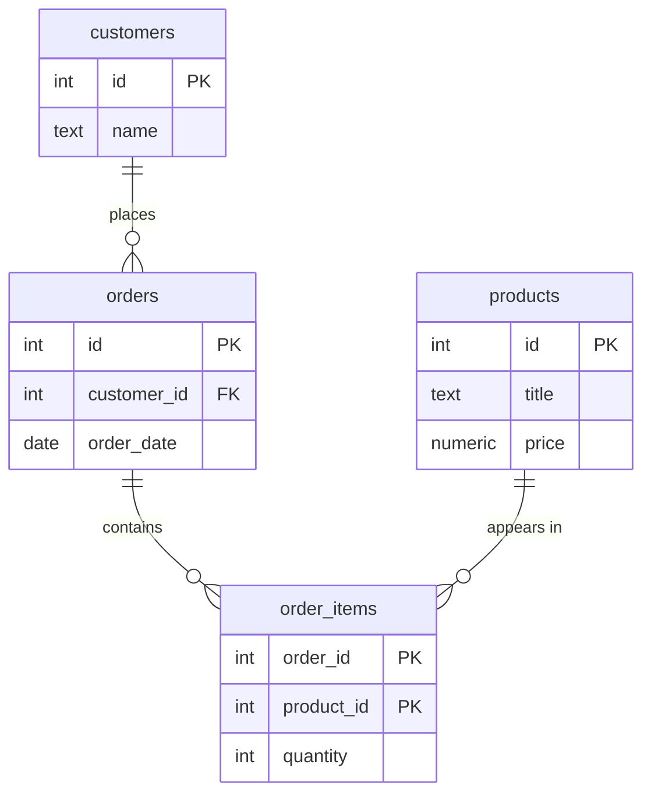

Once you can spot entities, you need a way to **draw** them so the
whole design is visible at a glance. The standard picture is the
**entity relationship diagram** (ERD). It shows each entity as a
box, its attributes inside, and lines for the relationships, the
blueprint of a database.

<Figure
  slug="sql-er-diagrams-cutout"
  alt="Entity relationship diagrams, an isometric illustration"
/>

## Anatomy of an ER diagram

Every ER diagram has the same three ingredients:

- **Boxes** are entities (which become tables): `customers`,
  `orders`.
- **Rows inside a box** are attributes (columns), with their type
  and any key marker, `PK` for primary key, `FK` for foreign key.
- **The line between boxes** is a relationship, labelled with a verb
  ("places").

## Reading the crow's-foot symbols

The small shapes at the **ends** of a relationship line tell you
*how many* rows take part. They are called **crow's-foot** notation
because the "many" symbol looks like a bird's footprint.

<Figure
  slug="sql-entity-relationship-diagrams-inline-cutout"
  alt="A pinned board of plain boxes and cords, a hand tracing one cord from a box to the box it points at"
  caption="Follow a line from one box to another and you are reading a foreign key."
/>

Read each end separately:

- `||`, **exactly one** (a straight bar).
- `o{`, **zero or many** (a circle plus the crow's foot).
- `|{`, **one or many**.

So `customers ||--o{ orders` reads: "**one** customer relates to
**zero or many** orders", one-to-many, the most common kind.

<Callout type="info" title="Read the line from both ends">
Always read a relationship in both directions. `customers ||--o{
orders` is "one customer has many orders" **and** "each order
belongs to exactly one customer." Saying both out loud is the
fastest way to confirm the diagram matches reality.
</Callout>

## The three shapes of relationships

Every relationship you will model is one of three cardinalities:

- **One-to-one:** each row pairs with at most one row on the other
  side. Rare; often the two could be a single table.
- **One-to-many:** the workhorse. One parent, many children, handled
  by a foreign key on the "many" side.
- **Many-to-many:** both sides can have many, handled by a junction
  table, which an ERD shows as two one-to-many lines into a middle
  box.

## From diagram to tables

An ERD maps directly onto `CREATE TABLE` statements. Here is the
`customers`/`orders` diagram above, turned into real tables and
queried:

<SqlCodeBlock
  dialect="postgres"
  title="An ER diagram realized as tables"
  initSql={`CREATE TABLE customers (
  id    INTEGER PRIMARY KEY,
  name  TEXT,
  email TEXT
);
CREATE TABLE orders (
  id          INTEGER PRIMARY KEY,
  customer_id INTEGER REFERENCES customers(id),
  order_date  DATE,
  total       NUMERIC
);
INSERT INTO customers (id, name, email) VALUES
  (1,'Ada','ada@example.com'),
  (2,'Grace','grace@example.com');
INSERT INTO orders (id, customer_id, order_date, total) VALUES
  (101, 1, DATE '2026-05-01', 42),
  (102, 1, DATE '2026-05-09', 18),
  (103, 2, DATE '2026-05-10', 99);`}
  starterCode={`SELECT
  c.name,
  o.order_date,
  o.total
FROM
  customers c
  JOIN orders o ON o.customer_id = c.id
ORDER BY
  c.name,
  o.order_date;`}
/>

The `PK` markers became `PRIMARY KEY`; the `FK` became `REFERENCES`;
the `||--o{` line became the `customer_id` column on the "many"
side. The diagram and the schema are two views of the same design.

<Figure
  slug="sql-entity-relationship-diagrams-anatomy-er-diagram-inline-cutout"
  alt="One plain box, one cord, one single peg and one three-pronged fitting laid out separately on a bench"
  caption="Boxes, lines and the markings at their ends are the whole notation."
/>

## A fuller model

Bringing several entities together, a small shop might look like
this, products, customers, orders, and a junction table linking
orders to products:

Trace the lines: a customer places many orders; each order contains
many `order_items`; each product appears in many `order_items`. The
many-to-many between orders and products is resolved by the
`order_items` junction in the middle, exactly the pattern from the
relationships pages, now drawn formally.

## Check your understanding

<MultipleChoice
  markdown={`In an ER diagram, what does a box represent?

- A relationship between two tables.
  > Relationships are shown as lines between boxes, not the boxes themselves.
- [o] An entity, which typically becomes a table, with its attributes listed inside.
  > Boxes are entities/tables, and the lines inside them are the attributes (columns).
- A single row of data.
  > A row is one instance; the box represents the entity (table) as a whole.
- A query.
  > ER diagrams describe structure, not queries.

A box is an entity (table); the lines connecting boxes are the relationships.`}
/>

<MultipleChoice
  markdown={`The notation \`customers ||--o{ orders\` means:

- One customer relates to exactly one order.
  > The \`o{\` end means "zero or many," not exactly one.
- Many customers relate to many orders.
  > The customer end is \`||\` (exactly one), so this is one-to-many, not many-to-many.
- [o] One customer relates to zero or many orders, and each order belongs to exactly one customer.
  > \`||\` is "exactly one" on the customer side and \`o{\` is "zero or many" on the orders side.
- Customers and orders have no relationship.
  > The line itself indicates a relationship between the two entities.

\`||--o{\` reads as one-to-many: one customer, zero or many orders.`}
/>

<MultipleChoice
  markdown={`When a many-to-many relationship is turned into actual tables, how is it usually represented in the diagram and schema?

*Hint: a foreign key can express "many" on only one side, so the database needs an extra table in the middle.*

- By removing the relationship line entirely.
  > The relationship still exists and must be represented; it is expressed through the junction entity.
- [o] As two one-to-many relationships pointing into a junction (middle) entity.
  > A junction entity resolves the many-to-many into two one-to-many links, which is how the schema actually implements it.
- By merging the two entities into one combined box.
  > Merging would collapse two distinct entities into one and lose their independent rows, so it is not how many-to-many is built.
- By drawing a single line with no key columns on either entity.
  > A line alone cannot store the pairings; the connections need a junction table holding a foreign key to each side.

A many-to-many is realized as two one-to-many links through a junction entity holding a foreign key to each side.`}
/>
