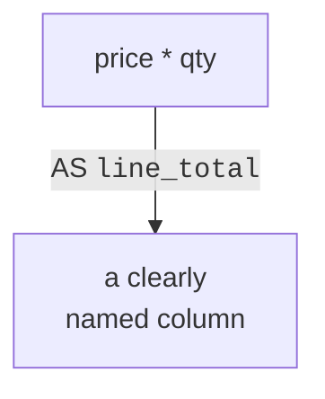

A query does not just hand back stored values; it can **compute new
ones**. You have already done a little of this (`price * 2`). This
page makes it a deliberate tool: building calculated columns,
combining text, calling functions, and giving every result a clear
name.

<Figure
  slug="sql-expressions-aliases-cutout"
  alt="Expressions and aliases, an isometric illustration"
/>

## Calculated columns

Anywhere you can name a column, you can instead write an
**expression**, a small calculation. The database evaluates it for
each row:

<SqlCodeBlock
  dialect="postgres"
  title="Derive a value per row"
  initSql={`CREATE TABLE sales (
  id      SERIAL PRIMARY KEY,
  product TEXT,
  price   NUMERIC,
  qty     INTEGER
);
INSERT INTO sales (product, price, qty) VALUES
  ('Latte', 4.50, 3),
  ('Mocha', 5.00, 2),
  ('Tea',   3.00, 5);`}
  starterCode={`SELECT
  product,
  price,
  qty,
  price * qty AS line_total
FROM
  sales;`}
/>

`price * qty` is not stored anywhere, it is computed fresh for each
row and returned as a new column named `line_total`. This is how
queries turn raw data into answers.

<Figure
  slug="sql-expressions-and-aliases-calculated-columns-inline-cutout"
  alt="Two standing columns feeding a small machine that sets a third column down beside them"
/>

## Aliases make output readable

That `AS line_total` is an **alias**, a name you give a result
column. Without it, a computed column gets an ugly auto-name like
`?column?`. Aliases are not decoration; they make results
self-explanatory and let later parts of bigger queries refer to the
value by name.

<Figure
  slug="sql-expressions-and-aliases-inline-cutout"
  alt="A narrow strip of stacked value blocks leaving a small machine and having a fresh blank name plate clipped to its head, the board it came from still standing behind it"
/>

<Callout type="info" title="The word AS is optional, but be kind">
PostgreSQL lets you write the alias without `AS`,
`price * qty line_total` works. Including `AS` is clearer for
readers, so this course always writes it. (One caution: alias names
with spaces or capitals need double quotes, e.g.
`AS "Line Total"`.)
</Callout>

## Working with text

Numbers are not the only thing you can compute. The `||` operator
**joins** (concatenates) text, and functions like `UPPER`, `LOWER`,
and `LENGTH` transform it:

<SqlCodeBlock
  dialect="postgres"
  title="Build a greeting from columns"
  initSql={`CREATE TABLE people (
  id    SERIAL PRIMARY KEY,
  first TEXT,
  last  TEXT
);
INSERT INTO people (first, last) VALUES
  ('Ada', 'Lovelace'),
  ('Alan', 'Turing');`}
  starterCode={`SELECT
  first || ' ' || last AS full_name,
  UPPER(last) AS last_upper,
  LENGTH(first) AS first_length
FROM
  people;`}
/>

`first || ' ' || last` glues the first name, a space, and the last
name into one value. Reading and reshaping text like this is
everyday SQL.

## Functions do focused jobs

A **function** takes input(s) and returns a value. You have just
used `UPPER` and `LENGTH`. There are many, grouped by what they work
on:

| Kind | Examples | Does |
| --- | --- | --- |
| Numeric | `ROUND`, `ABS`, `CEIL` | Round, absolute value, round up |
| Text | `UPPER`, `LOWER`, `TRIM`, `LENGTH` | Transform and measure text |
| Date | `NOW`, `AGE`, `EXTRACT` | Work with dates and times |

<SqlCodeBlock
  dialect="postgres"
  title="Rounding a computed value"
  initSql={`CREATE TABLE sales (
  id SERIAL PRIMARY KEY, product TEXT, price NUMERIC, qty INTEGER
);
INSERT INTO sales (product, price, qty) VALUES
  ('Latte',4.50,3),('Mocha',5.00,2),('Tea',3.00,5);`}
  starterCode={`SELECT
  product,
  ROUND(price * qty * 1.08, 2) AS total_with_tax
FROM
  sales;`}
/>

Here one expression multiplies price by quantity, adds 8% tax, and
`ROUND(..., 2)` trims it to two decimal places, a realistic little
calculation, expressed in a single readable line.

## Expressions work in WHERE and ORDER BY too

Expressions are not limited to `SELECT`. You can filter and sort by
them as well:

<SqlCodeBlock
  dialect="postgres"
  title="Filter and sort by a computed value"
  initSql={`CREATE TABLE sales (
  id SERIAL PRIMARY KEY, product TEXT, price NUMERIC, qty INTEGER
);
INSERT INTO sales (product, price, qty) VALUES
  ('Latte',4.50,3),('Mocha',5.00,2),('Tea',3.00,5),('Water',1.00,1);`}
  starterCode={`SELECT
  product,
  price * qty AS line_total
FROM
  sales
WHERE
  price * qty > 10
ORDER BY
  price * qty DESC;`}
/>

The database computes `price * qty` to decide which rows pass the
filter and how to sort them, even though you wrote that expression
in three different clauses.

## Check your understanding

<MultipleChoice
  markdown={`In \`SELECT price * qty AS line_total\`, where is the value \`line_total\` stored?

- It replaces the \`price\` column in storage.
  > The stored \`price\` column is untouched; the expression simply adds a computed column to the output.
- It is permanently saved as a new column in the table.
  > Computed columns are not written back to the table; they exist only in the query's result.
- In a separate table created automatically.
  > No new table is created; the value lives only in the returned result set.
- [o] Nowhere permanently, it is computed for each row and returned only in the result.
  > Expressions are evaluated on the fly per row, producing values that appear in the result but do not change storage.

A computed column is produced per row in the result and is not stored in the table.`}
/>

<MultipleChoice
  markdown={`What does the \`||\` operator do in PostgreSQL?

- It adds two numbers together.
  > Numeric addition uses \`+\`; \`||\` is for text.
- [o] It concatenates (joins) text values into one string.
  > \`||\` glues text together, so \`first || ' ' || last\` builds a full name.
- It compares two values for equality.
  > Equality uses \`=\`; \`||\` does something different.
- It selects every column.
  > Selecting all columns is \`*\`; \`||\` joins text.

\`||\` concatenates text values into a single string.`}
/>

<MultipleChoice
  markdown={`What is the purpose of an **alias** (the \`AS name\` part)?

- It permanently renames the column in the table.
  > An alias affects only the query's result, not the stored table's column name.
- It changes the value being computed.
  > An alias only labels the result; it does not alter the computation.
- [o] It gives a result column a clear, readable name in the output.
  > Aliases make output self-explanatory and let other parts of a query refer to the value by name.
- It is required for every column or the query fails.
  > Aliases are optional; plain columns keep their own names without one.

An alias names a result column for readability without changing stored data.`}
/>

## Practice challenge

<SqlChallengeCard
  dialect="postgres"
  title="Compute each sale's line total"
  instructions={`The \`sales\` table has \`product\`, \`price\`, and \`qty\` columns. Return each sale's \`product\` plus a computed column named \`line_total\` (the price multiplied by the quantity), sorted from the largest \`line_total\` to the smallest.`}
  initSql={`CREATE TABLE sales (
  id      SERIAL PRIMARY KEY,
  product TEXT NOT NULL,
  price   NUMERIC(8, 2) NOT NULL,
  qty     INTEGER NOT NULL
);
INSERT INTO sales (product, price, qty) VALUES
  ('Latte', 4.50, 3),
  ('Mocha', 5.00, 2),
  ('Tea',   3.00, 5),
  ('Water', 1.00, 1);`}
  starterCode={`SELECT
  product
  -- add a computed line_total column, then sort by it
FROM
  sales;`}
  solutionSql={`SELECT
  product,
  price * qty AS line_total
FROM
  sales
ORDER BY
  line_total DESC;`}
  tests={[
    {
      id: "columns",
      name: "Returns product and line_total",
      description: "The computed column must be aliased line_total.",
      expectedColumns: ["product", "line_total"],
    },
    {
      id: "row_count",
      name: "Returns all four sales",
      description: "One row per sale.",
      expectedRowCount: 4,
    },
    {
      id: "matches",
      name: "Matches the reference solution",
      description: "Tea (15.00) first, down to Water (1.00).",
      matchesSolution: true,
      ordered: true,
    },
  ]}
/>
