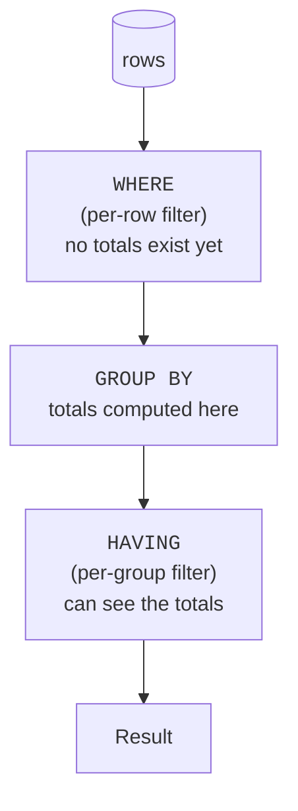

You can group rows and summarize each group. Now: how do you keep
only the groups whose *summary* meets a condition, "departments
with more than 2 people," "products that sold over \$1000"? You
cannot use `WHERE` for this, and the reason why reveals something
deep about how queries run.

<Figure
  slug="sql-filtering-groups-cutout"
  alt="Filtering groups with HAVING, an isometric illustration"
/>

## Why WHERE can't do it

`WHERE` runs **before** grouping. At that moment, the groups, and
therefore their `COUNT`s and `SUM`s, **do not exist yet.** Asking
`WHERE COUNT(*) > 2` is like asking about a total before anything
has been added up.

`HAVING` is the answer: it filters **groups**, *after* the
aggregates have been computed. Think of it as "`WHERE`, but for
groups."

## HAVING in action

Keep only departments with more than two employees:

<SqlCodeBlock
  dialect="postgres"
  title="Departments with more than 2 people"
  initSql={`CREATE TABLE employees (
  id SERIAL PRIMARY KEY, name TEXT, dept TEXT
);
INSERT INTO employees (name, dept) VALUES
  ('Alice','Engineering'),('Bob','Engineering'),('Cara','Engineering'),
  ('Dave','Sales'),('Eve','Sales'),
  ('Finn','Marketing');`}
  starterCode={`SELECT
  dept,
  COUNT(*) AS headcount
FROM
  employees
GROUP BY
  dept
HAVING
  COUNT(*) > 2
ORDER BY
  headcount DESC;`}
/>

Only Engineering (3 people) survives. Sales (2) and Marketing (1)
are filtered out *as groups*. Notice `HAVING` uses an aggregate,
`COUNT(*)`, which is exactly what `WHERE` could not do.

## WHERE and HAVING together

They are not rivals, they work as a team, each at its own stage:

- `WHERE` filters **rows** before grouping ("only count full-time
  staff").
- `HAVING` filters **groups** after aggregating ("only show
  departments whose average pay exceeds 80k").

<SqlCodeBlock
  dialect="postgres"
  title="Both filters in one query"
  initSql={`CREATE TABLE employees (
  id SERIAL PRIMARY KEY, name TEXT, dept TEXT, salary NUMERIC, is_intern BOOLEAN
);
INSERT INTO employees (name, dept, salary, is_intern) VALUES
  ('Alice','Engineering',120000,false),('Bob','Engineering',100000,false),
  ('Cara','Engineering',30000,true),
  ('Dave','Sales',75000,false),('Eve','Sales',72000,false),
  ('Finn','Marketing',68000,false);`}
  starterCode={`SELECT
  dept,
  ROUND(AVG(salary)) AS avg_salary
FROM
  employees
WHERE
  is_intern = false -- step 1: drop interns (rows)
GROUP BY
  dept -- step 2: form department groups
HAVING
  AVG(salary) > 80000 -- step 3: keep high-paying groups
ORDER BY
  avg_salary DESC;`}
/>

Read the three commented steps top to bottom, they are the actual
order the database works in. The intern row is removed first, *then*
groups form, *then* the average-pay filter runs on those groups.

<Callout type="info" title="A quick rule of thumb">
If your filter mentions an **aggregate** (`COUNT`, `SUM`, `AVG`,
`MIN`, `MAX`), it belongs in `HAVING`. If it mentions only **plain
column values**, it belongs in `WHERE`. Putting row filters in
`WHERE` is also more efficient, because fewer rows reach the
grouping step.
</Callout>

## The full clause order so far

You have now met the core query clauses. Here is their fixed order,
and, helpfully, roughly the order the database executes them:

**`FROM` → `WHERE` → `GROUP BY` → `HAVING` → `SELECT` → `ORDER BY` → `LIMIT`**

We will revisit this execution order in detail in the **Composing
Queries** section, for now, knowing where `HAVING` fits is the key
takeaway.

## Check your understanding

<MultipleChoice
  markdown={`Why can't you write \`WHERE COUNT(*) > 2\` to keep groups with more than two rows?

- Because \`COUNT(*)\` is not a real function.
  > \`COUNT(*)\` is a standard aggregate; the problem is *when* \`WHERE\` runs, not the function itself.
- [o] Because \`WHERE\` runs before grouping, so the group counts don't exist yet when it is evaluated.
  > Aggregates like \`COUNT(*)\` are only available after groups form, which is after \`WHERE\` has already run.
- Because \`WHERE\` can only be used without \`GROUP BY\`.
  > \`WHERE\` and \`GROUP BY\` work together; \`WHERE\` simply applies to rows before grouping.
- Because counts can never be compared with \`>\`.
  > Counts are numbers and compare fine; the issue is the stage at which \`WHERE\` operates.

\`WHERE\` filters rows before groups (and their counts) exist, so aggregate conditions go in \`HAVING\`.`}
/>

<MultipleChoice
  markdown={`What does \`HAVING\` filter?

- The order of the result rows.
  > Ordering is \`ORDER BY\`; \`HAVING\` is a filter on groups.
- [o] Groups, after their aggregates have been computed.
  > \`HAVING\` keeps or drops whole groups based on aggregate conditions like \`COUNT(*) > 2\`.
- The columns shown in the output.
  > Column selection is done by \`SELECT\`; \`HAVING\` filters groups.
- Individual rows before they are grouped.
  > That is the role of \`WHERE\`; \`HAVING\` acts later, on groups.

\`HAVING\` is a post-aggregation filter on groups.`}
/>

<MultipleChoice
  markdown={`You want to summarize only full-time staff, then keep only departments whose average salary exceeds 80000. Where does each condition go?

- Neither can be expressed in SQL.
  > Both are easily expressed, one in \`WHERE\`, the other in \`HAVING\`.
- Both conditions go in \`HAVING\`.
  > The full-time filter is a per-row condition best applied in \`WHERE\` before grouping, not in \`HAVING\`.
- [o] The full-time filter goes in \`WHERE\`; the average-salary condition goes in \`HAVING\`.
  > Row-level filters belong in \`WHERE\`, and conditions on aggregates belong in \`HAVING\`.
- Both conditions go in \`WHERE\`.
  > The average-salary condition uses an aggregate, which \`WHERE\` cannot evaluate; it must go in \`HAVING\`.

Per-row conditions go in \`WHERE\`; conditions on aggregated values go in \`HAVING\`.`}
/>

## Practice challenge

<SqlChallengeCard
  dialect="postgres"
  title="Repeat customers only"
  instructions={`The \`orders\` table has a \`customer\` column. Return each customer who has placed **more than one** order, with the columns \`customer\` and \`order_count\`, sorted from the highest order count to the lowest. The starter already groups and counts, add the group filter.`}
  initSql={`CREATE TABLE orders (
  id       SERIAL PRIMARY KEY,
  customer TEXT NOT NULL,
  amount   NUMERIC(8, 2) NOT NULL
);
INSERT INTO orders (customer, amount) VALUES
  ('Ada', 20.00), ('Linus', 35.00), ('Ada', 12.00),
  ('Grace', 50.00), ('Linus', 8.00), ('Ada', 41.00);`}
  starterCode={`SELECT
  customer,
  COUNT(*) AS order_count
FROM
  orders
GROUP BY
  customer
ORDER BY
  order_count DESC;`}
  solutionSql={`SELECT
  customer,
  COUNT(*) AS order_count
FROM
  orders
GROUP BY
  customer
HAVING
  COUNT(*) > 1
ORDER BY
  order_count DESC;`}
  tests={[
    {
      id: "columns",
      name: "Returns customer and order_count",
      description: "The group key and its count.",
      expectedColumns: ["customer", "order_count"],
    },
    {
      id: "row_count",
      name: "Returns two customers",
      description: "Only Ada and Linus ordered more than once.",
      expectedRowCount: 2,
    },
    {
      id: "matches",
      name: "Matches the reference solution",
      description: "Ada (3 orders), then Linus (2).",
      matchesSolution: true,
      ordered: true,
    },
  ]}
/>
