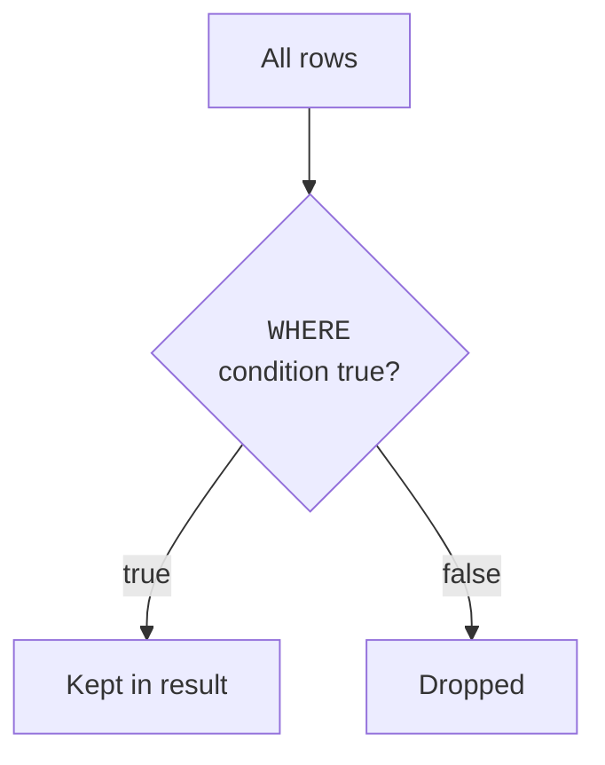
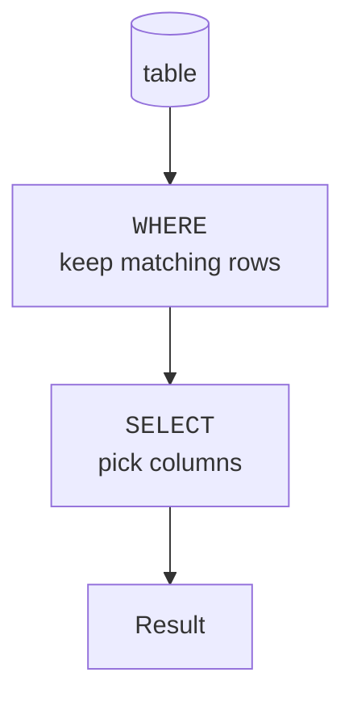

`SELECT` chooses *columns*. `WHERE` chooses *rows*. Together they let
you cut a table down to exactly the slice you want, the most
common thing you will ever do in SQL.

<Figure
  slug="sql-filtering-rows-cutout"
  alt="Filtering rows with WHERE, an isometric illustration"
/>

## The idea: a test applied to every row

A `WHERE` clause is a **condition**, a true/false test. The
database checks it against every row and keeps only the rows where
the test comes out **true**.

<Figure
  slug="sql-filtering-rows-idea-test-applied-inline-cutout"
  alt="Every row of a board passing under one identical gauge in turn"
  caption="The same condition is tested against every row, one at a time."
/>

## A first filter

<SqlCodeBlock
  dialect="postgres"
  title="Only the engineers"
  initSql={`CREATE TABLE employees (
  id     SERIAL PRIMARY KEY,
  name   TEXT,
  dept   TEXT,
  salary NUMERIC
);
INSERT INTO employees (name, dept, salary) VALUES
  ('Alice','Engineering',120000),('Bob','Engineering',95000),
  ('Carol','Sales',80000),('Dave','Sales',72000),('Eve','Marketing',68000),
  ('Frank','Engineering',110000),('Grace','Engineering',132000),
  ('Hana','Engineering',88000),('Ivan','Sales',76000),('Jade','Sales',91000),
  ('Kai','Sales',67000),('Lena','Marketing',74000),('Mark','Marketing',62000),
  ('Nina','Support',58000),('Omar','Support',61000),('Pia','Support',55000),
  ('Quinn','Support',63000),('Rosa','Engineering',105000),
  ('Sam','Engineering',99000),('Tara','Sales',84000),('Uri','Finance',88000),
  ('Vera','Finance',92000),('Wes','Legal',115000),('Yara','Marketing',70000);`}
  starterCode={`SELECT
  name,
  dept,
  salary
FROM
  employees
WHERE
  dept = 'Engineering';`}
/>

Only the two engineers survive the filter. Note `=` tests equality
(SQL uses a single equals sign for "is equal to"), and the text goes
in single quotes.

## The comparison operators

You can compare with more than just equality:

| Operator | Means | Example |
| --- | --- | --- |
| `=` | equal to | `dept = 'Sales'` |
| `<>` or `!=` | not equal to | `dept <> 'Sales'` |
| `<` `>` | less / greater than | `salary > 90000` |
| `<=` `>=` | at most / at least | `salary >= 80000` |
| `BETWEEN a AND b` | within a range (inclusive) | `salary BETWEEN 70000 AND 90000` |
| `IN (...)` | matches any in a list | `dept IN ('Sales', 'Marketing')` |
| `LIKE` | text pattern match | `name LIKE 'A%'` |

<SqlCodeBlock
  dialect="postgres"
  title="A numeric comparison"
  initSql={`CREATE TABLE employees (
  id SERIAL PRIMARY KEY, name TEXT, dept TEXT, salary NUMERIC
);
INSERT INTO employees (name, dept, salary) VALUES
  ('Alice','Engineering',120000),('Bob','Engineering',95000),
  ('Carol','Sales',80000),('Dave','Sales',72000),('Eve','Marketing',68000),
  ('Frank','Engineering',110000),('Grace','Engineering',132000),
  ('Hana','Engineering',88000),('Ivan','Sales',76000),('Jade','Sales',91000),
  ('Kai','Sales',67000),('Lena','Marketing',74000),('Mark','Marketing',62000),
  ('Nina','Support',58000),('Omar','Support',61000),('Pia','Support',55000),
  ('Quinn','Support',63000),('Rosa','Engineering',105000),
  ('Sam','Engineering',99000),('Tara','Sales',84000),('Uri','Finance',88000),
  ('Vera','Finance',92000),('Wes','Legal',115000),('Yara','Marketing',70000);`}
  starterCode={`SELECT
  name,
  salary
FROM
  employees
WHERE
  salary >= 90000
ORDER BY
  salary DESC;`}
/>

## Matching text patterns with LIKE

`LIKE` filters text by pattern. Two wildcards do the work:

- `%` matches **any number of characters** (including none).
- `_` matches **exactly one character**.

So `'A%'` means "starts with A," `'%son'` means "ends with son," and
`'%ar%'` means "contains ar."

<SyntaxBreakdown
  parts={[
    { text: "WHERE" },
    { text: "name", label: "the text column to test" },
    { text: "LIKE" },
    { text: "'A%'", label: "the pattern, where % is any run of characters" },
  ]}
/>

<SqlCodeBlock
  dialect="postgres"
  title="Names that start with a vowel-ish pattern"
  initSql={`CREATE TABLE employees (
  id SERIAL PRIMARY KEY, name TEXT
);
INSERT INTO employees (name) VALUES
  ('Alice'),('Bob'),('Carol'),('Dave'),('Eve'),('Frank'),
  ('Grace'),('Hana'),('Ivan'),('Jade'),('Kai'),('Lena'),
  ('Mark'),('Nina'),('Omar'),('Pia'),('Quinn'),('Rosa'),
  ('Sam'),('Tara'),('Uri'),('Vera'),('Wes'),('Yara');`}
  starterCode={`SELECT
  name
FROM
  employees
WHERE
  name LIKE 'A%'
  OR name LIKE 'E%';`}
/>

## Combining conditions: AND, OR, NOT

Real questions often have several parts. Combine conditions with
`AND` (both must be true), `OR` (at least one true), and `NOT`
(flips a condition):

<SqlCodeBlock
  dialect="postgres"
  title="Engineers who earn over 100k"
  initSql={`CREATE TABLE employees (
  id SERIAL PRIMARY KEY, name TEXT, dept TEXT, salary NUMERIC
);
INSERT INTO employees (name, dept, salary) VALUES
  ('Alice','Engineering',120000),('Bob','Engineering',95000),
  ('Carol','Sales',80000),('Dave','Sales',72000),('Eve','Marketing',68000),
  ('Frank','Engineering',110000),('Grace','Engineering',132000),
  ('Hana','Engineering',88000),('Ivan','Sales',76000),('Jade','Sales',91000),
  ('Kai','Sales',67000),('Lena','Marketing',74000),('Mark','Marketing',62000),
  ('Nina','Support',58000),('Omar','Support',61000),('Pia','Support',55000),
  ('Quinn','Support',63000),('Rosa','Engineering',105000),
  ('Sam','Engineering',99000),('Tara','Sales',84000),('Uri','Finance',88000),
  ('Vera','Finance',92000),('Wes','Legal',115000),('Yara','Marketing',70000);`}
  starterCode={`SELECT
  name,
  dept,
  salary
FROM
  employees
WHERE
  dept = 'Engineering'
  AND salary > 100000;`}
/>

<Callout type="info" title="Mixing AND and OR? Use parentheses">
When a condition mixes `AND` and `OR`, wrap the `OR` part in
parentheses to make your intent unambiguous, e.g.
`WHERE dept = 'Sales' AND (salary > 75000 OR name LIKE 'C%')`.
`AND` binds more tightly than `OR`, and being explicit prevents
surprising results.
</Callout>

## How WHERE fits with SELECT

A useful way to picture a query: the database first figures out
which rows pass `WHERE`, *then* picks the `SELECT` columns from those
surviving rows.

<Figure
  slug="sql-filtering-rows-inline-cutout"
  alt="Rows passing a checkpoint with a template held up to each, the ones that do not match turned aside"
  caption="Rows are filtered first, then the chosen columns are read off the survivors."
/>

We will refine this picture in the **Composing Queries** section,
but "filter rows, then choose columns" is an excellent mental model
to carry for now.

## Check your understanding

<MultipleChoice
  markdown={`What is the role of a \`WHERE\` clause?

- It sorts the rows into order.
  > Sorting is done by \`ORDER BY\`; \`WHERE\` filters rather than orders.
- It permanently deletes rows that don't match.
  > In a \`SELECT\`, \`WHERE\` only filters the result; it does not delete stored rows.
- [o] It keeps only the rows for which its condition is true.
  > \`WHERE\` is a per-row true/false test; rows that fail the test are dropped from the result.
- It chooses which columns appear in the result.
  > Choosing columns is the job of \`SELECT\`; \`WHERE\` decides which *rows* are kept.

\`WHERE\` filters rows, keeping those whose condition evaluates to true.`}
/>

<MultipleChoice
  markdown={`Which condition keeps employees whose salary is **at least** 80000?

- [o] \`WHERE salary >= 80000\`
  > \`>=\` means "greater than or equal to," which correctly includes 80000 and everything above it.
- \`WHERE salary > 80000\`
  > \`>\` excludes exactly 80000, so "at least 80000" is not fully captured.
- \`WHERE salary < 80000\`
  > \`<\` keeps salaries *below* 80000, the opposite of what is asked.
- \`WHERE salary = 80000\`
  > \`=\` keeps only exactly 80000, missing the higher salaries.

"At least 80000" means greater than or equal to, written \`>= 80000\`.`}
/>

<MultipleChoice
  markdown={`In a \`LIKE\` pattern, what does the \`%\` wildcard match?

- Exactly one character.
  > That is the \`_\` wildcard. \`%\` is broader.
- Only digits.
  > \`%\` is not limited to digits; it matches any characters.
- [o] Any number of characters, including none.
  > \`%\` stands in for any sequence of characters, which is why \`'A%'\` matches anything starting with A.
- The literal percent sign only.
  > \`%\` is a wildcard, not a literal percent; it matches arbitrary characters.

\`%\` matches any run of characters, so \`'A%'\` means "starts with A."`}
/>

<MultipleChoice
  markdown={`Which combination keeps rows where the department is Engineering **and** the salary is above 100000?

- \`WHERE dept = 'Engineering' NOT salary > 100000\`
  > That is not valid syntax for combining two conditions; \`AND\` is needed to require both.
- \`WHERE dept = 'Engineering', salary > 100000\`
  > A comma does not combine conditions in a \`WHERE\` clause; use \`AND\`.
- [o] \`WHERE dept = 'Engineering' AND salary > 100000\`
  > \`AND\` requires both conditions to be true, exactly matching "Engineering and over 100000."
- \`WHERE dept = 'Engineering' OR salary > 100000\`
  > \`OR\` keeps rows meeting *either* condition, which is broader than the "both must hold" requirement.

Requiring both conditions calls for \`AND\`.`}
/>

## Practice challenge

<SqlChallengeCard
  dialect="postgres"
  title="Books published before 2000"
  instructions={`The \`books\` table has a \`year\` column. Return the \`title\` and \`year\` of every book published before the year 2000.`}
  initSql={`CREATE TABLE books (
  id     SERIAL PRIMARY KEY,
  title  TEXT NOT NULL,
  author TEXT NOT NULL,
  year   INTEGER
);
INSERT INTO books (title, author, year) VALUES
  ('The Pragmatic Programmer', 'Hunt & Thomas', 1999),
  ('Clean Code', 'Robert C. Martin', 2008),
  ('Refactoring', 'Martin Fowler', 2018),
  ('SQL for Smarties', 'Joe Celko', 1995),
  ('The Mythical Man-Month', 'Fred Brooks', 1975),
  ('Design Patterns', 'Gamma et al.', 1994),
  ('Code Complete', 'Steve McConnell', 2004),
  ('Working Effectively with Legacy Code', 'Michael Feathers', 2005),
  ('Domain-Driven Design', 'Eric Evans', 2003),
  ('Structure and Interpretation of Computer Programs', 'Abelson & Sussman', 1985),
  ('The Art of Computer Programming', 'Donald Knuth', 1968),
  ('Peopleware', 'DeMarco & Lister', 1987),
  ('Test-Driven Development', 'Kent Beck', 2002),
  ('Continuous Delivery', 'Humble & Farley', 2010),
  ('Release It!', 'Michael Nygard', 2007),
  ('The Phoenix Project', 'Kim et al.', 2013),
  ('Accelerate', 'Forsgren et al.', 2018),
  ('Designing Data-Intensive Applications', 'Martin Kleppmann', 2017),
  ('Database Internals', 'Alex Petrov', 2019),
  ('Site Reliability Engineering', 'Beyer et al.', 2016),
  ('A Philosophy of Software Design', 'John Ousterhout', 2018),
  ('The Unicorn Project', 'Gene Kim', 2019),
  ('Software Engineering at Google', 'Winters et al.', 2020),
  ('Fundamentals of Data Engineering', 'Reis & Housley', 2022);`}
  starterCode={`-- Keep only the books from before 2000:
SELECT
  title,
  year
FROM
  books
WHERE;`}
  solutionSql={`SELECT
  title,
  year
FROM
  books
WHERE
  year < 2000
ORDER BY
  id;`}
  tests={[
    {
      id: "columns",
      name: "Returns title and year",
      description: "Those two columns.",
      expectedColumns: ["title", "year"],
    },
    {
      id: "row_count",
      name: "Returns seven books",
      description: "Only the titles from before 2000.",
      expectedRowCount: 7,
    },
    {
      id: "matches",
      name: "Matches the reference solution",
      description: "The Pragmatic Programmer and SQL for Smarties.",
      matchesSolution: true,
    },
  ]}
/>

That is `WHERE` in full: a test per row, combined with `AND`, `OR` and
`NOT`, with `BETWEEN`, `IN` and `LIKE` as shorthands for the three most
common shapes. Next you will put the surviving rows in a deliberate
order.
