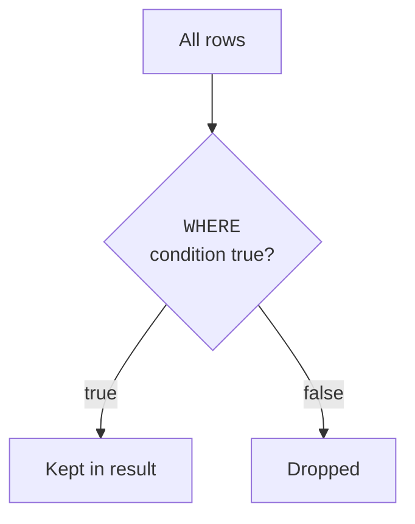
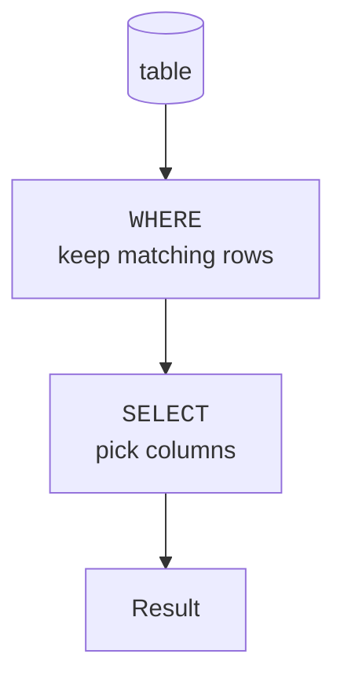

`SELECT` chooses *columns*. `WHERE` chooses *rows*. Together they let
you cut a table down to exactly the slice you want, the most
common thing you will ever do in SQL.

<svg
  viewBox="0 0 640 220"
  role="img"
  aria-label="Rows slide out of a table past a yellow test diamond, the rows that pass arrive green in a new stack while failing rows stay behind, faded"
  style={{ display: "block", width: "100%", maxWidth: "640px", height: "auto", margin: "2.5rem auto" }}
>
  <g style={{ color: "var(--ds-green-500)" }} fill="currentColor">
    <rect x="80" y="30" width="190" height="28" rx="9" fillOpacity="0.75" />
    <rect x="80" y="106" width="190" height="28" rx="9" fillOpacity="0.75" />
    <rect x="80" y="182" width="190" height="28" rx="9" fillOpacity="0.75" />
    <rect x="400" y="58" width="190" height="28" rx="9" fillOpacity="0.95" />
    <rect x="400" y="96" width="190" height="28" rx="9" fillOpacity="0.95" />
    <rect x="400" y="134" width="190" height="28" rx="9" fillOpacity="0.95" />
  </g>
  <g fill="currentColor" opacity="0.15">
    <rect x="80" y="68" width="190" height="28" rx="9" />
    <rect x="80" y="144" width="190" height="28" rx="9" />
  </g>
  <g style={{ color: "var(--ds-white)" }} fill="currentColor">
    <circle cx="102" cy="44" r="3.5" />
    <circle cx="122" cy="44" r="3.5" />
    <circle cx="102" cy="120" r="3.5" />
    <circle cx="122" cy="120" r="3.5" />
    <circle cx="102" cy="196" r="3.5" />
    <circle cx="122" cy="196" r="3.5" />
  </g>
  <g fill="currentColor" opacity="0.3">
    <circle cx="300" cy="50" r="3" />
    <circle cx="330" cy="58" r="3" />
    <circle cx="362" cy="66" r="3" />
    <circle cx="300" cy="118" r="3" />
    <circle cx="330" cy="115" r="3" />
    <circle cx="362" cy="112" r="3" />
    <circle cx="300" cy="186" r="3" />
    <circle cx="330" cy="172" r="3" />
    <circle cx="362" cy="158" r="3" />
  </g>
  <g style={{ color: "var(--ds-yellow-500)" }} fill="currentColor">
    <polygon points="331,8 345,22 331,36 317,22" fillOpacity="0.9" />
  </g>
</svg>

## The idea: a test applied to every row

A `WHERE` clause is a **condition**, a true/false test. The
database checks it against every row and keeps only the rows where
the test comes out **true**.

## A first filter

<SqlCodeBlock
  dialect="postgres"
  title="Only the engineers"
  initSql={`CREATE TABLE employees (
  id     SERIAL PRIMARY KEY,
  name   TEXT,
  dept   TEXT,
  salary NUMERIC
);
INSERT INTO employees (name, dept, salary) VALUES
  ('Alice', 'Engineering', 120000),
  ('Bob',   'Engineering',  95000),
  ('Carol', 'Sales',        80000),
  ('Dave',  'Sales',        72000),
  ('Eve',   'Marketing',    68000);`}
  starterCode={`SELECT
  name,
  dept,
  salary
FROM
  employees
WHERE
  dept = 'Engineering';`}
/>

Only the two engineers survive the filter. Note `=` tests equality
(SQL uses a single equals sign for "is equal to"), and the text goes
in single quotes.

## The comparison operators

You can compare with more than just equality:

| Operator | Means | Example |
| --- | --- | --- |
| `=` | equal to | `dept = 'Sales'` |
| `<>` or `!=` | not equal to | `dept <> 'Sales'` |
| `<` `>` | less / greater than | `salary > 90000` |
| `<=` `>=` | at most / at least | `salary >= 80000` |
| `BETWEEN a AND b` | within a range (inclusive) | `salary BETWEEN 70000 AND 90000` |
| `IN (...)` | matches any in a list | `dept IN ('Sales', 'Marketing')` |
| `LIKE` | text pattern match | `name LIKE 'A%'` |

<SqlCodeBlock
  dialect="postgres"
  title="A numeric comparison"
  initSql={`CREATE TABLE employees (
  id SERIAL PRIMARY KEY, name TEXT, dept TEXT, salary NUMERIC
);
INSERT INTO employees (name, dept, salary) VALUES
  ('Alice','Engineering',120000),('Bob','Engineering',95000),
  ('Carol','Sales',80000),('Dave','Sales',72000),('Eve','Marketing',68000);`}
  starterCode={`SELECT
  name,
  salary
FROM
  employees
WHERE
  salary >= 90000
ORDER BY
  salary DESC;`}
/>

## Matching text patterns with LIKE

`LIKE` filters text by pattern. Two wildcards do the work:

- `%` matches **any number of characters** (including none).
- `_` matches **exactly one character**.

So `'A%'` means "starts with A," `'%son'` means "ends with son," and
`'%ar%'` means "contains ar."

<SqlCodeBlock
  dialect="postgres"
  title="Names that start with a vowel-ish pattern"
  initSql={`CREATE TABLE employees (
  id SERIAL PRIMARY KEY, name TEXT
);
INSERT INTO employees (name) VALUES
  ('Alice'),('Bob'),('Carol'),('Dave'),('Eve');`}
  starterCode={`SELECT
  name
FROM
  employees
WHERE
  name LIKE 'A%'
  OR name LIKE 'E%';`}
/>

## Combining conditions: AND, OR, NOT

Real questions often have several parts. Combine conditions with
`AND` (both must be true), `OR` (at least one true), and `NOT`
(flips a condition):

<SqlCodeBlock
  dialect="postgres"
  title="Engineers who earn over 100k"
  initSql={`CREATE TABLE employees (
  id SERIAL PRIMARY KEY, name TEXT, dept TEXT, salary NUMERIC
);
INSERT INTO employees (name, dept, salary) VALUES
  ('Alice','Engineering',120000),('Bob','Engineering',95000),
  ('Carol','Sales',80000),('Dave','Sales',72000),('Eve','Marketing',68000);`}
  starterCode={`SELECT
  name,
  dept,
  salary
FROM
  employees
WHERE
  dept = 'Engineering'
  AND salary > 100000;`}
/>

<Callout type="info" title="Mixing AND and OR? Use parentheses">
When a condition mixes `AND` and `OR`, wrap the `OR` part in
parentheses to make your intent unambiguous, e.g.
`WHERE dept = 'Sales' AND (salary > 75000 OR name LIKE 'C%')`.
`AND` binds more tightly than `OR`, and being explicit prevents
surprising results.
</Callout>

## How WHERE fits with SELECT

A useful way to picture a query: the database first figures out
which rows pass `WHERE`, *then* picks the `SELECT` columns from those
surviving rows.

We will refine this picture in the **Composing Queries** section,
but "filter rows, then choose columns" is an excellent mental model
to carry for now.

## Check your understanding

<MultipleChoice
  markdown={`What is the role of a \`WHERE\` clause?

- It chooses which columns appear in the result.
  > Choosing columns is the job of \`SELECT\`; \`WHERE\` decides which *rows* are kept.
- [o] It keeps only the rows for which its condition is true.
  > \`WHERE\` is a per-row true/false test; rows that fail the test are dropped from the result.
- It sorts the rows into order.
  > Sorting is done by \`ORDER BY\`; \`WHERE\` filters rather than orders.
- It permanently deletes rows that don't match.
  > In a \`SELECT\`, \`WHERE\` only filters the result; it does not delete stored rows.

\`WHERE\` filters rows, keeping those whose condition evaluates to true.`}
/>

<MultipleChoice
  markdown={`Which condition keeps employees whose salary is **at least** 80000?

- \`WHERE salary > 80000\`
  > \`>\` excludes exactly 80000, so "at least 80000" is not fully captured.
- [o] \`WHERE salary >= 80000\`
  > \`>=\` means "greater than or equal to," which correctly includes 80000 and everything above it.
- \`WHERE salary < 80000\`
  > \`<\` keeps salaries *below* 80000, the opposite of what is asked.
- \`WHERE salary = 80000\`
  > \`=\` keeps only exactly 80000, missing the higher salaries.

"At least 80000" means greater than or equal to, written \`>= 80000\`.`}
/>

<MultipleChoice
  markdown={`In a \`LIKE\` pattern, what does the \`%\` wildcard match?

- Exactly one character.
  > That is the \`_\` wildcard. \`%\` is broader.
- [o] Any number of characters, including none.
  > \`%\` stands in for any sequence of characters, which is why \`'A%'\` matches anything starting with A.
- Only digits.
  > \`%\` is not limited to digits; it matches any characters.
- The literal percent sign only.
  > \`%\` is a wildcard, not a literal percent; it matches arbitrary characters.

\`%\` matches any run of characters, so \`'A%'\` means "starts with A."`}
/>

<MultipleChoice
  markdown={`Which combination keeps rows where the department is Engineering **and** the salary is above 100000?

- \`WHERE dept = 'Engineering' OR salary > 100000\`
  > \`OR\` keeps rows meeting *either* condition, which is broader than the "both must hold" requirement.
- [o] \`WHERE dept = 'Engineering' AND salary > 100000\`
  > \`AND\` requires both conditions to be true, exactly matching "Engineering and over 100000."
- \`WHERE dept = 'Engineering' NOT salary > 100000\`
  > That is not valid syntax for combining two conditions; \`AND\` is needed to require both.
- \`WHERE dept = 'Engineering', salary > 100000\`
  > A comma does not combine conditions in a \`WHERE\` clause; use \`AND\`.

Requiring both conditions calls for \`AND\`.`}
/>

## Practice challenge

<SqlChallengeCard
  dialect="postgres"
  title="Books published before 2000"
  instructions={`The \`books\` table has a \`year\` column. Return the \`title\` and \`year\` of every book published before the year 2000.`}
  initSql={`CREATE TABLE books (
  id     SERIAL PRIMARY KEY,
  title  TEXT NOT NULL,
  author TEXT NOT NULL,
  year   INTEGER
);
INSERT INTO books (title, author, year) VALUES
  ('The Pragmatic Programmer', 'Hunt & Thomas', 1999),
  ('Clean Code', 'Robert C. Martin', 2008),
  ('Refactoring', 'Martin Fowler', 2018),
  ('SQL for Smarties', 'Joe Celko', 1995);`}
  starterCode={`-- Keep only the books from before 2000:
SELECT
  title,
  year
FROM
  books
WHERE;`}
  solutionSql={`SELECT
  title,
  year
FROM
  books
WHERE
  year < 2000
ORDER BY
  id;`}
  tests={[
    {
      id: "columns",
      name: "Returns title and year",
      description: "Those two columns.",
      expectedColumns: ["title", "year"],
    },
    {
      id: "row_count",
      name: "Returns two books",
      description: "Only the titles from before 2000.",
      expectedRowCount: 2,
    },
    {
      id: "matches",
      name: "Matches the reference solution",
      description: "The Pragmatic Programmer and SQL for Smarties.",
      matchesSolution: true,
    },
  ]}
/>
