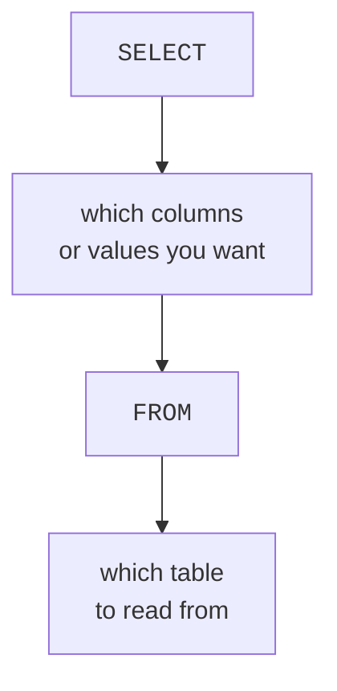
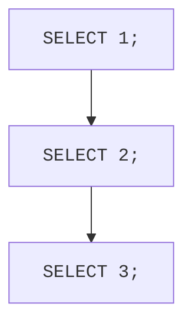

Enough concepts — let us *write SQL*. The wonderful thing about
PostgreSQL is that you can run a query without any tables at all,
which makes it a perfect, friendly calculator for learning the
shape of the language.

<svg
  viewBox="0 0 640 220"
  role="img"
  aria-label="A terminal window where a tiny query of one plus one returns a green chip holding the number two — SQL as a friendly calculator"
  style={{ display: "block", width: "100%", maxWidth: "640px", height: "auto", margin: "2.5rem auto" }}
>
  <g fill="currentColor" opacity="0.07">
    <rect x="120" y="30" width="400" height="160" rx="14" />
  </g>
  <g style={{ color: "var(--ds-red-500)" }} fill="currentColor">
    <circle cx="146" cy="52" r="5" fillOpacity="0.8" />
  </g>
  <g style={{ color: "var(--ds-yellow-500)" }} fill="currentColor">
    <circle cx="164" cy="52" r="5" fillOpacity="0.8" />
  </g>
  <g style={{ color: "var(--ds-green-500)" }} fill="currentColor">
    <circle cx="182" cy="52" r="5" fillOpacity="0.8" />
  </g>
  <g style={{ color: "var(--ds-blue-500)" }} fill="currentColor">
    <polygon points="142,74 154,82 142,90" fillOpacity="0.8" />
    <rect x="166" y="77" width="64" height="10" rx="5" />
    <text x="252" y="88" fontFamily="var(--font-mono), ui-monospace, monospace" fontSize="17" fontWeight="700">{"1+1"}</text>
  </g>
  <g style={{ color: "var(--ds-green-500)" }} fill="currentColor">
    <rect x="166" y="108" width="44" height="28" rx="9" fillOpacity="0.9" />
  </g>
  <g style={{ color: "var(--ds-white)" }} fill="currentColor">
    <text x="188" y="128" textAnchor="middle" fontFamily="var(--font-mono), ui-monospace, monospace" fontSize="17" fontWeight="700">2</text>
  </g>
  <g style={{ color: "var(--ds-blue-500)" }} fill="currentColor">
    <rect x="166" y="152" width="12" height="18" rx="3" fillOpacity="0.5" />
  </g>
</svg>

## SQL you can run with no tables

The keyword `SELECT` means "compute and give me back these values."
On its own, it can do arithmetic and produce text. Run this:

<SqlCodeBlock
  dialect="postgres"
  title="SELECT as a calculator"
  starterCode={`SELECT
  2 + 2;`}
/>

PostgreSQL evaluated `2 + 2` and handed back a one-row, one-column
result containing `4`. You just ran a complete, valid SQL query.

## Naming results with AS

That last result column had an unhelpful auto-generated name. You
can name a result column yourself with `AS`:

<SqlCodeBlock
  dialect="postgres"
  title="Give results friendly names"
  starterCode={`SELECT
  2 + 2 AS sum,
  10 * 3 AS product,
  'PostgreSQL' AS database_name;`}
/>

Notice three things that will recur all course long:

- You can `SELECT` **several values at once**, separated by commas.
- Text values go in **single quotes**: `'PostgreSQL'`. Double quotes
  mean something different in SQL (they refer to names), so stick to
  single quotes for text.
- `AS name` labels each result column. The label is for *you* — it
  does not change any stored data.

## The anatomy of a query

Here is the basic shape you will type thousands of times, with the
parts named:

- **`SELECT`** — *what* you want back (columns or computed values).
- **`FROM`** — *where* to get it (which table).

When you are just computing values, like `SELECT 2 + 2`, you can
skip `FROM` entirely. The moment you want stored data, you add
`FROM table_name`.

<Callout type="info" title="SQL keywords and your style">
SQL keywords like \`SELECT\` and \`FROM\` are not case-sensitive —
\`select\`, \`Select\`, and \`SELECT\` all work. By strong
convention, this course writes keywords in UPPERCASE and names in
lowercase, because it makes queries far easier to read at a glance.
</Callout>

## Statements end with a semicolon

Each SQL statement ends with a semicolon `;`. It marks where one
instruction stops. With a single statement it is often optional, but
it becomes essential when you run several statements together — so we
will always include it as a good habit.

## A first look at reading from a table

To prove the `FROM` half works, here is a tiny pre-loaded table.
Reading from it is just `SELECT` columns `FROM` the table:

<SqlCodeBlock
  dialect="postgres"
  title="SELECT ... FROM a real table"
  initSql={`CREATE TABLE cities (
  name       TEXT,
  country    TEXT,
  population INTEGER
);
INSERT INTO cities (name, country, population) VALUES
  ('Tokyo',  'Japan',  37000000),
  ('Lagos',  'Nigeria', 15000000),
  ('Lima',   'Peru',    11000000);`}
  starterCode={`SELECT
  name,
  population
FROM
  cities;`}
/>

Try editing it: replace `name, population` with `*` to get every
column, or with just `country` to get one. You are already steering
a query — choosing exactly what comes back. The whole **Querying
Data** section expands on this.

## Check your understanding

<MultipleChoice
  markdown={`What does the \`SELECT\` keyword do in a query?

- It permanently deletes the chosen columns.
  > Deleting data is done with other statements; \`SELECT\` only reads or computes values.
- [o] It specifies which columns or computed values you want the database to return.
  > \`SELECT\` is the "what do I want back" part of a query, whether reading columns or computing values.
- It creates a brand-new table.
  > Creating tables is done with \`CREATE TABLE\`, not \`SELECT\`.
- It sorts the table alphabetically.
  > Sorting is the job of \`ORDER BY\`; \`SELECT\` chooses what to return, not the order.

\`SELECT\` declares the columns or values you want the query to produce.`}
/>

<MultipleChoice
  markdown={`In the query \`SELECT 5 * 3 AS total;\`, what is the role of \`AS total\`?

- It multiplies the result by a value called total.
  > \`AS\` does no arithmetic; the multiplication is done by \`5 * 3\`. \`AS\` only labels the result.
- It stores the result permanently in a table named total.
  > \`AS\` does not store anything; it just names the column in the returned result.
- [o] It gives the resulting column the friendly name "total" in the output.
  > \`AS\` assigns a readable label to a result column, which makes output easier to understand.
- It is required or the query will fail.
  > \`AS\` is optional; without it the column simply gets an auto-generated name.

\`AS\` provides a readable alias for a result column; it changes only the label, not the data.`}
/>

<MultipleChoice
  markdown={`Which part of a query tells the database **which table** to read from?

- \`SELECT\`
  > \`SELECT\` lists the columns or values you want; it does not name the source table.
- [o] \`FROM\`
  > \`FROM table_name\` is exactly how you tell the database which table to pull rows from.
- \`AS\`
  > \`AS\` labels a result column; it does not choose the source table.
- The semicolon
  > The semicolon ends the statement; it does not identify a table.

\`FROM\` specifies the table that supplies the rows for a query.`}
/>
