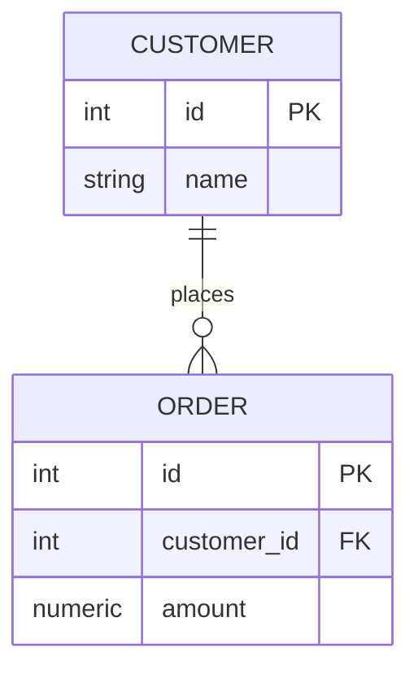
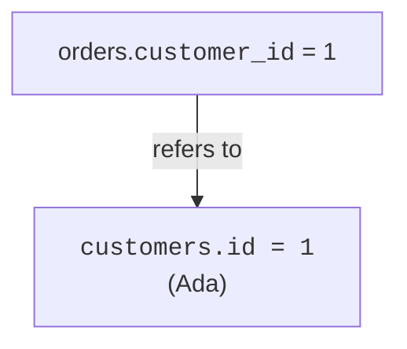
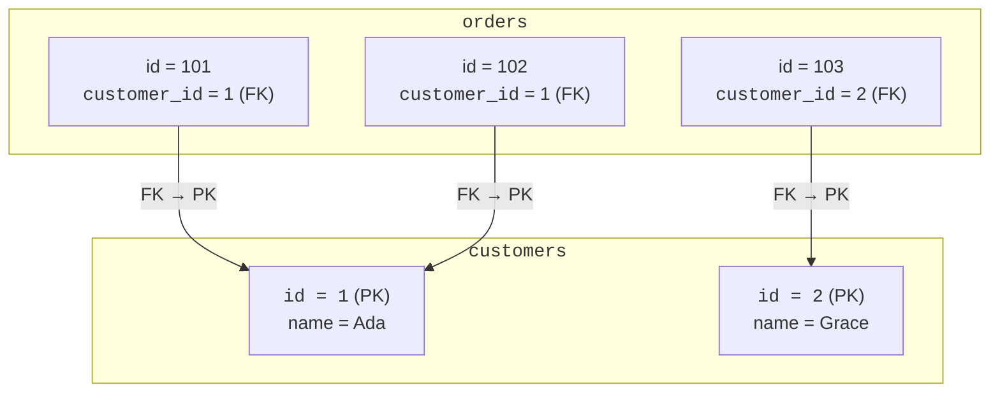

We have hinted at how tables connect: an order stores a customer's
`id`. That pointing column has a name, a **foreign key**, and it is
the mechanism that makes the relational model relational. This page
makes it concrete.

<svg
  viewBox="0 0 640 220"
  role="img"
  aria-label="Each order row carries a colored key dot that matches one customer's key color, except a red orphan dot that points at no one"
  style={{ display: "block", width: "100%", maxWidth: "640px", height: "auto", margin: "2.5rem auto" }}
>
  <g fill="currentColor" opacity="0.07">
    <rect x="80" y="40" width="180" height="130" rx="12" />
    <rect x="380" y="28" width="180" height="164" rx="12" />
  </g>
  <g style={{ color: "var(--ds-blue-500)" }} fill="currentColor">
    <circle cx="106" cy="70" r="7" />
    <circle cx="404" cy="56" r="7" fillOpacity="0.85" />
    <circle cx="404" cy="128" r="7" fillOpacity="0.85" />
  </g>
  <g style={{ color: "var(--ds-green-500)" }} fill="currentColor">
    <circle cx="106" cy="105" r="7" />
  </g>
  <g style={{ color: "var(--ds-yellow-500)" }} fill="currentColor">
    <circle cx="106" cy="140" r="7" />
    <circle cx="404" cy="92" r="7" fillOpacity="0.85" />
  </g>
  <g fill="currentColor" opacity="0.25">
    <rect x="124" y="66" width="110" height="8" rx="4" />
    <rect x="124" y="101" width="110" height="8" rx="4" />
    <rect x="124" y="136" width="110" height="8" rx="4" />
    <rect x="422" y="52" width="120" height="8" rx="4" />
    <rect x="422" y="88" width="120" height="8" rx="4" />
    <rect x="422" y="124" width="120" height="8" rx="4" />
    <rect x="422" y="160" width="120" height="8" rx="4" />
  </g>
  <g fill="currentColor" opacity="0.3">
    <polygon points="316,50 316,62 304,56" />
    <polygon points="316,86 316,98 304,92" />
    <polygon points="316,122 316,134 304,128" />
  </g>
  <g style={{ color: "var(--ds-red-500)" }} fill="currentColor">
    <circle cx="404" cy="164" r="7" fillOpacity="0.45" />
    <circle cx="350" cy="164" r="3" fillOpacity="0.3" />
    <circle cx="334" cy="164" r="3" fillOpacity="0.18" />
  </g>
</svg>

## A foreign key is a pointer to a primary key

A **foreign key** is a column in one table that holds the **primary
key value of a row in another table.** It is a *reference*, a way
for one row to say "I belong to that row over there."

In the `orders` table, `customer_id` is a foreign key. Its value is
the `id` of some customer. Order 101 storing `customer_id = 1` means
"this order belongs to customer 1 (Ada)."

## Why store an id instead of the name?

Because of everything we learned about identity and consistency.
The id is **stable** and **unique**; the name is neither. Storing
`customer_id = 1` rather than `"Ada"` means:

- Ada's name lives in exactly **one** place (the customers table).
- If she changes her name, every order still points correctly,
  because the id never changed.
- Two customers named "Ada" are still unambiguous, they have
  different ids.

This is the cure for the "copies that disagree" nightmare from the
very first pages of the course, now given a precise mechanism.

## Foreign keys protect integrity

Declaring a foreign key does more than document intent, PostgreSQL
**enforces** it. It will refuse to create an order that points to a
customer who does not exist. This guarantee is called **referential
integrity**: every reference actually points to something real.

<SqlCodeBlock
  dialect="postgres"
  title="A foreign key rejects a dangling reference"
  initSql={`CREATE TABLE customers (
  id   SERIAL PRIMARY KEY,
  name TEXT
);
CREATE TABLE orders (
  id          SERIAL PRIMARY KEY,
  customer_id INTEGER REFERENCES customers(id),
  amount      NUMERIC
);
INSERT INTO customers (name) VALUES ('Ada'), ('Grace');`}
  starterCode={`-- Customer 1 (Ada) exists, so this is fine:
INSERT INTO
  orders (customer_id, amount)
VALUES
  (1, 42);

-- Customer 99 does NOT exist; the foreign key blocks this:
INSERT INTO
  orders (customer_id, amount)
VALUES
  (99, 17);

SELECT
  *
FROM
  orders;`}
/>

The phrase `REFERENCES customers(id)` is what declares the foreign
key. The first insert succeeds; the second is rejected because there
is no customer 99. The database is preventing an **orphan**, an
order belonging to nobody.

<Callout type="info" title="Why orphans are dangerous">
Without referential integrity, you could have orders pointing at
customers that were deleted or never existed. Reports would
undercount, joins would lose rows, and "show this order's customer"
would fail. Foreign keys make such broken links impossible.
</Callout>

## The shape of a connected pair

Put the two ideas side by side and the whole relational mechanism
appears:

Primary key on one side, foreign key on the other, arrows pointing
from the *many* to the *one*. Once you can see this picture, you are
ready to actually *combine* the two tables, which is the **join**,
the subject of the next page.

## Check your understanding

<MultipleChoice
  markdown={`What is a **foreign key**?

- A second primary key that identifies the same row.
  > A table has one primary key for identity; a foreign key is different, it points to another table's row.
- [o] A column that stores the primary key value of a row in another table, creating a reference between them.
  > A foreign key links tables by holding the identifying value of a related row elsewhere.
- A password that locks a table.
  > "Key" here means an identifying reference, not a security credential.
- A column that must always be unique within its own table.
  > Uniqueness describes a primary key or a unique constraint; a foreign key value can repeat (many orders share one customer).

A foreign key holds another table's primary key value, linking the two tables.`}
/>

<MultipleChoice
  markdown={`Why store \`customer_id\` on an order instead of copying the customer's \`name\`?

- Because names cannot be stored in PostgreSQL.
  > Names can certainly be stored; the point is that ids make better, stabler references.
- [o] Because the id is stable and unique, so the customer's details stay in one place and references remain correct even if the name changes.
  > Referencing by id keeps a single source of truth and avoids duplication and ambiguity.
- Because an id takes exactly one byte and a name does not.
  > The benefit is reliability of reference, not a specific storage size.
- Because foreign keys are not allowed to be text.
  > Foreign keys can reference text keys too; ids are preferred for stability and uniqueness, not a type restriction.

Referencing by a stable, unique id keeps customer data in one place and references valid over time.`}
/>

<MultipleChoice
  markdown={`A foreign key from \`orders.customer_id\` to \`customers.id\` is declared. What does PostgreSQL do if you try to insert an order with \`customer_id = 99\` when no customer 99 exists?

- It creates a placeholder customer 99 automatically.
  > The database does not invent missing rows; it rejects the reference instead.
- It inserts the order with a NULL customer.
  > It does not silently alter your value; it refuses the insert to preserve integrity.
- [o] It rejects the insert, because the foreign key requires the referenced customer to exist (referential integrity).
  > Enforcing referential integrity prevents orphaned rows that point to nonexistent records.
- It deletes the orders table to stay safe.
  > Rejecting one bad insert never destroys the table; only that insert fails.

A foreign key enforces referential integrity by rejecting references to rows that do not exist.`}
/>
