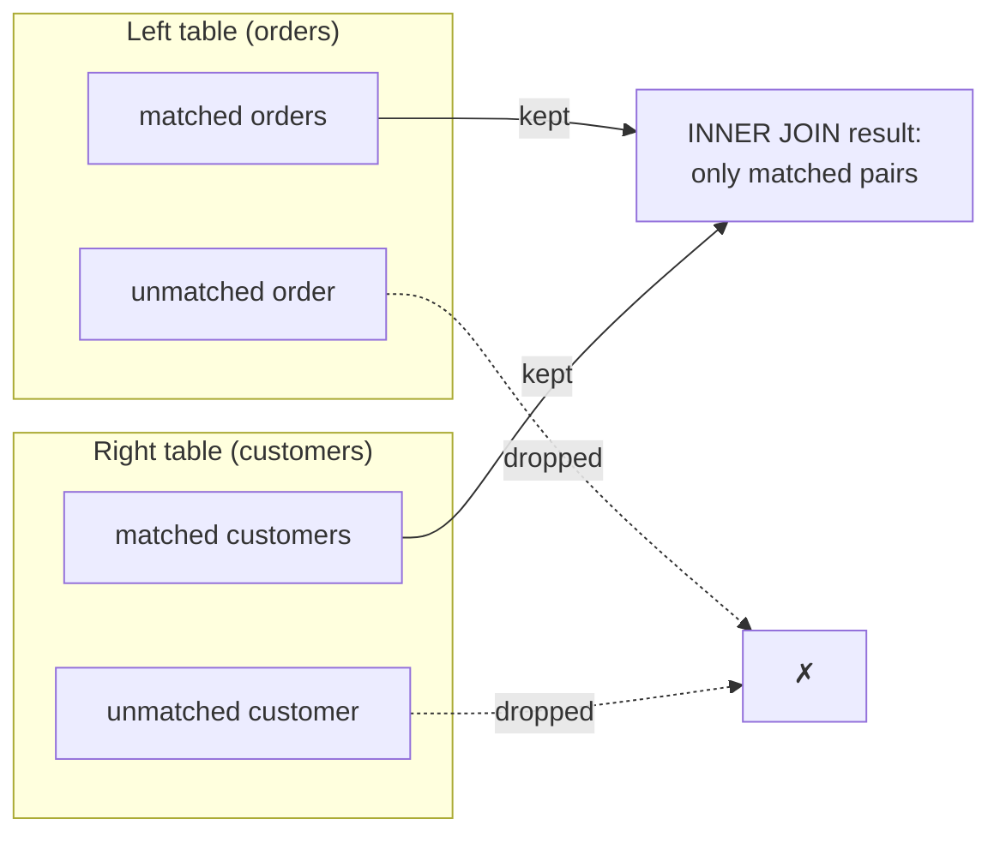

The join you met on the previous page was an **inner join**, the
default and most common kind. Its rule is simple and worth saying
precisely: an inner join keeps **only the rows that have a match in
both tables.** Rows with no partner are dropped.

<Figure
  slug="sql-inner-joins-cutout"
  alt="Inner joins, an isometric illustration"
/>

## The rule, in a picture

If an order points to a customer who exists → it appears. If a
customer has no orders → they do not appear. Only the **overlap**
survives.

## Seeing what survives and what drops

This data is rigged to show the rule. There is an order with no
matching customer, and a customer with no orders. Watch both vanish
from an inner join:

<SqlCodeBlock
  dialect="postgres"
  title="Inner join keeps only matches"
  initSql={`CREATE TABLE customers (
  id   INTEGER PRIMARY KEY,
  name TEXT
);
CREATE TABLE orders (
  id          INTEGER PRIMARY KEY,
  customer_id INTEGER,
  amount      NUMERIC
);
-- Linus, Mae, Quinn and Zara have no orders.
INSERT INTO customers (id, name) VALUES
  (1,'Ada'), (2,'Grace'), (3,'Linus'), (4,'Mae'),
  (5,'Rosa'), (6,'Ivan'), (7,'Nadia'), (8,'Omar'),
  (9,'Priya'), (10,'Quinn'), (11,'Ruth'), (12,'Sam'),
  (13,'Tariq'), (14,'Uma'), (15,'Viktor'), (16,'Wen'),
  (17,'Xenia'), (18,'Yusuf'), (19,'Zara'), (20,'Bruno'),
  (21,'Chidi'), (22,'Dara'), (23,'Elif'), (24,'Farid');
-- Order 199 points at customer 99, who does not exist.
INSERT INTO orders (id, customer_id, amount) VALUES
  (101,1,42), (102,1,18), (103,2,99), (104,2,15),
  (105,5,30), (106,5,76), (107,6,22), (108,7,64),
  (109,8,12), (110,8,48), (111,9,91), (112,11,27),
  (113,11,55), (114,12,38), (115,13,19), (116,13,83),
  (117,14,45), (118,15,61), (119,16,24), (120,16,70),
  (121,17,33), (122,18,88), (123,20,16), (124,20,52),
  (125,21,29), (126,22,74), (127,22,21), (128,23,95),
  (129,24,36), (130,1,57), (131,9,40), (132,17,68),
  (199,99,55);`}
  starterCode={`SELECT
  c.name,
  o.id AS order_id,
  o.amount
FROM
  customers c
  JOIN orders o ON o.customer_id = c.id
ORDER BY
  c.name,
  o.id;`}
/>

Twenty-four customers and thirty-three orders go in, and thirty-two
rows come out. **Linus, Mae, Quinn and Zara are absent** (no orders to
match), and **order 199 is absent** (its customer 99 does not exist).
That is the inner join doing its job: no match, no row.

It is worth pausing on how quiet that is. Nothing warned you that five
things were dropped. If you ever open a report and the row count looks
lower than it should, an inner join silently discarding unmatched rows
is the first suspect.

<Callout type="info" title="INNER is optional">
`JOIN` and `INNER JOIN` mean exactly the same thing, `INNER` is the
default, so people usually just write `JOIN`. Writing it out can
make your intent explicit when a query also contains outer joins.
</Callout>

## When an inner join is the right choice

Use an inner join when you only care about rows that are connected,
which is most of the time:

- "Orders **with** their customer details", you do not want
  customer-less orders.
- "Students **and** the courses they are enrolled in", empty
  enrollments are irrelevant.
- "Products **that have** been sold", unsold products are not part
  of the question.

<Figure
  slug="sql-inner-joins-inline-cutout"
  alt="Two card racks pushed together with only the pairs whose notches match lifted out onto a tray between them"
  caption="An inner join answers questions where both sides have to exist."
/>

The giveaway is the word **with** or **that have**: you want rows
that *do* have a counterpart.

## Joining more than two tables

Real questions often span three tables. You chain joins, each with
its own `ON`. Here orders connect to both customers and products:

<SqlCodeBlock
  dialect="postgres"
  title="A three-table inner join"
  initSql={`CREATE TABLE customers (
  id INTEGER PRIMARY KEY, name TEXT
);
CREATE TABLE products (
  id INTEGER PRIMARY KEY, title TEXT, price NUMERIC
);
CREATE TABLE orders (
  id INTEGER PRIMARY KEY,
  customer_id INTEGER,
  product_id INTEGER
);
INSERT INTO customers (id, name) VALUES
  (1,'Ada'), (2,'Grace'), (3,'Linus'), (4,'Mae'), (5,'Rosa'), (6,'Ivan'),
  (7,'Nadia'), (8,'Omar'), (9,'Priya'), (10,'Quinn'), (11,'Ruth'), (12,'Sam');
INSERT INTO products (id, title, price) VALUES
  (10,'Book',20), (11,'Pen',3), (12,'Notebook',7), (13,'Backpack',45),
  (14,'Mug',9), (15,'Desk lamp',22), (16,'Stapler',11), (17,'Poster',14);
INSERT INTO orders (id, customer_id, product_id) VALUES
  (101,1,10), (102,1,11), (103,2,10), (104,2,13), (105,3,12), (106,3,14),
  (107,4,10), (108,4,15), (109,5,11), (110,5,16), (111,6,12), (112,6,17),
  (113,7,13), (114,7,10), (115,8,14), (116,8,11), (117,9,15), (118,9,12),
  (119,10,16), (120,10,13), (121,11,17), (122,11,14), (123,12,10), (124,12,15);`}
  starterCode={`SELECT
  c.name,
  p.title,
  p.price
FROM
  orders o
  JOIN customers c ON c.id = o.customer_id
  JOIN products p ON p.id = o.product_id
ORDER BY
  c.name,
  p.title;`}
/>

Each `JOIN ... ON ...` adds one more connected table. The pattern
scales: the `orders` table sits in the middle, linking customers to
the products they bought. This is everyday relational querying.

## The same pattern on a real database

Toy tables prove the mechanics; real data proves the point. This
block clones the **Chinook** sample database, a music store with
hundreds of artists, hundreds of albums, and thousands of tracks,
and walks the exact same chain you just wrote: each track joins to
its album, each album to its artist.

<Figure
  slug="sql-inner-joins-same-pattern-on-real-inline-cutout"
  alt="Three crates joined by two cords, the same shape of join as the two-crate version beside it"
  caption="Three tables and two `ON` conditions is the same shape as the two-table version."
/>

<SqlCodeBlock
  dialect="postgres"
  title="Track → album → artist, across thousands of rows"
  remoteInitSql="postgres/chinook_postgres_AutoIncrementPKs.sql"
  tables={["artist", "album", "track"]}
  starterCode={`SELECT
  ar.name AS artist,
  al.title AS album,
  t.name AS track
FROM
  track t
  JOIN album al ON al.album_id = t.album_id
  JOIN artist ar ON ar.artist_id = al.artist_id
ORDER BY
  ar.name,
  al.title,
  t.name
LIMIT
  12;`}
/>

Notice that nothing about the query got harder, three tables,
two `ON` conditions, same shape as the toy version. Try changing it:
add `WHERE ar.name = 'Aerosmith'` to focus on one artist, or raise
the `LIMIT` and scroll. The join machinery you just learned is the
same machinery powering every "album page" you have ever seen in a
music app.

## Check your understanding

<MultipleChoice
  markdown={`What rows does an **inner join** include in its result?

- [o] Only rows that have a matching row in both tables.
  > An inner join keeps a row only when the \`ON\` condition finds a partner on the other side.
- Only rows where both tables are empty.
  > Empty tables would produce no rows at all; an inner join returns matched pairs.
- Only rows from the left table.
  > An inner join is symmetric and based on matches, not on one chosen side.
- Every row from both tables, matched or not.
  > Including all unmatched rows describes an outer join; an inner join is stricter.

An inner join returns only the matched rows present in both tables.`}
/>

<MultipleChoice
  markdown={`A customer named Linus has no orders. In an \`INNER JOIN\` between customers and orders, does Linus appear?

- It causes an error.
  > Unmatched rows are normal and simply omitted; they do not cause an error.
- Yes, but only if the orders table is empty.
  > An empty orders table would simply produce no matches for anyone, still excluding Linus.
- Yes, with all his order columns shown.
  > He has no orders, so there is nothing to show; an inner join cannot include an unmatched customer.
- [o] No, with no matching order, an inner join drops him entirely.
  > An inner join keeps a customer only if at least one order matches, so Linus is excluded.

With no matching order, an inner join leaves an order-less customer out of the result.`}
/>

<MultipleChoice
  markdown={`You want "all products that have actually been sold." Which join expresses this best?

- No join at all; just select from products.
  > Selecting from products alone cannot tell which were sold; you need to match against orders.
- [o] An inner join between products and orders, keeping only products with a matching order.
  > "That have been sold" means you want only products with at least one order, exactly an inner join.
- An outer join that keeps unsold products too.
  > Keeping unsold products contradicts "that have actually been sold"; you want only matched products.
- A join with no \`ON\` condition.
  > Omitting \`ON\` does not express "has a matching sale"; you need the match condition of an inner join.

"Products that have been sold" calls for an inner join keeping only matched products.`}
/>

## Practice challenge

<SqlChallengeCard
  dialect="postgres"
  title="Orders with customer details"
  instructions={`Join \`orders\` to \`customers\`. Return one row per order with the customer's \`name\`, their \`city\`, and the order \`amount\`, sorted from the largest amount to the smallest.`}
  initSql={`CREATE TABLE customers (
  id   SERIAL PRIMARY KEY,
  name TEXT NOT NULL,
  city TEXT NOT NULL
);
CREATE TABLE orders (
  id          SERIAL PRIMARY KEY,
  customer_id INTEGER REFERENCES customers(id),
  amount      NUMERIC(8, 2) NOT NULL
);
INSERT INTO customers (name, city) VALUES
  ('Ada', 'London'), ('Linus', 'Helsinki'), ('Grace', 'New York'),
  ('Mae', 'Toronto'), ('Rosa', 'Madrid'), ('Ivan', 'Sofia'),
  ('Nadia', 'Tunis'), ('Omar', 'Cairo'), ('Priya', 'Mumbai'),
  ('Quinn', 'London'), ('Ruth', 'Cape Town'), ('Sam', 'Toronto');
INSERT INTO orders (customer_id, amount) VALUES
  (1, 120.00), (2, 80.00), (1, 30.00), (3, 200.00),
  (4, 45.50), (5, 165.25), (6, 22.75), (7, 91.00),
  (8, 133.40), (9, 58.90), (10, 17.30), (11, 204.60),
  (12, 74.15), (1, 96.80), (2, 149.00), (3, 38.25),
  (4, 187.50), (5, 63.70), (6, 112.35), (7, 26.40),
  (8, 175.90), (9, 49.05), (11, 141.20), (12, 85.55);`}
  starterCode={`SELECT
  c.name,
  c.city,
  o.amount
FROM
  orders o
  -- add your JOIN and ORDER BY
;`}
  solutionSql={`SELECT
  c.name,
  c.city,
  o.amount
FROM
  orders o
  JOIN customers c ON c.id = o.customer_id
ORDER BY
  o.amount DESC;`}
  tests={[
    {
      id: "columns",
      name: "Returns name, city, amount",
      description: "Customer columns joined onto each order.",
      expectedColumns: ["name", "city", "amount"],
    },
    {
      id: "row_count",
      name: "Returns one row per order",
      description: "Twenty-four orders, twenty-four rows.",
      expectedRowCount: 24,
    },
    {
      id: "matches",
      name: "Matches the reference solution",
      description: "Ruth's 204.60 first, down to Quinn's 17.30.",
      matchesSolution: true,
      ordered: true,
    },
  ]}
/>

Inner joins answer the question "which rows have a partner?". The next
page answers the more interesting one: which rows do **not**.
