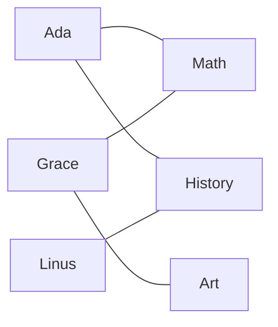
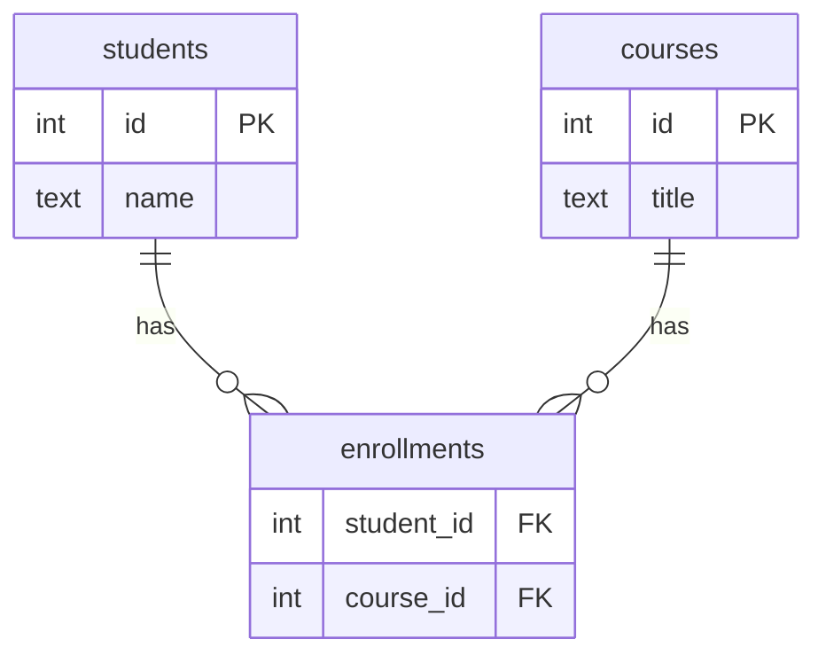

Some relationships do not fit "one row points to one other row." A
student takes **many** courses; a course holds **many** students.
This is a **many-to-many** relationship, and it needs a special
structure, because no single foreign key can express it.

<Figure
  slug="sql-many-to-many-cutout"
  alt="Many-to-many relationships, an isometric illustration"
/>

## Why a foreign key is not enough

Picture trying to store this with one column. If `students` had a
`course_id`, each student could take only one course. If `courses`
had a `student_id`, each course could hold only one student. Neither
works, because **both sides are "many."**

<Figure
  slug="sql-many-to-many-foreign-key-not-inline-cutout"
  alt="A crate with only one socket on its side and four cords needing to reach it at once"
  caption="One column holds one link, which is why both-sides-many needs a third table."
/>

Ada connects to two courses; Math connects to several students. The
links cross over each other, and that crossing is the whole problem:
you cannot capture it with a single column on either table. A
`course_id` on `students` would let each student take one course; a
`student_id` on `courses` would let each course hold one student.
Neither is what a school looks like.

## The junction table

The solution is a third table that sits **between** the two,
storing one row per connection. It is called a **junction**,
**bridge**, or **join** table. Each of its rows holds two foreign
keys: one to each side.

<Figure
  slug="sql-many-to-many-inline-cutout"
  alt="Two rows of crates with every cord between them routed through a small board of pegs standing in the middle"
  caption="The junction table holds one row per actual pairing, and nothing else."
/>

Read it as two one-to-many relationships pointing **inward**: one
student has many enrollments; one course has many enrollments. The
`enrollments` table turns a single, awkward many-to-many into two
ordinary, well-understood one-to-many links.

## Building and querying it

Each row in `enrollments` says "this student is in this course."
To list real names, you join through the junction table to both
sides:

<SqlCodeBlock
  dialect="postgres"
  title="Students and the courses they take"
  initSql={`CREATE TABLE students (
  id   INTEGER PRIMARY KEY,
  name TEXT
);
CREATE TABLE courses (
  id    INTEGER PRIMARY KEY,
  title TEXT
);
CREATE TABLE enrollments (
  student_id INTEGER REFERENCES students(id),
  course_id  INTEGER REFERENCES courses(id),
  PRIMARY KEY (student_id, course_id)
);
INSERT INTO students (id, name) VALUES
  (1,'Ada'),(2,'Grace'),(3,'Linus'),(4,'Mae'),(5,'Rosa'),(6,'Ivan'),
  (7,'Nadia'),(8,'Omar'),(9,'Priya'),(10,'Quinn'),(11,'Ruth'),(12,'Sam'),
  (13,'Tariq'),(14,'Uma'),(15,'Viktor'),(16,'Wen'),(17,'Xenia'),(18,'Yusuf'),
  (19,'Zara'),(20,'Bruno'),(21,'Chidi'),(22,'Dara'),(23,'Elif'),(24,'Farid');
INSERT INTO courses (id, title) VALUES
  (10,'Math'),(11,'History'),(12,'Art'),(13,'Biology'),(14,'Physics'),(15,'Music');
-- Ada: Math and History. Grace: Math and Art. Linus: History and Biology.
INSERT INTO enrollments (student_id, course_id) VALUES
  (1,10), (1,11), (2,10), (2,12), (3,11), (3,13),
  (4,10), (4,14), (5,11), (5,12), (6,13), (6,15),
  (7,10), (7,13), (8,11), (8,14), (9,12), (9,15),
  (10,10), (10,11), (11,13), (11,14), (12,12), (12,15),
  (13,10), (13,12), (14,11), (14,15), (15,13), (15,14),
  (16,10), (16,15), (17,11), (17,12), (18,13), (18,10),
  (19,14), (19,11), (20,15), (20,12), (21,10), (21,13),
  (22,11), (22,14), (23,12), (23,15), (24,10), (24,11);`}
  starterCode={`SELECT
  s.name,
  c.title
FROM
  enrollments e
  JOIN students s ON s.id = e.student_id
  JOIN courses c ON c.id = e.course_id
ORDER BY
  s.name,
  c.title;`}
/>

The query "walks" from `enrollments` out to both `students` and
`courses`, producing one readable row per connection. Notice the
junction's primary key is the **pair** `(student_id, course_id)`,
a composite key that prevents enrolling the same student in the same
course twice.

<Callout type="info" title="The junction table can hold its own facts">
A junction row often carries extra columns about the *relationship
itself*, an `enrolled_on` date, a `grade`, a `role`. These belong
to the pairing, not to either table alone, so the junction table is
their natural home.
</Callout>

## Answering questions from both directions

Because the structure is symmetric, you can ask in either
direction just by changing what you group or filter:

<SqlCodeBlock
  dialect="postgres"
  title="How many students each course has"
  initSql={`CREATE TABLE students (id INTEGER PRIMARY KEY, name TEXT);
CREATE TABLE courses (id INTEGER PRIMARY KEY, title TEXT);
CREATE TABLE enrollments (
  student_id INTEGER, course_id INTEGER,
  PRIMARY KEY (student_id, course_id)
);
INSERT INTO students (id, name) VALUES
  (1,'Ada'),(2,'Grace'),(3,'Linus'),(4,'Mae'),(5,'Rosa'),(6,'Ivan'),
  (7,'Nadia'),(8,'Omar'),(9,'Priya'),(10,'Quinn'),(11,'Ruth'),(12,'Sam'),
  (13,'Tariq'),(14,'Uma'),(15,'Viktor'),(16,'Wen'),(17,'Xenia'),(18,'Yusuf'),
  (19,'Zara'),(20,'Bruno'),(21,'Chidi'),(22,'Dara'),(23,'Elif'),(24,'Farid');
INSERT INTO courses (id, title) VALUES
  (10,'Math'),(11,'History'),(12,'Art'),(13,'Biology'),(14,'Physics'),(15,'Music');
INSERT INTO enrollments (student_id, course_id) VALUES
  (1,10), (1,11), (2,10), (2,12), (3,11), (3,13),
  (4,10), (4,14), (5,11), (5,12), (6,13), (6,15),
  (7,10), (7,13), (8,11), (8,14), (9,12), (9,15),
  (10,10), (10,11), (11,13), (11,14), (12,12), (12,15),
  (13,10), (13,12), (14,11), (14,15), (15,13), (15,14),
  (16,10), (16,15), (17,11), (17,12), (18,13), (18,10),
  (19,14), (19,11), (20,15), (20,12), (21,10), (21,13),
  (22,11), (22,14), (23,12), (23,15), (24,10), (24,11);`}
  starterCode={`SELECT
  c.title,
  COUNT(*) AS student_count
FROM
  courses c
  JOIN enrollments e ON e.course_id = c.id
GROUP BY
  c.title
ORDER BY
  student_count DESC,
  c.title;`}
/>

Same three tables, different question, "students per course"
instead of "courses per student." The junction table answers both
without any change to the schema.

## Check your understanding

<MultipleChoice
  markdown={`Why can't a single foreign key represent a many-to-many relationship like students and courses?

- [o] Because a single column can hold only one value, so it can represent "many" on only one side, not both.
  > One foreign key forces one of the sides to be singular, which fails when both sides are "many."
- Because foreign keys are not allowed between unrelated tables.
  > Foreign keys are exactly the tool for relating tables; the problem is the *cardinality*, not legality.
- Because PostgreSQL forbids more than two tables in a query.
  > Queries routinely span many tables; there is no such limit.
- Because foreign keys cannot reference primary keys.
  > Foreign keys normally reference primary keys; that is their usual purpose.

A lone foreign key can express "many" on just one side, so many-to-many needs a third table.`}
/>

<MultipleChoice
  markdown={`What is the role of a junction (bridge) table?

- To replace the need for primary keys.
  > Junction tables rely on keys, often a composite primary key, rather than replacing them.
- [o] To store one row per connection, holding a foreign key to each of the two related tables.
  > Each junction row links one row from each side, turning a many-to-many into two one-to-many links.
- To speed up queries by caching results.
  > A junction table models relationships; it is not a results cache.
- To store a backup copy of both tables.
  > A junction table holds connections, not duplicated copies of the other tables' data.

A junction table records each pairing as a row with a foreign key to each side.`}
/>

<MultipleChoice
  markdown={`In an \`enrollments\` junction table, where does a per-enrollment \`grade\` column most naturally belong?

- In a brand-new fourth table by itself.
  > The enrollment row already represents the pairing, so the grade belongs there rather than in a separate table.
- In the \`courses\` table.
  > A grade depends on *which student*, so it cannot live on the course alone.
- In the \`students\` table.
  > A grade depends on *which course*, so it cannot live on the student alone.
- [o] In the \`enrollments\` table, because the grade describes the specific student-course pairing.
  > A grade is a fact about the relationship itself, so the junction row is its natural home.

A value that describes the pairing itself belongs on the junction row.`}
/>

## Practice challenge

<SqlChallengeCard
  dialect="postgres"
  title="Courses per student"
  instructions={`Using the \`enrollments\` junction table, return each student's \`name\` and the number of courses they take as \`course_count\`, sorted by \`name\` ascending (A to Z). The starter is missing only the JOIN to the junction table.`}
  initSql={`CREATE TABLE students (
  id   INTEGER PRIMARY KEY,
  name TEXT NOT NULL
);
CREATE TABLE courses (
  id    INTEGER PRIMARY KEY,
  title TEXT NOT NULL
);
CREATE TABLE enrollments (
  student_id INTEGER REFERENCES students(id),
  course_id  INTEGER REFERENCES courses(id),
  PRIMARY KEY (student_id, course_id)
);
INSERT INTO students (id, name) VALUES
  (1,'Ada'),(2,'Grace'),(3,'Linus'),(4,'Mae'),(5,'Rosa'),(6,'Ivan'),
  (7,'Nadia'),(8,'Omar'),(9,'Priya'),(10,'Quinn'),(11,'Ruth'),(12,'Sam');
INSERT INTO courses (id, title) VALUES
  (10,'Math'),(11,'History'),(12,'Art'),(13,'Biology'),(14,'Physics');
INSERT INTO enrollments (student_id, course_id) VALUES
  (1,10), (1,11), (2,10), (2,12), (3,11), (3,13),
  (4,10), (4,14), (5,11), (5,12), (6,13), (6,14),
  (7,10), (7,13), (8,11), (8,14), (9,12), (9,13),
  (10,10), (10,11), (11,13), (11,14), (12,12), (12,14);`}
  starterCode={`SELECT
  s.name,
  COUNT(*) AS course_count
FROM
  students s
  -- JOIN the enrollments junction table here
GROUP BY
  s.name
ORDER BY
  s.name;`}
  solutionSql={`SELECT
  s.name,
  COUNT(*) AS course_count
FROM
  students s
  JOIN enrollments e ON e.student_id = s.id
GROUP BY
  s.name
ORDER BY
  s.name;`}
  tests={[
    {
      id: "columns",
      name: "Returns name and course_count",
      description: "Two columns, in that order.",
      expectedColumns: ["name", "course_count"],
    },
    {
      id: "row_count",
      name: "Returns twelve students",
      description: "Every student is enrolled in at least one course.",
      expectedRowCount: 12,
    },
    {
      id: "matches",
      name: "Matches the reference solution",
      description: "Every student takes exactly 2 courses, listed alphabetically.",
      matchesSolution: true,
      ordered: true,
    },
  ]}
/>
