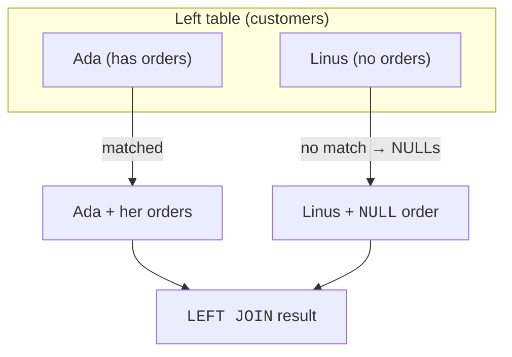

An inner join silently drops rows that have no match. But sometimes
the **unmatched rows are exactly what you want to see**: "customers
who have *never* ordered," "products that have *never* sold." For
those questions you need an **outer join**, which deliberately keeps
unmatched rows.

<Figure
  slug="sql-outer-joins-cutout"
  alt="Outer joins, an isometric illustration"
/>

## LEFT JOIN: keep all rows from the left table

A `LEFT JOIN` keeps **every row from the left (first) table**,
matched or not. Where a match exists, the right table's columns are
filled in. Where none exists, those columns come back as `NULL`.

<SyntaxBreakdown
  parts={[
    { text: "FROM customers", label: "the left table, every row survives" },
    { text: "LEFT JOIN" },
    { text: "orders", label: "the right table, optional" },
    { text: "ON customers.id = orders.customer_id", label: "no match here means NULLs" },
  ]}
/>

The key insight: the left table is **fully preserved**. The right
table is "optional", it contributes data when it can and `NULL`s
when it cannot.

<SqlCodeBlock
  dialect="postgres"
  title="Every customer, even those with no orders"
  initSql={`CREATE TABLE customers (
  id   INTEGER PRIMARY KEY,
  name TEXT
);
CREATE TABLE orders (
  id          INTEGER PRIMARY KEY,
  customer_id INTEGER,
  amount      NUMERIC
);
-- Linus, Mae, Quinn and Zara have no orders.
INSERT INTO customers (id, name) VALUES
  (1,'Ada'), (2,'Grace'), (3,'Linus'), (4,'Mae'),
  (5,'Rosa'), (6,'Ivan'), (7,'Nadia'), (8,'Omar'),
  (9,'Priya'), (10,'Quinn'), (11,'Ruth'), (12,'Sam'),
  (13,'Tariq'), (14,'Uma'), (15,'Viktor'), (16,'Wen'),
  (17,'Xenia'), (18,'Yusuf'), (19,'Zara'), (20,'Bruno'),
  (21,'Chidi'), (22,'Dara'), (23,'Elif'), (24,'Farid');
INSERT INTO orders (id, customer_id, amount) VALUES
  (101,1,42), (102,1,18), (103,2,99), (104,2,15),
  (105,5,30), (106,5,76), (107,6,22), (108,7,64),
  (109,8,12), (110,8,48), (111,9,91), (112,11,27),
  (113,11,55), (114,12,38), (115,13,19), (116,13,83),
  (117,14,45), (118,15,61), (119,16,24), (120,16,70),
  (121,17,33), (122,18,88), (123,20,16), (124,20,52),
  (125,21,29), (126,22,74), (127,22,21), (128,23,95),
  (129,24,36), (130,1,57), (131,9,40), (132,17,68);`}
  starterCode={`SELECT
  c.name,
  o.id AS order_id,
  o.amount
FROM
  customers c
  LEFT JOIN orders o ON o.customer_id = c.id
ORDER BY
  c.name;`}
/>

Linus appears, with `NULL` for `order_id` and `amount`, the join's
honest way of saying "this customer matched nothing." An inner join
would have hidden him entirely.

## Finding the unmatched rows

A `LEFT JOIN` plus `WHERE ... IS NULL` is the classic recipe for
"find the rows with **no** match." Keep everyone, then keep only the
ones whose match came back empty:

<SqlCodeBlock
  dialect="postgres"
  title="Customers who have never ordered"
  initSql={`CREATE TABLE customers (
  id INTEGER PRIMARY KEY, name TEXT
);
CREATE TABLE orders (
  id INTEGER PRIMARY KEY, customer_id INTEGER, amount NUMERIC
);
INSERT INTO customers (id, name) VALUES
  (1,'Ada'), (2,'Grace'), (3,'Linus'), (4,'Mae'),
  (5,'Rosa'), (6,'Ivan'), (7,'Nadia'), (8,'Omar'),
  (9,'Priya'), (10,'Quinn'), (11,'Ruth'), (12,'Sam'),
  (13,'Tariq'), (14,'Uma'), (15,'Viktor'), (16,'Wen'),
  (17,'Xenia'), (18,'Yusuf'), (19,'Zara'), (20,'Bruno'),
  (21,'Chidi'), (22,'Dara'), (23,'Elif'), (24,'Farid');
INSERT INTO orders (id, customer_id, amount) VALUES
  (101,1,42), (102,1,18), (103,2,99), (104,2,15),
  (105,5,30), (106,5,76), (107,6,22), (108,7,64),
  (109,8,12), (110,8,48), (111,9,91), (112,11,27),
  (113,11,55), (114,12,38), (115,13,19), (116,13,83),
  (117,14,45), (118,15,61), (119,16,24), (120,16,70),
  (121,17,33), (122,18,88), (123,20,16), (124,20,52),
  (125,21,29), (126,22,74), (127,22,21), (128,23,95),
  (129,24,36), (130,1,57), (131,9,40), (132,17,68);`}
  starterCode={`SELECT
  c.name
FROM
  customers c
  LEFT JOIN orders o ON o.customer_id = c.id
WHERE
  o.id IS NULL
ORDER BY
  c.name;`}
/>

Four of the 24 customers (Linus, Mae, Quinn and Zara) have no orders,
so their joined `o.id` is `NULL`, and the filter keeps exactly them.
This pattern, *outer join, then test for `NULL`*, answers a whole
family of "who is missing?" questions: products that never sold,
students who enrolled in nothing, invoices with no payment.

<Figure
  slug="sql-outer-joins-finding-unmatched-rows-inline-cutout"
  alt="Two racks pushed together with a lamp lighting only the cards that found no partner"
  caption="Outer join, then test for `NULL`, is how you find what has no match."
/>

## RIGHT and FULL joins

Once `LEFT JOIN` makes sense, its siblings are easy:

- **`RIGHT JOIN`** keeps every row from the **right** table instead
  of the left. It is just a `LEFT JOIN` with the tables mentally
  swapped, most people simply reorder the tables and use `LEFT`.
- **`FULL JOIN`** keeps **every row from both** tables, filling
  `NULL`s on whichever side lacks a match.

<Figure
  slug="sql-outer-joins-inline-cutout"
  alt="Two racks pushed together where the matched pairs go to a tray and the unmatched cards from the left rack are kept, each with a blank card clipped to it"
  caption="A left join keeps every left-hand row, filling the gaps with `NULL`."
/>

<Chart slug="sql-join-types" />

<Callout type="info" title="A simple way to choose">
Ask: *"whose rows must I keep even without a match?"* Keep the left
table → `LEFT JOIN`. Keep both → `FULL JOIN`. Keep only matched rows
→ plain `INNER JOIN`. Naming the table you refuse to lose tells you
the join.
</Callout>

## Why NULLs appear, and that it is correct

The `NULL`s in an outer join are not a glitch; they are the *truth*.
There genuinely is no order for Linus, so "his order amount" is
genuinely unknown/absent, exactly what `NULL` means (recall the
**Working with NULL** page). Outer joins and `NULL` are natural
partners: the join preserves a row, and `NULL` faithfully marks the
information that the missing side could not supply.

## Check your understanding

<MultipleChoice
  markdown={`What does a \`LEFT JOIN\` keep that an \`INNER JOIN\` does not?

- Nothing; they are identical.
  > They differ precisely on unmatched rows, so they are not identical.
- Every row from the right table only.
  > Preserving all right-table rows describes a right join, not a left join.
- Only rows that match in both tables.
  > That is what an inner join keeps; a left join additionally keeps unmatched left rows.
- [o] Every row from the left table, even those with no match in the right table (filling NULLs for the missing side).
  > A left join preserves all left-table rows and supplies NULLs where the right table has no match.

A left join preserves all left-table rows, using NULLs where the right side has no match.`}
/>

<MultipleChoice
  markdown={`In a \`LEFT JOIN\` of customers to orders, a customer with no orders appears with what in the order columns?

- The previous customer's order values.
  > Joins never borrow another row's values; unmatched columns become NULL.
- Zeros.
  > A missing match is not represented as zero; zero would falsely imply a real \$0 order.
- [o] NULLs, marking that there was no matching order to supply those values.
  > Outer joins fill unmatched columns with NULL, honestly signaling missing data.
- Empty strings.
  > Numeric and id columns are not blanked to empty strings; the absence is marked differently.

Unmatched columns in an outer join are filled with NULL, the marker for absent values.`}
/>

<MultipleChoice
  markdown={`Which pattern finds "customers who have never placed an order"?

- An inner join between customers and orders.
  > An inner join drops order-less customers, so it can never reveal them.
- \`SELECT DISTINCT\` on the orders table.
  > The orders table only contains customers who *did* order, so it cannot list those who never did.
- A \`LEFT JOIN\` then \`WHERE o.id IS NOT NULL\`.
  > Testing \`IS NOT NULL\` keeps the matched customers, the opposite of who you want.
- [o] A \`LEFT JOIN\` from customers to orders, then \`WHERE o.id IS NULL\`.
  > Keeping all customers and then filtering for the NULL (unmatched) side isolates those with no orders.

Outer-join everyone, then keep the rows whose match is NULL to find the unmatched customers.`}
/>

<MultipleChoice
  markdown={`A \`FULL JOIN\` between two tables returns which rows?

- [o] Every row from both tables, with NULLs wherever a row on one side has no match on the other.
  > A full join preserves unmatched rows from both tables, filling NULLs for the absent side.
- No rows, because both sides must match.
  > A full join does not require matches; it includes everything from both tables.
- Only the rows that match in both tables.
  > That is an inner join; a full join is the most inclusive kind.
- Only the left table's rows.
  > Keeping just the left side is a left join; a full join keeps both sides.

A full join keeps all rows from both tables, using NULLs where either side is unmatched.`}
/>

## Practice challenge

<SqlChallengeCard
  dialect="postgres"
  title="Customers who never ordered"
  instructions={`Return the \`name\` of every customer who has **never** placed an order, sorted alphabetically (A to Z). The starter already LEFT JOINs \`orders\` onto \`customers\`, add the filter that keeps only the unmatched customers.`}
  initSql={`CREATE TABLE customers (
  id   SERIAL PRIMARY KEY,
  name TEXT NOT NULL
);
CREATE TABLE orders (
  id          SERIAL PRIMARY KEY,
  customer_id INTEGER REFERENCES customers(id),
  amount      NUMERIC(8, 2)
);
INSERT INTO customers (name) VALUES
  ('Ada'), ('Grace'), ('Linus'), ('Mae'), ('Rosa'), ('Ivan'),
  ('Nadia'), ('Omar'), ('Priya'), ('Quinn'), ('Ruth'), ('Sam'),
  ('Tariq'), ('Uma'), ('Viktor'), ('Wen'), ('Xenia'), ('Yusuf'),
  ('Zara'), ('Bruno'), ('Chidi'), ('Dara'), ('Elif'), ('Farid');
INSERT INTO orders (customer_id, amount) VALUES
  (1, 42.00), (2, 99.00), (2, 15.00), (5, 30.00), (5, 76.00),
  (6, 22.00), (7, 64.00), (8, 12.00), (8, 48.00), (9, 91.00),
  (11, 27.00), (11, 55.00), (12, 38.00), (13, 19.00), (13, 83.00),
  (14, 45.00), (15, 61.00), (16, 24.00), (16, 70.00), (17, 33.00),
  (18, 88.00), (20, 16.00), (20, 52.00), (21, 29.00), (22, 74.00),
  (23, 95.00), (24, 36.00), (1, 57.00);`}
  starterCode={`SELECT
  c.name
FROM
  customers c
  LEFT JOIN orders o ON o.customer_id = c.id
ORDER BY
  c.name;`}
  solutionSql={`SELECT
  c.name
FROM
  customers c
  LEFT JOIN orders o ON o.customer_id = c.id
WHERE
  o.id IS NULL
ORDER BY
  c.name;`}
  tests={[
    {
      id: "columns",
      name: "Returns a single name column",
      description: "Just the customer's name.",
      expectedColumns: ["name"],
    },
    {
      id: "row_count",
      name: "Returns four customers",
      description: "Only the customers with no orders.",
      expectedRowCount: 4,
    },
    {
      id: "matches",
      name: "Matches the reference solution",
      description: "Linus, Mae, Quinn, then Zara.",
      matchesSolution: true,
      ordered: true,
    },
  ]}
/>

Between them, inner and outer joins cover most of the joining you will
ever do. Everything after this is a variation on choosing which side you
refuse to lose.
