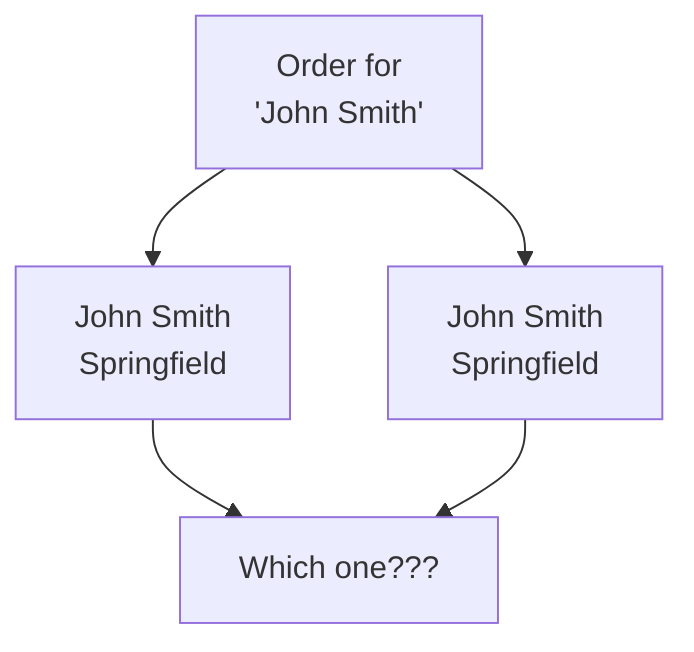
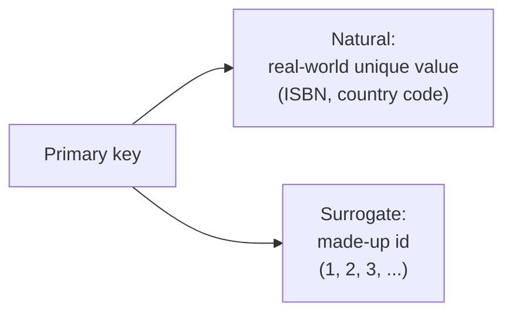

Here is a question that sounds silly but is deeply important: if two
rows happen to look identical, how does the database tell them
apart? The answer is the **primary key**, and it is one of the most
foundational ideas in relational databases.

<Figure
  slug="sql-primary-keys-cutout"
  alt="Primary keys, an isometric illustration"
/>

## The identity problem

Imagine a `customers` table where two different real people are both
named "John Smith" and both live in Springfield. Their rows could
be byte-for-byte identical. Now an order comes in for "John Smith."
*Which* John Smith?

<Figure
  slug="sql-primary-keys-identity-problem-inline-cutout"
  alt="A rack of cards that look alike, one hand unable to tell which is which until one gains a punched tab"
  caption="Two rows can look identical until one carries a key nothing else has."
/>

Without a reliable way to distinguish rows, the data becomes
ambiguous and links between tables become impossible. We need each
row to have a **unique, unchanging identity.**

## What a primary key is

A **primary key** is a column (or set of columns) whose value
**uniquely identifies each row** in a table. No two rows may share
the same primary key value, and it is never empty.

Table: `customers`

| id (PK) | name | city |
| --- | --- | --- |
| 1 | John Smith | Springfield |
| 2 | John Smith | Springfield |

Now the two John Smiths are clearly different: one is customer `1`,
the other is customer `2`. The `id` column is the primary key, and
it gives each row an unmistakable identity.

## The two rules a primary key enforces

A primary key is not just a label, the database actively **enforces**
two guarantees on it:

1. **Unique**, no two rows can have the same primary key value. Try
   it, and the database rejects the row.
2. **Not null**, every row must have a value (it can never be
   empty or "unknown").

These guarantees are exactly what make a primary key trustworthy as
an identity.

<Callout type="info" title="Why not use the name as the key?">
Couldn't we just say "the name identifies the customer"? No, names
repeat, change (marriage, typos), and can be missing. A good
primary key is **stable** (never changes) and **guaranteed unique**.
That is why tables so often use a dedicated, meaningless number like
`id` whose only job is to identify the row.
</Callout>

## Natural vs. surrogate keys

There are two flavors of primary key:

- A **natural key** is a real-world value that happens to be unique,
  like a country's ISO code or a book's ISBN.
- A **surrogate key** is an artificial value created just to be an
  identifier, most often an auto-incrementing number like `id`.

<Figure
  slug="sql-primary-keys-inline-cutout"
  alt="A rack of identical cards each carrying one unique coloured notch, and a single card being lifted out by that notch"
  caption="A natural key already means something; a surrogate key exists only to identify."
/>

Surrogate keys are extremely common because they are simple, stable,
and never run into the "what if it changes?" problem. PostgreSQL can
generate them automatically, as we will see when we create tables.

## Watch the rule get enforced

Run this. The first insert succeeds; the second tries to reuse
primary key `1` and PostgreSQL **refuses** it, protecting the
table's integrity. Read the error message, it is the database
defending the uniqueness rule.

<SqlCodeBlock
  expectError
  dialect="postgres"
  title="A primary key rejects duplicates"
  initSql={`CREATE TABLE customers (
  id   INTEGER PRIMARY KEY,
  name TEXT
);
INSERT INTO customers (id, name) VALUES (1, 'Ada');`}
  starterCode={`-- This tries to reuse id = 1, which already exists.
INSERT INTO
  customers (id, name)
VALUES
  (1, 'Grace');

-- The insert above fails; the table still has only Ada.
SELECT
  *
FROM
  customers;`}
/>

That rejection is a *good* thing. The database is stopping you from
creating two rows with the same identity, exactly the ambiguity we
set out to avoid.

## Check your understanding

<MultipleChoice
  markdown={`What is the purpose of a **primary key**?

- To describe the colors of the table.
  > Appearance is unrelated; a primary key is about uniquely identifying rows.
- [o] To uniquely identify each row, so any row can be told apart from every other.
  > A primary key gives every row a unique, non-empty identity, which is essential for distinguishing rows and linking tables.
- To sort the rows of a table alphabetically.
  > Sorting is done with \`ORDER BY\`; a primary key is about identity, not ordering.
- To store the largest value in the table.
  > A primary key identifies rows; it has nothing to do with which value is largest.

A primary key gives each row a unique, reliable identity within its table.`}
/>

<MultipleChoice
  markdown={`Which two rules does a database enforce on a primary key column?

- It must be text, and it must be lowercase.
  > Primary keys are often numbers, and casing is irrelevant; those are not the enforced rules.
- It must be the first column, and it must be sorted.
  > Position and sort order are not requirements of a primary key.
- [o] Every value must be unique, and no value may be null (empty).
  > Uniqueness plus never-null is exactly what makes a primary key a dependable identity for each row.
- It must change every time the row is updated.
  > A good primary key is *stable* and should not change; constant change would defeat its purpose.

A primary key must be unique and never null, the two guarantees that make it trustworthy.`}
/>

<MultipleChoice
  markdown={`Why is an auto-generated numeric \`id\` (a *surrogate key*) often preferred over using a person's name as the primary key?

- Because a numeric id automatically sorts the table.
  > A primary key does not sort the table; it identifies rows.
- [o] Because names can repeat, change, or be missing, while a dedicated id stays unique and stable.
  > A surrogate key sidesteps the problems of real-world values changing or colliding, giving a permanent, guaranteed-unique identity.
- Because names cannot be stored in a database.
  > Names absolutely can be stored; they just make poor identifiers.
- Because numbers always take less storage than any name.
  > Storage size is a minor concern; the real issue is reliability of identity.

Surrogate keys avoid the instability and duplication that plague real-world values like names.`}
/>
